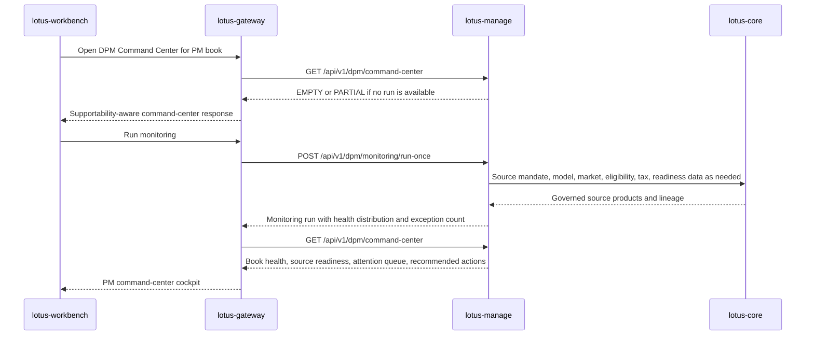

# DPM Command Center Gateway And Workbench Handoff

This document is the RFC-0038 Slice 6 handoff contract for integrating the mandate digital twin,
mandate health score, monitoring run, exception queue, and DPM command-center APIs into
`lotus-gateway` and `lotus-workbench`.

It is intentionally written as an integration contract, not as a downstream implementation. As of
RFC-0038, `lotus-manage` owns the backend DPM interpretation layer and the bounded command-center
read model. `lotus-gateway` owns product-facing API composition. `lotus-workbench` owns the
portfolio-manager user experience and must consume the gateway contract rather than calling
`lotus-manage` directly.

## Business Outcome

The command-center integration should let a discretionary portfolio manager, CIO delegate,
operations analyst, or supervision user answer five questions quickly:

1. Which mandates in my book are ready for action?
2. Which mandates need source-data repair, review, or rebalance simulation before action?
3. Which exceptions are material enough to affect fiduciary or operational risk?
4. Which source systems or policy controls are blocking portfolio-manager productivity?
5. What evidence backs the health state, action queue, and recommended next step?

The target user experience is an operating cockpit for discretionary mandate management, not a
generic metrics dashboard.

## Ownership Boundary

| Layer | Owns | Must not own |
| --- | --- | --- |
| `lotus-core` | Portfolio, mandate binding, model targets, eligibility, tax-lot, market-data, FX, and source-readiness products. | DPM health scoring, action queues, or Workbench presentation state. |
| `lotus-manage` | Mandate digital twin, health scoring, monitoring runs, monitoring exceptions, and command-center summary. | Canonical source-data authority, gateway composition, or UI-specific state synthesis. |
| `lotus-gateway` | Product-facing command-center composition, entitlement enforcement, tenant routing, response shaping, and Workbench-compatible cache policy. | Recomputing mandate health or fabricating unsupported command-center states. |
| `lotus-workbench` | Portfolio-manager cockpit panels, drill-down flows, and demo-ready interaction design. | Direct `lotus-manage` calls or client-side reconstruction of health and exception truth. |

## Strategic Gateway Contract

Gateway should expose a product-facing command-center contract that composes these
`lotus-manage` APIs:

| Product need | `lotus-manage` source API | Gateway behavior |
| --- | --- | --- |
| Book-level health cockpit | `GET /api/v1/dpm/command-center` | Pass tenant, portfolio-manager, book, as-of, and health filters. Preserve supportability and source-run lineage. |
| Monitoring execution | `POST /api/v1/dpm/monitoring/run-once` | Restrict execution to entitled books or explicit mandate ids. Add user, tenant, and channel context. |
| Monitoring run audit | `GET /api/v1/dpm/monitoring/runs` and `GET /api/v1/dpm/monitoring/runs/{monitoring_run_id}` | Provide newest-first audit view and drill-down. |
| Exception queue | `GET /api/v1/dpm/exceptions` | Shape for table and drill-down panels without changing reason codes, severity, or recommended action. |
| Exception resolution | `POST /api/v1/dpm/exceptions/{exception_id}/resolve` | Enforce resolver entitlement and pass bounded resolution reason. |
| Mandate drill-down | `GET /api/v1/mandates/{mandate_id}`, `GET /api/v1/mandates/{mandate_id}/health`, `GET /api/v1/mandates/{mandate_id}/diff` | Provide twin, score, dimension evidence, and version delta for the selected mandate. |
| Portfolio entry point | `GET /api/v1/mandates/by-portfolio/{portfolio_id}` | Support portfolio-context navigation from existing Workbench portfolio pages. |

Gateway should keep the same domain vocabulary as `lotus-manage`: `mandate_id`,
`portfolio_id`, `portfolio_manager_id`, `book_id`, `monitoring_run_id`, `health_state`,
`source_readiness_state`, `reason_code`, `recommended_action`, and `supportability`.

### Gateway Request Examples

Book cockpit:

```http
GET /api/v1/dpm/command-center?tenant_id=default&portfolio_manager_id=PM_SG_DPM_001&as_of_date=2026-05-03 HTTP/1.1
Host: manage.dev.lotus
```

Monitoring run:

```http
POST /api/v1/dpm/monitoring/run-once HTTP/1.1
Host: manage.dev.lotus
Content-Type: application/json

{
  "mandate_ids": ["MANDATE_PB_SG_GLOBAL_BAL_001"],
  "as_of_date": "2026-05-03",
  "tenant_id": "default",
  "portfolio_manager_id": "PM_SG_DPM_001",
  "book_id": "BOOK_SG_BALANCED_DPM",
  "requested_by": "workbench.pm.sg.001"
}
```

Exception resolution:

```http
POST /api/v1/dpm/exceptions/me_source_readiness_001/resolve HTTP/1.1
Host: manage.dev.lotus
Content-Type: application/json

{
  "resolution_reason": "SOURCE_DATA_REPAIRED_AND_RECALCULATED"
}
```

### Gateway Response Handling Rules

1. Preserve `supportability.data_completeness_state` exactly as returned.
2. Surface `supportability.partial_readiness_reasons` to Workbench rather than hiding them.
3. Treat `EMPTY` command-center state as a valid response, not an integration failure.
4. Treat `PARTIAL` command-center state as degraded readiness requiring visible supportability.
5. Do not convert bounded domain reason codes into free text.
6. Do not infer PM-book membership in Gateway unless the source is an entitled book-discovery
   product or a caller-supplied filter.
7. Do not merge exceptions from different `monitoring_run_id` values into the same book-level
   attention queue.

## Workbench Product Panels

Workbench should compose the command center as a portfolio-manager cockpit with these panels.

| Panel | Primary audience | Backing fields | Behavior |
| --- | --- | --- | --- |
| Book Health Strip | PM, CIO delegate, supervision | `health_distribution`, `evaluated_mandates`, `selected_health_state` | Shows ready, pending-review, and blocked mandates. Health-state selection filters the displayed book. |
| Source Readiness Tile | PM, operations, data owner | `source_readiness_summary`, `partial_readiness_reasons` | Shows whether the book can be trusted for DPM execution today. |
| Attention Queue | PM, operations | `attention_buckets`, `active_exception_count` | Groups active exceptions by dimension, severity, reason code, and recommended action. |
| Recommended Actions | PM, supervision | `recommended_actions` | Shows the next operational or investment action by severity and count. |
| Latest Monitoring Run | Operations, engineering support | `latest_monitoring_run`, `supportability.source_run_id` | Provides audit lineage and run status. |
| Mandate Drill-Down | PM, client-service support | mandate read, health, diff, versions | Explains why one mandate is ready, pending review, or blocked. |

Workbench must distinguish three supported states:

1. `COMPLETE`
   the selected monitoring run supports the command-center view.
2. `PARTIAL`
   the view is usable but missing explicit upstream or book-discovery readiness.
3. `EMPTY`
   no monitoring run exists for the requested filters; the UI should show an empty operational
   state with a run-monitoring action, not a broken chart.

## Canonical Demo Data Requirement

The front-office canonical stack should seed at least one discretionary mandate portfolio that can
exercise every command-center state.

Minimum canonical seed:

| Field | Required value or pattern | Purpose |
| --- | --- | --- |
| `portfolio_id` | `PB_SG_GLOBAL_BAL_001` | Existing canonical private-banking balanced mandate portfolio. |
| `mandate_id` | `MANDATE_PB_SG_GLOBAL_BAL_001` | Stable DPM mandate digital-twin id. |
| `portfolio_manager_id` | `PM_SG_DPM_001` | PM-book filter for command-center proof. |
| `book_id` | `BOOK_SG_BALANCED_DPM` | Book-level cockpit filter. |
| `tenant_id` | `default` | Local canonical tenant. |
| `as_of_date` | `2026-05-03` | Governed canonical evidence date. |
| Source products | RFC-087 model target, mandate binding, eligibility, tax-lot, market-data coverage, and source-readiness products | Enables `lotus-manage` to refresh the mandate twin and run monitoring without fabricated data. |

Canonical proof should include:

1. a populated command center for `PM_SG_DPM_001`,
2. an empty command center for a PM or date with no monitoring run,
3. a partial command center when book discovery is omitted,
4. a mandate drill-down from the attention queue to health dimensions and source lineage,
5. exception resolution and subsequent active-exception list proof.

## Integration Flow



## Downstream Delivery Backlog

Gateway and Workbench implementation should be planned as downstream work after this handoff:

1. `lotus-gateway` issue
   [sgajbi/lotus-gateway#180](https://github.com/sgajbi/lotus-gateway/issues/180)
   add a versioned command-center experience API that composes the manage APIs listed above,
   enforces tenant and book entitlement, preserves supportability, and publishes OpenAPI examples.
2. `lotus-workbench` issue
   [sgajbi/lotus-workbench#140](https://github.com/sgajbi/lotus-workbench/issues/140)
   add the DPM command-center cockpit panels, backed only by gateway, with complete, partial, and
   empty states validated through canonical runtime evidence.
3. `lotus-platform` issue
   [sgajbi/lotus-platform#294](https://github.com/sgajbi/lotus-platform/issues/294)
   extend canonical front-office automation to seed the mandate, book, PM, and source-product
   records required for repeatable command-center proof when this flow becomes a product-surface
   validation target.

No downstream implementation should start by bypassing gateway or reconstructing mandate health in
the browser.
