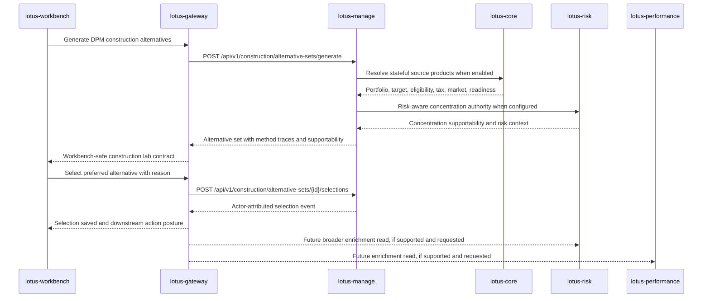

# DPM Construction Alternatives Gateway And Workbench Handoff

This document is the RFC-0039 Slice 10 handoff contract for realizing advanced discretionary
portfolio construction alternatives in `lotus-gateway` and `lotus-workbench`.

It is intentionally an integration contract, not downstream implementation. As of RFC-0039,
`lotus-manage` owns the backend construction-alternative authority: generating, persisting,
retrieving, comparing, and selecting alternative sets. `lotus-gateway` owns product-facing
composition and entitlement. `lotus-workbench` owns the portfolio-manager construction lab and must
consume Gateway rather than calling `lotus-manage` directly.

## Business Outcome

The construction-alternatives integration should let a discretionary portfolio manager, CIO
delegate, tax specialist, operations analyst, or client-demo presenter answer six questions
quickly:

1. What are my viable construction choices for this discretionary mandate?
2. What happens if I do nothing?
3. Which alternative best balances drift, turnover, tax, liquidity, cash, restrictions, risk, and
   performance posture?
4. Which constraints or source-data gaps make an alternative pending-review, degraded, blocked, or
   infeasible?
5. Which alternative did the portfolio manager select, and why?
6. What evidence supports that selection before proof-pack generation, review workflow, rebalance
   wave orchestration, or post-trade outcome review?

The target product experience is a DPM construction lab inside the command-center journey, not a
single black-box trade-list generator.

## Ownership Boundary

| Layer | Owns | Must not own |
| --- | --- | --- |
| `lotus-core` | Portfolio source products, model targets, mandate binding, eligibility, tax lots, market-data coverage, source readiness, and lineage. | Construction method choice, PM selection decisions, or UI composition. |
| `lotus-manage` | Construction alternative generation, objective/constraint traces, comparison metrics, supportability posture, persistence, idempotency, and selection event. | Gateway composition, Workbench presentation state, canonical source-data authority, risk/performance methodology authority, or order execution. |
| `lotus-risk` | Risk-authoritative analytics when integrated: concentration, tracking error, liquidity/stress, risk attribution, and calculation supportability. | Construction alternative persistence or PM workflow selection. |
| `lotus-performance` | Performance-authoritative analytics when integrated: active return, attribution, benchmark posture, and calculation supportability. | Construction alternative generation or action gating. |
| `lotus-gateway` | Workbench-facing construction-lab contract, entitlement, tenant routing, response shaping, supportability preservation, and action affordances. | Recomputing construction alternatives, fabricating unavailable risk/performance/tax values, or changing manage reason codes. |
| `lotus-workbench` | Construction lab UI, comparison matrix, selection workflow, evidence drawer, and demo-ready interaction design. | Direct `lotus-manage` calls, raw service stitching, local optimizer logic, or unsupported action eligibility. |

## Implemented Manage Contract

RFC-0039 currently exposes this certified manage endpoint family:

| Product need | `lotus-manage` source API | Gateway behavior |
| --- | --- | --- |
| Generate alternatives | `POST /api/v1/construction/alternative-sets/generate` | Add entitlement, tenant/user/channel context, idempotency handling, and Workbench-safe response shape. Preserve every method, status, trace, metric, supportability state, and reason code. |
| Read alternatives | `GET /api/v1/construction/alternative-sets/{alternative_set_id}` | Return persisted alternatives without recomputation. Preserve selected alternative state when available. |
| Select alternative | `POST /api/v1/construction/alternative-sets/{alternative_set_id}/selections` | Enforce actor entitlement, pass bounded selection reason/comment, and return manage selection truth. Do not execute trades. |

Supported manage methods:

1. `DO_NOTHING_BASELINE`
2. `HEURISTIC_EXPLAINABLE`
3. `MIN_TURNOVER`
4. `TAX_AWARE`
5. `SOLVER_CONSTRAINED`
6. `RISK_AWARE`
7. `LIQUIDITY_AWARE`
8. `CURRENCY_OVERLAY`
9. `REGIME_STRESS_AWARE`

`ESG_AWARE` and broader restriction-aware construction are explicitly deferred until source-backed
restriction and sustainability profiles exist. Gateway and Workbench must render this as a governed
degraded/unsupported capability, not as a missing backend feature or a UI-only label.

The implemented manage proof for `PB_SG_GLOBAL_BAL_001` showed:

1. do-nothing preserves drift with zero turnover and zero trades,
2. heuristic removes drift with two trade intents,
3. minimum-turnover can correctly land in `PENDING_REVIEW` when turnover budget suppresses intents,
4. tax-aware removes drift while carrying explicit degraded reason codes where authoritative
   transaction-cost or performance enrichment is absent,
5. solver-constrained, risk-aware, liquidity-aware, currency-overlay, and regime-stress-aware
   alternatives carry authority context and bounded reason codes,
6. persisted read and actor-attributed selection work under Postgres-backed canonical manage proof.

Evidence:

1. `output/rfc0039-proof/20260503-172059/04-comparison-matrix.json`
2. `output/rfc0039-proof/20260503-173624-canonical-postgres/summary.json`
3. `scripts/validate_live_api.py` probes `construction_alternatives_first_wave` and
   `construction_alternatives_authority_backed`

## Strategic Gateway Contract Requirement

Gateway should expose a Workbench-facing construction lab contract under the DPM command-center
experience API. The route names must be finalized in Gateway RFC-0098, but the product contract must
support:

1. generate an alternative set for an entitled mandate or portfolio context,
2. read a persisted alternative set,
3. record a selected alternative decision,
4. expose a comparison matrix without recomputing manage truth,
5. preserve degraded, blocked, pending-review, and infeasible states,
6. expose support references and source lineage for evidence drawers,
7. gate downstream actions such as proof-pack generation or wave handoff based on manage selection
   and supportability.

Gateway must not flatten construction states into generic success/failure:

| Manage state | Gateway product handling |
| --- | --- |
| `READY` | Action may be enabled if entitlement and downstream preconditions pass. |
| `PENDING_REVIEW` | Show as selectable only when policy allows PM review; downstream automation remains gated. |
| `DEGRADED` | Render with source/supportability warning and reason codes. |
| `BLOCKED` | Disable selection or downstream action unless a documented override workflow exists. |
| `INFEASIBLE` | Present as a rejected alternative with objective/constraint evidence, not as a transport error. |

## Workbench Product Surface Requirement

Workbench should realize a DPM construction lab with these panels:

| Panel | Primary audience | Backing fields | Behavior |
| --- | --- | --- | --- |
| Alternative Set Header | PM, CIO, operations | `alternative_set_id`, `portfolio_id`, `as_of`, `status`, supportability | Shows generation context, freshness, source posture, and action state. |
| Comparison Matrix | PM, CIO, tax specialist | method, status, drift, turnover, cost, tax, cash, risk/performance supportability | Lets PM compare alternatives side by side without reading raw payloads. |
| Objective And Constraint Trace | PM, investment control, operations | `objective_trace`, `constraint_trace`, `reason_codes` | Explains why an alternative exists, was suppressed, degraded, blocked, or pending review. |
| Trade Intent Preview | PM, operations | `intent_ids`, trade count, turnover, cash impact | Shows construction impact without becoming order execution. |
| Selection Drawer | PM, supervision | selected alternative, actor, reason, comment, timestamp, correlation id | Records PM rationale and prepares proof-pack/review handoff. |
| Evidence Drawer | operations, audit, sales/pre-sales | source supportability, lineage, canonical proof refs | Shows source and method evidence in business-readable language. |

Workbench must render at least these states:

1. no alternatives generated,
2. generating/loading,
3. ready alternatives,
4. partial/degraded supportability,
5. pending-review alternative,
6. blocked or infeasible alternative,
7. selected alternative,
8. selection saved,
9. selection failed with bounded error,
10. downstream action unavailable because Gateway/Manage says it is not yet supported.

## Canonical Demo Requirement

Canonical front-office validation should use `PB_SG_GLOBAL_BAL_001` and seed a mandate/portfolio
state that demonstrates real construction trade-offs:

1. the current portfolio must not already match the model exactly,
2. at least one instrument should require buy intent and one should require sell intent,
3. tax lots should exist for the sell candidate,
4. market data and FX must be fresh enough to avoid fabricated values,
5. eligibility should include at least one restriction or supportability reason suitable for the
   evidence drawer,
6. mandatory authority-backed methods should be demonstrably `READY` when source context is present,
   while ESG/restriction-aware construction should show explicit deferral until its source products
   are implemented.

## Integration Flow

## Downstream Delivery Backlog

Gateway and Workbench implementation should be planned after RFC-0039 manage hardening:

1. `lotus-gateway` RFC-0098 should add a construction-alternatives module to the DPM command-center
   composition contract. It must consume manage APIs rather than reconstructing alternatives.
2. `lotus-workbench` RFC-0098 should add a DPM construction lab surface to the command-center
   experience. It must consume Gateway only and must not implement optimizer logic in the browser.
3. Canonical front-office automation should extend seeded data for `PB_SG_GLOBAL_BAL_001` so the
   construction lab has meaningful drift, turnover, tax, source-readiness, and supportability proof.

No downstream implementation should start by bypassing Gateway or creating a second construction
method taxonomy outside `lotus-manage`.
