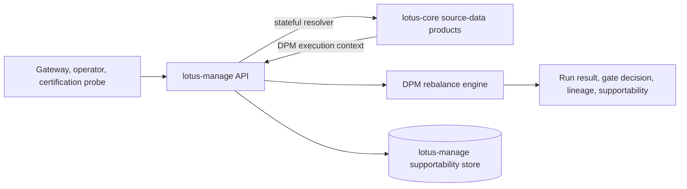

# RFC-0036: lotus-manage Stateful Core Sourcing And Endpoint Consolidation

- Status: PROPOSED
- Date: 2026-05-01
- Owners:
  - `lotus-manage` owners
  - `lotus-core` owners for governed source-data resolver contracts
  - `lotus-platform` governance for API vocabulary, OpenAPI quality, and source-data-product
    alignment
- Target repositories:
  - `lotus-manage`
  - `lotus-core` if the required DPM execution-context source-data contract is not already
    sufficient
  - `lotus-platform` only for shared context, vocabulary, and source-data-product catalog updates
- Depends on:
  - `RFC-0013` what-if analysis mode
  - `RFC-0016` idempotency replay contract
  - `RFC-0017` run supportability APIs
  - `RFC-0018` async operations resource
  - `RFC-0021` OpenAPI contract hardening
  - `RFC-0022` policy-pack configuration model
  - `RFC-0023` persistent supportability store and lineage APIs
  - `RFC-0028` integration capabilities contract
  - `lotus-platform` RFC-0067 OpenAPI quality and API vocabulary governance
  - `lotus-platform` RFC-0072 multi-lane CI validation and release governance
  - `lotus-platform` RFC-0082 source-data authority and downstream integration hardening
- Supersedes:
  - The older `docs/rfcs/RFC-CONVENTIONS.md` rule that treated unversioned
    `POST /rebalance/simulate` as the long-term canonical endpoint. This RFC defines the target
    strategic API as versioned only.

## Summary

`lotus-manage` must move from its current inline-only rebalance execution model to an enterprise
target model that supports both explicit stateless execution and governed stateful execution.

The target model is:

1. `stateless` mode for caller-supplied full execution bundles,
2. `stateful` mode for `portfolio_id`/`as_of`/mandate/model/policy selectors resolved through
   governed `lotus-core` source-data contracts,
3. one canonical versioned API surface with duplicate unversioned endpoints removed,
4. no advisory proposal behavior in `lotus-manage`,
5. no portfolio, market-data, price, FX, model, or shelf source-data ownership in `lotus-manage`,
6. complete lineage proving which upstream source snapshots fed each execution run.

This RFC intentionally does not preserve backward compatibility. Gateway integration will be
redone later against the corrected target contract.

## Current Reality

Current implementation:

1. `lotus-manage` accepts direct inline request bodies for `POST /rebalance/simulate`,
   `POST /rebalance/analyze`, and `POST /rebalance/analyze/async`.
2. The FastAPI app mounts the same routers twice: once unversioned and once under `/api/v1`.
3. `DPM_CAP_INPUT_MODE_PORTFOLIO_ID_ENABLED` defaults to disabled.
4. No active outbound `lotus-core` HTTP client exists in `lotus-manage`.
5. Current source-data authority is documented as upstream: callers must provide source-governed
   portfolio, market-data, model, shelf, and option bundles.
6. `lotus-gateway` currently consumes only run lookup, supportability summary, and capabilities
   from `lotus-manage`; it does not currently consume `simulate` or `analyze` for product DPM
   execution.

Current architecture is useful for deterministic certification, replay, and isolated engine
testing, but it is not the final enterprise product architecture because UI/BFF callers should not
be responsible for assembling source-data bundles.

## Problem

The current inline-only execution model creates enterprise architecture gaps:

1. Gateway or future consumers would need to assemble portfolio, price, FX, model, and shelf data.
2. Source-data lineage can become ambiguous if callers fail to preserve snapshot identifiers.
3. `lotus-manage` cannot independently prove it used the correct governed portfolio state for a
   `portfolio_id` request.
4. Duplicate endpoint registration creates unnecessary API surface area and documentation noise.
5. Capability discovery advertises future stateful behavior as disabled, but no implementation plan
   defines the resolver, source-data contract, error semantics, or lineage requirements.
6. The old unversioned route convention conflicts with the current platform move toward strategic
   versioned APIs.

## Business Outcome

Portfolio managers and operations teams should be able to run discretionary mandate rebalance
simulation and scenario analysis from either:

1. a complete deterministic input bundle, or
2. a governed portfolio identifier and source-data selector set.

For stateful mode, the user-facing outcome is:

1. select a portfolio/mandate/model/policy context,
2. run rebalance simulation, analysis, or async analysis,
3. receive execution-ready, review-required, or blocked decisions,
4. inspect source-backed lineage, supportability, idempotency, policy-pack, and artifact evidence.

## Goals

1. Add explicit `input_mode` support to all strategic execution endpoints.
2. Preserve stateless execution for deterministic replay, external validation, tests, and demo
   evidence.
3. Add stateful execution that resolves required source data from `lotus-core` through governed
   contracts.
4. Remove duplicate public API endpoints and keep one canonical versioned surface.
5. Keep `lotus-manage` as the discretionary mandate execution owner, not a source-data authority.
6. Publish capability truth that reports stateful mode only when resolver configuration and
   upstream readiness are proven.
7. Capture complete lineage and supportability evidence for stateful and stateless runs.
8. Improve OpenAPI/Swagger so every endpoint explains when to use it, when not to use it, request
   modes, attributes, examples, and error behavior.

## Non-Goals

1. Do not rebuild advisory proposal workflows in `lotus-manage`.
2. Do not maintain backward compatibility for unversioned duplicate endpoints.
3. Do not integrate Gateway in this RFC. Gateway will be reworked later against the corrected
   contract.
4. Do not make Workbench call `lotus-manage` directly.
5. Do not move portfolio ledger, market-data, price, FX, model, or shelf ownership into
   `lotus-manage`.
6. Do not introduce gRPC. REST/OpenAPI remains the governed integration contract.
7. Do not enable stateful mode by configuration until live source-data resolution and validation
   evidence exist.

## Target Architecture



Boundary rules:

1. `lotus-core` owns source-data products.
2. `lotus-manage` owns discretionary mandate execution decisions from governed inputs.
3. `lotus-manage` may cache only bounded resolver results for latency and idempotency, never as a
   new portfolio source of truth.
4. All stateful runs must carry source identifiers in lineage.
5. Gateway and Workbench integration is explicitly deferred until the corrected service API is
   implemented and certified.

## Canonical API Surface

The strategic target surface is versioned only:

1. `POST /api/v1/rebalance/simulate`
2. `POST /api/v1/rebalance/analyze`
3. `POST /api/v1/rebalance/analyze/async`
4. `POST /api/v1/rebalance/operations/{operation_id}/execute`
5. `GET /api/v1/rebalance/operations`
6. `GET /api/v1/rebalance/operations/{operation_id}`
7. `GET /api/v1/rebalance/operations/by-correlation/{correlation_id}`
8. `GET /api/v1/rebalance/runs`
9. `GET /api/v1/rebalance/runs/{rebalance_run_id}`
10. `GET /api/v1/rebalance/runs/by-correlation/{correlation_id}`
11. `GET /api/v1/rebalance/runs/by-request-hash/{request_hash}`
12. `GET /api/v1/rebalance/runs/idempotency/{idempotency_key}`
13. `GET /api/v1/rebalance/runs/{rebalance_run_id}/artifact`
14. `GET /api/v1/rebalance/runs/{rebalance_run_id}/support-bundle`
15. `GET /api/v1/rebalance/lineage/{entity_id}`
16. `GET /api/v1/rebalance/idempotency/{idempotency_key}/history`
17. `GET /api/v1/rebalance/supportability/summary`
18. `GET /api/v1/rebalance/policies/effective`
19. `GET /api/v1/rebalance/policies/catalog`
20. policy-pack admin routes under `/api/v1/rebalance/policies/catalog/{policy_pack_id}`
21. one capability route: `GET /api/v1/integration/capabilities`

Operational health probes remain unversioned infrastructure endpoints:

1. `GET /health`
2. `GET /health/live`
3. `GET /health/ready`

Target removals:

1. remove unversioned `/rebalance/*` duplicates,
2. remove `/api/v1/health*` duplicates,
3. remove `/platform/capabilities` and `/api/v1/platform/capabilities` duplicates,
4. remove any remaining proposal/advisory route remnants if found,
5. remove tests and docs that present duplicate routes as supported product contracts.

## Input Contract

All execution endpoints should use an explicit envelope.

### Stateless Simulate

```json
{
  "input_mode": "stateless",
  "stateless_input": {
    "portfolio_snapshot": {},
    "market_data_snapshot": {},
    "model_portfolio": {},
    "shelf_entries": [],
    "options": {}
  }
}
```

### Stateful Simulate

```json
{
  "input_mode": "stateful",
  "stateful_input": {
    "portfolio_id": "PB_SG_GLOBAL_BAL_001",
    "as_of": "2026-03-25",
    "mandate_id": "mandate_balanced_discretionary",
    "model_portfolio_id": "model_balanced_sgd",
    "policy_pack_id": "dpm_standard_v1",
    "tenant_id": "tenant_001",
    "booking_center_code": "SG"
  },
  "options_override": {
    "enable_tax_awareness": true,
    "enable_settlement_awareness": true
  }
}
```

### Stateful Analyze

```json
{
  "input_mode": "stateful",
  "stateful_input": {
    "portfolio_id": "PB_SG_GLOBAL_BAL_001",
    "as_of": "2026-03-25",
    "mandate_id": "mandate_balanced_discretionary",
    "model_portfolio_id": "model_balanced_sgd"
  },
  "scenarios": {
    "baseline": {
      "options": {}
    },
    "tax_budget": {
      "options": {
        "enable_tax_awareness": true,
        "max_realized_capital_gains": "2500.00"
      }
    }
  }
}
```

Legacy direct bodies may be supported only inside an implementation migration branch until the new
contracts, tests, docs, and Gateway follow-up plan are ready. They must not remain as the final
target API.

## `lotus-core` Source-Data Requirements

Stateful execution needs a single governed resolver response that can be transformed into the
current DPM engine input without ad hoc Gateway assembly.

### Preferred Core Contract

Add or certify a `lotus-core` control-plane source-data product:

`POST /integration/portfolios/{portfolio_id}/dpm-execution-context`

Request:

```json
{
  "as_of": "2026-03-25",
  "mandate_id": "mandate_balanced_discretionary",
  "model_portfolio_id": "model_balanced_sgd",
  "tenant_id": "tenant_001",
  "booking_center_code": "SG",
  "include_tax_lots": true,
  "include_settlement_profile": true,
  "include_shelf": true,
  "include_model_portfolio": true
}
```

Response must include:

1. `portfolio_snapshot`
   - portfolio id,
   - base currency,
   - positions,
   - cash balances,
   - tax lots where available,
   - snapshot id,
   - valuation/as-of metadata.
2. `market_data_snapshot`
   - prices for held and target/shelf instruments,
   - FX rates required for portfolio base-currency conversion,
   - market-data snapshot id,
   - completeness/freshness posture.
3. `model_portfolio`
   - target weights by instrument,
   - model id,
   - model version/as-of,
   - mandate alignment metadata.
4. `shelf_entries`
   - instrument id,
   - status,
   - asset class,
   - issuer id,
   - liquidity tier,
   - settlement days,
   - eligibility and restriction reason codes.
5. `policy_context`
   - recommended `policy_pack_id` when core owns selector inputs,
   - tenant, booking center, mandate, and jurisdiction selectors.
6. `source_lineage`
   - portfolio snapshot id,
   - market-data snapshot id,
   - model portfolio id/version,
   - shelf version,
   - integration policy version,
   - source-data product ids,
   - restatement/completeness indicators.
7. `supportability`
   - state,
   - reason,
   - freshness bucket,
   - missing or degraded source families.

### Acceptable Interim Core Contract

If `POST /integration/portfolios/{portfolio_id}/core-snapshot` already provides enough portfolio,
valuation, market-data, enrichment, and source-lineage data, `lotus-manage` may consume it as the
first resolver input. Any missing DPM-specific data must be explicitly sourced through certified
core contracts, not inferred in Gateway.

Known likely gaps to verify in `lotus-core` before implementation:

1. model portfolio target resolution by `model_portfolio_id`,
2. discretionary mandate metadata and mandate-to-model binding,
3. product shelf / eligibility export with settlement days and restriction reason codes,
4. tax-lot completeness for tax-aware sell allocation,
5. market price coverage for target instruments that are not currently held,
6. FX coverage for all portfolio, cash, price, and target instrument currencies,
7. explicit DPM supportability/completeness object.

If any of these are absent, the implementation must open `lotus-core` issues or PRs before enabling
stateful `lotus-manage`.

## Output And Lineage Requirements

`RebalanceResult`, `BatchRebalanceResult`, async operation status, run lookup, support bundle, and
artifact payloads must expose enough lineage to prove source-data authority.

Required lineage additions:

1. `input_mode`,
2. `source_system`,
3. `portfolio_snapshot_id`,
4. `market_data_snapshot_id`,
5. `model_portfolio_id`,
6. `model_portfolio_version`,
7. `shelf_version`,
8. `integration_policy_version`,
9. `source_lineage_bundle_id`,
10. `source_supportability_state`,
11. `stateful_context_hash`,
12. canonical `request_hash`.

No response, log, metric, or trace may expose sensitive holdings content beyond the governed API
payload itself. Metrics labels must remain bounded and must not include portfolio ids, request
hashes, correlation ids, account ids, instrument ids, or client identifiers.

## Capability Contract

`GET /api/v1/integration/capabilities` must publish:

1. supported input modes,
2. stateful mode enabled/disabled,
3. required upstream source-data products,
4. upstream readiness state,
5. resolver policy version,
6. duplicate endpoint removal status,
7. supported canonical endpoint list.

Stateful mode must be disabled unless:

1. `lotus-core` base URL is configured,
2. resolver contract version is configured and validated,
3. readiness check confirms required source-data products are available,
4. OpenAPI schema and API vocabulary validation pass,
5. live stateful probe succeeds for a governed test portfolio,
6. supportability store captures source lineage.

## Error Behavior

Use domain-specific, supportable error codes:

| Condition | HTTP | Error code |
| --- | --- | --- |
| unknown `input_mode` | 422 | `DPM_INPUT_MODE_INVALID` |
| missing `stateless_input` | 422 | `DPM_STATELESS_INPUT_REQUIRED` |
| missing `stateful_input` | 422 | `DPM_STATEFUL_INPUT_REQUIRED` |
| stateful mode disabled | 404 or 409 | `DPM_STATEFUL_INPUT_DISABLED` |
| core resolver unavailable | 503 | `DPM_CORE_RESOLVER_UNAVAILABLE` |
| core context incomplete | 424 or 422 | `DPM_CORE_CONTEXT_INCOMPLETE` |
| missing model portfolio | 424 or 422 | `DPM_MODEL_PORTFOLIO_UNAVAILABLE` |
| missing shelf context | 424 or 422 | `DPM_SHELF_CONTEXT_UNAVAILABLE` |
| missing market data | 422 | existing data-quality diagnostics plus `DPM_MARKET_DATA_INCOMPLETE` |
| idempotency conflict | 409 | existing idempotency conflict code |

The implementation must choose final HTTP status mappings consistently and certify them in
OpenAPI examples and tests.

## Implementation Slices

### Slice 0: Contract Audit And No-Go Decisions

1. Reconfirm `lotus-core` source-data products available for DPM execution.
2. Decide whether to use existing core-snapshot plus supplemental reads or add the preferred
   `dpm-execution-context` route.
3. Record exact core endpoint paths, request examples, response examples, timeout budget, retry
   policy, and supportability fields.
4. Confirm no Gateway integration work is included in the first implementation branch.

Exit evidence:

1. RFC updated with final resolver decision,
2. `lotus-core` issue/PR links for any required source-data gaps,
3. no runtime behavior changed yet.

### Slice 1: Endpoint Consolidation

1. Remove unversioned domain API router mounts.
2. Remove `/platform/capabilities` duplicates.
3. Keep only unversioned infrastructure health probes.
4. Update OpenAPI, API vocabulary, docs, tests, demo scripts, and wiki source to use canonical
   `/api/v1` paths.
5. Remove stale duplicate endpoint tests.

Exit evidence:

1. OpenAPI quality gate passes,
2. API vocabulary gate passes,
3. route inventory proves no duplicate product API paths,
4. live API demo pack uses only canonical paths.

### Slice 2: Explicit Stateless Envelope

1. Add envelope request models for simulate, analyze, and async analyze.
2. Move current direct request body into `stateless_input`.
3. Preserve deterministic engine behavior and idempotency semantics.
4. Update examples, docs, and tests.

Exit evidence:

1. current golden scenarios pass through stateless envelopes,
2. idempotency replay/conflict tests pass,
3. OpenAPI examples include complete request and response examples.

### Slice 3: Core Resolver Client And Stateful Models

1. Add `stateful_input` models.
2. Add a `lotus-core` resolver client with bounded timeout, retry, correlation propagation, and
   source-safe errors.
3. Transform core execution context into DPM engine input.
4. Capture resolver lineage into run records and artifacts.
5. Keep stateful mode feature-gated until live proof passes.

Exit evidence:

1. resolver unit tests cover success, timeout, incomplete context, and degraded supportability,
2. transformation tests tie out positions, cash, prices, FX, model targets, shelf metadata, and
   lineage,
3. no sensitive identifiers appear in metrics labels.

### Slice 4: Stateful Simulate And Analyze Certification

1. Enable stateful simulate under controlled configuration.
2. Enable stateful analyze and async analyze.
3. Add live tests against `lotus-core` using a governed portfolio such as `PB_SG_GLOBAL_BAL_001`
   when available.
4. Verify every output family: valuation, target, intents, tax, settlement, diagnostics,
   gate decision, lineage, supportability, and artifacts.

Exit evidence:

1. live API evidence captured,
2. figure tie-outs reviewed critically,
3. supportability and lineage verified,
4. Remote Feature Lane and PR Merge Gate pass.

### Slice 5: Documentation, Wiki, And Platform Context

1. Update README, repository context, engine know-how, API surface, endpoint certification, and
   supported-features docs.
2. Update repo-local wiki source and publish after merge.
3. Update platform context/source-data catalogs if the core resolver contract changes.
4. Record Gateway integration as a follow-on, not part of this RFC.

Exit evidence:

1. wiki check passes,
2. docs regression tests pass,
3. supported-features reflects only implemented and proven behavior.

## Test Plan

Minimum test coverage:

1. model validation tests for `input_mode`, `stateless_input`, and `stateful_input`,
2. request compatibility removal tests proving old direct bodies and unversioned paths are not
   accepted in target mode,
3. resolver client tests for HTTP success, 404, 422, 424, 503, timeout, malformed payload, and
   partial supportability,
4. transformation tests from core context to DPM engine request,
5. simulate/analyze/async API tests for both modes,
6. idempotency tests where stateful context hash changes,
7. supportability store tests for source-lineage persistence,
8. OpenAPI examples and attribute documentation tests,
9. API vocabulary/no-alias tests,
10. live core-backed API validation before stateful mode is promoted.

## OpenAPI And Swagger Requirements

Every strategic endpoint must document:

1. when to use the endpoint,
2. when not to use the endpoint,
3. supported input modes,
4. every request and response attribute with description, type, and example,
5. all headers,
6. all error responses with examples,
7. idempotency behavior,
8. source-data ownership and lineage behavior,
9. mode-specific examples for stateless and stateful requests.

## Rollout Plan

1. Implement endpoint consolidation and stateless envelope first.
2. Keep stateful mode disabled while resolver and core source-data gaps are implemented.
3. Certify stateful mode locally against `lotus-core`.
4. Promote `dpm.execution.stateful_portfolio_id` in capabilities only after live proof.
5. Rebuild Gateway integration in a separate follow-on slice against the canonical `/api/v1`
   contract.

## Risks And Controls

| Risk | Control |
| --- | --- |
| `lotus-manage` accidentally becomes a source-data owner | resolver outputs carry core source lineage; no local source-data persistence beyond supportability evidence |
| Gateway breaks after endpoint cleanup | Gateway integration is explicitly deferred; breaking change is accepted |
| stateful resolver becomes high latency | bounded timeout, retries, optional async analyze path, resolver performance tests |
| stale or incomplete core data drives execution | supportability state, completeness checks, source-lineage requirements, blocking error codes |
| OpenAPI sprawl continues | remove duplicates and certify route inventory |
| test suite becomes shallow | require unit, integration, live, OpenAPI, vocabulary, and endpoint certification proof |

## Acceptance Criteria

This RFC is complete only when:

1. only canonical versioned product API routes remain,
2. stateless and stateful input modes are implemented for simulate, analyze, and async analyze,
3. `lotus-manage` resolves stateful source data from governed `lotus-core` contracts,
4. stateful mode is disabled unless resolver readiness passes,
5. capabilities truthfully reports enabled modes and upstream supportability,
6. OpenAPI and API vocabulary gates pass,
7. live stateful proof is captured and critically reviewed,
8. supportability and artifact evidence include source lineage,
9. docs, wiki, repository context, and platform context are updated,
10. Gateway follow-on integration work is tracked separately.

## Follow-On Work

1. Rebuild `lotus-gateway` integration against the canonical stateful `lotus-manage` API.
2. Add Workbench product surfaces only through Gateway after Gateway integration is certified.
3. Consider portfolio-level DPM operation dashboards after run/supportability APIs are certified
   against stateful executions.
4. Promote stateful DPM source-data products into platform mesh certification only after the
   source-data lineage and supportability evidence is stable.
