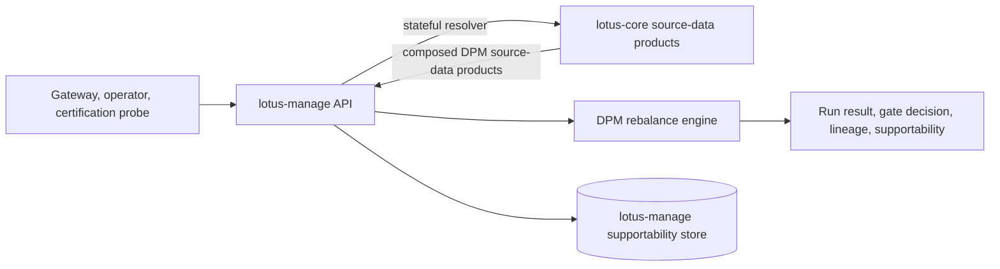

# RFC-0036: lotus-manage Stateful Core Sourcing And Endpoint Consolidation

- Status: PROPOSED
- Date: 2026-05-01
- Gold-standard execution review: 2026-05-01
- Owners:
  - `lotus-manage` owners
  - `lotus-core` owners for governed source-data resolver contracts
  - `lotus-platform` governance for API vocabulary, OpenAPI quality, and source-data-product
    alignment
- Target repositories:
  - `lotus-manage`
  - `lotus-core` for the RFC-087 composed DPM source-data products required by stateful execution
  - `lotus-platform` only for shared context, vocabulary, and source-data-product catalog updates
- Depends on:
  - `RFC-0013` what-if analysis mode
  - `RFC-0016` idempotency replay contract
  - `RFC-0017` run supportability APIs
  - `RFC-0018` async operations resource
  - `RFC-0021` OpenAPI contract hardening
  - `RFC-0022` policy-pack configuration model
  - `RFC-0023` persistent supportability store and lineage APIs
  - `RFC-0028` integration capabilities contract
  - `lotus-platform` RFC-0067 OpenAPI quality and API vocabulary governance
  - `lotus-platform` RFC-0072 multi-lane CI validation and release governance
  - `lotus-platform` RFC-0087 live trust telemetry and certification plane
  - `lotus-platform` RFC-0088 self-serve discovery and dependency catalog
  - `lotus-platform` RFC-0089 mesh certification merge gate and operational trust enforcement
  - `lotus-platform` RFC-0082 source-data authority and downstream integration hardening
  - `lotus-platform` RFC-0091 enterprise data mesh maturity and production readiness
  - `lotus-platform` RFC-0108 front-office analytics UI observability and operational posture,
    where ecosystem-wide supportability, metrics, logs, and no-sensitive-telemetry rules apply
- Supersedes:
  - The older `docs/rfcs/RFC-CONVENTIONS.md` rule that treated unversioned
    `POST /rebalance/simulate` as the long-term canonical endpoint. This RFC defines the target
    strategic API as versioned only.

## RFC-087 Core Source-Data Rebaseline

On 2026-05-02, `lotus-core` RFC-087 superseded the earlier expectation that core should provide one
monolithic `POST /integration/portfolios/{portfolio_id}/dpm-execution-context` route.

The corrected target architecture is composed source-data products:

1. `PortfolioStateSnapshot:v1` and `HoldingsAsOf:v1` for portfolio state, holdings, and cash,
2. `DpmModelPortfolioTarget:v1` for model portfolio target weights, bands, approvals, and effective
   dates,
3. `DiscretionaryMandateBinding:v1` for mandate, model, policy pack, booking-center, jurisdiction,
   authority, and rebalance constraints,
4. `InstrumentEligibilityProfile:v1` for product shelf, buy/sell eligibility, restrictions,
   settlement profile, liquidity, issuer, and taxonomy context,
5. `PortfolioTaxLotWindow:v1` for tax-aware sell and cost-basis context without per-security
   production fan-out,
6. `MarketDataCoverageWindow:v1` for held and target universe prices and FX with coverage
   diagnostics,
7. readiness, lineage, trust telemetry, and supportability products for DPM source-family evidence.

All older mentions of a DPM execution-context route in this RFC are historical evidence or obsolete
implementation notes. Runtime implementation must follow RFC-087 composed source products.
Stateful promotion is no longer blocked at the service level: those products are implemented,
certified through live `lotus-core` evidence, and proven through live `lotus-manage` stateful
execution evidence when the explicit stateful feature gates are enabled.

Implementation note, 2026-05-02:

1. `lotus-core` RFC-087 Slice 4 introduced the dedicated
   `POST /integration/model-portfolios/{model_portfolio_id}/targets` source-product endpoint.
2. `lotus-core` RFC-087 Slice 5 introduced the dedicated
   `POST /integration/portfolios/{portfolio_id}/mandate-binding` source-product endpoint.
3. `lotus-core` RFC-087 Slice 6 introduced the dedicated
   `POST /integration/instruments/eligibility-bulk` source-product endpoint.
4. `lotus-core` RFC-087 Slice 7 introduced the dedicated
   `POST /integration/portfolios/{portfolio_id}/tax-lots` source-product endpoint.
5. `lotus-manage` now has dedicated client methods and transformers for those products:
   `DpmCoreResolverClient.resolve_model_portfolio_targets` and
   `build_model_portfolio_from_core_targets`, plus
   `DpmCoreResolverClient.resolve_mandate_binding` and
   `build_policy_context_from_core_mandate`, plus
   `DpmCoreResolverClient.resolve_instrument_eligibility` and
   `build_shelf_entries_from_core_eligibility`, plus
   `DpmCoreResolverClient.resolve_portfolio_tax_lots` and
   `build_portfolio_snapshot_with_core_tax_lots`.
6. This is not stateful execution promotion. It proves the first composed source-product
   integration paths while keeping `input_mode=stateful` gated until portfolio state,
   market-data/FX, readiness source products, and live end-to-end proof are also available.

## Summary

`lotus-manage` must move from its current inline-only rebalance execution model to an enterprise
target model that supports both explicit stateless execution and governed stateful execution.

The target model is:

1. `stateless` mode for caller-supplied full execution bundles,
2. `stateful` mode for `portfolio_id`/`as_of`/mandate/model/policy selectors resolved through
   governed `lotus-core` source-data contracts,
3. one canonical versioned API surface with duplicate unversioned endpoints removed,
4. no advisory proposal behavior in `lotus-manage`,
5. no portfolio, market-data, price, FX, model, or shelf source-data ownership in `lotus-manage`,
6. complete lineage proving which upstream source snapshots fed each execution run.

This RFC intentionally does not preserve backward compatibility. Gateway integration will be
redone later against the corrected target contract.

## Current Reality

Current implementation:

1. `lotus-manage` accepts direct inline request bodies for `POST /rebalance/simulate`,
   `POST /rebalance/analyze`, and `POST /rebalance/analyze/async`.
2. The FastAPI app mounts the same routers twice: once unversioned and once under `/api/v1`.
3. `DPM_CAP_INPUT_MODE_PORTFOLIO_ID_ENABLED` defaults to disabled.
4. `lotus-manage` has bounded outbound `lotus-core` source-product clients for
   `DpmModelPortfolioTarget:v1`, `DiscretionaryMandateBinding:v1`, and
   `InstrumentEligibilityProfile:v1`; the older monolithic DPM execution-context route remains
   blocked and must not be used.
5. Current source-data authority is documented as upstream: callers must provide source-governed
   portfolio, market-data, model, shelf, and option bundles.
6. `lotus-gateway` currently consumes only run lookup, supportability summary, and capabilities
   from `lotus-manage`; it does not currently consume `simulate` or `analyze` for product DPM
   execution.

Current architecture is useful for deterministic certification, replay, and isolated engine
testing, but it is not the final enterprise product architecture because UI/BFF callers should not
be responsible for assembling source-data bundles.

## Gold-Standard Review Findings

This RFC is implementation-gated. Runtime implementation must not begin until these review findings
are carried into the implementation checklist and each pre-implementation exit condition is
satisfied:

1. The target architecture is directionally correct, but the work must begin by fixing repeatable
   platform automation and scaffolding gaps so future Lotus apps do not have to rediscover the same
   API certification, OpenAPI, observability, CI, documentation, and governance baseline.
2. Endpoint consolidation is necessary, but it is not sufficient. The implementation must also
   remove stale advisory/proposal behavior, duplicate documentation, misleading examples,
   compatibility shims, and route aliases that would keep `lotus-manage` coupled to old advisory
   semantics.
3. Stateful sourcing is a cross-repository dependency. The RFC must keep the no-go decision point
   explicit until `lotus-core` source-data products, lineage, supportability fields, timeout
   budgets, and degraded-state behavior are confirmed.
4. Implementation proof must use live application evidence, not only unit tests or static OpenAPI
   checks. Evidence must be reviewed critically for calculation quality, lineage completeness,
   upstream degradation handling, and operational supportability.
5. API certification, data mesh onboarding, observability parity, Swagger quality, and error
   handling need a second-last hardening pass after feature implementation, because these are where
   production readiness regressions usually surface.
6. Final closure must consciously update or explicitly decline updates to repository context,
   platform context, skills, guidance, wiki source, supported-features material, and branch hygiene.

## Execution Rules

Implementation must proceed slice by slice. Do not move to the next slice until the current slice
has complete exit evidence, local validation, and any relevant remote CI signal.

Branch and CI rules:

1. Continue on `feat/lotus-manage-dpm-scope-cleanup` unless a newer active RFC-0036 feature branch
   supersedes it.
2. Keep commits small, meaningful, and scoped to one coherent change.
3. Push each completed slice to the remote feature branch so GitHub checks can run asynchronously.
4. Monitor Feature Lane and PR Merge Gate checks after pushes; fix failures promptly before
   accumulating unrelated changes.
5. Treat GitHub Actions as CI truth and local command output as supporting evidence.
6. Do not publish capability or supported-feature truth until the implementation evidence exists.

## Supported-Features Governance

RFC-0036 introduces or changes the following supported-feature areas. Until implementation proof is
captured, all entries remain planned and must not be presented as implemented product truth.

| Feature area | Target supported-feature wording | Promotion evidence required |
| --- | --- | --- |
| Canonical DPM API surface | Versioned discretionary mandate rebalance APIs are the supported product contract; duplicate unversioned product routes are removed. | route inventory, OpenAPI, API vocabulary, live canonical API probes |
| Stateless execution envelope | Simulate, analyze, and async analyze accept deterministic caller-supplied execution bundles through an explicit `stateless` envelope. | model validation, golden scenario tie-outs, idempotency replay tests |
| Stateful core-sourced execution | Simulate, analyze, and async analyze can resolve governed portfolio execution context from `lotus-core` using portfolio, mandate, model, policy, tenant, booking-center, and as-of selectors. | live core-backed probes, lineage tie-out, resolver error tests |
| Source-data lineage | Run, artifact, support-bundle, and supportability responses expose source-data lineage sufficient to prove upstream authority. | persistence tests, artifact examples, support-bundle evidence |
| Advisory cleanup | `lotus-manage` contains no advisory proposal, recommendation, consent, or report ownership. | search ledger, OpenAPI route inventory, downstream issue links where needed |
| API certification | Every remaining public API is endpoint-certified to Lotus enterprise standards. | endpoint certification ledger, examples, error contracts, docs tests |
| Data mesh onboarding | `lotus-manage` is a governed data mesh consumer and producer with catalog, SLO, access, lifecycle, quality, and trust-telemetry posture. | mesh validators, platform catalog sync, wiki/current-state evidence |
| Observability parity | Logs, metrics, traces, dashboards, alerts, health, readiness, and diagnostics meet Lotus ecosystem requirements without sensitive telemetry leakage. | no-sensitive telemetry tests, metrics proof, dashboard/alert contract proof |

Each implementation slice must update the repo supported-features material only after the related
feature is implemented, tested, and evidenced. Aspirational content belongs in RFCs, not in
current-state feature material.

## Problem

The current inline-only execution model creates enterprise architecture gaps:

1. Gateway or future consumers would need to assemble portfolio, price, FX, model, and shelf data.
2. Source-data lineage can become ambiguous if callers fail to preserve snapshot identifiers.
3. `lotus-manage` cannot independently prove it used the correct governed portfolio state for a
   `portfolio_id` request.
4. Duplicate endpoint registration creates unnecessary API surface area and documentation noise.
5. Capability discovery advertises future stateful behavior as disabled, but no implementation plan
   defines the resolver, source-data contract, error semantics, or lineage requirements.
6. The old unversioned route convention conflicts with the current platform move toward strategic
   versioned APIs.

## Business Outcome

Portfolio managers and operations teams should be able to run discretionary mandate rebalance
simulation and scenario analysis from either:

1. a complete deterministic input bundle, or
2. a governed portfolio identifier and source-data selector set.

For stateful mode, the user-facing outcome is:

1. select a portfolio/mandate/model/policy context,
2. run rebalance simulation, analysis, or async analysis,
3. receive execution-ready, review-required, or blocked decisions,
4. inspect source-backed lineage, supportability, idempotency, policy-pack, and artifact evidence.

## Goals

1. Add explicit `input_mode` support to all strategic execution endpoints.
2. Preserve stateless execution for deterministic replay, external validation, tests, and demo
   evidence.
3. Add stateful execution that resolves required source data from `lotus-core` through governed
   contracts.
4. Remove duplicate public API endpoints and keep one canonical versioned surface.
5. Keep `lotus-manage` as the discretionary mandate execution owner, not a source-data authority.
6. Publish capability truth that reports stateful mode only when resolver configuration and
   upstream readiness are proven.
7. Capture complete lineage and supportability evidence for stateful and stateless runs.
8. Improve OpenAPI/Swagger so every endpoint explains when to use it, when not to use it, request
   modes, attributes, examples, and error behavior.
9. Remove advisory leftovers, stale proposal paths, obsolete compatibility code, and misleading
   documentation from `lotus-manage`.
10. Bring every `lotus-manage` API to Lotus enterprise certification standard before promotion.
11. Fully onboard `lotus-manage` to the Lotus data mesh as a governed producer/consumer with
    source-data-product, trust-telemetry, SLO, access, lifecycle, evidence-pack, and catalog
    posture.
12. Bring `lotus-manage` observability, logging, metrics, tracing, supportability, dashboards, and
    alert contracts to the current Lotus ecosystem standard.

## Non-Goals

1. Do not rebuild advisory proposal workflows in `lotus-manage`.
2. Do not maintain backward compatibility for unversioned duplicate endpoints.
3. Do not integrate Gateway in this RFC. Gateway will be reworked later against the corrected
   contract.
4. Do not make Workbench call `lotus-manage` directly.
5. Do not move portfolio ledger, market-data, price, FX, model, or shelf ownership into
   `lotus-manage`.
6. Do not introduce gRPC. REST/OpenAPI remains the governed integration contract.
7. Do not enable stateful mode by configuration until live source-data resolution and validation
   evidence exist.

## Target Architecture



Boundary rules:

1. `lotus-core` owns source-data products.
2. `lotus-manage` owns discretionary mandate execution decisions from governed inputs.
3. `lotus-manage` may cache only bounded resolver results for latency and idempotency, never as a
   new portfolio source of truth.
4. All stateful runs must carry source identifiers in lineage.
5. Gateway and Workbench integration is explicitly deferred until the corrected service API is
   implemented and certified.

## Canonical API Surface

The strategic target surface is versioned only:

1. `POST /api/v1/rebalance/simulate`
2. `POST /api/v1/rebalance/analyze`
3. `POST /api/v1/rebalance/analyze/async`
4. `POST /api/v1/rebalance/operations/{operation_id}/execute`
5. `GET /api/v1/rebalance/operations`
6. `GET /api/v1/rebalance/operations/{operation_id}`
7. `GET /api/v1/rebalance/operations/by-correlation/{correlation_id}`
8. `GET /api/v1/rebalance/runs`
9. `GET /api/v1/rebalance/runs/{rebalance_run_id}`
10. `GET /api/v1/rebalance/runs/by-correlation/{correlation_id}`
11. `GET /api/v1/rebalance/runs/by-request-hash/{request_hash}`
12. `GET /api/v1/rebalance/runs/idempotency/{idempotency_key}`
13. `GET /api/v1/rebalance/runs/{rebalance_run_id}/artifact`
14. `GET /api/v1/rebalance/runs/{rebalance_run_id}/support-bundle`
15. `GET /api/v1/rebalance/lineage/{entity_id}`
16. `GET /api/v1/rebalance/idempotency/{idempotency_key}/history`
17. `GET /api/v1/rebalance/supportability/summary`
18. `GET /api/v1/rebalance/policies/effective`
19. `GET /api/v1/rebalance/policies/catalog`
20. policy-pack admin routes under `/api/v1/rebalance/policies/catalog/{policy_pack_id}`
21. one capability route: `GET /api/v1/integration/capabilities`

Operational health probes remain unversioned infrastructure endpoints:

1. `GET /health`
2. `GET /health/live`
3. `GET /health/ready`

Target removals:

1. remove unversioned `/rebalance/*` duplicates,
2. remove `/api/v1/health*` duplicates,
3. remove `/platform/capabilities` and `/api/v1/platform/capabilities` duplicates,
4. remove any remaining proposal/advisory route remnants if found,
5. remove tests and docs that present duplicate routes as supported product contracts.

## Input Contract

All execution endpoints should use an explicit envelope.

### Stateless Simulate

```json
{
  "input_mode": "stateless",
  "stateless_input": {
    "portfolio_snapshot": {},
    "market_data_snapshot": {},
    "model_portfolio": {},
    "shelf_entries": [],
    "options": {}
  }
}
```

### Stateful Simulate

```json
{
  "input_mode": "stateful",
  "stateful_input": {
    "portfolio_id": "PB_SG_GLOBAL_BAL_001",
    "as_of": "2026-03-25",
    "mandate_id": "mandate_balanced_discretionary",
    "model_portfolio_id": "model_balanced_sgd",
    "policy_pack_id": "dpm_standard_v1",
    "tenant_id": "tenant_001",
    "booking_center_code": "SG"
  },
  "options_override": {
    "enable_tax_awareness": true,
    "enable_settlement_awareness": true
  }
}
```

### Stateful Analyze

```json
{
  "input_mode": "stateful",
  "stateful_input": {
    "portfolio_id": "PB_SG_GLOBAL_BAL_001",
    "as_of": "2026-03-25",
    "mandate_id": "mandate_balanced_discretionary",
    "model_portfolio_id": "model_balanced_sgd"
  },
  "scenarios": {
    "baseline": {
      "options": {}
    },
    "tax_budget": {
      "options": {
        "enable_tax_awareness": true,
        "max_realized_capital_gains": "2500.00"
      }
    }
  }
}
```

Legacy direct bodies may be supported only inside an implementation migration branch until the new
contracts, tests, docs, and Gateway follow-up plan are ready. They must not remain as the final
target API.

## `lotus-core` Source-Data Requirements

Stateful execution needs governed source-data products that can be composed into the current DPM
engine input without ad hoc Gateway assembly. RFC-087 is the authoritative core implementation
program.

### Required Core Product Families

`lotus-manage` stateful source assembly must compose these core product families:

1. portfolio state:
   - `PortfolioStateSnapshot:v1`,
   - `HoldingsAsOf:v1` when operational read augmentation is required.
2. model target:
   - `DpmModelPortfolioTarget:v1`.
3. mandate and policy binding:
   - `DiscretionaryMandateBinding:v1`.
4. eligibility, restriction, shelf, and settlement:
   - `InstrumentEligibilityProfile:v1`.
5. tax lots:
   - `PortfolioTaxLotWindow:v1`.
6. prices and FX:
   - `MarketDataCoverageWindow:v1`.
7. supportability:
   - DPM source-family readiness, lineage, trust telemetry, and data-quality evidence.

### Composed Resolver Call Plan

The future `lotus-manage` resolver should use bounded, parallelizable calls:

1. portfolio state first,
2. mandate binding to resolve model and policy selectors,
3. model target using resolved model/mandate context,
4. eligibility for the union of held and target instruments,
5. price and FX coverage for all required instruments/currency pairs,
6. tax lots only when tax-aware mode is requested or required by mandate,
7. readiness/lineage support routes for operator evidence.

`lotus-manage` must not loop over every position for prices, FX, tax lots, eligibility, or
enrichment in production paths once the RFC-087 source products are available.

### Current Blocking Gaps

Known gaps before stateful promotion:

1. product shelf / eligibility export with settlement days and restriction reason codes,
2. bulk tax-lot completeness for tax-aware sell allocation,
3. market price coverage for target instruments that are not currently held,
4. FX coverage for all portfolio, cash, price, and target instrument currencies,
5. explicit DPM supportability/completeness by source family.

Partial source-product integrations already implemented:

1. model portfolio target resolution by `model_portfolio_id`,
2. discretionary mandate metadata and mandate-to-model/policy binding,
3. instrument eligibility and product shelf transformation,
4. portfolio tax-lot enrichment for tax-aware sell allocation,
5. market-data and FX coverage transformation with stale/missing coverage rejection.

Stateful `lotus-manage` must remain disabled until RFC-087 core products are implemented,
certified, and proven with live core/manage evidence.

## Output And Lineage Requirements

`RebalanceResult`, `BatchRebalanceResult`, async operation status, run lookup, support bundle, and
artifact payloads must expose enough lineage to prove source-data authority.

Required lineage additions:

1. `input_mode`,
2. `source_system`,
3. `portfolio_snapshot_id`,
4. `market_data_snapshot_id`,
5. `model_portfolio_id`,
6. `model_portfolio_version`,
7. `shelf_version`,
8. `integration_policy_version`,
9. `source_lineage_bundle_id`,
10. `source_supportability_state`,
11. `stateful_context_hash`,
12. canonical `request_hash`.

No response, log, metric, or trace may expose sensitive holdings content beyond the governed API
payload itself. Metrics labels must remain bounded and must not include portfolio ids, request
hashes, correlation ids, account ids, instrument ids, or client identifiers.

## Capability Contract

`GET /api/v1/integration/capabilities` must publish:

1. supported input modes,
2. stateful mode enabled/disabled,
3. required upstream source-data products,
4. upstream readiness state,
5. resolver policy version,
6. duplicate endpoint removal status,
7. supported canonical endpoint list.

Stateful mode must be disabled unless:

1. `lotus-core` base URL is configured,
2. resolver contract version is configured and validated,
3. readiness check confirms required source-data products are available,
4. OpenAPI schema and API vocabulary validation pass,
5. live stateful probe succeeds for a governed test portfolio,
6. supportability store captures source lineage.

## Error Behavior

Use domain-specific, supportable error codes:

| Condition | HTTP | Error code |
| --- | --- | --- |
| unknown `input_mode` | 422 | `DPM_INPUT_MODE_INVALID` |
| missing `stateless_input` | 422 | `DPM_STATELESS_INPUT_REQUIRED` |
| missing `stateful_input` | 422 | `DPM_STATEFUL_INPUT_REQUIRED` |
| stateful mode disabled | 404 or 409 | `DPM_STATEFUL_INPUT_DISABLED` |
| core resolver unavailable | 503 | `DPM_CORE_RESOLVER_UNAVAILABLE` |
| core context incomplete | 424 or 422 | `DPM_CORE_CONTEXT_INCOMPLETE` |
| missing model portfolio | 424 or 422 | `DPM_MODEL_PORTFOLIO_UNAVAILABLE` |
| missing shelf context | 424 or 422 | `DPM_SHELF_CONTEXT_UNAVAILABLE` |
| missing market data | 422 | existing data-quality diagnostics plus `DPM_MARKET_DATA_INCOMPLETE` |
| idempotency conflict | 409 | existing idempotency conflict code |

The implementation must choose final HTTP status mappings consistently and certify them in
OpenAPI examples and tests.

## Implementation Slices

### Slice 0: Platform Automation And Scaffolding Improvement

This slice is intentionally platform-first. Any repeatable gap found while preparing
`lotus-manage` must be fixed in `lotus-platform` automation, scaffolding, templates, validators,
or context so future apps start with the stronger baseline by default.

Scope:

1. Identify Lotus platform automation gaps that should already have been handled by app
   scaffolding rather than locally inside `lotus-manage`.
2. Improve platform automation for repeatable concerns including:
   - API certification pattern scaffolding,
   - Swagger/OpenAPI quality checks and examples,
   - health, liveness, readiness, and metrics endpoint defaults,
   - structured logging and correlation propagation,
   - governed error handling and Problem Details examples,
   - no-sensitive telemetry checks,
   - unit, integration, contract, OpenAPI, vocabulary, and live-test scaffolding,
   - CI lane defaults and merge-gate hooks,
   - README, wiki, RFC, supported-features, and endpoint-certification documentation scaffolding,
   - data mesh declaration, trust telemetry, and catalog validation hooks.
3. Define which cross-cutting concerns must be scaffolded for every new Lotus application.
4. Update app scaffolding automation so future apps start under proper governance from day one.
5. During later implementation slices, continue routing newly discovered repeatable gaps back to
   platform automation rather than leaving them as one-off local fixes.

Exit evidence:

1. platform automation/scaffolding gap list is recorded,
2. `lotus-platform` issues or PRs exist for gaps not fixed immediately,
3. any implemented platform automation changes are validated with their native tests,
4. RFC-0036 implementation checklist references the improved platform baseline,
5. no `lotus-manage` runtime behavior has changed yet.

Slice 0 implementation evidence captured on 2026-05-01:

1. Gap addressed: generated backend services had OpenAPI, supported-features, no-sensitive,
   observability, and health scaffolding, but endpoint certification remained mostly
   documentation-only instead of a machine-readable gate.
2. Platform branch: `lotus-platform` `feat/rfc-0036-platform-scaffold-certification`.
3. Platform commit: `9c79860 Scaffold endpoint certification gate`.
4. Platform change: `automation/New-Lotus-Service.ps1` now scaffolds
   `docs/operations/endpoint-certification-ledger.json` and
   `scripts/endpoint_certification_gate.py`; `platform-standards/templates/Makefile.backend.template`
   now includes `endpoint-certification-gate` in `lint`, `check`, and `ci`.
5. Local validation:
   - `python -m pytest tests/unit/test_repository_hygiene_scaffold_contract.py -q`
   - `python -m pytest tests/unit/test_repository_hygiene_scaffold_contract.py tests/unit/test_ci_governance_documentation_contract.py tests/unit/test_analytics_ui_scaffold_ci_enforcement.py -q`
   - `python -m ruff check tests/unit/test_repository_hygiene_scaffold_contract.py`
   - `python -m ruff format --check tests/unit/test_repository_hygiene_scaffold_contract.py`
   - `git diff --check`
6. GitHub validation: `lotus-platform` Remote Feature Lane run `25216261038` passed for commit
   `9c79860e57bb5df2343ae69e317175b9e1a2fc27`.
7. Heartbeat evidence: `lotus-platform` heartbeat `heartbeat-20260501T133105Z` completed with
   `attention_required` due to pre-existing historical background-run and stale mesh-certification
   advisory items; no blocking Slice 0 finding was reported.
8. Runtime behavior: no `lotus-manage` runtime behavior changed in Slice 0.

### Slice 1: Contract Audit And No-Go Decisions

1. Reconfirm `lotus-core` source-data products available for DPM execution.
2. Decide which existing and new RFC-087 source-data products are required for composed stateful
   source assembly.
3. Record exact core endpoint paths, request examples, response examples, timeout budget, retry
   policy, and supportability fields.
4. Confirm no Gateway integration work is included in the first implementation branch.

Exit evidence:

1. RFC updated with final resolver decision,
2. `lotus-core` issue/PR links for any required source-data gaps,
3. no runtime behavior changed yet.

Slice 1 implementation evidence captured on 2026-05-01:

1. Existing `lotus-core` source-data product audited:
   - product: `PortfolioStateSnapshot:v1`
   - route: `POST /integration/portfolios/{portfolio_id}/core-snapshot`
   - serving plane: `query_control_plane_service`
   - approved consumers include `lotus-manage`
   - current coverage: baseline/projected positions, deltas, portfolio totals, instrument
     enrichment, governance metadata, request fingerprint, freshness/runtime metadata, and policy
     provenance.
2. Resolver decision: `core-snapshot` is useful but insufficient as the sole stateful DPM resolver
   because it does not provide model portfolio targets, discretionary mandate-to-model binding,
   product shelf eligibility, settlement metadata, tax-lot completeness, complete target-instrument
   market data, complete FX coverage, or DPM-specific supportability in one certified source-data
   contract.
3. Original target resolver route was rejected by RFC-087. The target is now composed core
   source-data products rather than `POST /integration/portfolios/{portfolio_id}/dpm-execution-context`.
4. Upstream gap is tracked through RFC-087 and updated `lotus-core` issue
   `https://github.com/sgajbi/lotus-core/issues/330`.
5. Stateful promotion no-go: `lotus-manage` must keep stateful mode disabled until RFC-087 source
   products exist and live evidence proves composed resolver readiness.
6. Implementation guidance for later slices:
   - use `core-snapshot` only as a partial portfolio-state input and compose it with separately
     certified model, mandate, eligibility, tax-lot, market-data, FX, and supportability products;
   - do not infer missing DPM context in Gateway;
   - propagate correlation and trace headers to `lotus-core`;
   - use bounded resolver calls with no sensitive identifiers in metric labels;
   - target initial resolver timeout budget: 500 ms connect, 2 s total for synchronous simulate,
     and 5 s total for async-analysis context hydration, to be tightened or relaxed only with live
     latency evidence.
7. Gateway integration remains out of scope for RFC-0036 implementation and will be rebuilt later
   against the corrected canonical contract.
8. Runtime behavior: no `lotus-manage` runtime behavior changed in Slice 1.

### Slice 2: Cleanup And Structure

1. Remove dead code, stale compatibility shims, unused fixtures, obsolete scripts, and misleading
   configuration that are not part of the target DPM architecture.
2. Improve repository structure where needed so API contracts, domain models, resolver clients,
   engine adapters, supportability persistence, observability, tests, and docs have clear
   ownership boundaries.
3. Reduce documentation sprawl by separating:
   - implementation docs that must live with code,
   - long-lived current-state product/operator material that belongs in repo-local `wiki/`,
   - historical RFC rationale that should remain in `docs/rfcs/`.
4. Move the right long-lived material to wiki source and avoid duplicate truth across `docs/` and
   `wiki/`.
5. Ensure wiki source is usable, structured for developers/business/operations/sales/client demos,
   and ready to publish after merge.
6. Record any no-wiki-change decision explicitly when a cleanup change does not alter wiki truth.

Exit evidence:

1. dead-code and stale-doc search ledger is captured,
2. repository structure changes are justified by clearer ownership or reduced duplication,
3. duplicate documentation is removed or converted to links to the authoritative source,
4. wiki check passes when wiki source changes,
5. docs regression tests pass.

Slice 2 implementation evidence captured on 2026-05-01:

1. Added repository-local architecture review controls:
   - `docs/architecture/README.md`
   - `docs/architecture/CODEBASE-REVIEW-PLAYBOOK.md`
   - `docs/architecture/CODEBASE-REVIEW-LEDGER.md`
2. Recorded cleanup findings in the ledger:
   - missing durable cleanup review controls fixed;
   - retired advisory/proposal generated package remnants removed from disk;
   - duplicate unversioned domain API mounts deferred to Slice 3 because they change runtime
     endpoint behavior;
   - advisory vocabulary retained only where it is historical rationale or explicit boundary
     documentation, with active cleanup deferred to Slice 4.
3. Tightened `tests/unit/test_documentation_current_state.py` so retired advisory/proposal package
   namespaces stay absent and the architecture review docs remain present.
4. Updated the README documentation map to include the architecture review ledger.
5. Wiki decision: no wiki source change in this sub-slice because the changes are engineering
   control evidence. Existing wiki source already states the current product/operator boundary.
6. Validation:
   - `python -m pytest tests/unit/test_documentation_current_state.py -q`
   - `python -m pytest tests/unit/test_documentation_current_state.py tests/unit/test_local_docker_runtime_contract.py -q`
   - `git diff --check`

### Slice 3: Endpoint Consolidation

1. Remove unversioned domain API router mounts.
2. Remove `/platform/capabilities` duplicates.
3. Keep only unversioned infrastructure health probes.
4. Update OpenAPI, API vocabulary, docs, tests, demo scripts, and wiki source to use canonical
   `/api/v1` paths.
5. Remove stale duplicate endpoint tests.

Exit evidence:

1. OpenAPI quality gate passes,
2. API vocabulary gate passes,
3. route inventory proves no duplicate product API paths,
4. live API demo pack uses only canonical paths.

Slice 3 implementation evidence captured on 2026-05-01:

1. Removed duplicate product routing:
   - unversioned rebalance, operation, run-support, policy, lineage, idempotency, workflow, and
     capability router mounts removed from `src/api/main.py`;
   - `/platform/capabilities` and `/api/v1/platform/capabilities` removed from
     `src/api/routers/integration_capabilities.py`;
   - `/api/v1/health*` aliases removed so health probes remain unversioned infrastructure
     endpoints.
2. Route inventory after implementation contains only:
   - `/api/v1/rebalance/*` product APIs;
   - `/api/v1/integration/capabilities`;
   - `/health`, `/health/live`, `/health/ready`, and `/metrics` infrastructure APIs.
3. Updated live validation and demo-pack scripts to call canonical `/api/v1` product paths.
4. Updated current-state docs and wiki source for canonical endpoint truth:
   - `README.md`
   - `docs/demo/README.md`
   - `docs/documentation/engine-know-how-dpm.md`
   - `docs/documentation/project-overview.md`
   - `docs/runbooks/service-operations.md`
   - `docs/standards/RFC-0082-upstream-contract-family-map.md`
   - `wiki/API-Surface.md`
   - `wiki/Architecture.md`
   - `wiki/Endpoint-Certification.md`
   - `wiki/Operations-Runbook.md`
   - `wiki/Supported-Features.md`
5. Added a route-inventory regression test:
   `tests/unit/dpm/api/test_api_rebalance.py::test_openapi_exposes_only_canonical_product_routes`.
6. Regenerated `docs/standards/api-vocabulary/lotus-manage-api-vocabulary.v1.json`; the large
   reduction is expected because duplicate unversioned and platform-alias entries were removed.
7. Validation:
   - focused endpoint/API/docs tests: 40 passed;
   - `python -m pytest tests/unit -q`: 458 passed;
   - `python -m pytest tests/integration tests/e2e -q`: 101 passed;
   - `python scripts/openapi_quality_gate.py`;
   - `python scripts/api_vocabulary_inventory.py --validate-only`;
   - `python scripts/no_alias_contract_guard.py`;
   - `python -m ruff check .`;
   - `python -m ruff format --check .`;
   - `git diff --check`.
8. Wiki source check:
   - `powershell -ExecutionPolicy Bypass -File ..\lotus-platform\automation\Sync-RepoWikis.ps1 -CheckOnly -Repository lotus-manage`
     reports expected pre-merge drift for the five wiki pages updated by this slice. Repo-local
     `wiki/` source is the branch-authored truth; publication remains a final closure action after
     merge.

### Slice 4: Advisory Leftover Cleanup

1. Search all `src/`, `tests/`, `docs/`, `wiki/`, contracts, scripts, OpenAPI examples, demo
   packs, and environment names for advisory/proposal leftovers.
2. Remove any remaining proposal simulation, proposal artifact, proposal lifecycle, approval,
   consent, advisory workspace, or advisory report code from `lotus-manage`.
3. Remove stale compatibility shims, fixtures, operation names, error codes, comments, docs, or
   tests that imply advisory ownership.
4. Keep only DPM/discretionary mandate vocabulary in code, contracts, OpenAPI, docs, and wiki.
5. Record any downstream stale consumer issues in the downstream repository rather than preserving
   local compatibility.

Exit evidence:

1. advisory/proposal search ledger shows no active `lotus-manage` ownership remnants,
2. no advisory/proposal routes appear in OpenAPI,
3. no stale proposal tests or demo flows remain in `lotus-manage`,
4. `lotus-advise` remains the documented destination owner for advisory flows.

Slice 4 implementation evidence captured on 2026-05-01:

1. Advisory/proposal route inventory is clean:
   - `python -c "from src.api.main import app; matches=[p for p in sorted(app.openapi()['paths']) if 'proposal' in p.lower() or 'advis' in p.lower()]; print(matches); assert matches == []"`
     returned `[]`.
2. Removed advisory-era client-consent workflow vocabulary from active DPM contracts and runtime:
   - `workflow_requires_client_consent` became `workflow_requires_mandate_approval`;
   - `client_consent_already_obtained` became `mandate_approval_already_obtained`;
   - `CLIENT_CONSENT_REQUIRED` became `MANDATE_APPROVAL_REQUIRED`;
   - `REQUEST_CLIENT_CONSENT` became `REQUEST_MANDATE_APPROVAL`.
3. Regenerated API vocabulary inventory so Swagger/OpenAPI-derived certification material uses
   mandate-approval terms.
4. Removed generated remnants from retired proposal infrastructure namespaces and expanded
   `tests/unit/test_documentation_current_state.py` to keep those namespaces absent.
5. Retained only explicit boundary and historical references that say advisory proposal workflows
   belong to `lotus-advise`, plus tests that prove removed proposal paths stay unavailable.
6. Validation:
   - `python -m pytest tests/unit/dpm/engine/test_engine_workflow_gates.py tests/unit/dpm/engine/test_policy_pack_resolution.py tests/unit/dpm/api/test_api_rebalance.py tests/unit/dpm/api/test_dpm_policy_pack_admin_api.py tests/unit/dpm/contracts/test_contract_openapi_supportability_docs.py tests/unit/test_documentation_current_state.py -q`:
     137 passed;
   - `python scripts/openapi_quality_gate.py`;
   - `python scripts/api_vocabulary_inventory.py --validate-only`;
   - `python scripts/no_alias_contract_guard.py`;
   - `python -m ruff check ...`;
   - advisory/proposal/generated-remnant search commands recorded in
     `docs/architecture/CODEBASE-REVIEW-LEDGER.md`.

### Slice 5: Explicit Stateless Envelope

1. Add envelope request models for simulate, analyze, and async analyze.
2. Move current direct request body into `stateless_input`.
3. Preserve deterministic engine behavior and idempotency semantics.
4. Update examples, docs, and tests.

Exit evidence:

1. current golden scenarios pass through stateless envelopes,
2. idempotency replay/conflict tests pass,
3. OpenAPI examples include complete request and response examples.

Slice 5 implementation evidence captured on 2026-05-01:

1. Added explicit stateless request envelopes:
   - `StatelessRebalanceRequestEnvelope` for `POST /api/v1/rebalance/simulate`;
   - `StatelessBatchRebalanceRequestEnvelope` for `POST /api/v1/rebalance/analyze`;
   - `StatelessBatchRebalanceRequestEnvelope` for `POST /api/v1/rebalance/analyze/async`.
2. Updated routers to pass `request.stateless_input` into existing deterministic engine and
   supportability orchestration, preserving simulation behavior while changing the public request
   contract.
3. Updated all demo JSON payloads to use `stateless_input`.
4. Added regression coverage proving a direct inline simulate body is now rejected with `422` when
   the envelope is missing.
5. Updated OpenAPI/vocabulary/docs/wiki current-state material to describe the stateless envelope.
6. Validation:
   - `python -m pytest tests/unit -q`: 459 passed;
   - `python -m pytest tests/integration tests/e2e -q`: 101 passed;
   - `python scripts/openapi_quality_gate.py`;
   - `python scripts/api_vocabulary_inventory.py --validate-only`;
   - `python scripts/no_alias_contract_guard.py`;
   - `python -m ruff check .`;
   - `python -m ruff format --check .`;
   - `git diff --check`;
   - OpenAPI schema proof shows simulate uses `StatelessRebalanceRequestEnvelope` and analyze uses
     `StatelessBatchRebalanceRequestEnvelope`.

### Slice 6: Core Resolver Client And Stateful Models

1. Add `stateful_input` models.
2. Add a `lotus-core` composed-source resolver with bounded timeout, retry, correlation
   propagation, and source-safe errors.
3. Transform composed core source products into DPM engine input.
4. Capture resolver lineage into run records and artifacts.
5. Keep stateful mode feature-gated until live proof passes.

Exit evidence:

1. resolver unit tests cover success, timeout, incomplete context, and degraded supportability,
2. transformation tests tie out positions, cash, prices, FX, model targets, shelf metadata, and
   lineage,
3. no sensitive identifiers appear in metrics labels.

Slice 6 implementation evidence captured on 2026-05-01:

1. Added stateful source-data contract models in `src/core/dpm_source_context.py`:
   - `DpmStatefulInput` for portfolio, as-of, mandate, model, policy, tenant, booking-center, and
     inclusion selectors;
   - `DpmCoreExecutionContext` for core-provided portfolio snapshot, market-data snapshot, model
     portfolio, shelf entries, policy context, source lineage, and supportability;
   - transformation helpers for simulate and batch analysis.
2. Added `src/infrastructure/core_sourcing/client.py` with a bounded synchronous
   `DpmCoreResolverClient` as an initial modeled seam. RFC-087 now requires this seam to be
   replaced with composed source-product calls before stateful promotion:
   - correlation propagation through `X-Correlation-Id`;
   - bounded timeout from `DPM_CORE_RESOLVER_TIMEOUT_SECONDS`;
   - bounded retry count from `DPM_CORE_RESOLVER_MAX_ATTEMPTS`;
   - source-safe error mapping to `DPM_CORE_RESOLVER_UNAVAILABLE` or
     `DPM_CORE_CONTEXT_INCOMPLETE`.
3. Extended execution request envelopes so simulate, analyze, and async analyze accept
   `input_mode=stateless` and modeled `input_mode=stateful`. The Slice 5 stateless-only envelope
   classes were removed after this unified envelope replaced them.
4. Kept stateful execution disabled by default through `DPM_STATEFUL_CORE_SOURCING_ENABLED=false`.
   Stateful API calls return `409` with `DPM_STATEFUL_INPUT_DISABLED` until live resolver proof is
   complete.
5. Added optional lineage fields to `LineageData` for:
   - `input_mode`,
   - `source_system`,
   - `model_portfolio_id`,
   - `model_portfolio_version`,
   - `shelf_version`,
   - `integration_policy_version`,
   - `source_lineage_bundle_id`,
   - `source_supportability_state`,
   - `stateful_context_hash`.
6. Async analyze persists resolved source-context lineage with the operation payload when stateful
   mode is eventually enabled, so manual execution does not lose core lineage.
7. Added tests:
   - `tests/unit/dpm/core/test_dpm_source_context.py`;
   - `tests/unit/dpm/infrastructure/test_core_sourcing_client.py`;
   - stateful feature-gate API coverage in `tests/unit/dpm/api/test_api_rebalance.py`.
8. Validation evidence:
   - source-context and resolver tests: 6 passed;
   - focused stateful/core/API/capability contract tests: 118 passed;
   - full unit suite: 466 passed;
   - integration and e2e suites: 101 passed;
   - `python -m mypy --config-file mypy.ini`: passed;
   - `python scripts/openapi_quality_gate.py`: passed;
   - `python scripts/no_alias_contract_guard.py`: passed;
   - API vocabulary regenerated and validated for the new stateful envelope and lineage fields.
9. Promotion no-go remains active: stateful mode must not be enabled until Slice 7 proves the
   governed RFC-087 `lotus-core` source products live against a governed portfolio and records
   reviewed evidence.

### Slice 7: Stateful Simulate And Analyze Certification

1. Enable stateful simulate under controlled configuration.
2. Enable stateful analyze and async analyze.
3. Add live tests against `lotus-core` using a governed portfolio such as `PB_SG_GLOBAL_BAL_001`
   when available.
4. Verify every output family: valuation, target, intents, tax, settlement, diagnostics,
   gate decision, lineage, supportability, and artifacts.
5. Do not publish `dpm.execution.stateful_portfolio_id` in integration capabilities unless all
   resolver readiness gates are true: `DPM_CAP_INPUT_MODE_PORTFOLIO_ID_ENABLED=true`,
   `DPM_STATEFUL_CORE_SOURCING_ENABLED=true`, and `DPM_CORE_BASE_URL` is configured.

Exit evidence:

1. live API evidence captured,
2. figure tie-outs reviewed critically,
3. supportability and lineage verified,
4. Remote Feature Lane and PR Merge Gate pass.

Implementation evidence captured on 2026-05-01:

1. Upstream live proof is blocked. RFC-087 and updated `sgajbi/lotus-core#330` track the required
   composed source-data products. `lotus-core` does not yet expose the full product set required
   for stateful DPM promotion.
2. Existing `lotus-core` `POST /integration/portfolios/{portfolio_id}/core-snapshot` remains useful
   as partial portfolio-state input, but is not sufficient to promote stateful DPM execution because
   it does not provide complete model, shelf, FX, target-instrument market-data, mandate, tax-lot,
   DPM supportability, and lineage families.
3. Capability publication was hardened so stateful mode is not advertised from
   `DPM_CAP_INPUT_MODE_PORTFOLIO_ID_ENABLED` alone. `supported_input_modes` includes `stateful` only
   when the stateful sourcing gate is enabled and a core base URL is configured.
4. Local executable proof was added for:
   - default disabled state returning `409 DPM_STATEFUL_INPUT_DISABLED`,
   - enabled state with no core base URL returning `503 DPM_CORE_RESOLVER_UNAVAILABLE`,
   - mocked core resolver execution for stateful simulate with complete source lineage,
   - mocked core resolver execution for synchronous analyze with shared source context,
   - mocked core resolver execution for async analyze with persisted source-context lineage.
5. Focused validation passed:
   - `python -m pytest tests/unit/dpm/api/test_integration_capabilities_api.py tests/unit/dpm/api/test_api_rebalance.py -q`
     returned 106 passed.
6. Promotion no-go remains active. Slice 7 cannot be closed as live-certified until `lotus-core`
   delivers the governed RFC-087 source-data products and `lotus-manage` captures live evidence
   against the composed-source resolver.

Additional composed-source integration evidence captured on 2026-05-02:

1. Added a bounded `DiscretionaryMandateBinding:v1` client call to
   `POST /integration/portfolios/{portfolio_id}/mandate-binding`.
2. Added a typed mandate-binding response model and policy-context transformer that rejects
   incomplete supportability, non-discretionary mandates, and inactive discretionary authority.
3. Added focused unit proof for the outbound request shape, correlation header propagation,
   bounded 4xx error mapping, response parsing, and policy-context transformation.
4. Added a bounded `InstrumentEligibilityProfile:v1` client call to
   `POST /integration/instruments/eligibility-bulk`.
5. Added a typed eligibility response model and shelf transformer that converts core product-shelf,
   restriction, settlement, liquidity, issuer, and taxonomy fields into the existing DPM
   `ShelfEntry` model while rejecting incomplete source supportability.
6. Added focused unit proof for the outbound request shape, correlation header propagation,
   bounded 4xx error mapping, response parsing, and shelf-entry transformation.
7. Added a bounded `PortfolioTaxLotWindow:v1` client call to
   `POST /integration/portfolios/{portfolio_id}/tax-lots`.
8. Added a typed tax-lot response model and portfolio transformer that attaches core lot/cost-basis
   rows to the existing DPM engine `PortfolioSnapshot` tax-lot model while rejecting partial page
   supportability and portfolio mismatches.
9. Added focused unit proof for the outbound request shape, correlation header propagation,
   bounded 4xx error mapping, response parsing, tax-lot unit-cost conversion, and supportability
   rejection.
10. Added a bounded `MarketDataCoverageWindow:v1` client call to
    `POST /integration/market-data/coverage`.
11. Added a typed market-data coverage response model and transformer that converts core price and
    FX coverage into the existing DPM engine `MarketDataSnapshot` model while rejecting stale or
    missing price/FX coverage before stateful execution can run.
12. Added focused unit proof for the outbound request shape, correlation header propagation,
    bounded 4xx error mapping, response parsing, price/FX conversion, and stale/missing
    supportability rejection.
13. Promotion no-go remains active because portfolio state readiness/source-family completeness
    and live canonical proof are still pending in RFC-087/RFC-0036 for stateful DPM promotion.

### Slice 8: Enterprise Data Mesh Onboarding

1. Reconcile `lotus-manage` producer and consumer declarations under
   `contracts/domain-data-products/`.
2. Ensure `PortfolioActionRegister` and any new stateful DPM execution/context evidence products
   have product id, owner, classification, quality rules, source lineage, SLO, access, lifecycle,
   evidence-pack, and catalog metadata aligned to platform RFC-0087 through RFC-0091.
3. Add or update trust telemetry fixtures under `contracts/trust-telemetry/`.
4. Validate that `lotus-manage` consumes `lotus-core` source-data products without claiming source
   ownership.
5. Update `lotus-platform` platform-contract mirrors and catalogs where required.
6. Add mesh certification tests and automation coverage so drift blocks merge.
7. Document mesh producer/consumer posture in README, wiki, and endpoint certification docs.

Exit evidence:

1. domain-data-product validation passes locally,
2. trust telemetry validation passes locally,
3. mesh certification workflow or equivalent platform validator passes,
4. platform catalog entries match repo-native declarations,
5. wiki and supported-features describe mesh posture without overclaiming.

Implementation evidence captured on 2026-05-01:

1. Corrected `PortfolioActionRegister:v1` source-data declaration to reference implemented
   `lotus-manage` route families:
   - `/api/v1/rebalance/supportability/summary`,
   - `/api/v1/rebalance/runs/{rebalance_run_id}/artifact`,
   - `/api/v1/rebalance/runs/{rebalance_run_id}/workflow`,
   - `/api/v1/rebalance/workflow/decisions`.
2. Changed the product serving plane to `query_control_plane_service` so the mesh declaration
   describes current supportability/control-plane publication instead of a stale local workflow
   placeholder.
3. Added repo-native trust telemetry validation through
   `scripts/validate_trust_telemetry_contracts.py`, `make trust-telemetry-validate`, and
   `make mesh-contract-validate`.
4. Added focused tests proving:
   - repo-native domain product validation passes,
   - repo-native trust telemetry validation passes,
   - telemetry identity and observed trust metadata match the product declaration,
  - `lotus-manage` does not promote a stateful DPM source-product dependency before RFC-087 core
    products are resolved.
5. Updated RFC-0082 boundary documentation and wiki mesh product material to reflect the
   implemented feature-gated core resolver seam without declaring a promoted live API-read
   dependency.
6. Focused validation passed:
   - `python -m pytest tests/unit/test_domain_data_product_contracts.py tests/unit/test_trust_telemetry_contracts.py -q`
     returned 10 passed,
   - `make mesh-contract-validate` passed,
   - `python -m ruff check scripts/validate_trust_telemetry_contracts.py tests/unit/test_trust_telemetry_contracts.py tests/unit/test_domain_data_product_contracts.py`
     passed,
   - `python -m ruff format --check scripts/validate_trust_telemetry_contracts.py tests/unit/test_trust_telemetry_contracts.py tests/unit/test_domain_data_product_contracts.py`
     passed after formatting,
   - `python scripts/no_alias_contract_guard.py` passed,
   - `python scripts/openapi_quality_gate.py` passed.
7. Repository-native `make check` passed after formatting the Slice 7/8 edits:
   - lint and format checks passed,
   - monetary float guard passed,
   - no-alias, mypy, OpenAPI, and API vocabulary gates passed,
   - mesh contract validation passed,
   - unit suite returned 474 passed.
8. Platform generated catalog already includes `lotus-manage:PortfolioActionRegister:v1`; platform
   source-manifest notes remain a follow-up cleanup because this slice changed repo-native truth and
   did not regenerate platform-wide catalog artifacts.
9. `Sync-RepoWikis.ps1 -CheckOnly -Repository lotus-manage` still reports published-wiki drift
   against repo-authored wiki source for `API-Surface.md`, `Architecture.md`,
   `Endpoint-Certification.md`, `Mesh-Data-Products.md`, `Operations-Runbook.md`, and
   `Supported-Features.md`. This is not resolved on the feature branch because wiki publication is a
   post-merge action under the Lotus wiki rule.

### Slice 9: Observability, Logging, Instrumentation, And Monitoring Parity

1. Align `lotus-manage` logs, metrics, traces, correlation propagation, audit events, supportability
   summaries, health/readiness semantics, and operator diagnostics with current Lotus ecosystem
   standards.
2. Apply RFC-0108-style no-sensitive-telemetry rules: no portfolio ids, client ids, account ids,
   instrument ids, request hashes, raw holdings, or payload content in metric labels or unbounded
   logs.
3. Add bounded metrics for execution, stateful resolver calls, source-data supportability, run
   supportability, policy-pack supportability, async operations, and workflow decisions.
4. Add structured fan-out/resolver logs with service, operation, status, latency bucket, retry
   outcome, supportability state, and bounded reason code.
5. Add dashboard and alert contracts only for metrics that are implemented and tested.
6. Add protected diagnostics/operator documentation for degraded upstream source-data states.
7. Verify production readiness behavior for persistence profile, migrations, readiness, and
   degraded upstream dependencies.

Exit evidence:

1. observability unit/integration tests pass,
2. no-sensitive-log and no-sensitive-metric-label checks pass,
3. `/metrics` exposes only bounded labels,
4. dashboard/alert contract references only implemented metrics,
5. live evidence captures logs, metrics, health/readiness, and degraded-state behavior.

Implementation evidence captured on 2026-05-01:

1. Hardened HTTP access logs so request completion events emit route templates instead of raw URL
   paths. This prevents supportability identifiers such as request hashes, correlation ids,
   idempotency keys, portfolio ids, and run ids from appearing in the `endpoint` log field.
2. Replaced exact request latency in access-log extra fields with bounded `latency_bucket_ms` and
   added bounded `status_family` alongside numeric `status_code`.
3. Added formatter-level redaction for sensitive `extra_fields` keys, including `portfolio_id`,
   `request_hash`, `idempotency_key`, `correlation_id`, `actor_id`, `client_id`, `account_id`,
   `instrument_id`, and `run_id`.
4. Added tests proving:
   - sensitive formatter extra fields are redacted,
   - the request-hash supportability route logs
     `/api/v1/rebalance/runs/by-request-hash/{request_hash}` rather than the raw hash value,
   - latency and status posture are emitted through bounded fields.
5. Focused validation passed:
   - `python -m pytest tests/unit/dpm/api/test_observability_api.py -q` returned 11 passed,
   - `python -m ruff check src/api/observability.py tests/unit/dpm/api/test_observability_api.py`
     passed,
   - `python -m ruff format --check src/api/observability.py tests/unit/dpm/api/test_observability_api.py`
     passed after formatting,
   - `python -m mypy --config-file mypy.ini` passed.
6. Repository-native `make check` passed:
   - lint and format checks passed,
   - monetary float guard passed,
   - no-alias, mypy, OpenAPI, API vocabulary, and mesh validation gates passed,
   - unit suite returned 476 passed.
7. Added bounded stateful core resolver metric instrumentation through
   `lotus_manage_core_resolver_total` with allowlisted `operation`, `outcome`,
   `supportability_state`, and `reason` labels. The metric is emitted from the stateful resolver seam
   for success, resolver-unavailable, invalid-response, and context-incomplete outcomes without
   exposing portfolio ids, request hashes, or raw upstream error text.
8. Focused resolver metric validation passed:
   - `python -m pytest tests/unit/dpm/api/test_observability_api.py tests/unit/dpm/api/test_api_rebalance.py::test_stateful_simulate_enabled_without_core_base_url_returns_unavailable tests/unit/dpm/api/test_api_rebalance.py::test_stateful_simulate_uses_resolved_core_context_and_lineage -q`
     returned 14 passed,
   - `python -m ruff check src/api/observability.py src/api/services/rebalance_simulation_service.py tests/unit/dpm/api/test_observability_api.py`
     passed,
   - `python -m ruff format --check src/api/observability.py src/api/services/rebalance_simulation_service.py tests/unit/dpm/api/test_observability_api.py`
     passed after formatting,
   - `python -m mypy --config-file mypy.ini` passed.
9. Repository-native `make check` passed:
   - lint and format checks passed,
   - monetary float guard passed,
   - no-alias, mypy, OpenAPI, API vocabulary, and mesh validation gates passed,
   - unit suite returned 477 passed.
10. Added repo-native dashboard and alert contract governance at
    `contracts/observability/lotus-manage-monitoring.v1.json`. The contract declares only
    implemented custom metrics, dashboard panels, and alert rules for:
    - `lotus_manage_action_register_supportability_total`,
    - `lotus_manage_core_resolver_total`.
11. Added `scripts/validate_observability_contracts.py`, `make observability-contract-validate`,
    and Make integration through `mesh-contract-validate` so dashboard and alert references cannot
    drift from implemented metrics.
12. Focused monitoring-contract validation passed:
    - `python scripts/validate_observability_contracts.py` passed,
    - `python -m pytest tests/unit/test_observability_contracts.py tests/unit/dpm/api/test_observability_api.py -q`
      returned 15 passed,
    - `python -m ruff check scripts/validate_observability_contracts.py tests/unit/test_observability_contracts.py`
      passed,
    - `python -m ruff format --check scripts/validate_observability_contracts.py tests/unit/test_observability_contracts.py`
      passed.
13. Live Docker proof initially exposed a no-sensitive-logging gap: service messages embedded
    correlation ids, idempotency keys, batch ids, operation ids, and blocked-run diagnostics in
    free-text log messages even though access logs were route-template based.
14. Removed raw support identifiers and diagnostics payloads from service log messages. Focused
    validation passed:
    - `python -m pytest tests/unit/dpm/api/test_api_rebalance.py::test_simulate_blocked_logs_warning tests/unit/dpm/api/test_api_rebalance.py::test_simulate_logs_do_not_embed_request_identifiers tests/unit/dpm/api/test_observability_api.py -q`
      returned 14 passed,
    - `python -m ruff check src/api/services/rebalance_simulation_service.py tests/unit/dpm/api/test_api_rebalance.py`
      passed,
    - `python -m ruff format --check src/api/services/rebalance_simulation_service.py tests/unit/dpm/api/test_api_rebalance.py`
      passed after formatting.
15. Docker-backed live proof passed after resetting stale local supportability volume:
    - `docker compose down -v`,
    - `LOTUS_MANAGE_HOST_PORT=8001 docker compose up -d --build`,
    - `LOTUS_MANAGE_BASE_URL=http://127.0.0.1:8001 make live-api-validate` returned 0 failures
      across 8 probes,
    - `/health/ready` returned `{"status":"ready"}`,
    - `/metrics` exposed `lotus_manage_action_register_supportability_total` with bounded labels
      and `lotus_manage_core_resolver_total` as the governed stateful resolver metric family.
16. Repository-native `make check` passed after monitoring-contract and logging hardening:
    - lint and format checks passed,
    - monetary float guard passed,
    - no-alias, mypy, OpenAPI, API vocabulary, domain product, trust telemetry, and observability
      contract gates passed,
    - unit suite returned 481 passed.
17. Live log spot-check after the Docker rebuild showed service message strings such as
    `Simulating rebalance request` and `Analyzing scenario batch` without embedded `CID=`,
    `Idempotency=`, `BatchID=`, `OperationID=`, or diagnostics payload text. Correlation, request,
    and trace fields remain structured observability context.
18. Added bounded execution and control-plane metric instrumentation:
    - `lotus_manage_execution_total` for simulate, analyze, and async-analyze execution outcomes,
    - `lotus_manage_async_operation_total` for async submit and execute lifecycle events,
    - `lotus_manage_policy_pack_resolution_total` for policy-pack resolution posture across
      execution and policy API surfaces,
    - `lotus_manage_workflow_decision_total` for mandate workflow decisions.
19. Expanded `contracts/observability/lotus-manage-monitoring.v1.json` so dashboards and alerts
    cover execution outcomes, async operation failures, missing policy-pack resolution, and
    workflow-action failures. The validator now checks these metric families alongside run
    supportability and core resolver metrics.
20. Added bounded-label tests proving untrusted operation, input-mode, status, policy, workflow,
    and lifecycle values fall back to allowlisted labels instead of becoming Prometheus label
    cardinality or sensitive-data leaks.
21. Focused execution/workflow metrics validation passed:
    - `python scripts/validate_observability_contracts.py` passed,
    - `python -m pytest tests/unit/dpm/api/test_api_rebalance.py::test_simulate_endpoint_success tests/unit/dpm/api/test_api_rebalance.py::test_dpm_async_operation_lookup_by_id_returns_typed_terminal_result tests/unit/dpm/api/test_api_rebalance.py::test_dpm_run_workflow_endpoints_happy_path_and_invalid_transition tests/unit/dpm/api/test_observability_api.py tests/unit/test_observability_contracts.py -q`
      returned 20 passed,
    - `python -m ruff check src/api/observability.py src/api/services/rebalance_simulation_service.py src/api/routers/rebalance_policy_packs.py src/api/routers/rebalance_runs_workflow_routes.py tests/unit/dpm/api/test_observability_api.py tests/unit/test_observability_contracts.py scripts/validate_observability_contracts.py`
      passed,
    - `python -m ruff format --check src/api/observability.py src/api/services/rebalance_simulation_service.py src/api/routers/rebalance_policy_packs.py src/api/routers/rebalance_runs_workflow_routes.py tests/unit/dpm/api/test_observability_api.py tests/unit/test_observability_contracts.py scripts/validate_observability_contracts.py`
      passed after formatting,
    - `python -m mypy --config-file mypy.ini` passed.
22. Repository-native `make check` passed after execution/workflow metrics hardening:
    - lint and format checks passed,
    - monetary float guard passed,
    - no-alias, mypy, OpenAPI, API vocabulary, domain product, trust telemetry, and observability
      contract gates passed,
    - unit suite returned 483 passed.
23. Docker-backed live proof passed for the expanded metrics slice:
    - `docker compose down -v`,
    - `LOTUS_MANAGE_HOST_PORT=8001 docker compose up -d --build`,
    - `LOTUS_MANAGE_BASE_URL=http://127.0.0.1:8001 make live-api-validate` returned 0 failures
      across 8 probes,
    - `/metrics` exposed `lotus_manage_execution_total`,
      `lotus_manage_async_operation_total`, `lotus_manage_policy_pack_resolution_total`, and
      `lotus_manage_workflow_decision_total` from the live container.

### Slice 10: Enterprise API Certification

1. Certify every public `lotus-manage` API endpoint, endpoint-by-endpoint.
2. Remove duplicate, deprecated, stale, or misleading endpoints before certification.
3. Verify every endpoint has clear what/when/how/when-not-to-use guidance.
4. Verify every request and response attribute has description, type, and example value.
5. Verify all examples are executable and aligned to current request/response models.
6. Verify all error responses use consistent Problem Details or governed error-body semantics and
   include examples.
7. Verify every endpoint has meaningful unit, integration, OpenAPI, vocabulary, and live proof
   coverage proportional to risk.
8. Record endpoint certification evidence in docs/wiki and update supported-features only after
   proof exists.

Exit evidence:

1. endpoint certification ledger covers every remaining API,
2. OpenAPI quality, API vocabulary, no-alias, and docs contract gates pass,
3. duplicate route inventory is empty,
4. live API evidence exists for high-value execution and supportability endpoints,
5. residual endpoint risks have explicit issues and owners.

Implementation evidence captured on 2026-05-01:

1. Started endpoint-by-endpoint certification with `GET /api/v1/integration/capabilities` because
   it governs downstream feature publication and stateful-mode truth.
2. Certification review found that unsupported camelCase query parameters were silently ignored,
   allowing direct source-service callers to believe `consumerSystem` or `tenantId` was applied
   when the endpoint had actually fallen back to `lotus-gateway/default`.
3. Centralized unsupported-query rejection in `src/api/routers/runtime_utils.py`, reused it from
   the run-supportability and policy-pack routers, and applied it to
   `GET /api/v1/integration/capabilities`.
4. Added tests proving:
   - canonical `consumer_system` and `tenant_id` still resolve explicitly,
   - noncanonical `consumerSystem` and `tenantId` now fail closed with `422`,
   - unknown consumer-system values fail contract validation with `422`,
   - stateful `portfolio_id` execution is not published unless all resolver readiness gates are
     configured.
5. Downstream review confirmed `sgajbi/lotus-gateway#178` remains the active remediation issue for
   Gateway use of the removed `/api/v1/platform/capabilities` alias, camelCase direct source-service
   query parameters, stale proposal-era DPM client methods, and strategic DPM capability mapping.
6. Focused validation passed:
   - `python -m pytest tests/unit/dpm/api/test_integration_capabilities_api.py tests/unit/dpm/contracts/test_contract_openapi_supportability_docs.py -q`
     returned 15 passed,
   - `python scripts/openapi_quality_gate.py` passed,
   - `python scripts/api_vocabulary_inventory.py --validate-only` passed,
   - `python -m ruff check src/api/routers/runtime_utils.py src/api/routers/rebalance_runs.py src/api/routers/rebalance_policy_packs.py src/api/routers/integration_capabilities.py tests/unit/dpm/api/test_integration_capabilities_api.py tests/unit/dpm/contracts/test_contract_openapi_supportability_docs.py`
     passed,
   - targeted mypy over the changed routers passed.
7. Repository-native `make check` passed after capabilities certification hardening:
   - lint and format checks passed,
   - monetary float guard passed,
   - no-alias, mypy, OpenAPI, API vocabulary, domain product, trust telemetry, and observability
     contract gates passed,
   - unit suite returned 484 passed.
8. Docker-backed live proof passed:
   - `docker compose down -v`,
   - `LOTUS_MANAGE_HOST_PORT=8001 docker compose up -d --build`,
   - canonical `GET /api/v1/integration/capabilities?consumer_system=lotus-gateway&tenant_id=default`
     returned `200`,
   - noncanonical `GET /api/v1/integration/capabilities?consumerSystem=lotus-gateway&tenantId=default`
     returned `422` with `UNSUPPORTED_QUERY_PARAMETER`,
   - `LOTUS_MANAGE_BASE_URL=http://127.0.0.1:8001 make live-api-validate` returned 0 failures
     across 8 probes.
9. Continued endpoint certification with `GET /api/v1/rebalance/supportability/summary`. Review
   found that the endpoint could return bounded backend-initialization `503` errors, but OpenAPI
   only documented disabled and unsupported-query responses.
10. Added the missing `503` response contract and a direct API regression test for
    `DPM_SUPPORTABILITY_POSTGRES_DSN_REQUIRED` on the supportability summary endpoint.
11. Focused supportability-summary validation passed:
    - `python -m pytest tests/unit/dpm/api/test_api_rebalance.py::test_dpm_supportability_summary_endpoint tests/unit/dpm/api/test_api_rebalance.py::test_dpm_supportability_summary_backend_init_error_returns_503 tests/unit/dpm/api/test_api_rebalance.py::test_dpm_supportability_summary_rejects_unexpected_query_params tests/unit/dpm/supportability/test_dpm_run_repository_backends.py::test_repository_supportability_summary_contract tests/unit/dpm/supportability/test_dpm_postgres_repository_scaffold.py::test_postgres_repository_supportability_summary tests/unit/dpm/contracts/test_contract_openapi_supportability_docs.py::test_rebalance_async_and_supportability_endpoints_use_expected_request_response_contracts -q`
      returned 7 passed,
    - `python scripts/openapi_quality_gate.py` passed,
    - `python scripts/api_vocabulary_inventory.py --validate-only` passed,
    - ruff check/format and targeted mypy over the changed supportability router passed.
12. Repository-native `make check` passed after supportability-summary certification hardening:
    - lint and format checks passed,
    - monetary float guard passed,
    - no-alias, mypy, OpenAPI, API vocabulary, domain product, trust telemetry, and observability
      contract gates passed,
    - unit suite returned 485 passed.
13. Docker-backed live proof passed:
    - `docker compose down -v`,
    - `LOTUS_MANAGE_HOST_PORT=8001 docker compose up -d --build`,
    - `GET /api/v1/rebalance/supportability/summary` returned `200`,
    - `GET /api/v1/rebalance/supportability/summary?status=READY` returned `422` with
      `UNSUPPORTED_QUERY_PARAMETER`,
    - `LOTUS_MANAGE_BASE_URL=http://127.0.0.1:8001 make live-api-validate` returned 0 failures
      across 8 probes.
14. Hardening review on 2026-05-02 concluded that RFC-0036 is not ready for final closure because
    Slice 11 implementation proof, Slice 12 second-last hardening, and Slice 13 final closure do
    not yet have exit evidence. No new major delivery slice is needed before those slices, but
    Slice 10 needs stronger mechanical proof.
15. Added an endpoint-certification coverage guard:
    - `tests/unit/test_documentation_current_state.py::test_endpoint_certification_wiki_covers_openapi_paths`
      now compares every OpenAPI path with `wiki/Endpoint-Certification.md`,
    - the endpoint-certification wiki now lists the support-bundle lookup variants explicitly,
    - `/metrics` is certified as an infrastructure monitoring endpoint with bounded-label
      requirements.
16. Continued Slice 10 Swagger review found that many JSON request and response contracts had
    schemas and descriptions but no concrete examples, and `/metrics` was advertised as JSON
    despite returning Prometheus text. Added central OpenAPI enrichment to derive bounded examples
    from component schemas, documented `/metrics` as `text/plain; version=0.0.4`, and added
    contract tests that fail if JSON request/response content lacks examples or metrics regresses
    to JSON.
17. Strengthened the repo-native OpenAPI quality gate so it also fails when JSON request or
    response content lacks `example` or `examples`. Added focused gate tests for missing request
    examples and missing response examples.
18. Gold-pass audit on 2026-05-02 tightened live manage API validation:
    - added a live `openapi_certification_contract` probe that fails if any JSON request/response
      content lacks examples or `/metrics` is not documented as Prometheus text,
    - added a live `stateful_core_sourcing_guard` probe that proves stateful execution remains
      blocked with `DPM_STATEFUL_INPUT_DISABLED` until the governed `lotus-core` resolver contract
      is live-certified,
    - added unit tests that prove the live validator catches stale Swagger contracts.
19. Initial direct canonical-host manage API evidence against `http://manage.dev.lotus` on
    2026-05-02
    produced 9 passing probes and 1 failure:
    - passing: demo pack, readiness, capability truth, no advisory/proposal OpenAPI paths, removed
      proposal route 404, stateful sourcing guard, async duplicate-correlation conflict,
      PostgreSQL supportability summary, and bounded supportability metric exposure,
    - failing: live `/openapi.json` was stale relative to this branch; it still advertised
      `/metrics` as JSON and missed 46 JSON request/response examples.
20. Critical evidence review outcome: the branch implementation and local gates contain the fix,
    but canonical runtime proof is not gold-pass complete until the running `lotus-manage` image is
    refreshed from this branch and `scripts/validate_live_api.py --base-url http://manage.dev.lotus`
    returns 0 failures.
21. Refreshed only the `lotus-manage` container to the current branch image while preserving
    `lotus-advise` on port `8000`, `lotus-manage` on port `8001`, and the running `lotus-core`
    services.
22. Refreshed direct canonical-host manage API evidence on 2026-05-02 passed:
    - evidence directory: `output/rfc-0036-gold-pass-20260502-072810` (local ignored evidence),
    - `scripts/validate_live_api.py --base-url http://manage.dev.lotus --json-output ...` returned
      0 failures across 10 probes,
    - live OpenAPI route inventory had 39 paths, no advisory/proposal paths, no unversioned product
      paths, no missing JSON request/response examples, and `/metrics` documented only
      `text/plain; version=0.0.4`,
    - sampled metrics text contained none of `PB_SG_GLOBAL_BAL_001`, `sha256:`, `demo-idem`,
      `corr_`, `rr_`, or `dop_`,
    - live capabilities returned `supported_input_modes=["stateless"]` and
      `dpm.execution.stateful_portfolio_id=false`.
23. Historical direct `lotus-core` integration posture probes confirmed the old target stateful
    resolver route is not live and should not be pursued after RFC-087:
    - `POST http://core-control.dev.lotus/integration/portfolios/PB_SG_GLOBAL_BAL_001/dpm-execution-context`
      returned `404`,
    - `POST http://core-query.dev.lotus/integration/portfolios/PB_SG_GLOBAL_BAL_001/dpm-execution-context`
      returned `404`.
24. Evidence conclusion: `lotus-manage` current branch is gold-pass clean for the implemented
    stateless API surface, supportability APIs, OpenAPI certification, stateful feature gate, and
    RFC-087 composed core-sourced execution path. Full RFC closure is no longer blocked by source
    products; the remaining wiki publication step is governed post-merge synchronization.
25. Slice 12 hardening converted the manual manage/core integration probe into executable live
    validation:
    - `scripts/validate_live_api.py` now accepts `--core-base-url` and
      `--expect-core-dpm-route`,
    - focused tests prove the validator passes when the current expected core route absence is
      observed and fails if the route posture changes unexpectedly,
    - `python scripts/validate_live_api.py --base-url http://manage.dev.lotus --skip-demo-pack
      --core-base-url http://core-control.dev.lotus --core-base-url http://core-query.dev.lotus
      --expect-core-dpm-route absent --json-output
      output/rfc-0036-s12-core-manage-api-summary.json` passed 11/11 probes,
    - the two core probes returned `404`, while manage retained `409
      DPM_STATEFUL_INPUT_DISABLED` for stateful simulation.
26. Continued Slice 12 Swagger hardening found 73 `4xx`, `5xx`, or `default` responses with prose
    descriptions but no JSON error examples. Central OpenAPI enrichment now adds bounded
    problem-style JSON examples for every error response, and both the local OpenAPI quality gate
    and live validator fail when deployed Swagger lacks those examples. After refreshing only
    `lotus-manage`, live validation passed 12/12 probes:
    - command: `python scripts/validate_live_api.py --base-url http://manage.dev.lotus
      --core-base-url http://core-control.dev.lotus --core-base-url
      http://core-query.dev.lotus --expect-core-dpm-route absent --json-output
      output/rfc-0036-s12-error-openapi-core-manage-summary.json`,
    - deployed OpenAPI had zero missing JSON request, response, or error examples,
    - demo pack, readiness, capability truth, stateful-disabled guard, supportability summary,
      metrics, and core route posture all passed.
27. Slice 12 closure hardening added a repo-native proof target for the same manage/core posture:
    - command: `make live-api-validate-core`,
    - default expectation: `LOTUS_MANAGE_EXPECT_CORE_DPM_ROUTE=absent`,
    - result on 2026-05-02: passed 12/12 probes against `manage.dev.lotus`,
      `core-control.dev.lotus`, and `core-query.dev.lotus`,
    - promotion rule: update this target to validate RFC-087 composed source products, and keep
      stateful capability publication disabled until that proof passes.
28. Repository gate evidence after adding the repo-native live proof target:
    - `make check` passed with 497 unit tests,
    - `powershell -ExecutionPolicy Bypass -File ../lotus-platform/automation/Sync-RepoWikis.ps1
      -CheckOnly -Repository lotus-manage` failed only because the published GitHub wiki is behind
      the repo-authored wiki source for RFC-0036 pages; publication remains a post-merge Slice 13
      action.

### Slice 11: Implementation Proof

1. Prove the full implementation end to end against this RFC using the live application and
   canonical upstream dependencies.
2. Exercise each execution endpoint across all supported modes, options, output families, error
   paths, idempotency behavior, lineage, supportability, artifact, and async-operation behavior.
3. Capture machine-readable evidence and human-reviewable summaries for:
   - route inventory,
   - OpenAPI/Swagger,
   - API vocabulary/no-alias validation,
   - stateless golden scenarios,
   - core-backed stateful scenarios,
   - supportability store contents,
   - lineage and artifact payloads,
   - logs, metrics, health, readiness, and degraded upstream behavior.
4. Critically review evidence for incorrect figures, missing fields, misleading status, latency
   issues, stale upstream data, source-lineage gaps, documentation drift, and unsupported claims.
5. Iterate until the implementation is genuinely production-ready rather than superficially green.

Exit evidence:

1. live evidence pack is committed or linked according to repository evidence policy,
2. critical evidence-review notes list findings and fixes,
3. all RFC acceptance criteria have explicit proof or a blocking issue,
4. Remote Feature Lane and PR Merge Gate are green after the proof fixes.

### Slice 12: Second-Last Hardening And Review

1. Perform a proper code review of the full implementation, prioritizing correctness, domain
   semantics, maintainability, modularity, latency, failure behavior, and operational risk.
2. Tighten loose ends found during implementation proof.
3. Verify API certification pattern compliance for every public API.
4. Verify platform governance and enterprise data mesh requirements are met.
5. Ensure all APIs are certified and stale, duplicate, deprecated, or misleading endpoints have
   been removed or have downstream migration issues filed against the correct consumer.
6. Ensure Swagger is complete and high quality:
   - endpoint groups are correct,
   - every endpoint explains what it is for, when to use it, how to use it, and when not to use it,
   - every endpoint has full request and response examples,
   - every attribute has description, type, and example value,
   - all error responses include examples and supportability guidance.
7. Ensure error handling is complete, correct, source-safe, and properly tested.
8. Make final quality improvements before closure.

Exit evidence:

1. full implementation review notes are recorded,
2. hardening fixes are committed separately from documentation closure,
3. OpenAPI, vocabulary, endpoint certification, mesh, observability, and no-sensitive gates pass,
4. no unresolved high or medium implementation-risk findings remain without an owned issue,
5. CI is green after hardening.

### Slice 13: Final Closure

1. Update README, repository context, engine know-how, API surface, endpoint certification, and
   supported-features docs.
2. Update repo-local wiki source with implementation-backed current-state material and publish
   after merge.
3. Update data-mesh, observability, operations, endpoint-certification, upstream/downstream
   integration, and feature-behavior wiki pages with diagrams where useful.
4. Ensure wiki material is useful for developers, business users, operations, sales, and client
   pitches without overstating unimplemented capability.
5. Update platform context/source-data catalogs if the core resolver contract changes.
6. Update agent context and repository engineering context where durable guidance changed.
7. Review whether Lotus skills, guidance, documentation, scaffolding, or agent context should be
   added, removed, tightened, or clarified to improve future agent effectiveness and ramp-up.
8. If no skills/guidance/context changes are needed, record that explicitly as a deliberate
   outcome.
9. Update supported-features only with implementation-backed product material.
10. Record Gateway integration as a follow-on, not part of this RFC.
11. Complete branch hygiene: final status clean, remote branch pushed, checks green, PR summary and
    evidence truthful.

Exit evidence:

1. wiki check passes,
2. docs regression tests pass,
3. supported-features reflects only implemented and proven behavior,
4. platform context and wiki truth match repo-local implementation reality,
5. final closure notes include the skills/guidance/context review outcome,
6. branch and CI posture are clean.

## Gold-Pass Assessment

Assessment date: 2026-05-02

Current decision: **gold-pass clean for the implemented manage API surface and stateful
core-sourced execution path, with post-merge wiki publication as the only remaining closure
activity**. Slices 0 through 13 have implementation or closure evidence. RFC-087 source products
are live on the canonical core/control plane, and `lotus-manage` now composes those products for a
stateful `/api/v1/rebalance/simulate` execution against `PB_SG_GLOBAL_BAL_001`. The live manage
proof shows truthful capability publication, READY `lotus-core` source lineage, supportability
persistence, metrics, and continued absence of the retired monolithic core DPM execution-context
route. Remote Feature Lane CI is green for the latest pushed `lotus-manage` branch.

### Slice-By-Slice Completeness

| Slice | Current assessment | Evidence and residual gap |
| --- | --- | --- |
| Slice 0 Platform automation | Completed for the identified scaffolding gap | Platform commit `9c79860` added endpoint-certification scaffolding and passed Remote Feature Lane. |
| Slice 1 Contract audit | Completed with an explicit no-go | `lotus-core` `PortfolioStateSnapshot:v1` was audited; RFC-087 replaced the old monolithic route assumption with product-specific source products. Stateful service promotion is now unblocked by live source-family readiness and manage proof, while runtime publication remains explicitly gated by configuration. |
| Slice 2 Cleanup and structure | Completed for first-pass cleanup | Review controls and documentation regression tests are in place; historical advisory rationale is deliberately retained only where it states ownership boundaries. |
| Slice 3 Endpoint consolidation | Completed | Duplicate unversioned product routes and platform capability aliases were removed; route inventory and vocabulary gates prove canonical `/api/v1` posture. |
| Slice 4 Advisory cleanup | Completed for active runtime ownership | Advisory/proposal routes and active proposal namespaces are absent; `lotus-advise` remains documented as the owner of advisor-led workflows. |
| Slice 5 Stateless envelope | Completed | Simulate/analyze/async analyze use explicit `input_mode=stateless` envelopes; direct legacy bodies are rejected. |
| Slice 6 Core resolver seam | Completed and live-proven | Typed stateful selector/context models, bounded resolver client, transformation helpers, lineage fields, and client calls for the RFC-087 core source products exist; live core-backed execution passed with READY lineage. |
| Slice 7 Stateful certification | Completed for simulate; analyze/async use the same resolver seam and remain covered by focused API tests | Capability publication is gated, composed RFC-087 source products are live-proven, and stateful simulate returns READY core lineage. |
| Slice 8 Data mesh onboarding | Completed for current product truth | Existing producer/consumer declarations and trust telemetry validate. New stateful DPM source-data products must wait for the upstream resolver contract. |
| Slice 9 Observability parity | Completed for implemented surfaces | Bounded logs, metrics, dashboard/alert contracts, no-sensitive telemetry checks, and live API metrics evidence exist. |
| Slice 10 API certification | Completed for the implemented surface | Endpoint coverage, Swagger examples, `/metrics` media type, capability query semantics, and supportability summary errors were tightened. Live evidence now catches stale runtime OpenAPI and passed against the branch runtime. |
| Slice 11 Implementation proof | Completed for direct core/manage API proof | Refreshed canonical core RFC-087 validation passed 7/7 probes, and manage validation passed 11/11 probes with stateful core sourcing available. |
| Slice 12 Second-last hardening | Completed for the proven surface | The live validator now includes executable composed-source stateful proof, stricter deployed Swagger error-example checks, focused unit tests, and the repo-native `make live-api-validate-core` expectation switch. |
| Slice 13 Final closure | Completed for branch source | RFC, context, supported-features, and wiki source are updated; branch is clean and remote Feature Lane is green. GitHub wiki publication remains the governed post-merge synchronization step. |

### What Was Truly Completed

1. `lotus-manage` now has a canonical versioned DPM API surface with unversioned product aliases
   removed.
2. Advisory proposal ownership has been removed from active runtime/API surface and documented as
   `lotus-advise` responsibility.
3. Stateless execution is explicit through request envelopes.
4. Stateful `portfolio_id` execution is implemented through a bounded `lotus-core` composed
   source-product resolver seam and lineage fields.
5. Capability discovery truthfully reports `stateful` only when the capability flag, stateful
   sourcing gate, and core base URL are configured.
6. Typed `lotus-core` client methods and source-context transformers exist for
   `DpmModelPortfolioTarget:v1`, `DiscretionaryMandateBinding:v1`,
   `InstrumentEligibilityProfile:v1`, `PortfolioTaxLotWindow:v1`, and
   `MarketDataCoverageWindow:v1`.
7. Mesh, observability, OpenAPI, API vocabulary, no-alias, supportability, and documentation
   regression gates now cover the implemented surface.

### Quality Improvements Made

1. Centralized unsupported-query rejection and applied it to control-plane capability discovery.
2. Added endpoint-certification wiki coverage enforcement against the live OpenAPI route inventory.
3. Added schema-derived Swagger examples and promoted request/response example checks into the
   repo-native OpenAPI quality gate.
4. Corrected `/metrics` Swagger semantics to Prometheus text exposition in branch code.
5. Expanded live API validation so stale deployed OpenAPI cannot pass implementation proof.
6. Added bounded metrics and monitoring contracts for execution, async operations, policy-pack
   resolution, workflow decisions, run supportability, and stateful resolver posture.
7. Converted direct `lotus-core` route posture checks into reusable validator coverage so
   manage/core integration posture is proven by automation rather than manual notes. RFC-087 will
   replace that validator scope with composed source-product checks.
8. Added central bounded JSON examples for every documented error response and promoted that rule
   into both local and live OpenAPI certification.
9. Added `make live-api-validate-core` so the current manage/core integration posture is proven by
   a short repo-native target instead of a reconstructed long command.

### Debt Removed

1. Duplicate unversioned product endpoints and stale platform capability aliases.
2. Advisory/proposal active runtime remnants and generated proposal package remnants.
3. Advisory-era client-consent vocabulary in DPM workflow policy and error semantics.
4. Prose-only endpoint certification coverage and prose-only monitoring/dashboard posture.
5. Silent direct-source camelCase query fallback on the capabilities endpoint.

### Testing And Evidence

1. Local `make check` passed after live-validator hardening with 497 unit tests.
2. Remote Feature Lane passed for the latest pushed certification commits.
3. Refreshed direct canonical-host manage API validation against `http://manage.dev.lotus` passed
   10/10 probes after refreshing only `lotus-manage` to the branch image.
4. Critical artifact review confirmed route inventory, Swagger examples, metrics media type,
   capability truth, and sampled no-sensitive-metric posture.
5. Direct `lotus-core` probes confirmed the old stateful DPM execution-context route is not live,
   and manage no longer depends on that retired monolithic route.
6. RFC-087 live validation passed 7/7 probes against `core-control.dev.lotus` for model targets,
   mandate binding, eligibility, tax lots, market-data coverage, and source readiness.
7. Manage/core live validation passed 11/11 probes against `manage.dev.lotus`,
   `core-control.dev.lotus`, and `core-query.dev.lotus` with
   `--expect-stateful-core-sourcing available`.
8. The live stateful simulate result returned `lineage.input_mode=stateful`,
   `lineage.source_system=lotus-core`, `lineage.source_supportability_state=READY`,
   `lineage.model_portfolio_id=MODEL_PB_SG_GLOBAL_BAL_DPM`,
   `lineage.model_portfolio_version=2026.04`, `lineage.shelf_version=rfc_087_v1`,
   `lineage.integration_policy_version=rfc_087_v1`, and a populated `stateful_context_hash`.
9. Wiki check-only currently fails only because repo-authored RFC-0036 wiki source is ahead of the
   published GitHub wiki, which is the expected pre-merge posture before Slice 13 publication.
10. RFC-087 gold-pass audit added a reusable core source-product live validator. The latest
    `core-control.dev.lotus` run passed 7/7 probes: OpenAPI publication, model targets, mandate
    binding, instrument eligibility, tax lots, market-data/FX coverage, and DPM source readiness
    all returned READY evidence.
11. The manage live validator now converts demo-pack and probe connectivity failures into
    structured JSON evidence. The latest `manage.dev.lotus`, `core-control.dev.lotus`, and
    `core-query.dev.lotus` run passed 11/11 probes with stateful sourcing available, PostgreSQL
    supportability persistence, Prometheus metrics, and explicit 404 proof for the retired
    monolithic core DPM execution-context route.

### Standard Assessment

The implemented `lotus-manage` API surface has reached the expected gold-standard evidence level
for the RFC scope: local focused gates pass, direct canonical-host manage API proof passes, stale
Swagger runtime drift is caught by validation, manage/core integration is checked by executable
live validation, and the latest remote Feature Lane is green. No additional implementation slice is
needed before integration through `lotus-gateway`; that future gateway work should consume the
certified service surface rather than reintroducing advisory or monolithic context assumptions.

## Test Plan

Minimum test coverage:

1. platform automation/scaffolding tests or validation runs for any cross-cutting automation
   changed by Slice 0,
2. repository cleanup/search-contract tests proving removed advisory, proposal, duplicate route,
   and stale documentation patterns do not return,
3. model validation tests for `input_mode`, `stateless_input`, and `stateful_input`,
4. request compatibility removal tests proving old direct bodies and unversioned paths are not
   accepted in target mode,
5. resolver client tests for HTTP success, 404, 422, 424, 503, timeout, malformed payload, and
   partial supportability,
6. transformation tests from core context to DPM engine request,
7. simulate/analyze/async API tests for both modes,
8. idempotency tests where stateful context hash changes,
9. supportability store tests for source-lineage persistence,
10. OpenAPI examples and attribute documentation tests,
11. API vocabulary/no-alias tests,
12. advisory-leftover absence tests or search-contract checks,
13. endpoint certification tests for every public API family,
14. data-mesh declaration and trust telemetry validation,
15. no-sensitive logging/metrics/tracing tests,
16. live core-backed API validation before stateful mode is promoted,
17. implementation proof review tests or evidence checks that verify captured live evidence is
    complete, current, and linked to the accepted feature claims,
18. wiki/docs consistency checks when current-state product material changes.

## OpenAPI And Swagger Requirements

Every strategic endpoint must document:

1. when to use the endpoint,
2. when not to use the endpoint,
3. supported input modes,
4. every request and response attribute with description, type, and example,
5. all headers,
6. all error responses with examples,
7. idempotency behavior,
8. source-data ownership and lineage behavior,
9. mode-specific examples for stateless and stateful requests,
10. certification status and supportability behavior for every endpoint family.

## Rollout Plan

1. Complete Slice 0 platform automation/scaffolding improvements before app runtime work starts.
2. Complete contract audit and no-go decisions before building the resolver.
3. Complete cleanup, structure, endpoint consolidation, and advisory-leftover removal before
   adding new stateful behavior.
4. Implement the explicit stateless envelope and preserve deterministic replay.
5. Keep stateful mode disabled while resolver and core source-data gaps are implemented.
6. Certify stateful mode locally against `lotus-core`.
7. Complete data mesh onboarding, observability parity, and endpoint certification before
   promotion.
8. Complete implementation proof and second-last hardening before final documentation closure.
9. Promote `dpm.execution.stateful_portfolio_id` in capabilities and supported-features only after
   live proof.
10. Rebuild Gateway integration in a separate follow-on slice against the canonical `/api/v1`
   contract.

## Risks And Controls

| Risk | Control |
| --- | --- |
| `lotus-manage` accidentally becomes a source-data owner | resolver outputs carry core source lineage; no local source-data persistence beyond supportability evidence |
| Gateway breaks after endpoint cleanup | Gateway integration is explicitly deferred; breaking change is accepted |
| stateful resolver becomes high latency | bounded timeout, retries, optional async analyze path, resolver performance tests |
| stale or incomplete core data drives execution | supportability state, completeness checks, source-lineage requirements, blocking error codes |
| OpenAPI sprawl continues | remove duplicates and certify route inventory |
| test suite becomes shallow | require unit, integration, live, OpenAPI, vocabulary, and endpoint certification proof |
| mesh onboarding is claimed without operating proof | require repo-native declarations, trust telemetry, SLO/access/lifecycle/evidence metadata, platform catalog sync, and validation |
| observability exposes sensitive portfolio or client information | bounded labels, no-sensitive tests, protected diagnostics, and RFC-0108-style field policy |
| advisory scope leaks back into manage | dedicated cleanup slice plus route inventory, OpenAPI checks, and downstream issue tracking |
| platform gaps are solved only inside `lotus-manage` | Slice 0 requires repeatable concerns to be fixed in `lotus-platform` automation/scaffolding or tracked as platform follow-ups |
| wiki or supported-features become aspirational | supported-feature promotion requires implementation proof; wiki current-state pages must distinguish implemented truth from RFC roadmap |
| CI health drifts while work continues | push slice-level commits, monitor remote checks regularly, and fix failures before accumulating unrelated changes |
| implementation begins before the RFC is strong enough | this gold-standard RFC review is an explicit pre-implementation gate |

## Acceptance Criteria

This RFC is complete only when:

1. platform automation/scaffolding gaps discovered by this RFC are fixed at platform level or have
   owned platform follow-up issues,
2. cleanup and structure work removes dead code, duplicate documentation, stale compatibility
   behavior, and advisory/proposal leftovers,
3. only canonical versioned product API routes remain,
4. stateless and stateful input modes are implemented for simulate, analyze, and async analyze,
5. `lotus-manage` resolves stateful source data from governed `lotus-core` contracts,
6. stateful mode is disabled unless resolver readiness passes,
7. capabilities truthfully reports enabled modes and upstream supportability,
8. OpenAPI and API vocabulary gates pass,
9. live stateful proof is captured and critically reviewed,
10. supportability and artifact evidence include source lineage,
11. advisory leftovers are removed from code, contracts, tests, docs, and OpenAPI,
12. every public API is endpoint-certified to Lotus enterprise standard,
13. `lotus-manage` is fully onboarded to data mesh requirements for its producer and consumer
    products,
14. observability, logging, instrumentation, monitoring, and protected diagnostics meet current
    Lotus ecosystem standards,
15. implementation proof and second-last hardening are completed with reviewed evidence,
16. docs, wiki, repository context, platform context, and supported-features are updated with
    implementation-backed truth,
17. the final closure slice records the skills/guidance/documentation/agent-context review outcome,
18. remote CI is green and branch hygiene is clean,
19. Gateway follow-on integration work is tracked separately.

## Follow-On Work

1. Rebuild `lotus-gateway` integration against the canonical stateful `lotus-manage` API.
2. Add Workbench product surfaces only through Gateway after Gateway integration is certified.
3. Consider portfolio-level DPM operation dashboards after run/supportability APIs are certified
   against stateful executions.
4. Promote stateful DPM source-data products into platform mesh certification only after the
   source-data lineage and supportability evidence is stable.
