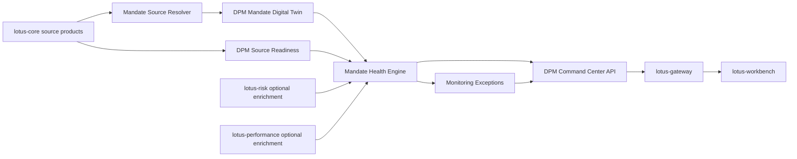

# RFC-0038: Mandate Digital Twin, Health Score, and DPM Command Center Foundation

| Metadata | Details |
| --- | --- |
| **Status** | IN PROGRESS |
| **Created** | 2026-05-03 |
| **Depends On** | RFC-0021, RFC-0022, RFC-0023, RFC-0024, RFC-0025, RFC-0028, RFC-0036, RFC-0037, lotus-core RFC-0087 |
| **Doc Location** | `docs/rfcs/RFC-0038-mandate-digital-twin-health-and-command-center.md` |
| **Implementation Branch** | `feat/rfc0038-mandate-digital-twin` |

---

## 0. Executive Summary

RFC-0037 defines the long-term `lotus-manage` DPM operating-system vision. RFC-0038 is the first
implementation RFC for that vision. It introduces three connected foundations:

1. **Mandate Digital Twin**
   a machine-readable representation of each discretionary mandate used by stateful execution,
   monitoring, health scoring, exception detection, proof packs, and Workbench command-center flows.
2. **Mandate Health Score**
   a deterministic, decomposable score and state that explains whether a mandate is ready, needs PM
   review, or is blocked by mandate, data, risk, liquidity, tax, or workflow issues.
3. **DPM Command Center**
   a backend product API that lets portfolio managers, CIO teams, operations, and Workbench see the
   current management book by exception, readiness, and action state.

This RFC intentionally starts with the business-control layer rather than another optimizer. Without
mandate truth, monitoring, and command-center state, advanced solver output cannot be safely scaled
across discretionary portfolios.

---

## 1. Problem Statement

Current `lotus-manage` can simulate and analyze rebalances, source core DPM data products, persist
run supportability, and expose workflow gates. That is strong, but a portfolio manager still needs a
system-level answer to daily questions:

1. Which mandates need attention today?
2. Why does each mandate need attention?
3. Is the issue investment drift, risk, data readiness, cash, liquidity, tax, policy, or workflow?
4. Which mandates are safe to rebalance now?
5. Which mandates are blocked by upstream data or policy?
6. Which mandates need PM, CIO, compliance, or operations review?
7. Which action should be taken next?

Today, these answers are distributed across simulate/analyze responses, core readiness endpoints,
supportability APIs, and future Workbench composition. RFC-0038 creates a first-class backend
foundation for those answers.

## 1.5 Business Outcomes

This RFC targets the following business outcomes:

1. **Daily PM book control**
   give portfolio managers a single source of truth for which mandates are healthy, drifting,
   blocked, stale, or ready for action.
2. **Faster exception triage**
   reduce time spent diagnosing whether an issue is caused by allocation drift, data readiness,
   cash, tax, risk, restrictions, or workflow state.
3. **Better mandate adherence**
   make the mandate itself a machine-readable control object, so every downstream rebalance and
   monitoring decision can be traced to client objectives and constraints.
4. **Improved operating discipline**
   allow operations and support teams to inspect source readiness and monitoring exceptions without
   reconstructing state from individual simulation payloads.
5. **A stronger Workbench product surface**
   provide the backend truth needed for a sellable DPM command center in `lotus-workbench`.
6. **Foundation for future automation**
   create the mandate, health, and exception primitives needed by alternatives, proof packs, waves,
   post-trade feedback, and AI summaries.

---

## 2. Goals and Non-Goals

### 2.1 Goals

1. Introduce a versioned `DpmMandateDigitalTwin` model.
2. Source mandate, model, eligibility, tax-lot, and readiness inputs from existing `lotus-core`
   source products.
3. Define a deterministic mandate health score with decomposed dimension scores.
4. Define exception taxonomy and monitoring outputs.
5. Add command-center APIs that summarize PM book posture.
6. Persist mandate snapshots, health snapshots, monitoring runs, and exceptions.
7. Expose OpenAPI-certified models and examples.
8. Prepare gateway/workbench integration without requiring UI implementation in this RFC.
9. Add canonical front-office demo data requirements for realistic discretionary mandates.

### 2.2 Non-Goals

1. Advanced optimizer or alternatives generation. That belongs to a later construction RFC.
2. Rebalance wave orchestration. That belongs to a later wave RFC.
3. Client proposal or consent workflow. That belongs to `lotus-advise`.
4. Risk calculations. Those remain in `lotus-risk`.
5. Performance calculations. Those remain in `lotus-performance`.
6. Portfolio, tax-lot, transaction, price, or FX source-of-record ownership. Those remain in
   `lotus-core`.
7. AI PM memo generation. That belongs to a later proof-pack/AI RFC.

---

## 3. Architecture Direction

### 3.1 High-Level Flow



### 3.2 Service Ownership

`lotus-manage` owns:

1. DPM mandate interpretation,
2. DPM-specific mandate version snapshots,
3. mandate health score,
4. monitoring exception records,
5. command-center aggregation,
6. management workflow readiness state.

`lotus-manage` consumes but does not own:

1. raw portfolio state,
2. tax lots,
3. model targets,
4. market data,
5. eligibility master data,
6. risk analytics,
7. performance analytics.

---

## 4. Source Data Requirements

### 4.1 Existing lotus-core Products Used in RFC-0038

| Source product | Current route | Use in RFC-0038 |
| --- | --- | --- |
| `DiscretionaryMandateBinding:v1` | `/integration/portfolios/{portfolio_id}/mandate-binding` | Mandate identity, model binding, policy version, review cadence, mandate metadata. |
| `DpmModelPortfolioTarget:v1` | `/integration/model-portfolios/{model_portfolio_id}/targets` | Strategic model target and model version. |
| `InstrumentEligibilityProfile:v1` | `/integration/instruments/eligibility-bulk` | Product shelf, restrictions, eligibility state. |
| `PortfolioTaxLotWindow:v1` | `/integration/portfolios/{portfolio_id}/tax-lots` | Tax sensitivity, missing lot readiness, tax-budget monitoring. |
| `MarketDataCoverageWindow:v1` | `/integration/market-data/coverage` | Price/FX readiness and freshness posture. |
| `DpmSourceReadiness:v1` | `/integration/portfolios/{portfolio_id}/dpm-source-readiness` | Aggregated source readiness for command-center state. |

### 4.2 Core Enhancements Likely Needed

RFC-0038 should try to compose from existing products first. If implementation proves gaps, create
or extend core products instead of inventing local synthetic truth.

Potential core additions:

1. `MandateObjectiveProfile:v1`
   investment objective, income need, horizon, drawdown tolerance, liquidity need, review cadence.
2. `ClientRestrictionProfile:v1`
   client-specific exclusions, restricted sectors, restricted instruments, restricted issuers.
3. `SustainabilityPreferenceProfile:v1`
   ESG strategy, exclusions, sustainability labels, ratings, transition preferences.
4. `PortfolioCashflowForecast:v1`
   known upcoming withdrawals, deposits, fees, income needs, and liquidity events.
5. `ModelChangeEvent:v1`
   CIO/model changes that should trigger monitoring and command-center attention.

No implementation should block on new products unless existing core outputs cannot support the
minimum viable mandate twin.

---

## 5. Domain Models

### 5.1 DpmMandateDigitalTwin

Required fields:

| Field | Type | Description | Example |
| --- | --- | --- | --- |
| `mandate_id` | string | Stable DPM mandate identifier. | `mandate_pb_sg_bal_001` |
| `portfolio_id` | string | Core portfolio id governed by this mandate. | `PB_SG_GLOBAL_BAL_001` |
| `mandate_version` | string | Version or effective timestamp for this twin. | `2026-05-03T00:00:00Z` |
| `as_of_date` | date | Business date for the twin. | `2026-05-03` |
| `source_system` | string | Source authority for underlying mandate data. | `lotus-core` |
| `base_currency` | string | Portfolio base currency. | `SGD` |
| `reference_currency` | string | Client reporting/reference currency. | `SGD` |
| `risk_profile` | enum | Mandate risk profile. | `BALANCED` |
| `investment_objective` | enum | Investment objective. | `LONG_TERM_TOTAL_RETURN` |
| `time_horizon` | enum | Investment horizon. | `MEDIUM_TERM` |
| `model_portfolio_id` | string | Bound model portfolio id. | `MODEL_PB_SG_GLOBAL_BAL_DPM` |
| `benchmark_id` | string | Benchmark used for monitoring and reporting. | `BENCH_GLOBAL_BALANCED_SGD` |
| `constraints` | object | Mandate constraint set. | see below |
| `preferences` | object | Client/mandate preferences. | see below |
| `review_policy` | object | Review cadence and due posture. | see below |
| `source_lineage` | object | Source product lineage and hashes. | see below |

### 5.2 DpmMandateConstraintSet

Fields:

1. `cash_band_min_weight`
2. `cash_band_max_weight`
3. `single_position_max_weight`
4. `issuer_max_weight`
5. `sector_max_weight`
6. `region_max_weight`
7. `currency_max_weight`
8. `turnover_budget`
9. `tax_budget_base`
10. `max_tracking_error`
11. `max_active_share`
12. `minimum_trade_notional`
13. `allowed_product_types`
14. `restricted_instruments`
15. `restricted_issuers`
16. `restricted_sectors`
17. `sustainability_exclusions`

### 5.3 DpmMandateHealthSnapshot

Required fields:

| Field | Type | Description | Example |
| --- | --- | --- | --- |
| `health_snapshot_id` | string | Stable id for this health calculation. | `mh_20260503_pb_sg_bal_001` |
| `mandate_id` | string | Mandate id. | `mandate_pb_sg_bal_001` |
| `portfolio_id` | string | Portfolio id. | `PB_SG_GLOBAL_BAL_001` |
| `as_of_date` | date | Business date. | `2026-05-03` |
| `health_score` | integer | Overall score from 0 to 100. | `82` |
| `health_state` | enum | `READY`, `PENDING_REVIEW`, or `BLOCKED`. | `PENDING_REVIEW` |
| `dimension_scores` | array | Decomposed score components. | `[{"dimension":"DRIFT","score":68}]` |
| `top_reasons` | array | Top reasons driving state and score. | `[{"reason_code":"ALLOCATION_DRIFT"}]` |
| `recommended_action` | enum | Next action. | `SIMULATE_REBALANCE` |
| `source_readiness_state` | enum | Source readiness posture. | `READY` |
| `evidence_refs` | array | Links to source, run, or artifact evidence. | `[]` |

### 5.4 DpmMonitoringException

Required fields:

1. `exception_id`
2. `mandate_id`
3. `portfolio_id`
4. `detected_at`
5. `as_of_date`
6. `dimension`
7. `severity`
8. `reason_code`
9. `measured_value`
10. `threshold_value`
11. `state`
12. `recommended_action`
13. `source_lineage`
14. `resolved_at`
15. `resolution_reason`

### 5.5 DpmCommandCenterSummary

Required fields:

1. `as_of_date`
2. `generated_at`
3. `portfolio_manager_id`
4. `tenant_id`
5. `book_summary`
6. `health_distribution`
7. `attention_buckets`
8. `source_readiness_summary`
9. `workflow_summary`
10. `top_exceptions`
11. `recommended_actions`
12. `supportability`

---

## 6. Health Scoring Methodology

### 6.1 Dimensions and Weights

Initial default weights:

| Dimension | Weight | Description |
| --- | ---: | --- |
| `SOURCE_READINESS` | 15 | Core data availability, freshness, coverage, and lineage readiness. |
| `ALLOCATION_DRIFT` | 18 | Distance from model or permitted mandate bands. |
| `RISK_DRIFT` | 12 | Risk profile, tracking error, concentration, drawdown/stress posture. |
| `CASH_LIQUIDITY` | 10 | Cash band, known liquidity needs, overdraft risk, settlement readiness. |
| `TAX_TURNOVER` | 10 | Tax budget and turnover budget usage. |
| `ELIGIBILITY_RESTRICTIONS` | 10 | Product shelf, restricted instruments, client exclusions, ESG constraints. |
| `PERFORMANCE_ATTENTION` | 8 | Underperformance, attribution flags, benchmark-relative concerns. |
| `WORKFLOW_READINESS` | 7 | Approval, stale workflow, pending decision, operation blockage. |
| `REVIEW_CADENCE` | 5 | Due or overdue mandate review. |
| `MODEL_FRESHNESS` | 5 | Model version currency and CIO change posture. |

Weights must total 100.

### 6.2 Dimension Score Rules

Each dimension produces:

1. score from 0 to 100,
2. state `READY`, `PENDING_REVIEW`, or `BLOCKED`,
3. reason code,
4. measured value,
5. threshold value,
6. evidence reference.

Overall score:

```text
overall_score = sum(dimension_score * dimension_weight) / 100
```

Overall state:

1. if any hard source, mandate, restriction, no-shorting, no-overdraft, or source-readiness issue
   exists, state is `BLOCKED`,
2. else if any soft breach, stale review, drift attention, or approval-required issue exists, state
   is `PENDING_REVIEW`,
3. else state is `READY`.

The state is not derived from score alone. Hard gates override score.

### 6.3 Example Reason Codes

Source readiness:

1. `DPM_SOURCE_READY`
2. `DPM_SOURCE_STALE`
3. `DPM_SOURCE_INCOMPLETE`
4. `PRICE_COVERAGE_INCOMPLETE`
5. `FX_COVERAGE_INCOMPLETE`
6. `TAX_LOTS_INCOMPLETE`

Mandate and construction:

1. `ALLOCATION_DRIFT`
2. `CASH_ABOVE_BAND`
3. `CASH_BELOW_BAND`
4. `MODEL_VERSION_STALE`
5. `MANDATE_REVIEW_OVERDUE`
6. `TURNOVER_BUDGET_NEAR_LIMIT`
7. `TAX_BUDGET_NEAR_LIMIT`

Restrictions:

1. `RESTRICTED_INSTRUMENT_HELD`
2. `RESTRICTED_ISSUER_HELD`
3. `SUSTAINABILITY_EXCLUSION_HELD`
4. `PRODUCT_SHELF_BLOCK`

Risk/performance:

1. `TRACKING_ERROR_ABOVE_LIMIT`
2. `CONCENTRATION_BREACH`
3. `DRAWDOWN_ATTENTION`
4. `PERFORMANCE_UNDER_REVIEW`

Workflow:

1. `APPROVAL_REQUIRED`
2. `REBALANCE_RUN_BLOCKED`
3. `OPERATION_HANDOFF_PENDING`

---

## 7. API Surface

### 7.1 Mandate APIs

`GET /api/v1/mandates/by-portfolio/{portfolio_id}`

Purpose:

1. retrieve the current DPM mandate digital twin for a portfolio,
2. show source lineage and readiness,
3. support Workbench, Gateway, and operations inspection.

`GET /api/v1/mandates/{mandate_id}`

Purpose:

1. retrieve a mandate by mandate id,
2. support version-aware inspection,
3. return 404 only when the mandate id is unknown.

`GET /api/v1/mandates/{mandate_id}/versions`

Purpose:

1. list persisted mandate twin versions,
2. support audit and change review.

`GET /api/v1/mandates/{mandate_id}/diff`

Purpose:

1. compare two versions,
2. identify changed constraints, objectives, model binding, restrictions, and review policy.

`POST /api/v1/mandates/{mandate_id}/refresh-from-core`

Purpose:

1. refresh local mandate twin snapshot from governed core source products,
2. persist source lineage,
3. expose partial-readiness state if core products are stale or incomplete.

### 7.2 Health APIs

`GET /api/v1/mandates/{mandate_id}/health`

Purpose:

1. retrieve latest mandate health snapshot,
2. include dimension scores and top reasons,
3. support PM decision flow.

`POST /api/v1/mandates/{mandate_id}/health/recalculate`

Purpose:

1. force recalculation from current sources,
2. persist a health snapshot,
3. return source-readiness posture.

### 7.3 Monitoring APIs

`POST /api/v1/dpm/monitoring/run-once`

Purpose:

1. execute a bounded monitoring scan,
2. support filters by PM, model, mandate type, portfolio id, tenant, and as-of date,
3. persist monitoring run and exceptions.

`GET /api/v1/dpm/monitoring/runs`

Purpose:

1. search monitoring runs by status, date, portfolio manager, and source-readiness posture.

`GET /api/v1/dpm/monitoring/runs/{monitoring_run_id}`

Purpose:

1. inspect one monitoring run and aggregate exception counts.

`GET /api/v1/dpm/exceptions`

Purpose:

1. search active and resolved mandate exceptions.

`POST /api/v1/dpm/exceptions/{exception_id}/resolve`

Purpose:

1. resolve a monitoring exception with actor, reason, and optional linked run id.

### 7.4 Command Center APIs

`GET /api/v1/dpm/command-center`

Purpose:

1. return book-level summary for Workbench and Gateway,
2. summarize health distribution,
3. expose attention buckets,
4. include recommended actions.

Query parameters:

1. `portfolio_manager_id`
2. `tenant_id`
3. `as_of_date`
4. `book_id`
5. `health_state`
6. `limit`

---

## 8. Persistence Design

### 8.1 Tables

`dpm_mandate_snapshots`

1. `mandate_snapshot_id` primary key,
2. `mandate_id`,
3. `portfolio_id`,
4. `mandate_version`,
5. `as_of_date`,
6. `source_hash`,
7. `source_lineage_json`,
8. `payload_json`,
9. `created_at`,
10. `created_by`.

Indexes:

1. `(mandate_id, mandate_version) unique`,
2. `(portfolio_id, as_of_date)`,
3. `(mandate_id, created_at desc)`.

`dpm_mandate_health_snapshots`

1. `health_snapshot_id` primary key,
2. `mandate_id`,
3. `portfolio_id`,
4. `as_of_date`,
5. `health_score`,
6. `health_state`,
7. `top_reason_code`,
8. `source_readiness_state`,
9. `dimension_scores_json`,
10. `payload_json`,
11. `created_at`.

Indexes:

1. `(portfolio_id, as_of_date)`,
2. `(mandate_id, created_at desc)`,
3. `(health_state, created_at desc)`.

`dpm_monitoring_runs`

1. `monitoring_run_id` primary key,
2. `as_of_date`,
3. `status`,
4. `portfolio_manager_id`,
5. `tenant_id`,
6. `requested_by`,
7. `filters_json`,
8. `source_readiness_summary_json`,
9. `started_at`,
10. `completed_at`,
11. `failure_reason`.

`dpm_monitoring_exceptions`

1. `exception_id` primary key,
2. `monitoring_run_id`,
3. `mandate_id`,
4. `portfolio_id`,
5. `as_of_date`,
6. `dimension`,
7. `severity`,
8. `reason_code`,
9. `state`,
10. `measured_value_json`,
11. `threshold_value_json`,
12. `recommended_action`,
13. `source_lineage_json`,
14. `resolved_at`,
15. `resolution_reason`,
16. `resolved_by`.

### 8.2 Retention

Default retention:

1. mandate snapshots: 7 years,
2. health snapshots: 3 years,
3. monitoring runs: 3 years,
4. monitoring exceptions: 7 years if unresolved or audit-linked, 3 years otherwise.

Retention must be configurable and documented.

---

## 9. Implementation Slices

### Slice 0 - Design Tightening and Source-Data Gap Review

1. validate exact core source fields available today,
2. map field gaps to core enhancements,
3. finalize minimum viable mandate twin,
4. update supported-features target-state wording,
5. update wiki with "target roadmap" status, not implemented claims.

Validation:

1. evidence table mapping every mandate twin field to source, derived logic, default, or gap,
2. no field is silently invented.

### Slice 1 - Domain Models and Pure Health Engine

1. add Pydantic/domain models,
2. implement mandate compiler from source context,
3. implement pure health scoring engine,
4. add exception taxonomy,
5. add unit tests for every dimension and gate.

Validation:

1. deterministic score tests,
2. hard-gate override tests,
3. no high-cardinality telemetry labels,
4. property/edge tests for missing or stale dimensions.

Slice 0-1 implementation note:

1. Slice 0 field-source evidence is captured in
   `docs/rfcs/RFC-0038-source-data-field-map.md`.
2. Slice 1 pure domain implementation lives in `src/core/mandates.py`.
3. Slice 1 behavior tests live in `tests/unit/dpm/core/test_mandate_health.py`.
4. This slice intentionally does not expose APIs or persistence yet; supported-feature promotion
   remains blocked until later slices certify routes, storage, OpenAPI, live evidence, and wiki
   publication.

### Slice 2 - Persistence and Repository Layer

1. add Postgres migrations,
2. add repository interface,
3. add in-memory and Postgres-backed repositories,
4. add retention hooks,
5. add repository parity tests.

Validation:

1. migration smoke,
2. repository parity,
3. idempotent snapshot persistence,
4. retention tests.

Slice 2 implementation note:

1. Repository contract lives in `src/core/mandate_repository.py`.
2. In-memory repository lives in `src/infrastructure/mandates/in_memory.py`.
3. Postgres repository foundation lives in `src/infrastructure/mandates/postgres.py`.
4. Postgres migration lives in
   `src/infrastructure/postgres_migrations/dpm/0003_mandate_health_foundation.sql`.
5. Repository behavior and retention tests live in
   `tests/unit/dpm/supportability/test_dpm_mandate_repository.py`.
6. This slice still does not expose APIs; persistence is ready for Slice 3/4 routes.

### Slice 3 - Core Resolver and Mandate APIs

1. resolve mandate twin from existing core products,
2. expose mandate retrieval APIs,
3. expose version/diff APIs,
4. expose refresh API,
5. add OpenAPI certification.

Validation:

1. mocked core integration tests,
2. 404/503/error mapping tests,
3. source-readiness degradation tests,
4. full OpenAPI docs checks.

Slice 3 implementation note:

1. Mandate API service orchestration lives in `src/api/services/mandate_service.py`.
2. Certified mandate API routes live in `src/api/routers/mandates.py` and are mounted under
   `/api/v1/mandates`.
3. The refresh route composes existing lotus-core product-specific endpoints:
   `DiscretionaryMandateBinding:v1`, `DpmModelPortfolioTarget:v1`, and optional
   `MarketDataCoverageWindow:v1`.
4. The implementation deliberately preserves explicit source-data gap codes for objective,
   restriction, sustainability, and cash-flow products that are not yet available from core.
5. API tests live in `tests/unit/dpm/api/test_mandates_api.py` and cover source refresh,
   persisted reads, version ordering, diff materiality, core failure mapping, validation, OpenAPI
   posture, and no legacy alias.

### Slice 4 - Health and Monitoring APIs

1. health retrieval,
2. health recalculation,
3. monitoring run-once,
4. monitoring run search,
5. exception search/resolve.

Validation:

1. run-once creates persisted run and exceptions,
2. search filters are deterministic,
3. resolution is actor-attributed,
4. blocked/stale source behavior is tested.

Slice 4 implementation note:

1. Standalone health endpoints are implemented under `/api/v1/mandates/{mandate_id}/health`.
2. Bounded monitoring run and exception queue endpoints are implemented under `/api/v1/dpm/*`.
3. Monitoring run-once currently evaluates caller-supplied mandate ids that have already been
   refreshed; PM-book discovery and command-center aggregation remain Slice 5 scope.
4. API tests live in `tests/unit/dpm/api/test_mandates_api.py` and
   `tests/unit/dpm/api/test_monitoring_api.py`.

### Slice 5 - Command Center API

1. PM book aggregation,
2. health distribution,
3. attention buckets,
4. recommended actions,
5. supportability block.

Validation:

1. command-center response remains bounded,
2. pagination/limit behavior is deterministic,
3. empty book behavior is useful,
4. partial readiness is explicit.

Slice 5 implementation note:

1. `GET /api/v1/dpm/command-center` is implemented as a bounded read model over persisted
   monitoring runs and active exceptions.
2. The response returns health distribution, source-readiness summary, active exception count,
   attention buckets, recommended actions, latest monitoring-run lineage, and supportability state.
3. When no monitoring run matches the query, the API returns an `EMPTY` supportability state rather
   than fabricating a PM book view.
4. When portfolio-manager or book discovery is not supplied by caller filters, the API explicitly
   reports `PM_BOOK_DISCOVERY_NOT_YET_SOURCED` as a partial-readiness reason.
5. Workbench and Gateway product-surface integration remain Slice 6 handoff scope.

### Slice 6 - Gateway and Workbench Integration RFC Handoff

1. define gateway composition contract,
2. define Workbench command-center panels,
3. create gateway/workbench issues or RFCs,
4. seed canonical demo mandates.

Validation:

1. no direct Workbench-to-manage bypass,
2. gateway contract examples are complete,
3. canonical demo data can drive command-center output.

### Slice 7 - Implementation Proof and Live Evidence

1. bring up canonical front-office stack,
2. seed mandate data,
3. capture request/response evidence for every endpoint,
4. review evidence critically,
5. fix gaps.

Validation:

1. evidence stored under non-git-tracked `output/`,
2. RFC updated with proof summary,
3. no superficial pass accepted.

### Slice 8 - Hardening and Certification

1. full OpenAPI certification,
2. API vocabulary guard,
3. migration contract smoke,
4. security review,
5. observability review,
6. performance/load smoke,
7. supportability review.

Validation:

1. local and PR gates green,
2. Swagger examples complete,
3. every attribute has description/type/example,
4. logs/metrics are bounded.

### Slice 9 - Documentation, Wiki, and Closure

1. README update,
2. wiki update,
3. supported-features update,
4. repository context update,
5. branch hygiene,
6. final evidence summary.

Validation:

1. wiki source updated and published after merge,
2. docs tests pass,
3. no target-state feature is documented as implemented until proven.

---

## 10. OpenAPI Documentation Requirements

Every new endpoint must include:

1. endpoint summary,
2. what/when/how description,
3. request example,
4. response example,
5. degraded-source example,
6. validation error example,
7. every field description,
8. every field type,
9. every field example,
10. reason-code explanation.

Swagger grouping:

1. `Mandates`
2. `Mandate Health`
3. `DPM Monitoring`
4. `DPM Command Center`

---

## 11. Test Pyramid Requirements

Minimum test categories:

1. unit tests for pure health scoring,
2. unit tests for mandate compilation,
3. unit tests for exception taxonomy,
4. repository parity tests,
5. migration tests,
6. API route tests,
7. OpenAPI certification tests,
8. core resolver tests,
9. command-center aggregation tests,
10. live canonical evidence tests.

Coverage target remains at or above current repository gate. Tests must validate behavior, not only
line coverage.

---

## 12. Risks and Mitigations

| Risk | Mitigation |
| --- | --- |
| Health score becomes opaque | Store and expose dimension-level score, reason, measurement, threshold, and evidence. |
| Mandate twin duplicates core truth | Mark every field as source, derived, or local overlay; keep source lineage. |
| Command center becomes too large | Use paginated drill-down and bounded summary counts. |
| Source gaps lead to invented defaults | Source-data gap review in Slice 0; fail or degrade explicitly. |
| Workbench displays unsupported states | Gateway-backed contract only; no UI-only state synthesis. |
| Score weights become arbitrary | Make weights policy-pack governed and versioned. |

---

## 13. Acceptance Criteria

RFC-0038 is complete only when:

1. mandate digital twin APIs exist and are certified,
2. health scoring is deterministic, decomposed, persisted, and tested,
3. monitoring run and exception APIs exist and are certified,
4. command-center API exists and is certified,
5. core source integration is proven,
6. canonical seeded mandate data exists,
7. live evidence proves all endpoints,
8. wiki/README/supported-features reflect actual implemented state,
9. target-state claims remain separate from implemented claims,
10. branch, PR, CI, and wiki publication are clean.

---

## 14. Gold-Standard Execution Contract

RFC-0038 is the first implementation foundation for the DPM operating system. It must establish
portfolio-manager trust in the mandate record before later construction, proof-pack, wave, outcome,
or AI features build on it.

### 14.1 Supported-Features Ledger

| Feature | Support state before implementation | Promotion rule |
| --- | --- | --- |
| Mandate digital twin | Proposed | Promote only after source fields, derived fields, local overlays, versions, lineage, and APIs are certified. |
| Mandate health score | Proposed | Promote only after decomposed dimensions, weights, thresholds, reason codes, and tests are complete. |
| Monitoring exceptions | Proposed | Promote only after repeatable monitoring runs create bounded, actor-reviewable exceptions. |
| DPM command center | Foundation implemented | Bounded API summarizes persisted monitoring runs and active exceptions; product-surface integration and live canonical proof remain pending. |

### 14.2 Architecture and Domain Direction

Implementation must preserve these boundaries:

1. `lotus-core` remains source authority for portfolio, mandate-binding, model, eligibility,
   market-data, cash, tax-lot, and reference data,
2. `lotus-manage` owns the DPM interpretation layer: mandate digital twin, health score,
   monitoring exception, and command-center summary,
3. `lotus-risk` and `lotus-performance` remain enrichment authorities; missing enrichment must
   degrade health dimensions instead of inventing values,
4. `lotus-gateway` and `lotus-workbench` must consume supported APIs rather than reconstructing
   health or command-center truth client-side.

### 14.3 Mandatory Delivery Slices

These slices are mandatory in addition to the feature-specific slices in Section 9.

#### Mandatory Slice A - Platform Automation and Scaffolding Improvement

Check whether platform scaffolding already enforces health/readiness endpoints, OpenAPI examples,
bounded problem-details errors, structured logging, no-sensitive metrics, documentation scaffolding,
and API certification tests. Fix repeatable gaps in `lotus-platform`; otherwise record a deliberate
no-change decision.

#### Mandatory Slice B - Cleanup and Structure

Remove stale advisory language, duplicate mandate documentation, unused local health abstractions,
and any generic "score" naming that should be domain-specific. Keep long-lived operator and product
truth in wiki source; keep scoring methodology and schema details in `docs/`.

#### Mandatory Slice C - Implementation Proof

Bring up core/manage with seeded discretionary mandate data. Capture request and response evidence
for mandate lookup, mandate refresh, health snapshot, monitoring run, exceptions, and command-center
summary. Review dimension scores, thresholds, reason codes, lineage, and degraded-source states.

#### Mandatory Slice D - Second-Last Hardening and Review

Perform a full review of source ownership, score transparency, OpenAPI field-level examples,
metrics/logging labels, migration posture, repository boundaries, and tests. Every endpoint must be
API-certified and every error path must have tests and Swagger examples.

#### Mandatory Slice E - Final Closure

Update README if orientation changes, update wiki with business-readable command-center behavior and
diagrams, update supported-features only for proven support, update repository context if ownership
or runtime truth changes, record skills/guidance decision, and leave branch/PR/CI clean.

### 14.4 Evidence Expectations

Closure evidence must include:

1. field-by-field source map for the mandate twin,
2. health-score worked example with source refs and reason codes,
3. command-center response for a populated PM book and an empty/partial book,
4. degraded-source proof,
5. OpenAPI certification summary,
6. local and GitHub check summary.

### 14.5 Enterprise Baseline

This RFC inherits RFC-0037 Section 19.4. Completion requires data-mesh posture, source-readiness
lineage, structured logging, bounded metrics, supportability diagnostics, API certification, and
GitHub lane evidence appropriate to every mandate, health, monitoring, and command-center endpoint.

---

## 15. Implementation Progress Log

| Date | Slice | Status | Evidence | Notes |
| --- | --- | --- | --- | --- |
| 2026-05-03 | Slice 0 - Design Tightening and Source-Data Gap Review | Complete | `docs/rfcs/RFC-0038-source-data-field-map.md` | Minimum viable mandate twin fields are mapped to source-backed, derived, local policy, or explicit source-data gap. |
| 2026-05-03 | Slice 1 - Domain Models and Pure Health Engine | Complete | `src/core/mandates.py`, `tests/unit/dpm/core/test_mandate_health.py` | Pure model/compiler/health engine implemented without API or persistence claims. |
| 2026-05-03 | Slice 2 - Persistence and Repository Layer | Complete | `src/core/mandate_repository.py`, `src/infrastructure/mandates/`, `src/infrastructure/postgres_migrations/dpm/0003_mandate_health_foundation.sql`, `tests/unit/dpm/supportability/test_dpm_mandate_repository.py` | Repository and migration foundation implemented for mandate snapshots, health snapshots, monitoring exceptions, monitoring runs, and retention hooks. |
| 2026-05-03 | Slice 3 - Core Resolver and Mandate APIs | Complete | `src/api/services/mandate_service.py`, `src/api/routers/mandates.py`, `tests/unit/dpm/api/test_mandates_api.py`, `tests/integration/test_openapi_certification_matrix.py` | Mandate refresh/read/version/diff API foundation implemented with product-specific core sourcing and explicit gap-code preservation. |
| 2026-05-03 | Slice 4 - Health and Monitoring APIs | Complete | `src/api/routers/mandates.py`, `src/api/routers/monitoring.py`, `tests/unit/dpm/api/test_monitoring_api.py` | Standalone health read/recalculate plus bounded monitoring run and exception queue APIs implemented. |
| 2026-05-03 | Slice 5 - Command Center API | Complete | `src/api/routers/monitoring.py`, `src/api/services/mandate_service.py`, `tests/unit/dpm/api/test_monitoring_api.py`, `tests/integration/test_openapi_certification_matrix.py` | Bounded command-center summary implemented over persisted monitoring runs and active exceptions with explicit empty/partial supportability states. Hardening now scopes exception reads to the selected monitoring run at repository-query boundary before pagination. |
| 2026-05-03 | Slice 6 - Gateway and Workbench Integration RFC Handoff | Complete | `docs/architecture/dpm-command-center-gateway-workbench-handoff.md`, `README.md`, `wiki/Architecture.md`, `wiki/Integrations.md`, `wiki/Supported-Features.md`, `sgajbi/lotus-gateway#180`, `sgajbi/lotus-workbench#140`, `sgajbi/lotus-platform#294` | Gateway composition contract, Workbench cockpit panel contract, no-direct-Workbench-bypass rule, and canonical PM-book demo seed requirements are documented as downstream handoff. No downstream implementation is claimed in this RFC. |
| 2026-05-03 | Slice 7 - Local Manage API Proof | Complete for manage-local proof | `output/rfc0038-live-proof/20260503T063617Z/summary.json` (non-git evidence), `make check`, `make test-all` | Local live HTTP proof covered 16 mandate, health, monitoring, exception, and command-center calls with no failed responses. Proof identified and fixed stale exception aggregation by adding `monitoring_run_id` to monitoring exceptions and filtering command-center attention to the selected run. Canonical core/manage proof remains a later environment-dependent closure step. |

Current promotion posture:

1. mandate digital twin is implemented as a source-mapped domain model with certified refresh,
   read, version, and diff API foundation,
2. mandate health score is implemented as a deterministic pure engine, persisted foundation, and
   refresh-response output,
3. monitoring exception taxonomy is implemented as pure derived domain output plus persistence
   foundation,
4. DPM command-center API foundation is implemented and locally live-proven against manage,
5. Gateway/Workbench integration is explicitly handed off through a downstream contract; no direct
   Workbench-to-manage bypass or UI-side health reconstruction is allowed,
6. canonical core/manage proof and downstream product-surface implementation remain outside the
   local proof scope until the canonical front-office stack is available for this RFC.

Local proof summary:

1. Evidence path: `output/rfc0038-live-proof/20260503T063617Z/`.
2. Covered endpoints: readiness, health recalculation, mandate read, portfolio read, version list,
   latest diff, health read, monitoring run-once, monitoring run list/detail, exception list,
   command-center populated, command-center empty, exception resolve, resolved-exception list.
3. Result: 16/16 HTTP calls returned successful responses.
4. Critical review finding: command-center attention initially included older active exceptions from
   prior non-run recalculations. The implementation now persists `monitoring_run_id` on generated
   exceptions and the command-center summary includes only exceptions generated by the selected
   monitoring run. The corrected proof shows `command_center_active_exception_count = 2` and
   `latest_run_exception_count = 2`.
5. Follow-up hardening finding: selected-run exception filtering must occur before pagination to
   avoid newer unrelated exceptions starving the selected run's attention queue. The repository
   contract now accepts `monitoring_run_id`, Postgres and in-memory repositories filter by that
   field, and command-center tests prove unrelated newer exceptions do not pollute or hide the
   selected monitoring run.

Slice 6 handoff summary:

1. `lotus-gateway` should compose `lotus-manage` mandate, health, monitoring, exception, and
   command-center APIs into a product-facing command-center contract.
2. `lotus-workbench` should consume the gateway product contract and render PM-book health,
   source-readiness, attention queue, recommended action, latest-run, and mandate drill-down panels.
3. Canonical demo automation should seed `PB_SG_GLOBAL_BAL_001`,
   `MANDATE_PB_SG_GLOBAL_BAL_001`, `PM_SG_DPM_001`, `BOOK_SG_BALANCED_DPM`, tenant `default`, and
   the RFC-087 source products required to prove populated, partial, and empty command-center
   states.
