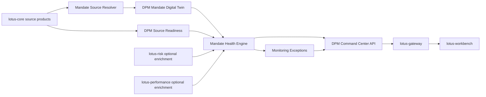

# RFC-0038: Mandate Digital Twin, Health Score, and DPM Command Center Foundation

| Metadata | Details |
| --- | --- |
| **Status** | IMPLEMENTED |
| **Created** | 2026-05-03 |
| **Depends On** | RFC-0021, RFC-0022, RFC-0023, RFC-0024, RFC-0025, RFC-0028, RFC-0036, RFC-0037, lotus-core RFC-0087 |
| **Doc Location** | `docs/rfcs/RFC-0038-mandate-digital-twin-health-and-command-center.md` |
| **Implementation Branch** | `feat/rfc0038-mandate-digital-twin` merged through PR #58 |

---

## 0. Executive Summary

RFC-0037 defines the long-term `lotus-manage` DPM operating-system vision. RFC-0038 is the first
implementation RFC for that vision. It introduces three connected foundations:

1. **Mandate Digital Twin**
   a machine-readable representation of each discretionary mandate used by stateful execution,
   monitoring, health scoring, exception detection, proof packs, and Workbench command-center flows.
2. **Mandate Health Score**
   a deterministic, decomposable score and state that explains whether a mandate is ready, needs PM
   review, or is blocked by mandate, data, risk, liquidity, tax, or workflow issues.
3. **DPM Command Center**
   a backend product API that lets portfolio managers, CIO teams, operations, and Workbench see the
   current management book by exception, readiness, and action state.

This RFC intentionally starts with the business-control layer rather than another optimizer. Without
mandate truth, monitoring, and command-center state, advanced solver output cannot be safely scaled
across discretionary portfolios.

---

## 1. Problem Statement

Current `lotus-manage` can simulate and analyze rebalances, source core DPM data products, persist
run supportability, and expose workflow gates. That is strong, but a portfolio manager still needs a
system-level answer to daily questions:

1. Which mandates need attention today?
2. Why does each mandate need attention?
3. Is the issue investment drift, risk, data readiness, cash, liquidity, tax, policy, or workflow?
4. Which mandates are safe to rebalance now?
5. Which mandates are blocked by upstream data or policy?
6. Which mandates need PM, CIO, compliance, or operations review?
7. Which action should be taken next?

Today, these answers are distributed across simulate/analyze responses, core readiness endpoints,
supportability APIs, and future Workbench composition. RFC-0038 creates a first-class backend
foundation for those answers.

## 1.5 Business Outcomes

This RFC targets the following business outcomes:

1. **Daily PM book control**
   give portfolio managers a single source of truth for which mandates are healthy, drifting,
   blocked, stale, or ready for action.
2. **Faster exception triage**
   reduce time spent diagnosing whether an issue is caused by allocation drift, data readiness,
   cash, tax, risk, restrictions, or workflow state.
3. **Better mandate adherence**
   make the mandate itself a machine-readable control object, so every downstream rebalance and
   monitoring decision can be traced to client objectives and constraints.
4. **Improved operating discipline**
   allow operations and support teams to inspect source readiness and monitoring exceptions without
   reconstructing state from individual simulation payloads.
5. **A stronger Workbench product surface**
   provide the backend truth needed for a sellable DPM command center in `lotus-workbench`.
6. **Foundation for future automation**
   create the mandate, health, and exception primitives needed by alternatives, proof packs, waves,
   post-trade feedback, and AI summaries.

---

## 2. Goals and Non-Goals

### 2.1 Goals

1. Introduce a versioned `DpmMandateDigitalTwin` model.
2. Source mandate, model, eligibility, tax-lot, and readiness inputs from existing `lotus-core`
   source products.
3. Define a deterministic mandate health score with decomposed dimension scores.
4. Define exception taxonomy and monitoring outputs.
5. Add command-center APIs that summarize PM book posture.
6. Persist mandate snapshots, health snapshots, monitoring runs, and exceptions.
7. Expose OpenAPI-certified models and examples.
8. Prepare gateway/workbench integration without requiring UI implementation in this RFC.
9. Add canonical front-office demo data requirements for realistic discretionary mandates.

### 2.2 Non-Goals

1. Advanced optimizer or alternatives generation. That belongs to a later construction RFC.
2. Rebalance wave orchestration. That belongs to a later wave RFC.
3. Client proposal or consent workflow. That belongs to `lotus-advise`.
4. Risk calculations. Those remain in `lotus-risk`.
5. Performance calculations. Those remain in `lotus-performance`.
6. Portfolio, tax-lot, transaction, price, or FX source-of-record ownership. Those remain in
   `lotus-core`.
7. AI PM memo generation. That belongs to a later proof-pack/AI RFC.

---

## 3. Architecture Direction

### 3.1 High-Level Flow



### 3.2 Service Ownership

`lotus-manage` owns:

1. DPM mandate interpretation,
2. DPM-specific mandate version snapshots,
3. mandate health score,
4. monitoring exception records,
5. command-center aggregation,
6. management workflow readiness state.

`lotus-manage` consumes but does not own:

1. raw portfolio state,
2. tax lots,
3. model targets,
4. market data,
5. eligibility master data,
6. risk analytics,
7. performance analytics.

---

## 4. Source Data Requirements

### 4.1 Existing lotus-core Products Used in RFC-0038

| Source product | Current route | Use in RFC-0038 |
| --- | --- | --- |
| `DiscretionaryMandateBinding:v1` | `/integration/portfolios/{portfolio_id}/mandate-binding` | Mandate identity, objective, model binding, policy version, review cadence, review dates, and mandate metadata. |
| `BenchmarkAssignment:v1` | `/integration/portfolios/{portfolio_id}/benchmark-assignment` | Source-owned benchmark id for mandate twin context. |
| `DpmModelPortfolioTarget:v1` | `/integration/model-portfolios/{model_portfolio_id}/targets` | Strategic model target and model version. |
| `InstrumentEligibilityProfile:v1` | `/integration/instruments/eligibility-bulk` | Product shelf, restrictions, eligibility state. |
| `PortfolioTaxLotWindow:v1` | `/integration/portfolios/{portfolio_id}/tax-lots` | Tax sensitivity, missing lot readiness, tax-budget monitoring. |
| `MarketDataCoverageWindow:v1` | `/integration/market-data/coverage` | Price/FX readiness and freshness posture. |
| `DpmSourceReadiness:v1` | `/integration/portfolios/{portfolio_id}/dpm-source-readiness` | Aggregated source readiness for command-center state. |

### 4.2 Core Enhancements Likely Needed

RFC-0038 should try to compose from existing products first. If implementation proves gaps, create
or extend core products instead of inventing local synthetic truth.

Potential core additions:

1. `MandateObjectiveProfile:v1`
   no longer required for first-wave mandate objective or review cadence because
   `DiscretionaryMandateBinding:v1` now supplies those fields; income need, drawdown tolerance,
   and liquidity need remain future source depth.
2. `ClientRestrictionProfile:v1`
   client-specific exclusions, restricted sectors, restricted instruments, restricted issuers.
3. `SustainabilityPreferenceProfile:v1`
   ESG strategy, exclusions, sustainability labels, ratings, transition preferences.
4. `PortfolioCashflowForecast:v1`
   known upcoming withdrawals, deposits, fees, and liquidity events.
5. Future `ClientIncomeNeedsSchedule:v1`, `LiquidityReserveRequirement:v1`, and optional
   `PlannedWithdrawalSchedule:v1`
   client income needs, liquidity reserve requirements, planned withdrawals, and source-owned
   planning/reference posture from `lotus-core`.
5. `ModelChangeEvent:v1`
   CIO/model changes that should trigger monitoring and command-center attention.

No implementation should block on new products unless existing core outputs cannot support the
minimum viable mandate twin.

---

## 5. Domain Models

### 5.1 DpmMandateDigitalTwin

Required fields:

| Field | Type | Description | Example |
| --- | --- | --- | --- |
| `mandate_id` | string | Stable DPM mandate identifier. | `mandate_pb_sg_bal_001` |
| `portfolio_id` | string | Core portfolio id governed by this mandate. | `PB_SG_GLOBAL_BAL_001` |
| `mandate_version` | string | Version or effective timestamp for this twin. | `2026-05-03T00:00:00Z` |
| `as_of_date` | date | Business date for the twin. | `2026-05-03` |
| `source_system` | string | Source authority for underlying mandate data. | `lotus-core` |
| `base_currency` | string | Portfolio base currency. | `SGD` |
| `reference_currency` | string | Client reporting/reference currency. | `SGD` |
| `risk_profile` | enum | Mandate risk profile. | `BALANCED` |
| `investment_objective` | enum | Investment objective. | `LONG_TERM_TOTAL_RETURN` |
| `time_horizon` | enum | Investment horizon. | `MEDIUM_TERM` |
| `model_portfolio_id` | string | Bound model portfolio id. | `MODEL_PB_SG_GLOBAL_BAL_DPM` |
| `benchmark_id` | string | Benchmark used for monitoring and reporting. | `BENCH_GLOBAL_BALANCED_SGD` |
| `constraints` | object | Mandate constraint set. | see below |
| `preferences` | object | Client/mandate preferences. | see below |
| `review_policy` | object | Review cadence and due posture. | see below |
| `source_lineage` | object | Source product lineage and hashes. | see below |

### 5.2 DpmMandateConstraintSet

Fields:

1. `cash_band_min_weight`
2. `cash_band_max_weight`
3. `single_position_max_weight`
4. `issuer_max_weight`
5. `sector_max_weight`
6. `region_max_weight`
7. `currency_max_weight`
8. `turnover_budget`
9. `tax_budget_base`
10. `max_tracking_error`
11. `max_active_share`
12. `minimum_trade_notional`
13. `allowed_product_types`
14. `restricted_instruments`
15. `restricted_issuers`
16. `restricted_sectors`
17. `sustainability_exclusions`

### 5.3 DpmMandateHealthSnapshot

Required fields:

| Field | Type | Description | Example |
| --- | --- | --- | --- |
| `health_snapshot_id` | string | Stable id for this health calculation. | `mh_20260503_pb_sg_bal_001` |
| `mandate_id` | string | Mandate id. | `mandate_pb_sg_bal_001` |
| `portfolio_id` | string | Portfolio id. | `PB_SG_GLOBAL_BAL_001` |
| `as_of_date` | date | Business date. | `2026-05-03` |
| `health_score` | integer | Overall score from 0 to 100. | `82` |
| `health_state` | enum | `READY`, `PENDING_REVIEW`, or `BLOCKED`. | `PENDING_REVIEW` |
| `dimension_scores` | array | Decomposed score components. | `[{"dimension":"DRIFT","score":68}]` |
| `top_reasons` | array | Top reasons driving state and score. | `[{"reason_code":"ALLOCATION_DRIFT"}]` |
| `recommended_action` | enum | Next action. | `SIMULATE_REBALANCE` |
| `source_readiness_state` | enum | Source readiness posture. | `READY` |
| `evidence_refs` | array | Links to source, run, or artifact evidence. | `[]` |

### 5.4 DpmMonitoringException

Required fields:

1. `exception_id`
2. `mandate_id`
3. `portfolio_id`
4. `detected_at`
5. `as_of_date`
6. `dimension`
7. `severity`
8. `reason_code`
9. `measured_value`
10. `threshold_value`
11. `state`
12. `recommended_action`
13. `source_lineage`
14. `resolved_at`
15. `resolution_reason`

### 5.5 DpmCommandCenterSummary

Required fields:

1. `as_of_date`
2. `generated_at`
3. `portfolio_manager_id`
4. `tenant_id`
5. `book_summary`
6. `health_distribution`
7. `attention_buckets`
8. `source_readiness_summary`
9. `workflow_summary`
10. `top_exceptions`
11. `recommended_actions`
12. `supportability`

---

## 6. Health Scoring Methodology

### 6.1 Dimensions and Weights

Initial default weights:

| Dimension | Weight | Description |
| --- | ---: | --- |
| `SOURCE_READINESS` | 15 | Core data availability, freshness, coverage, and lineage readiness. |
| `ALLOCATION_DRIFT` | 18 | Distance from model or permitted mandate bands. |
| `RISK_DRIFT` | 12 | Risk profile, tracking error, concentration, drawdown/stress posture. |
| `CASH_LIQUIDITY` | 10 | Cash band, known liquidity needs, overdraft risk, settlement readiness. |
| `TAX_TURNOVER` | 10 | Tax budget and turnover budget usage. |
| `ELIGIBILITY_RESTRICTIONS` | 10 | Product shelf, restricted instruments, client exclusions, ESG constraints. |
| `PERFORMANCE_ATTENTION` | 8 | Underperformance, attribution flags, benchmark-relative concerns. |
| `WORKFLOW_READINESS` | 7 | Approval, stale workflow, pending decision, operation blockage. |
| `REVIEW_CADENCE` | 5 | Due or overdue mandate review. |
| `MODEL_FRESHNESS` | 5 | Model version currency and CIO change posture. |

Weights must total 100.

### 6.2 Dimension Score Rules

Each dimension produces:

1. score from 0 to 100,
2. state `READY`, `PENDING_REVIEW`, or `BLOCKED`,
3. reason code,
4. measured value,
5. threshold value,
6. evidence reference.

Overall score:

```text
overall_score = sum(dimension_score * dimension_weight) / 100
```

Overall state:

1. if any hard source, mandate, restriction, no-shorting, no-overdraft, or source-readiness issue
   exists, state is `BLOCKED`,
2. else if any soft breach, stale review, drift attention, or approval-required issue exists, state
   is `PENDING_REVIEW`,
3. else state is `READY`.

The state is not derived from score alone. Hard gates override score.

### 6.3 Example Reason Codes

Source readiness:

1. `DPM_SOURCE_READY`
2. `DPM_SOURCE_STALE`
3. `DPM_SOURCE_INCOMPLETE`
4. `PRICE_COVERAGE_INCOMPLETE`
5. `FX_COVERAGE_INCOMPLETE`
6. `TAX_LOTS_INCOMPLETE`

Mandate and construction:

1. `ALLOCATION_DRIFT`
2. `CASH_ABOVE_BAND`
3. `CASH_BELOW_BAND`
4. `MODEL_VERSION_STALE`
5. `MANDATE_REVIEW_OVERDUE`
6. `TURNOVER_BUDGET_NEAR_LIMIT`
7. `TAX_BUDGET_NEAR_LIMIT`

Restrictions:

1. `RESTRICTED_INSTRUMENT_HELD`
2. `RESTRICTED_ISSUER_HELD`
3. `SUSTAINABILITY_EXCLUSION_HELD`
4. `PRODUCT_SHELF_BLOCK`

Risk/performance:

1. `TRACKING_ERROR_ABOVE_LIMIT`
2. `CONCENTRATION_BREACH`
3. `DRAWDOWN_ATTENTION`
4. `PERFORMANCE_UNDER_REVIEW`

Workflow:

1. `APPROVAL_REQUIRED`
2. `REBALANCE_RUN_BLOCKED`
3. `OPERATION_HANDOFF_PENDING`

---

## 7. API Surface

### 7.1 Mandate APIs

`GET /api/v1/mandates/by-portfolio/{portfolio_id}`

Purpose:

1. retrieve the current DPM mandate digital twin for a portfolio,
2. show source lineage and readiness,
3. support Workbench, Gateway, and operations inspection.

`GET /api/v1/mandates/{mandate_id}`

Purpose:

1. retrieve a mandate by mandate id,
2. support version-aware inspection,
3. return 404 only when the mandate id is unknown.

`GET /api/v1/mandates/{mandate_id}/versions`

Purpose:

1. list persisted mandate twin versions,
2. support audit and change review.

`GET /api/v1/mandates/{mandate_id}/diff`

Purpose:

1. compare two versions,
2. identify changed constraints, objectives, model binding, restrictions, and review policy.

`POST /api/v1/mandates/{mandate_id}/refresh-from-core`

Purpose:

1. refresh local mandate twin snapshot from governed core source products,
2. persist source lineage,
3. expose partial-readiness state if core products are stale or incomplete.

### 7.2 Health APIs

`GET /api/v1/mandates/{mandate_id}/health`

Purpose:

1. retrieve latest mandate health snapshot,
2. include dimension scores and top reasons,
3. support PM decision flow.

`POST /api/v1/mandates/{mandate_id}/health/recalculate`

Purpose:

1. force recalculation from current sources,
2. persist a health snapshot,
3. return source-readiness posture.

### 7.3 Monitoring APIs

`POST /api/v1/dpm/monitoring/run-once`

Purpose:

1. execute a bounded monitoring scan,
2. support filters by PM, model, mandate type, portfolio id, tenant, and as-of date,
3. persist monitoring run and exceptions.

`GET /api/v1/dpm/monitoring/runs`

Purpose:

1. search monitoring runs by status, date, portfolio manager, and source-readiness posture.

`GET /api/v1/dpm/monitoring/runs/{monitoring_run_id}`

Purpose:

1. inspect one monitoring run and aggregate exception counts.

`GET /api/v1/dpm/exceptions`

Purpose:

1. search active and resolved mandate exceptions.

`POST /api/v1/dpm/exceptions/{exception_id}/resolve`

Purpose:

1. resolve a monitoring exception with actor, reason, and optional linked run id.

### 7.4 Command Center APIs

`GET /api/v1/dpm/command-center`

Purpose:

1. return book-level summary for Workbench and Gateway,
2. summarize health distribution,
3. expose attention buckets,
4. include recommended actions.

Query parameters:

1. `portfolio_manager_id`
2. `tenant_id`
3. `as_of_date`
4. `book_id`
5. `health_state`
6. `limit`

---

## 8. Persistence Design

### 8.1 Tables

`dpm_mandate_snapshots`

1. `mandate_snapshot_id` primary key,
2. `mandate_id`,
3. `portfolio_id`,
4. `mandate_version`,
5. `as_of_date`,
6. `source_hash`,
7. `source_lineage_json`,
8. `payload_json`,
9. `created_at`,
10. `created_by`.

Indexes:

1. `(mandate_id, mandate_version) unique`,
2. `(portfolio_id, as_of_date)`,
3. `(mandate_id, created_at desc)`.

`dpm_mandate_health_snapshots`

1. `health_snapshot_id` primary key,
2. `mandate_id`,
3. `portfolio_id`,
4. `as_of_date`,
5. `health_score`,
6. `health_state`,
7. `top_reason_code`,
8. `source_readiness_state`,
9. `dimension_scores_json`,
10. `payload_json`,
11. `created_at`.

Indexes:

1. `(portfolio_id, as_of_date)`,
2. `(mandate_id, created_at desc)`,
3. `(health_state, created_at desc)`.

`dpm_monitoring_runs`

1. `monitoring_run_id` primary key,
2. `as_of_date`,
3. `status`,
4. `portfolio_manager_id`,
5. `tenant_id`,
6. `requested_by`,
7. `filters_json`,
8. `source_readiness_summary_json`,
9. `started_at`,
10. `completed_at`,
11. `failure_reason`.

`dpm_monitoring_exceptions`

1. `exception_id` primary key,
2. `monitoring_run_id`,
3. `mandate_id`,
4. `portfolio_id`,
5. `as_of_date`,
6. `dimension`,
7. `severity`,
8. `reason_code`,
9. `state`,
10. `measured_value_json`,
11. `threshold_value_json`,
12. `recommended_action`,
13. `source_lineage_json`,
14. `resolved_at`,
15. `resolution_reason`,
16. `resolved_by`.

### 8.2 Retention

Default retention:

1. mandate snapshots: 7 years,
2. health snapshots: 3 years,
3. monitoring runs: 3 years,
4. monitoring exceptions: 7 years if unresolved or audit-linked, 3 years otherwise.

Retention must be configurable and documented.

---

## 9. Implementation Slices

### Slice 0 - Design Tightening and Source-Data Gap Review

1. validate exact core source fields available today,
2. map field gaps to core enhancements,
3. finalize minimum viable mandate twin,
4. update supported-features target-state wording,
5. update wiki with "target roadmap" status, not implemented claims.

Validation:

1. evidence table mapping every mandate twin field to source, derived logic, default, or gap,
2. no field is silently invented.

### Slice 1 - Domain Models and Pure Health Engine

1. add Pydantic/domain models,
2. implement mandate compiler from source context,
3. implement pure health scoring engine,
4. add exception taxonomy,
5. add unit tests for every dimension and gate.

Validation:

1. deterministic score tests,
2. hard-gate override tests,
3. no high-cardinality telemetry labels,
4. property/edge tests for missing or stale dimensions.

Slice 0-1 implementation note:

1. Slice 0 field-source evidence is captured in
   `docs/rfcs/RFC-0038-source-data-field-map.md`.
2. Slice 1 pure domain implementation lives in `src/core/mandates.py`.
3. Slice 1 behavior tests live in `tests/unit/dpm/core/test_mandate_health.py`.
4. This slice intentionally does not expose APIs or persistence yet; supported-feature promotion
   remains blocked until later slices certify routes, storage, OpenAPI, live evidence, and wiki
   publication.

### Slice 2 - Persistence and Repository Layer

1. add Postgres migrations,
2. add repository interface,
3. add in-memory and Postgres-backed repositories,
4. add retention hooks,
5. add repository parity tests.

Validation:

1. migration smoke,
2. repository parity,
3. idempotent snapshot persistence,
4. retention tests.

Slice 2 implementation note:

1. Repository contract lives in `src/core/mandate_repository.py`.
2. In-memory repository lives in `src/infrastructure/mandates/in_memory.py`.
3. Postgres repository foundation lives in `src/infrastructure/mandates/postgres.py`.
4. Postgres migration lives in
   `src/infrastructure/postgres_migrations/dpm/0003_mandate_health_foundation.sql`.
5. Repository behavior and retention tests live in
   `tests/unit/dpm/supportability/test_dpm_mandate_repository.py`.
6. This slice still does not expose APIs; persistence is ready for Slice 3/4 routes.

### Slice 3 - Core Resolver and Mandate APIs

1. resolve mandate twin from existing core products,
2. expose mandate retrieval APIs,
3. expose version/diff APIs,
4. expose refresh API,
5. add OpenAPI certification.

Validation:

1. mocked core integration tests,
2. 404/503/error mapping tests,
3. source-readiness degradation tests,
4. full OpenAPI docs checks.

Slice 3 implementation note:

1. Mandate API service orchestration lives in `src/api/services/mandate_service.py`.
2. Certified mandate API routes live in `src/api/routers/mandates.py` and are mounted under
   `/api/v1/mandates`.
3. The refresh route composes existing lotus-core product-specific endpoints:
   `DiscretionaryMandateBinding:v1`, `DpmModelPortfolioTarget:v1`, and optional
   `MarketDataCoverageWindow:v1`.
4. The implementation deliberately preserves explicit source-data gap codes for objective,
   restriction, sustainability, and cash-flow products that are not yet available from core.
5. API tests live in `tests/unit/dpm/api/test_mandates_api.py` and cover source refresh,
   persisted reads, version ordering, diff materiality, core failure mapping, validation, OpenAPI
   posture, and no legacy alias.

### Slice 4 - Health and Monitoring APIs

1. health retrieval,
2. health recalculation,
3. monitoring run-once,
4. monitoring run search,
5. exception search/resolve.

Validation:

1. run-once creates persisted run and exceptions,
2. search filters are deterministic,
3. resolution is actor-attributed,
4. blocked/stale source behavior is tested.

Slice 4 implementation note:

1. Standalone health endpoints are implemented under `/api/v1/mandates/{mandate_id}/health`.
2. Bounded monitoring run and exception queue endpoints are implemented under `/api/v1/dpm/*`.
3. Monitoring run-once currently evaluates caller-supplied mandate ids that have already been
   refreshed; PM-book discovery and command-center aggregation remain Slice 5 scope.
4. API tests live in `tests/unit/dpm/api/test_mandates_api.py` and
   `tests/unit/dpm/api/test_monitoring_api.py`.

### Slice 5 - Command Center API

1. PM book aggregation,
2. health distribution,
3. attention buckets,
4. recommended actions,
5. supportability block.

Validation:

1. command-center response remains bounded,
2. pagination/limit behavior is deterministic,
3. empty book behavior is useful,
4. partial readiness is explicit.

Slice 5 implementation note:

1. `GET /api/v1/dpm/command-center` is implemented as a bounded read model over persisted
   monitoring runs and active exceptions.
2. The response returns health distribution, source-readiness summary, active exception count,
   attention buckets, recommended actions, latest monitoring-run lineage, and supportability state.
3. When no monitoring run matches the query, the API returns an `EMPTY` supportability state rather
   than fabricating a PM book view.
4. When portfolio-manager or book discovery is not supplied by caller filters, the API explicitly
   reports `PM_BOOK_DISCOVERY_NOT_YET_SOURCED` as a partial-readiness reason.
5. Workbench and Gateway product-surface integration remain Slice 6 handoff scope.

### Slice 6 - Gateway and Workbench Integration RFC Handoff

1. define gateway composition contract,
2. define Workbench command-center panels,
3. create gateway/workbench issues or RFCs,
4. seed canonical demo mandates.

Validation:

1. no direct Workbench-to-manage bypass,
2. gateway contract examples are complete,
3. canonical demo data can drive command-center output.

### Slice 7 - Implementation Proof and Live Evidence

1. bring up canonical front-office stack,
2. seed mandate data,
3. capture request/response evidence for every endpoint,
4. review evidence critically,
5. fix gaps.

Validation:

1. evidence stored under non-git-tracked `output/`,
2. RFC updated with proof summary,
3. no superficial pass accepted.

### Slice 8 - Hardening and Certification

1. full OpenAPI certification,
2. API vocabulary guard,
3. migration contract smoke,
4. security review,
5. observability review,
6. performance/load smoke,
7. supportability review.

Validation:

1. local and PR gates green,
2. Swagger examples complete,
3. every attribute has description/type/example,
4. logs/metrics are bounded.

### Slice 9 - Documentation, Wiki, and Closure

1. README update,
2. wiki update,
3. supported-features update,
4. repository context update,
5. branch hygiene,
6. final evidence summary.

Validation:

1. wiki source updated and published after merge,
2. docs tests pass,
3. no target-state feature is documented as implemented until proven.

---

## 10. OpenAPI Documentation Requirements

Every new endpoint must include:

1. endpoint summary,
2. what/when/how description,
3. request example,
4. response example,
5. degraded-source example,
6. validation error example,
7. every field description,
8. every field type,
9. every field example,
10. reason-code explanation.

Swagger grouping:

1. `Mandates`
2. `Mandate Health`
3. `DPM Monitoring`
4. `DPM Command Center`

---

## 11. Test Pyramid Requirements

Minimum test categories:

1. unit tests for pure health scoring,
2. unit tests for mandate compilation,
3. unit tests for exception taxonomy,
4. repository parity tests,
5. migration tests,
6. API route tests,
7. OpenAPI certification tests,
8. core resolver tests,
9. command-center aggregation tests,
10. live canonical evidence tests.

Coverage target remains at or above current repository gate. Tests must validate behavior, not only
line coverage.

---

## 12. Risks and Mitigations

| Risk | Mitigation |
| --- | --- |
| Health score becomes opaque | Store and expose dimension-level score, reason, measurement, threshold, and evidence. |
| Mandate twin duplicates core truth | Mark every field as source, derived, or local overlay; keep source lineage. |
| Command center becomes too large | Use paginated drill-down and bounded summary counts. |
| Source gaps lead to invented defaults | Source-data gap review in Slice 0; fail or degrade explicitly. |
| Workbench displays unsupported states | Gateway-backed contract only; no UI-only state synthesis. |
| Score weights become arbitrary | Make weights policy-pack governed and versioned. |

---

## 13. Acceptance Criteria

RFC-0038 is complete only when:

1. mandate digital twin APIs exist and are certified,
2. health scoring is deterministic, decomposed, persisted, and tested,
3. monitoring run and exception APIs exist and are certified,
4. command-center API exists and is certified,
5. core source integration is proven,
6. canonical seeded mandate data exists,
7. live evidence proves all endpoints,
8. wiki/README/supported-features reflect actual implemented state,
9. target-state claims remain separate from implemented claims,
10. branch, PR, CI, and wiki publication are clean.

---

## 14. Gold-Standard Execution Contract

RFC-0038 is the first implementation foundation for the DPM operating system. It must establish
portfolio-manager trust in the mandate record before later construction, proof-pack, wave, outcome,
or AI features build on it.

### 14.1 Supported-Features Ledger

| Feature | Support state before implementation | Promotion rule |
| --- | --- | --- |
| Mandate digital twin | Proposed | Promote only after source fields, derived fields, local overlays, versions, lineage, and APIs are certified. |
| Mandate health score | Proposed | Promote only after decomposed dimensions, weights, thresholds, reason codes, and tests are complete. |
| Monitoring exceptions | Proposed | Promote only after repeatable monitoring runs create bounded, actor-reviewable exceptions. |
| DPM command center | Foundation implemented | Bounded API summarizes persisted monitoring runs and active exceptions. Local canonical manage plus live `lotus-core` proof passed; Gateway/Workbench product-surface integration remains downstream handoff work. |

### 14.2 Architecture and Domain Direction

Implementation must preserve these boundaries:

1. `lotus-core` remains source authority for portfolio, mandate-binding, model, eligibility,
   market-data, cash, tax-lot, and reference data,
2. `lotus-manage` owns the DPM interpretation layer: mandate digital twin, health score,
   monitoring exception, and command-center summary,
3. `lotus-risk` and `lotus-performance` remain enrichment authorities; missing enrichment must
   degrade health dimensions instead of inventing values,
4. `lotus-gateway` and `lotus-workbench` must consume supported APIs rather than reconstructing
   health or command-center truth client-side.

### 14.3 Mandatory Delivery Slices

These slices are mandatory in addition to the feature-specific slices in Section 9.

#### Mandatory Slice A - Platform Automation and Scaffolding Improvement

Check whether platform scaffolding already enforces health/readiness endpoints, OpenAPI examples,
bounded problem-details errors, structured logging, no-sensitive metrics, documentation scaffolding,
and API certification tests. Fix repeatable gaps in `lotus-platform`; otherwise record a deliberate
no-change decision.

#### Mandatory Slice B - Cleanup and Structure

Remove stale advisory language, duplicate mandate documentation, unused local health abstractions,
and any generic "score" naming that should be domain-specific. Keep long-lived operator and product
truth in wiki source; keep scoring methodology and schema details in `docs/`.

#### Mandatory Slice C - Implementation Proof

Bring up core/manage with seeded discretionary mandate data. Capture request and response evidence
for mandate lookup, mandate refresh, health snapshot, monitoring run, exceptions, and command-center
summary. Review dimension scores, thresholds, reason codes, lineage, and degraded-source states.

#### Mandatory Slice D - Second-Last Hardening and Review

Perform a full review of source ownership, score transparency, OpenAPI field-level examples,
metrics/logging labels, migration posture, repository boundaries, and tests. Every endpoint must be
API-certified and every error path must have tests and Swagger examples.

#### Mandatory Slice E - Final Closure

Update README if orientation changes, update wiki with business-readable command-center behavior and
diagrams, update supported-features only for proven support, update repository context if ownership
or runtime truth changes, record skills/guidance decision, and leave branch/PR/CI clean.

### 14.4 Evidence Expectations

Closure evidence must include:

1. field-by-field source map for the mandate twin,
2. health-score worked example with source refs and reason codes,
3. command-center response for a populated PM book and an empty/partial book,
4. degraded-source proof,
5. OpenAPI certification summary,
6. local and GitHub check summary.

### 14.5 Enterprise Baseline

This RFC inherits RFC-0037 Section 19.4. Completion requires data-mesh posture, source-readiness
lineage, structured logging, bounded metrics, supportability diagnostics, API certification, and
GitHub lane evidence appropriate to every mandate, health, monitoring, and command-center endpoint.

---

## 15. Implementation Progress Log

| Date | Slice | Status | Evidence | Notes |
| --- | --- | --- | --- | --- |
| 2026-05-03 | Slice 0 - Design Tightening and Source-Data Gap Review | Complete | `docs/rfcs/RFC-0038-source-data-field-map.md` | Minimum viable mandate twin fields are mapped to source-backed, derived, local policy, or explicit source-data gap. |
| 2026-05-03 | Slice 1 - Domain Models and Pure Health Engine | Complete | `src/core/mandates.py`, `tests/unit/dpm/core/test_mandate_health.py` | Pure model/compiler/health engine implemented without API or persistence claims. |
| 2026-05-03 | Slice 2 - Persistence and Repository Layer | Complete | `src/core/mandate_repository.py`, `src/infrastructure/mandates/`, `src/infrastructure/postgres_migrations/dpm/0003_mandate_health_foundation.sql`, `tests/unit/dpm/supportability/test_dpm_mandate_repository.py` | Repository and migration foundation implemented for mandate snapshots, health snapshots, monitoring exceptions, monitoring runs, and retention hooks. |
| 2026-05-03 | Slice 3 - Core Resolver and Mandate APIs | Complete | `src/api/services/mandate_service.py`, `src/api/routers/mandates.py`, `tests/unit/dpm/api/test_mandates_api.py`, `tests/integration/test_openapi_certification_matrix.py` | Mandate refresh/read/version/diff API foundation implemented with product-specific core sourcing and explicit gap-code preservation. |
| 2026-05-03 | Slice 4 - Health and Monitoring APIs | Complete | `src/api/routers/mandates.py`, `src/api/routers/monitoring.py`, `tests/unit/dpm/api/test_monitoring_api.py` | Standalone health read/recalculate plus bounded monitoring run and exception queue APIs implemented. |
| 2026-05-03 | Slice 5 - Command Center API | Complete | `src/api/routers/monitoring.py`, `src/api/services/mandate_service.py`, `tests/unit/dpm/api/test_monitoring_api.py`, `tests/integration/test_openapi_certification_matrix.py` | Bounded command-center summary implemented over persisted monitoring runs and active exceptions with explicit empty/partial supportability states. Hardening now scopes exception reads to the selected monitoring run at repository-query boundary before pagination. |
| 2026-05-03 | Slice 6 - Gateway and Workbench Integration RFC Handoff | Complete | `docs/architecture/dpm-command-center-gateway-workbench-handoff.md`, `README.md`, `wiki/Architecture.md`, `wiki/Integrations.md`, `wiki/Supported-Features.md`, `sgajbi/lotus-gateway#180`, `sgajbi/lotus-workbench#140`, `sgajbi/lotus-platform#294` | Gateway composition contract, Workbench cockpit panel contract, no-direct-Workbench-bypass rule, and canonical PM-book demo seed requirements are documented as downstream handoff. No downstream implementation is claimed in this RFC. |
| 2026-05-03 | Slice 7 - Local Manage API Proof | Complete | `output/rfc0038-live-proof/20260503T063617Z/summary.json` (non-git evidence), `make check`, `make test-all` | Local live HTTP proof covered 16 mandate, health, monitoring, exception, and command-center calls with no failed responses. Proof identified and fixed stale exception aggregation by adding `monitoring_run_id` to monitoring exceptions and filtering command-center attention to the selected run. |
| 2026-05-03 | Slice 8 - Hardening and Certification | Complete | `make check`, `make test-all`, `make live-api-validate-core`, PR #58 GitHub checks | Endpoint certification, OpenAPI, API vocabulary, no-alias, domain product, trust telemetry, observability, Docker build, and coverage gates passed. Live core/manage proof passed from local canonical manage on `127.0.0.1:8012` backed by Postgres and live `core-control.dev.lotus`/`core-query.dev.lotus`. |
| 2026-05-03 | Slice 9 - Documentation, Wiki, and Closure | Complete | `README.md`, `wiki/Architecture.md`, `wiki/Integrations.md`, `wiki/Supported-Features.md`, PR #58, wiki publish commit `40d832a` | README, wiki source, supported features, RFC progress, downstream issues, and repo context are updated. The repo-local wiki source was published after merge and `Sync-RepoWikis.ps1 -CheckOnly -Repository lotus-manage` returned a clean sync check. |
| 2026-05-03 | Post-Merge Gold-Pass Audit | Complete | `make live-api-validate-core`, `tests/unit/test_local_docker_runtime_contract.py`, `lotus-workbench` canonical core/manage automation | Slice-by-slice audit found stale repo/wiki wording and a canonical proof automation gap. The audit updated RFC/context/wiki truth, exposed stateful core-sourcing gates in Docker-backed manage, configured Workbench core/manage proof mode to start manage with source-ready stateful posture, and documented the build variant needed to avoid stale-image proof. |

Current promotion posture:

1. mandate digital twin is implemented as a source-mapped domain model with certified refresh,
   read, version, and diff API foundation,
2. mandate health score is implemented as a deterministic pure engine, persisted foundation, and
   refresh-response output,
3. monitoring exception taxonomy is implemented as pure derived domain output plus persistence
   foundation,
4. DPM command-center API foundation is implemented and locally live-proven against manage,
5. Gateway/Workbench integration is explicitly handed off through a downstream contract; no direct
   Workbench-to-manage bypass or UI-side health reconstruction is allowed,
6. local canonical manage plus live `lotus-core` proof passed; downstream Gateway/Workbench
   product-surface implementation remains outside this RFC and is tracked in the owning
   repositories.

Local proof summary:

1. Evidence path: `output/rfc0038-live-proof/20260503T063617Z/`.
2. Covered endpoints: readiness, health recalculation, mandate read, portfolio read, version list,
   latest diff, health read, monitoring run-once, monitoring run list/detail, exception list,
   command-center populated, command-center empty, exception resolve, resolved-exception list.
3. Result: 16/16 HTTP calls returned successful responses.
4. Critical review finding: command-center attention initially included older active exceptions from
   prior non-run recalculations. The implementation now persists `monitoring_run_id` on generated
   exceptions and the command-center summary includes only exceptions generated by the selected
   monitoring run. The corrected proof shows `command_center_active_exception_count = 2` and
   `latest_run_exception_count = 2`.
5. Follow-up hardening finding: selected-run exception filtering must occur before pagination to
   avoid newer unrelated exceptions starving the selected run's attention queue. The repository
   contract now accepts `monitoring_run_id`, Postgres and in-memory repositories filter by that
   field, and command-center tests prove unrelated newer exceptions do not pollute or hide the
   selected monitoring run.

Slice 6 handoff summary:

1. `lotus-gateway` should compose `lotus-manage` mandate, health, monitoring, exception, and
   command-center APIs into a product-facing command-center contract.
2. `lotus-workbench` should consume the gateway product contract and render PM-book health,
   source-readiness, attention queue, recommended action, latest-run, and mandate drill-down panels.
3. Canonical demo automation should seed `PB_SG_GLOBAL_BAL_001`,
   `MANDATE_PB_SG_GLOBAL_BAL_001`, `PM_SG_DPM_001`, `BOOK_SG_BALANCED_DPM`, tenant `default`, and
   the RFC-087 source products required to prove populated, partial, and empty command-center
   states.

Core/manage live proof summary:

1. Deployed `core-control.dev.lotus` and `core-query.dev.lotus` readiness returned `200`.
2. Pre-merge local canonical `lotus-manage` was started on `127.0.0.1:8012` with Postgres
   supportability, `DPM_CAP_INPUT_MODE_PORTFOLIO_ID_ENABLED=true`,
   `DPM_STATEFUL_CORE_SOURCING_ENABLED=true`, and
   `DPM_CORE_BASE_URL=http://core-control.dev.lotus`.
3. `make live-api-validate-core` passed with `LOTUS_MANAGE_BASE_URL=http://127.0.0.1:8012` and
   `LOTUS_MANAGE_EXPECT_STATEFUL_CORE_SOURCING=available`.
4. Post-merge audit also used the governed Workbench `core-manage` canonical stack with
   Docker-backed `lotus-manage` behind `http://manage.dev.lotus`. Initial proof exposed stale
   image/gate propagation drift; after fixing Docker env propagation and rebuilding the image,
   `make live-api-validate-core` passed 11/11.
5. Proof covered readiness, capability truth, OpenAPI certification, removed proposal route,
   stateful core sourcing, async duplicate-correlation conflict, Postgres supportability summary,
   bounded metrics, and retired monolithic core-route absence on both core control and query.
6. Stateful proof returned `source_system=lotus-core`, `source_supportability_state=READY`,
   `model_portfolio_id=MODEL_PB_SG_GLOBAL_BAL_DPM`, `model_portfolio_version=2026.04`,
   `source_lineage_bundle_id=rfc-087:PB_SG_GLOBAL_BAL_001:2026-04-10`, and a populated
   `stateful_context_hash`.
7. Additional degraded-source proof for as-of `2026-05-03` returned
   `424 DPM_CORE_CONTEXT_INCOMPLETE` for stale market data instead of leaking an internal `500`.

## 16. Gold-Pass Assessment

### 16.1 Completed Scope

RFC-0038 delivered the first implementation foundation for a discretionary mandate operating
system:

1. source-data field map for the minimum viable mandate digital twin,
2. deterministic mandate digital-twin and mandate-health domain models,
3. decomposed health scoring with dimension evidence, reason codes, thresholds, and recommended
   actions,
4. monitoring exception taxonomy with bounded severity and action vocabulary,
5. in-memory and PostgreSQL mandate/health/monitoring persistence,
6. certified mandate refresh, read, by-portfolio, version, diff, health read, and health
   recalculation APIs,
7. certified monitoring run, monitoring run detail/list, exception list, exception resolution, and
   command-center summary APIs,
8. downstream Gateway, Workbench, and platform automation handoff issues and contract
   documentation,
9. README/wiki/supported-features updates that distinguish implementation-backed features from
   downstream product-surface work.

### 16.2 Quality Improvements

The implementation improved production posture in these areas:

1. command-center exception aggregation is now scoped to the selected `monitoring_run_id` at the
   repository boundary before pagination,
2. stale market-data source posture now degrades as `424 DPM_CORE_CONTEXT_INCOMPLETE` instead of
   escaping as an internal server error,
3. tests now prove selected-run exception filtering against newer unrelated exceptions,
4. Postgres and in-memory repositories share the same monitoring-run filtering contract,
5. downstream integration rules explicitly prevent direct Workbench-to-manage calls and UI-side
   health reconstruction,
6. Docker-backed `lotus-manage` now exposes the stateful core-sourcing gates required for canonical
   proof without changing the default disabled posture,
7. Workbench core/manage proof automation starts manage with the correct source-ready stateful
   posture and documents the build variant required to avoid stale container images,
8. documentation now includes business-facing command-center outcomes, cockpit panels, canonical
   demo data requirements, and integration diagrams.

### 16.3 Debt Removed Or Avoided

This RFC avoided adding another optimization-only surface without mandate control. It also avoided:

1. duplicating source-data authority already owned by `lotus-core`,
2. creating a monolithic DPM context endpoint,
3. fabricating source readiness or PM-book discovery when data is partial,
4. preserving advisory-era product behavior inside the DPM command-center surface,
5. coupling Workbench directly to `lotus-manage` before Gateway composition is designed.

### 16.4 Proven Evidence

Local and remote evidence:

1. `make check` passed with 632 unit tests and all local governance gates.
2. `make test-all` passed with 813 tests and 99.01% total coverage.
3. Targeted monitoring/repository tests passed: 15 tests.
4. Documentation contract tests passed: 16 tests.
5. Local manage live proof passed: 16/16 HTTP calls.
6. Local canonical manage plus live core proof passed: 11/11 checks through
   `make live-api-validate-core`.
7. Post-merge audit reran local canonical core/manage proof through Workbench `core-manage`
   startup and `make live-api-validate-core`; the final proof passed 11/11 checks after fixing
   canonical manage Docker gate propagation and stale-image rebuild guidance.
8. PR #58 remote Feature Lane and PR Merge Gate checks passed on commit `48cb72c`, including
   workflow lint, lint/type/security, unit/integration/e2e tests, coverage, and Docker build.

### 16.5 Remaining Governed Follow-Up

The implementation reached the expected backend foundation standard for RFC-0038. The original
downstream follow-ups for Gateway composition, Workbench cockpit integration, and platform
canonical seed automation are now complete and are integrated below as post-closure WTBD truth.
Remaining work is source-owner enrichment rather than a gap in the completed command-center product
path:

1. richer mandate objective, benchmark, review-cadence, and model-change source products,
2. client-restriction, sustainability, cashflow, and income-need source products where they affect
   health scoring,
3. broader risk and performance health enrichment only through certified source owners,
4. degraded, blocked, and permission-denied canonical command-center fixtures once source owners
   publish durable fixture support.

Skills and context decision: no new local Codex skill is required for this RFC. The existing
`lotus-backend-delivery-governance`, `lotus-endpoint-certification-loop`, and
`lotus-readme-wiki-governance` skills were sufficient. This post-merge audit refreshed repository
context and RFC/wiki wording so the current backend foundation, published wiki state, and remaining
downstream product-surface work are explicitly separated. Gateway, Workbench, and platform context
should be updated in the owning repositories when those implementations land.

## 17. Post-Closure WTBD Integration Audit

Assessment dates: 2026-05-09 and 2026-05-10

This section incorporates completed RFC38 WTBD follow-ons back into RFC-0038 so the command-center
product truth lives with the originating RFC rather than only in
`docs/rfcs/RFC-worktobedone.md`.

### 17.1 Completed Follow-On WTBDs

| WTBD | Status | Implementation-backed conclusion |
| --- | --- | --- |
| RFC38-WTBD-001 - Gateway DPM command-center composition | Completed and merged | `lotus-gateway` PR #194 merged to `main` at `ee2d806`. Gateway exposes the `/api/v1/dpm/command-center` route family, composes manage-owned mandate, health, monitoring, exception, and drill-down truth, and keeps mandate health and PM-book source authority outside the BFF. |
| RFC38-WTBD-002 - Workbench DPM cockpit panels | Completed, merged, and live-proven | `lotus-workbench` PR #154 merged to `main` at `2fbfac5`. Workbench consumes Gateway/BFF command-center contracts only and renders health distribution, source readiness, attention queue, active exceptions, mandate health dimensions, monitoring action posture, and bounded observability without browser-side health or source-readiness calculation. |
| RFC38-WTBD-003 - Platform canonical seed automation | Completed, merged, live-proven, and wiki-published | `lotus-platform` PR #304, `lotus-workbench` PR #155, and `lotus-manage` PR #113 added the governed command-center seed path for `PB_SG_GLOBAL_BAL_001`, `MANDATE_PB_SG_GLOBAL_BAL_001`, `PM_SG_DPM_001`, and `BOOK_SG_BALANCED_DPM`, including Manage and Gateway mandate/health/summary checks plus canonical Workbench screenshot registration. |
| RFC38-WTBD-004 - PM-book discovery for monitoring and command-center cohorts | Completed for populated source-owned PM-book monitoring cohorts | `lotus-core` owns `PortfolioManagerBookMembership:v1`; `lotus-manage` consumes it when monitoring run-once receives a portfolio-manager selector without explicit mandate ids; Gateway passes the body through; Workbench now triggers the source-owned path rather than sending a single-mandate fallback. |
| RFC38-WTBD-005 - Mandate objective, benchmark, review cadence, and model-change sources | Completed for first-wave source-owned mandate twin enrichment | `lotus-core` enriches `DiscretionaryMandateBinding:v1` with source-owned mandate objective, review cadence, last review date, and next review due date; `lotus-manage` consumes those fields into the mandate twin and health review cadence instead of local defaults. Manage also consumes the existing core `BenchmarkAssignment:v1` source product for `benchmark_id`, while CIO model-change source ownership remains covered by `CioModelChangeAffectedCohort:v1` and RFC-0041. Broader performance benchmark analytics remain owned outside manage. |
| RFC38-WTBD-006 - Client restriction, sustainability, and cashflow source products | Completed for first-wave manage health consumption | `lotus-manage` mandate refresh now optionally consumes `ClientRestrictionProfile:v1`, `SustainabilityPreferenceProfile:v1`, and `PortfolioCashflowProjection:v1` from `lotus-core`. Available profiles are preserved in mandate lineage, field-gap codes are removed only when the source product is actually present, active instrument restrictions can block model-target health, sustainability preferences create bounded review-required health posture, and projected negative net cashflow can create cash-liquidity attention. Client income-needs and liquidity-reserve ownership is decided for future `lotus-core` `ClientIncomeNeedsSchedule:v1`, `LiquidityReserveRequirement:v1`, and optional `PlannedWithdrawalSchedule:v1`; implementation remains pending and no financial-planning advice claim is made. Issuer/sector restriction joins, security-level sustainability classification, and regulatory suitability approval remain explicit non-goals. |
| RFC38-WTBD-008 - Full front-office command-center product support | Completed for the first-wave populated product path | Backend authority, Gateway command-center composition, Workbench cockpit rendering, platform canonical seed automation, PM-book discovery, populated ready proof, selector-driven partial proof, empty-date proof, and demo-ready screenshot evidence are implementation-backed. Degraded/blocked canonical fixtures and richer profile-detail surfaces remain future source-owner or product-depth work. |

### 17.2 Evidence Rechecked

The 2026-05-09 audit rechecked current source and runtime evidence:

1. Manage command-center, mandate, health, monitoring, and repository proof:
   `python -m pytest tests/unit/dpm/core/test_mandate_health.py tests/unit/dpm/api/test_mandates_api.py tests/unit/dpm/api/test_monitoring_api.py tests/unit/dpm/supportability/test_dpm_mandate_repository.py -q`
   passed with 61 tests.
2. Manage PM-book core-sourcing proof:
   `python -m pytest tests/unit/dpm/infrastructure/test_core_sourcing_client.py -k "pm_book or PortfolioManagerBookMembership or cio_model_change" -q`
   passed with 1 selected PM-book test.
3. Static command-center proof:
   `python -m ruff check src/api/routers/monitoring.py src/api/services/mandate_service.py src/infrastructure/core_sourcing/client.py tests/unit/dpm/api/test_monitoring_api.py tests/unit/dpm/infrastructure/test_core_sourcing_client.py`
   passed.
4. Canonical front-office proof:
   `lotus-platform/output/front-office-qa/canonical-front-office-qa-20260509-214551.json` passed
   with DPM command-center seed status `ok`.
5. The same canonical proof classified `dpm.command_center` as `ready`, with
   `supportabilityState=READY`, `dataCompletenessState=COMPLETE`, and screenshot evidence under
   `lotus-platform/output/front-office-qa/wtbd-rfc36-audit-20260509-214550/dpm-command-center-live.png`.
6. The DPM command-center seed evidence captured populated `ready`, selector-driven `partial`
   (`PM_BOOK_DISCOVERY_NOT_YET_SOURCED`), and empty-date `empty` posture checks in
   `lotus-platform/output/front-office-qa/dpm-command-center-seed-20260509-220332.json`.

### 17.3 Critical Review

The completed RFC38 command-center path is production-ready for its first-wave scope:

1. manage remains mandate-health, monitoring, and command-center authority,
2. Gateway composes but does not recalculate mandate health, source readiness, exceptions, or
   PM-book membership,
3. Workbench consumes Gateway/BFF contracts and preserves bounded supportability, health, attention,
   and exception state without local reconstruction,
4. canonical seed automation now proves the populated command-center path with current runtime
   evidence and captures explicit partial and empty postures,
5. PM-book monitoring cohort discovery fails closed on missing selectors, source unavailability,
   incomplete source supportability, empty memberships, and missing refreshed mandate twins.

The audit did not find a code gap requiring implementation changes in this slice. The main gap was
documentation drift: the RFC still described Gateway/Workbench/platform follow-ups as outstanding
after they had already merged. This section closes that durable-truth drift.

### 17.4 Gold-Pass Reassessment

What was truly completed:

1. the manage backend mandate twin, health, monitoring, exception, and command-center authority,
2. Gateway command-center composition over manage-owned truth,
3. Workbench cockpit panels over the Gateway/BFF product contract,
4. platform canonical seed automation and current live command-center screenshot evidence,
5. populated PM-book monitoring cohort discovery through `PortfolioManagerBookMembership:v1`.

Quality improvements made:

1. source authority boundaries are now explicit across manage, Gateway, Workbench, and platform
   automation,
2. tests prove command-center behavior, selected-run exception scoping, PM-book dependency
   handling, and PM-book source-client parsing,
3. canonical evidence preserves ready, partial, and empty states rather than collapsing them into a
   single success label,
4. this RFC now owns completed WTBD truth instead of pointing readers to obsolete downstream issue
   links.

Debt removed:

1. stale follow-up wording for already completed Gateway, Workbench, and platform seed work,
2. ambiguity between manage backend foundation and full first-wave product realization,
3. the risk of treating populated command-center screenshots as proof without machine-readable seed
   and panel-classification evidence.

Testing and evidence:

1. 61 manage RFC38 tests passed in this audit,
2. PM-book core-sourcing focused proof passed,
3. Ruff static checks passed for the command-center and core-sourcing files,
4. governed canonical front-office QA passed with command-center seed status `ok`,
5. screenshot and `live-validation-summary.json` evidence prove the populated Workbench panel.

Expected-standard decision:

RFC-0038 and completed WTBD-001 through WTBD-004 have genuinely reached the expected first-wave
standard for backend authority, Gateway composition, Workbench command-center product realization,
platform seed automation, PM-book monitoring cohort discovery, and first-wave mandate
objective/benchmark/review source enrichment. Remaining degraded-fixture and richer
risk/performance health-enrichment work should remain separate WTBD scope.

### 17.5 WTBD-005 Gold-Pass Assessment

Assessment date: 2026-05-10

What was truly completed:

1. `lotus-core` enriched `DiscretionaryMandateBinding:v1` with source-owned mandate objective,
   review cadence, last review date, and next review due date,
2. missing objective or review-cycle fields now degrade core mandate-binding supportability rather
   than letting downstream consumers treat local defaults as source truth,
3. `lotus-manage` consumes mandate objective and review-cycle fields into the mandate digital twin,
   removes the corresponding gap codes only when source values are present, and uses
   `next_review_due_date` in review-cadence health scoring,
4. `lotus-manage` consumes `BenchmarkAssignment:v1` from `lotus-core` and sets
   `DpmMandateDigitalTwin.benchmark_id` from source evidence,
5. model-change source ownership remains implementation-backed through
   `CioModelChangeAffectedCohort:v1` and the completed RFC-0041 CIO model-change wave path.

Quality improvements made:

1. mandate twin personalization now uses core source data instead of static manage defaults when
   source data exists,
2. fallback behavior remains explicit through `MANDATE_OBJECTIVE_PROFILE_NOT_YET_SOURCED` and
   `MANDATE_REVIEW_SCHEDULE_NOT_YET_SOURCED`,
3. benchmark binding is sourced from the existing core benchmark-assignment product without moving
   performance analytics methodology into manage,
4. source lineage now records `BenchmarkAssignment:v1` alongside mandate and model source products.

Debt removed:

1. stale field-map wording that treated mandate objective and review dates as unsourced,
2. the local-default-only mandate objective path for source-ready mandates,
3. nullable benchmark twin state when core benchmark assignment evidence is available.

Testing and evidence:

1. `lotus-core` focused source-product proof passed with 156 mandate-binding and seed tests,
2. `lotus-core` source-product and OpenAPI/domain-product guards passed,
3. `lotus-manage` focused source-consumption proof passed with 94 mandate health, source-context,
   core-sourcing client, and mandate API tests,
4. platform domain-product mirror validation passed after syncing the core declaration.

Expected-standard decision:

RFC38-WTBD-005 reaches the expected first-wave standard for source-owned mandate objective,
benchmark binding, review cadence, review dates, and model-change source authority. Remaining
RFC38 health enrichment is limited to broader risk/performance analytics and product-depth
fixtures, not mandate objective or review-source truth.

### 17.6 WTBD-008 Gold-Pass Assessment

Assessment date: 2026-05-10

What was truly completed:

1. the first-wave DPM command-center product path is complete across manage, Gateway, Workbench,
   and platform canonical seed automation,
2. Gateway composes manage-owned command-center truth without recalculating mandate health or
   source readiness,
3. Workbench renders the cockpit through Gateway/BFF only,
4. platform canonical evidence proves populated `ready`, selector-driven `partial`, and empty-date
   `empty` command-center postures,
5. demo-ready screenshot evidence exists for the populated canonical portfolio.

Quality improvements made:

1. RFC-0038 now treats product realization as completed implementation truth, not only as a
   downstream handoff,
2. the supported scope separates populated product readiness from degraded/blocked fixture depth,
3. the evidence chain names backend, BFF, browser, seed, and screenshot proof explicitly.

Debt removed:

1. stale downstream-future wording for Gateway, Workbench, and platform seed work,
2. ambiguity between backend-only support and first-wave product support,
3. the risk of using screenshots without machine-readable seed and supportability evidence.

Testing and evidence:

1. manage RFC38 tests and focused PM-book source-client proof passed during the prior gold-pass
   audit,
2. governed canonical front-office QA passed at
   `lotus-platform/output/front-office-qa/canonical-front-office-qa-20260509-214551.json`,
3. seed posture proof is retained at
   `lotus-platform/output/front-office-qa/dpm-command-center-seed-20260509-220332.json`,
4. screenshot evidence is retained at
   `lotus-platform/output/front-office-qa/wtbd-rfc36-audit-20260509-214550/dpm-command-center-live.png`.

Expected-standard decision:

RFC38-WTBD-008 reaches the expected first-wave product standard for the populated DPM
command-center path. Remaining RFC38 work is limited to broader risk/performance health
enrichment, degraded/blocked canonical fixtures, and richer profile-detail product surfaces.

### 17.7 WTBD-006 Gold-Pass Assessment

Assessment date: 2026-05-10

What was truly completed:

1. mandate refresh attempts to consume `ClientRestrictionProfile:v1`,
   `SustainabilityPreferenceProfile:v1`, and `PortfolioCashflowProjection:v1` from `lotus-core`,
2. available source products are attached to mandate lineage and remove only their corresponding
   field-gap codes,
3. unavailable optional source products degrade source readiness instead of blocking refresh or
   fabricating profile facts,
4. active restricted model targets can block eligibility health,
5. source-owned sustainability preferences create `SUSTAINABILITY_REVIEW_REQUIRED`, and negative
   projected net cashflow creates `PROJECTED_CASHFLOW_PRESSURE` when current cash is otherwise
   inside mandate cash bands.

Quality improvements made:

1. RFC-0038 no longer treats already-certified core client-profile and cashflow products as absent,
2. health scoring now has bounded first-wave semantics for source-backed restriction,
   sustainability, and cashflow risk without claiming full suitability or income-needs planning,
3. source lineage and field gaps now reflect actual source availability rather than static
   historical assumptions.

Debt removed:

1. stale `PortfolioCashflowForecast` wording has been replaced with the implemented
   `PortfolioCashflowProjection:v1` boundary,
2. static client restriction and sustainability field-gap behavior was replaced with
   source-availability-aware behavior,
3. the WTBD truth has been moved back into this RFC as implementation-backed product truth.

Testing and evidence:

1. `python -m pytest tests/unit/dpm/core/test_mandate_health.py tests/unit/dpm/api/test_mandates_api.py -q`
   passed with 43 tests,
2. core health tests prove lineage preservation, field-gap removal, restricted target blocking,
   sustainability review posture, and projected-cashflow pressure,
3. mandate API tests prove refresh consumes optional source products and degrades truthfully when
   they are unavailable.

Expected-standard decision:

WTBD-006 is complete for first-wave manage mandate-health consumption of certified core source
products. It has not implemented client income-needs or liquidity-reserve products yet, but
ownership is decided for future `lotus-core` source products. Issuer/sector/client-jurisdiction
restriction joins, security-level sustainability classification, regulatory suitability approval,
and downstream UI detail presentation remain separately governed source-owner/product slices.
