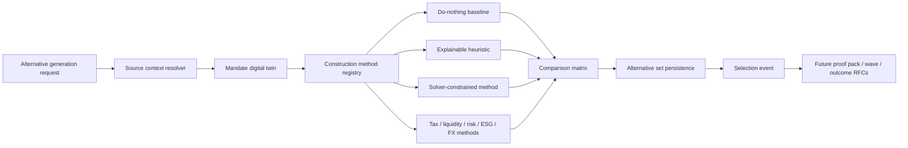

# RFC-0039: Advanced Portfolio Construction and Rebalance Alternatives

| Metadata | Details |
| --- | --- |
| **Status** | IMPLEMENTED - AUTHORITY-BACKED MANAGE CONSTRUCTION COMPLETE |
| **Created** | 2026-05-03 |
| **Last Tightened** | 2026-05-03 |
| **Owner** | `lotus-manage` |
| **Business Sponsor Persona** | DPM head, portfolio manager, CIO desk, investment control, tax specialist, operations, sales/pre-sales |
| **Depends On** | RFC-0021, RFC-0022, RFC-0023, RFC-0024, RFC-0025, RFC-0028, RFC-0036, RFC-0037, RFC-0038, `lotus-core` RFC-0087, Gateway RFC-0098, Workbench RFC-0098 |
| **Doc Location** | `docs/rfcs/RFC-0039-advanced-portfolio-construction-and-rebalance-alternatives.md` |
| **Implementation Branch** | `feat/rfc0039-authority-backed-methods` |

---

## 0. Executive Summary

RFC-0038 made `lotus-manage` understand a discretionary mandate as a governed operating object:
digital twin, health score, source readiness, monitoring exceptions, and command-center posture.
RFC-0039 is the next analytical step. It turns `lotus-manage` from a single-result rebalance engine
into a portfolio construction decision system that can generate, compare, explain, persist, and
select multiple rebalance alternatives for a discretionary mandate.

The business point is simple: a premium private bank does not tell a portfolio manager "here is one
trade list." It shows disciplined alternatives:

1. do nothing and accept current drift,
2. rebalance explainably toward model,
3. minimize turnover,
4. protect tax budget,
5. preserve liquidity and cash needs,
6. control risk and concentration,
7. respect ESG/restrictions,
8. manage currency exposure,
9. test construction under regime or stress conditions.

Each alternative must expose objective terms, constraints, trades, expected outcomes, feasibility,
source supportability, fallback decisions, and evidence. The selected alternative becomes the
input to proof packs, review workflows, rebalance waves, and post-trade outcome learning in later
RFCs.

This RFC began as a manage-side backend RFC and remains the authority record for construction
alternative methodology, persistence, source supportability, and selection state. Post-closure WTBD
work has now delivered the first-wave downstream product path: `lotus-gateway` composes the
manage-owned construction contracts without recomputation, and `lotus-workbench` renders the
Gateway-backed construction lab for the canonical front-office portfolio. The full business outcome
is therefore implementation-backed for generated alternatives, comparison posture, source
supportability, and selection controls, while richer lifecycle choreography across proof packs,
waves, reports, AI, approvals, and OMS handoff remains tracked separately.

---

## 1. Gold-Standard Tightening Review

This section records the critical review performed before implementation.

| Area | First-draft strength | Gap found | Tightened requirement |
| --- | --- | --- | --- |
| Domain ambition | Strong construction vocabulary and method list. | Needed sharper MVP sequencing and proof gates. | Added MVP method set, later method gates, evidence requirements, and promotion rules. |
| Business outcome | Clear value for PMs and sales. | Needed persona-level outcomes and downstream realization boundary. | Added PM, CIO, tax, operations, sales/pre-sales, and an end-of-implementation Gateway/Workbench realization RFC slice. |
| Architecture | Correctly kept risk/performance as external authorities. | Risk/performance enrichment could be read as manage-owned. | Added strict domain authority rules and degraded enrichment semantics. |
| API design | Good basic alternative endpoints. | Needed certified API details, action semantics, idempotency, and comparison contract. | Added endpoint family, request/response expectations, no-alias rule, and OpenAPI requirements. |
| Solver posture | Objective/constraint traces were identified. | Needed deterministic fallback and infeasibility taxonomy. | Added solver trace, fallback, relaxation, and infeasibility requirements. |
| Slices | Had feature slices plus mandatory slices. | Needed full Lotus delivery standard and cross-repo realization slice. | Added platform/scaffolding, cleanup, proof, hardening, closure, and an end-of-implementation paired Gateway/Workbench RFC slice. |
| Evidence | Live proof was mentioned. | Needed exact evidence package and critical review standard. | Added canonical evidence package with request/response, alternatives matrix, traces, degraded examples, and selected-event proof. |
| Documentation | Supported-features ledger existed. | Needed business-facing wiki/demo outputs and implementation-backed wording. | Added documentation/wiki/demo expectations and supported-feature promotion discipline. |

Implementation must not begin until this RFC has a confirmed first-wave method set, upstream field
map, and fallback policy. Gateway/Workbench realization RFCs should be created near the end of the
manage implementation, once the implemented manage API contracts and evidence are stable enough to
write those RFCs accurately.

---

## 2. Business Outcomes

RFC-0039 must deliver these business outcomes:

1. **Better PM construction decisions**
   PMs compare multiple valid construction paths instead of accepting one generated trade list.
2. **Clear trade-off visibility**
   Each alternative shows drift, tracking error, turnover, estimated cost, tax, liquidity, cash,
   FX, ESG/restriction, source-readiness, and supportability trade-offs.
3. **More personalized DPM**
   Mandates can prioritize tax sensitivity, low turnover, liquidity, income needs, risk reduction,
   sustainability, currency exposure, or CIO model adherence.
4. **Higher investment discipline**
   Construction becomes objective-driven, constraint-aware, repeatable, and evidence-backed.
5. **Improved review and approval quality**
   PMs, CIO desk, compliance, tax specialists, and operations can see why one alternative was
   recommended, why another was rejected, and which constraints or fallbacks shaped the result.
6. **Reduced unnecessary trading**
   Turnover, transaction cost, tax realization, settlement, and liquidity impacts are compared
   before action.
7. **Stronger client-demo and sales narrative**
   Lotus can demonstrate institutional-grade portfolio construction as a visible value proposition,
   not a hidden optimizer.
8. **Foundation for proof packs, waves, and outcome learning**
   Selected alternatives become structured inputs to RFC-0040 proof packs, RFC-0041 waves, and
   RFC-0042 expected-versus-realized review.

---

## 3. Current Baseline

Existing `lotus-manage` has:

1. deterministic rebalance simulation,
2. stateless and gated stateful execution envelopes,
3. core source-data integration for DPM model targets, mandate binding, eligibility, tax lots,
   market data coverage, and DPM source readiness,
4. mandate digital twin and health foundation from RFC-0038,
5. policy-pack controls,
6. workflow gates and supportability,
7. idempotency, lineage, artifacts, and certified API posture,
8. heuristic and solver-capable target-generation foundation.

Current gaps:

1. one execution generally produces one primary result,
2. construction alternatives are not first-class resources,
3. do-nothing baseline is not consistently surfaced as a comparable alternative,
4. solver objective and constraint trade-offs are not presented as PM choices,
5. infeasibility and soft-constraint relaxation evidence is not rich enough,
6. tax, turnover, cost, liquidity, FX, ESG, risk, and performance trade-offs are not normalized
   into a decision matrix,
7. alternative selection is not actor-attributed as a durable decision event,
8. Gateway and Workbench do not yet expose alternatives as a product workflow.

---

## 4. Goals and Non-Goals

### 4.1 Goals

1. Add first-class `DpmRebalanceAlternativeSet` and `DpmRebalanceAlternative` resources.
2. Generate a bounded set of alternatives for one discretionary mandate.
3. Include `DO_NOTHING_BASELINE`, `HEURISTIC_EXPLAINABLE`, and at least two additional first-wave
   construction methods before initial support promotion.
4. Expose objective terms, constraint traces, infeasibility, fallback, and relaxation evidence.
5. Normalize comparison metrics across alternatives.
6. Persist alternative sets, alternatives, and selection events.
7. Support stateful and stateless inputs, with stateful source-data support through core products.
8. Preserve domain authority for risk, performance, source data, report, archive, and AI.
9. Prepare selected alternatives for proof-pack and workflow RFCs.
10. Produce certified OpenAPI and live canonical evidence.

### 4.2 Non-Goals

1. Execute trades.
2. Replace `lotus-risk` as risk analytics authority.
3. Replace `lotus-performance` as performance authority.
4. Replace `lotus-core` as portfolio, tax-lot, price, FX, or eligibility authority.
5. Create advisor-led proposal or client-consent workflows. Those belong to `lotus-advise`.
6. Let AI choose alternatives. AI may summarize evidence only in later RFCs.
7. Guarantee global optimality under all market and mandate constraints.
8. Build the Gateway composition contract or Workbench UI in this RFC. Those require paired RFCs.

---

## 5. Architecture Direction

### 5.1 Manage-Side Construction Flow



### 5.2 Domain Authority Rules

| Domain | Authority | Manage usage |
| --- | --- | --- |
| Source portfolio, holdings, model, eligibility, tax lots, price, FX | `lotus-core` | consume source products and preserve source readiness |
| Mandate digital twin, health, construction alternatives, selection | `lotus-manage` | own |
| Risk impact, stress, drawdown, concentration, tracking error where authoritative | `lotus-risk` | consume enrichment; degrade truthfully when unavailable |
| Performance/benchmark context, attribution, realized return context | `lotus-performance` | consume enrichment/context; do not recompute performance truth |
| Proof pack/report generation | `lotus-report` | downstream consumer of selected alternative |
| Archive | `lotus-archive` | downstream evidence owner |
| AI narrative | `lotus-ai` | future summarization only |
| Composition API | `lotus-gateway` | future consumer and product boundary |
| User experience | `lotus-workbench` | future consumer through Gateway |

`lotus-manage` may calculate local construction diagnostics such as drift distance, turnover,
estimated transaction cost, and local concentration approximations only when the methodology is
documented, deterministic, and clearly labelled as manage-side construction diagnostics rather than
authoritative risk/performance analytics.

---

## 6. Construction Method Roadmap

### 6.1 First-Wave Required Methods

The first implementation wave must include:

| Method | Purpose | Required before support promotion |
| --- | --- | --- |
| `DO_NOTHING_BASELINE` | Compare against no action. | current drift, breaches, source readiness, no trades |
| `HEURISTIC_EXPLAINABLE` | Preserve deterministic target-difference baseline. | reason codes for capping, suppression, funding, blocking |
| `MIN_TURNOVER` | Reduce drift with fewer trades. | turnover weight, trade count, drift reduction, cost estimate |
| `TAX_AWARE` or `LIQUIDITY_AWARE` | Prove source-aware personalized construction. | tax-lot or cash/liquidity supportability and degraded behavior |

First-wave implementation may include solver-constrained construction only if solver trace,
fallback, infeasibility, and deterministic timeout behavior are production-grade.

### 6.2 Later Methods

RFC-0039 is the owning RFC for both first-wave and second-wave construction alternatives. Later
RFCs such as RFC-0040, RFC-0041, RFC-0042, and RFC-0043 consume selected alternatives for proof
packs, waves, outcome learning, and AI summarization; they must not create duplicate construction
method RFCs unless a genuinely separate business capability appears. The following second-wave
methods are governed inside RFC-0039 and must not be split into duplicate method RFCs. This
gold-pass promotes five authority-backed methods and a bounded source-backed
ESG/restriction-aware method while keeping regulatory suitability, security-level ESG
classification, and automatic client approval explicitly out of scope:

1. `SOLVER_CONSTRAINED`
2. `RISK_AWARE`
3. `LIQUIDITY_AWARE`
4. `CURRENCY_OVERLAY`
5. `REGIME_STRESS_AWARE`
6. `ESG_AWARE` / restriction-aware construction - supported when core restriction and
   sustainability profiles are source-backed; degraded or pending-review otherwise
7. advanced multi-objective blend methods

Second-wave implementation must stay slice-driven within this RFC:

1. `SOLVER_CONSTRAINED` only after deterministic solver timeouts, infeasibility taxonomy, fallback,
   and objective/constraint traces are production-grade.
2. `RISK_AWARE` only through `lotus-risk` authority; manage must not become risk methodology
   authority.
3. `LIQUIDITY_AWARE` only with settlement, cash, funding, and policy evidence.
4. `CURRENCY_OVERLAY` only after FX exposure, hedge-ratio bands, hedge eligibility, and settlement
   readiness are documented and tested.
5. `REGIME_STRESS_AWARE` only after scenario packs and stress contribution evidence are
   risk/CIO-authoritative or explicitly unavailable.
6. `ESG_AWARE` only after restriction, sustainability, eligibility, and missing-profile behavior
   are source-backed; missing profiles, classification gaps, or automatic suitability claims must
   degrade or remain pending review with explicit reason codes.
7. Advanced blends only after the component methods and objective weighting governance are already
   proven.

### 6.3 Method Definitions

#### DO_NOTHING_BASELINE

Purpose:

1. make "no action" a governed comparator,
2. quantify current drift, source readiness, rule breaches, cash, tax, restriction, and risk
   posture,
3. avoid implying that trading is always superior.

Required output:

1. no trade intents,
2. current state as after state,
3. health/rule results preserved,
4. drift reduction equal to zero,
5. reason code `baseline_no_action`.

#### HEURISTIC_EXPLAINABLE

Purpose:

1. preserve current deterministic rebalance logic,
2. provide reason-coded target-difference construction,
3. act as fallback when solver or enrichment is unavailable.

Rules:

1. same input produces same output,
2. no hidden relaxations,
3. all capping, suppression, funding, lot selection, and blocking has reason codes,
4. unsupported data produces degraded state rather than fabricated metrics.

#### MIN_TURNOVER

Purpose:

1. reduce material drift while avoiding unnecessary trading,
2. support low-activity or cost-sensitive mandates,
3. reduce operational burden.

Required metrics:

1. turnover weight,
2. trade count,
3. drift before/after/reduction,
4. estimated transaction cost,
5. minimum-trade-notional suppressions.

#### TAX_AWARE

Purpose:

1. reduce realized gains within mandate or policy tax budget,
2. use tax-lot windows from `lotus-core`,
3. flag missing tax lots explicitly.

Lot-selection posture:

1. `HIFO`
2. `LIFO`
3. `FIFO`
4. `MIN_GAIN`
5. `TAX_LOTS_UNAVAILABLE`

No tax-aware alternative may be `READY` when required tax lots are unavailable and the mandate
requires tax-aware execution.

#### LIQUIDITY_AWARE

Purpose:

1. protect cash buffers,
2. respect known cashflow needs when available,
3. avoid illiquid trades where liquidity profile is weak,
4. preserve settlement readiness.

Inputs:

1. current cash,
2. settlement ladder,
3. known cashflow forecast if available,
4. instrument liquidity profile if available.

#### SOLVER_CONSTRAINED

Purpose:

1. optimize against an explicit objective function,
2. respect hard and soft constraints,
3. quantify trade-offs.

Required solver trace:

1. solver engine,
2. solver version,
3. objective terms,
4. constraint set id,
5. time budget,
6. solve status,
7. gap/tolerance where available,
8. relaxed constraints,
9. infeasible constraints,
10. fallback method when used.

#### RISK_AWARE

Purpose:

1. reduce or control tracking error,
2. mitigate concentration,
3. avoid worsening drawdown or stress posture beyond mandate limits,
4. use `lotus-risk` enrichment where available.

Risk-aware alternatives consume `lotus-risk` concentration supportability through the bounded
risk-authority client when `DPM_RISK_BASE_URL` is configured, or require caller-supplied
source-backed authority context. Manage must degrade or block missing authority; it must not
recalculate risk methodology locally.

#### ESG_AWARE

Purpose:

1. apply sustainability exclusions,
2. avoid restricted sectors, issuers, and instruments,
3. prefer eligible sustainable instruments where the mandate requires it,
4. expose ESG degradation when source profiles are incomplete.

Current support posture:

`ESG_AWARE` is supported at the manage backend layer when stateful core sourcing provides
`ClientRestrictionProfile:v1` and `SustainabilityPreferenceProfile:v1`. It degrades when profiles
are missing, blocks candidate trades that violate hard client restrictions, and keeps sustainability
allocation or classification evidence gaps in `PENDING_REVIEW`. It does not infer security-level
ESG classifications or claim regulatory suitability approval.

#### CURRENCY_OVERLAY

Purpose:

1. compare unhedged, partially hedged, and fully hedged outcomes,
2. separate strategic currency exposure from trade funding,
3. respect currency exposure and hedge-ratio bands,
4. avoid hedge trades when required FX, eligibility, forward points, or settlement evidence is
   missing.

#### REGIME_STRESS_AWARE

Purpose:

1. compare alternatives under named market-regime and stress packs,
2. reject or downgrade alternatives that improve drift while worsening unacceptable downside,
3. support CIO-required scenario checks,
4. expose degraded state when risk-authoritative scenario packs are unavailable.

---

## 7. Objective Function and Constraint Registry

### 7.1 Objective Function

Target objective model:

```text
minimize:
    w_drift * drift_distance
  + w_tracking_error * tracking_error
  + w_turnover * turnover
  + w_cost * transaction_cost
  + w_tax * realized_tax
  + w_cash * cash_band_penalty
  + w_liquidity * liquidity_penalty
  + w_esg * esg_penalty
  + w_concentration * concentration_penalty
  + w_currency_overlay * currency_overlay_penalty
  + w_scenario_loss * scenario_loss_penalty
```

Objective weights may come from:

1. mandate digital twin,
2. policy pack,
3. construction method default,
4. explicit request override where policy allows.

Every objective term must be exposed in the alternative trace, even when the term is inactive.

### 7.2 Constraint Families

Initial constraint registry:

1. `ASSET_CLASS_BAND`
2. `INSTRUMENT_WEIGHT_MAX`
3. `ISSUER_WEIGHT_MAX`
4. `SECTOR_WEIGHT_MAX`
5. `REGION_WEIGHT_MAX`
6. `CURRENCY_EXPOSURE_MAX`
7. `TRACKING_ERROR_MAX`
8. `TURNOVER_MAX`
9. `TAX_REALIZATION_MAX`
10. `CASH_BAND`
11. `MIN_TRADE_NOTIONAL`
12. `NO_SHORTING`
13. `NO_OVERDRAFT`
14. `SETTLEMENT_CASH_LADDER`
15. `SHELF_ELIGIBILITY`
16. `CLIENT_RESTRICTION`
17. `SUSTAINABILITY_EXCLUSION`
18. `LIQUIDITY_MINIMUM`
19. `CURRENCY_HEDGE_RATIO_BAND`
20. `FX_FORWARD_ELIGIBILITY`
21. `SCENARIO_LOSS_MAX`
22. `REGIME_POLICY_BAND`
23. `STRESS_CONTRIBUTION_MAX`

Constraint severities:

1. `HARD`: cannot be relaxed without `BLOCKED`,
2. `SOFT`: may produce `PENDING_REVIEW`,
3. `INFO`: evidence only.

Relaxation rules:

1. hard constraints cannot be silently relaxed,
2. every soft relaxation must include reason, magnitude, policy authority, and evidence,
3. default implementation should avoid relaxations unless explicitly configured.

---

## 8. Domain Models

### 8.1 DpmRebalanceAlternativeSet

Required fields:

| Field | Type | Description | Example |
| --- | --- | --- | --- |
| `alternative_set_id` | string | Stable identifier for generated set. | `altset_PB_SG_GLOBAL_BAL_001_20260410_001` |
| `portfolio_id` | string | Portfolio id. | `PB_SG_GLOBAL_BAL_001` |
| `mandate_id` | string | Mandate id. | `MANDATE_PB_SG_GLOBAL_BAL_001` |
| `as_of_date` | date | Business date. | `2026-04-10` |
| `input_mode` | enum | `stateful` or `stateless`. | `stateful` |
| `requested_methods` | array | Methods requested by caller. | `["DO_NOTHING_BASELINE","MIN_TURNOVER"]` |
| `generated_methods` | array | Methods generated successfully or degraded. | `["DO_NOTHING_BASELINE","HEURISTIC_EXPLAINABLE","MIN_TURNOVER"]` |
| `source_readiness` | object | Source readiness summary. | `{ "state": "READY" }` |
| `alternatives` | array | Generated alternatives. | `[]` |
| `comparison_summary` | object | Ranked comparison and recommendation. | `{ "recommended_alternative_id": "alt_002" }` |
| `selected_alternative_id` | string/null | Selected alternative if actor selected one. | `alt_002` |
| `recommendation_basis` | string | Why recommendation was ranked first. | `best_drift_reduction_with_low_turnover` |
| `lineage` | object | Source and calculation lineage. | `{ "source_system": "lotus-manage" }` |
| `created_at` | datetime | Creation timestamp. | `2026-05-03T08:00:00Z` |

### 8.2 DpmRebalanceAlternative

Required fields:

1. `alternative_id`
2. `alternative_type`
3. `status`
4. `construction_method`
5. `objective_trace`
6. `constraint_trace`
7. `before`
8. `target`
9. `intents`
10. `after_simulated`
11. `rule_results`
12. `diagnostics`
13. `decision_metrics`
14. `risk_impact`
15. `tax_impact`
16. `turnover_impact`
17. `cost_impact`
18. `liquidity_impact`
19. `fx_impact`
20. `source_supportability`
21. `explanation`
22. `lineage`

### 8.3 DpmAlternativeDecisionMetrics

Required metrics:

1. `drift_before`
2. `drift_after`
3. `drift_reduction`
4. `turnover_weight`
5. `trade_count`
6. `estimated_transaction_cost_base`
7. `estimated_realized_gain_base`
8. `cash_after_weight`
9. `risk_score_before`
10. `risk_score_after`
11. `tracking_error_before`
12. `tracking_error_after`
13. `restriction_breach_count`
14. `source_readiness_state`
15. `method_rank`
16. `recommendation_score`

---

## 9. API Surface

### 9.1 Generate Alternatives

`POST /api/v1/rebalance/alternatives`

Purpose:

1. generate a bounded alternative set for one mandate or portfolio,
2. support stateless and stateful source input,
3. persist alternative set, lineage, and supportability.

Required request fields:

1. `input_mode`
2. `portfolio_id` or stateless input bundle
3. `as_of_date`
4. `mandate_id`
5. `requested_methods`
6. `policy_pack_id`
7. `max_alternatives`
8. `include_risk_enrichment`
9. `include_performance_context`
10. `include_tax_impact`
11. `solver_time_budget_ms`
12. `idempotency_key`

Response:

1. full `DpmRebalanceAlternativeSet`,
2. per-alternative status,
3. source readiness and degradation details,
4. support reference,
5. persistence refs.

### 9.2 Retrieve Alternative Set

`GET /api/v1/rebalance/alternatives/{alternative_set_id}`

Purpose:

1. retrieve persisted alternative set,
2. support Gateway/Workbench comparison,
3. support proof-pack generation.

### 9.3 Select Alternative

`POST /api/v1/rebalance/alternatives/{alternative_set_id}/select`

Purpose:

1. mark selected alternative,
2. persist actor, rationale, timestamp, and selection version,
3. prepare selected alternative for proof pack and workflow review.

Rules:

1. selection does not execute trades,
2. only one selected alternative is active per selection version,
3. selecting a `BLOCKED` alternative requires explicit override and remains `BLOCKED` or
   `PENDING_REVIEW` according to policy,
4. actor attribution is mandatory,
5. selection must emit audit and lineage evidence.

### 9.4 Compare Alternatives

`GET /api/v1/rebalance/alternatives/{alternative_set_id}/comparison`

Purpose:

1. return a compact comparison matrix for Gateway/Workbench and proof packs,
2. avoid forcing consumers to parse full trade-level details when only comparison is needed.

This endpoint may be implemented as a view over the stored set, but if added, it must be certified
and not duplicate business truth.

---

## 10. Persistence and Retention

Tables:

1. `dpm_alternative_sets`
2. `dpm_rebalance_alternatives`
3. `dpm_alternative_selection_events`

Required indexes:

1. `(portfolio_id, created_at desc)`
2. `(mandate_id, created_at desc)`
3. `(alternative_set_id)`
4. `(selected_alternative_id)`
5. `(status, created_at desc)`
6. `(idempotency_key)`

Retention:

1. selected alternatives: 7 years,
2. unselected alternatives: configurable, default 2 years,
3. blocked alternatives linked to audit or compliance review: 7 years,
4. diagnostic traces may be shortened or summarized where required by storage and sensitivity
   policy, but selected-alternative evidence must remain audit-grade.

---

## 11. OpenAPI and API Certification

Every endpoint in RFC-0039 must be certified before promotion.

Swagger requirements:

1. group under `DPM Construction Alternatives`,
2. explain what each endpoint is for,
3. explain when to use each construction method,
4. explain how solver, fallback, infeasibility, and degraded-source states should be interpreted,
5. include full request and response examples,
6. include ready, pending-review, blocked, infeasible, solver-unavailable, source-degraded, and
   tax-lots-missing examples,
7. every attribute has description, type, and example,
8. no `Any` or untyped dictionary contracts,
9. no duplicate aliases,
10. no advisory/proposal vocabulary leakage,
11. OpenAPI examples are validated by tests.

---

## 12. Security, Audit, Observability, and Data Mesh

Required controls:

1. actor attribution for selection,
2. support references for generation and selection,
3. bounded objective/constraint traces,
4. no raw client names or personal data in logs/metrics,
5. no raw holdings/tax-lot dumps in logs/metrics,
6. no request/response body logging,
7. low-cardinality metrics for method, status, source state, solver status, and failure reason,
8. structured audit for alternative generation, selection, blocked selection, and override attempts,
9. domain-product consumer declarations updated if new upstream data products are consumed,
10. trust telemetry updated if alternatives become a managed data product.

Potential metrics:

1. `lotus_manage_alternative_sets_total{status,input_mode}`
2. `lotus_manage_rebalance_alternatives_total{method,status}`
3. `lotus_manage_alternative_solver_duration_ms{method,status}`
4. `lotus_manage_alternative_generation_duration_ms{input_mode,status}`
5. `lotus_manage_alternative_source_degraded_total{source,reason}`
6. `lotus_manage_alternative_selection_total{status}`

---

## 13. Implementation Slices

Slice 0 evidence is recorded in
`docs/rfcs/RFC-0039-source-data-and-method-map.md`. That file is the governed source map for
first-wave methods, current engine reuse, upstream authority, and missing data-product posture.

### Slice 0: RFC Tightening, Method Scope, and Source Map

Scope:

1. finalize this RFC,
2. confirm first-wave methods,
3. validate current engine and solver capabilities,
4. map constraints to mandate digital twin, policy pack, and source products,
5. identify source-data gaps for risk, tax, liquidity, ESG, FX, cost, and scenario data.

Acceptance:

1. field-by-field source map exists,
2. first-wave method list is explicit,
3. missing upstream fields are listed by owner and not patched locally,
4. no implementation begins with ambiguous method semantics.

### Slice 1: Platform Automation and Scaffolding Improvement Slice

Slice 1 scaffolding governance is recorded in
`docs/standards/construction-alternatives-api-governance.md`. That document records the
platform no-change decision, manage-local optimization-style API rules, bounded trace policy,
method-status semantics, OpenAPI/test scaffolding, and observability scaffold.

Scope:

1. identify platform scaffolding gaps for optimization-style APIs,
2. review OpenAPI example scaffolding for objective/constraint traces,
3. review observability and no-sensitive-trace governance,
4. improve platform automation if the gap is cross-cutting,
5. improve manage-local reusable scaffolding if the gap is repo-specific.

Acceptance:

1. cross-cutting gaps are fixed in `lotus-platform` when applicable,
2. no-change decisions are explicit,
3. future construction APIs start with better scaffolding.

### Slice 2: Cleanup and Structure Slice

Slice 2 structure starts with `src/core/construction/`, a dedicated domain package for
construction-alternative vocabulary and future models. Existing `src/core/rebalance/` modules remain
the execution engine boundary; construction modules must wrap and compare engine outputs rather than
turning the rebalance engine into a monolithic alternatives service.

Scope:

1. separate pure construction logic from API orchestration, persistence, and enrichment,
2. remove duplicated heuristic rules encountered,
3. remove stale advisory/proposal language,
4. replace generic "option" language with "construction alternative" or "selected alternative",
5. keep docs/wiki truth aligned.

Acceptance:

1. construction domain modules are clear and testable,
2. no advisory ownership leakage remains,
3. `Sync-RepoWikis.ps1 -CheckOnly -Repository lotus-manage` passes before merge when wiki changed.

### Slice 3: Domain Models and Pure Alternative Engine

Slice 3 domain primitives live in `src/core/construction/`. The first implementation pass adds
bounded construction method/status/source vocabulary, Pydantic alternative models, objective and
constraint trace models, do-nothing baseline construction, rebalance-result wrapping for the
explainable heuristic alternative, normalized drift/turnover comparison metrics, and conservative
alternative-set status roll-up. API, persistence, and method registry work remain later slices.

Scope:

1. add alternative set models,
2. add alternative models,
3. add objective and constraint traces,
4. wrap existing heuristic as one alternative,
5. add do-nothing baseline,
6. add pure comparison metrics.

Acceptance:

1. deterministic model tests pass,
2. objective trace completeness is tested,
3. constraint trace completeness is tested,
4. comparison metrics reconcile.

### Slice 4: Method Registry and Solver/Fallback Governance

Slice 4 implementation lives in `src/core/construction/method_registry.py`. It adds one bounded
registry entry for every declared construction method, first-wave source-family requirements,
support-promotion gates, solver-required posture, explicit solver-unavailable fallback to
`HEURISTIC_EXPLAINABLE`, and bounded solver failure classification.

Scope:

1. add construction method registry,
2. add solver availability posture,
3. add solver trace where solver is used,
4. add fallback handling,
5. add infeasibility classification.

Acceptance:

1. solver success, unavailable, timeout, infeasible, and fallback cases are tested,
2. fallback is explicit and never hidden,
3. hard constraint infeasibility returns `BLOCKED`.

### Slice 5: Tax, Turnover, Liquidity, Cost, and FX Enrichment

Slice 5 implementation lives in `src/core/construction/enrichment.py` and related construction
models. It adds pure enrichment posture for tax, turnover, liquidity/cash, estimated transaction
cost, and FX source state. Transaction cost remains explicitly local/estimated until an
authoritative cost source product exists.

Scope:

1. connect tax lots,
2. calculate turnover and estimated cost,
3. calculate liquidity/cash posture,
4. calculate FX exposure and hedge-readiness posture where first-wave scope allows,
5. classify missing inputs.

Acceptance:

1. tax-lot present and missing cases are tested,
2. turnover budget tests pass,
3. liquidity/cash tests pass,
4. FX degraded cases are explicit where FX method is included.

### Slice 6: Risk and Performance Context

Slice 6 implementation extends `src/core/construction/enrichment.py` and construction models with
`AuthoritativeRiskContext` and `AuthoritativePerformanceContext`. These are seams for preserving
upstream supportability and reason codes from `lotus-risk` and `lotus-performance`; they do not
calculate authoritative risk or performance inside `lotus-manage`. Missing risk/performance context
degrades explicitly with bounded reason codes.

Scope:

1. add seams for risk enrichment,
2. add seams for performance/benchmark context,
3. support degraded mode,
4. preserve upstream supportability and calculation authority.

Acceptance:

1. mocked upstream risk/performance tests pass,
2. unavailable upstream tests pass,
3. response examples with and without enrichment are certified,
4. manage does not recompute authoritative risk/performance figures.

### Slice 7: Persistence and APIs

Slice 7 implementation adds the first certified backend API surface for construction alternatives:
`POST /api/v1/construction/alternative-sets/generate`,
`GET /api/v1/construction/alternative-sets/{alternative_set_id}`, and
`POST /api/v1/construction/alternative-sets/{alternative_set_id}/selections`. It also adds the
`ConstructionRepository` contract, in-memory repository, Postgres repository foundation, migration
`0005_construction_alternatives.sql`, idempotency replay/conflict behavior, and actor-attributed
selection decisions. The API generates RFC-0039 first-wave alternatives: do-nothing baseline,
explainable heuristic, minimum-turnover, and tax-aware posture.

Scope:

1. add migrations and repositories,
2. add generate, retrieve, select, and optional comparison APIs,
3. add idempotency and replay posture,
4. add supportability,
5. certify OpenAPI.

Acceptance:

1. repository parity tests pass for in-memory and PostgreSQL paths where applicable,
2. API tests cover ready, pending review, blocked, infeasible, source-degraded, and idempotent
   replay cases,
3. OpenAPI certification passes.

Evidence:

1. `python -m pytest tests/unit/dpm/construction tests/unit/dpm/api/test_construction_api.py -q`
   passed with 22 tests.
2. `python scripts/openapi_quality_gate.py` passed.
3. `python -m pytest tests/integration/test_openapi_certification_matrix.py tests/unit/dpm/contracts/test_contract_openapi_supportability_docs.py -q`
   passed with 91 tests.
4. `python -m ruff check src/core/construction src/infrastructure/construction src/api/routers/construction.py src/api/services/construction_service.py tests/unit/dpm/construction tests/unit/dpm/api/test_construction_api.py`
   passed.
5. `python -m mypy src/core/construction src/api/routers/construction.py src/api/services/construction_service.py`
   passed.

### Slice 8: Implementation Proof Slice

Slice 8 has local application-contract evidence in
`output/rfc0039-proof/20260503-172059/` and Postgres-backed canonical manage evidence in
`output/rfc0039-proof/20260503-173624-canonical-postgres/` (both ignored by Git). The first
evidence pass used an already aligned portfolio and was rejected as not business-useful. The proof
was regenerated with drifted holdings for `PB_SG_GLOBAL_BAL_001`, producing a comparison matrix
where do-nothing preserves drift with zero turnover, heuristic and tax-aware alternatives remove
drift with turnover, and the minimum-turnover alternative correctly lands in `PENDING_REVIEW` after
turnover-budget suppression. The repeatable live validator then passed against a Postgres-backed
canonical manage runtime on `127.0.0.1:8020`.

Scope:

1. prove canonical portfolio alternatives,
2. capture request/response evidence,
3. capture comparison matrix,
4. capture objective/constraint trace samples,
5. capture infeasible/fallback/degraded examples,
6. critically review evidence and fix gaps.

Acceptance:

1. live manage proof passes for `PB_SG_GLOBAL_BAL_001`,
2. evidence includes at least do-nothing, heuristic, min-turnover, and one source-aware alternative,
3. no supported-feature promotion occurs until every promoted method has evidence.

Current evidence:

1. `output/rfc0039-proof/20260503-172059/01-generate-request.json`
2. `output/rfc0039-proof/20260503-172059/01-generate-response.json`
3. `output/rfc0039-proof/20260503-172059/02-read-response.json`
4. `output/rfc0039-proof/20260503-172059/03-selection-request.json`
5. `output/rfc0039-proof/20260503-172059/03-selection-response.json`
6. `output/rfc0039-proof/20260503-172059/04-comparison-matrix.json`
7. `output/rfc0039-proof/20260503-172059/metadata.json`
8. `output/rfc0039-proof/live-validator/summary.json`
9. `output/rfc0039-proof/20260503-173624-canonical-postgres/summary.json`

Critical review:

1. First proof pass was not accepted because zero drift created no meaningful construction
   trade-off.
2. Regenerated proof demonstrates real trade-offs across drift reduction, turnover, method status,
   selection, and degraded enrichment reason codes.
3. The repeatable live validator now includes `construction_alternatives_first_wave`, proving
   generate/read/select plus first-wave trade-off checks.
4. The short-lived local runtime proof exposed an environment-profile gap: without Postgres DSNs,
   construction passed but supportability probes failed. The canonical proof reran with
   `DPM_SUPPORTABILITY_STORE_BACKEND=POSTGRES`,
   `DPM_POLICY_PACK_CATALOG_BACKEND=POSTGRES`, and migrations applied through
   `scripts/postgres_migrate.py --target dpm`; the validator passed 10/10 checks including
   `supportability_postgres_summary` with `store_backend=POSTGRES`.
5. Debt removed during proof: `scripts/Start-CanonicalManage.ps1` now treats missing Python
   modules as a false probe result instead of aborting before the intended global-Python fallback,
   making the canonical startup helper reliable in a repo venv that is missing the Postgres driver.
6. Slice 8 is complete for manage backend proof. Gateway and Workbench product-surface proof is
   intentionally deferred to the final realization RFC slice after manage hardening stabilizes the
   contract.

### Slice 9: Second-Last Hardening and Review Slice

Slice 9 found and fixed two production-readiness gaps: construction PostgreSQL repository behavior
was live-proven but under-covered in fast unit tests, and the governed API vocabulary inventory had
not yet been refreshed for the construction endpoint family. The slice added repository contract
tests for the PostgreSQL path, tightened the PostgreSQL payload helper typing, refreshed the API
vocabulary inventory, applied repo formatting, and reran the governance gate.

Scope:

1. perform full code review,
2. verify numerical determinism,
3. verify solver fallback,
4. verify objective/constraint traceability,
5. verify error handling,
6. verify OpenAPI quality,
7. verify latency and performance,
8. verify test pyramid adequacy,
9. remove dead code and duplicates.

Acceptance:

1. every Swagger field has description, type, and example,
2. every error path is tested,
3. generation latency is bounded and documented,
4. no duplicate or deprecated construction endpoints remain.

Evidence:

1. `make check` passed: Ruff check/format, monetary-float guard, no-alias guard, mypy, OpenAPI
   quality gate, API vocabulary inventory, domain data product validation, trust telemetry
   validation, observability contract validation, and 668 unit tests.
2. `python -m pytest tests/unit/dpm/construction tests/unit/dpm/api/test_construction_api.py tests/unit/test_validate_live_api.py tests/unit/test_documentation_current_state.py -q`
   passed with 47 tests.
3. `python -m pytest tests/integration/test_openapi_certification_matrix.py tests/unit/dpm/contracts/test_contract_openapi_supportability_docs.py -q`
   passed with 91 tests.
4. `python scripts/api_vocabulary_inventory.py --validate-only` passed after refreshing
   `docs/standards/api-vocabulary/lotus-manage-api-vocabulary.v1.json`.
5. `python scripts/no_alias_contract_guard.py` passed.
6. `python -m mypy src/core/construction src/infrastructure/construction/postgres.py src/api/routers/construction.py src/api/services/construction_service.py scripts/validate_live_api.py`
   passed.
7. `python -m ruff check src/core/construction src/infrastructure/construction src/api/routers/construction.py src/api/services/construction_service.py tests/unit/dpm/construction tests/unit/dpm/api/test_construction_api.py`
   passed.
8. `python scripts/openapi_quality_gate.py` passed.
9. `powershell` scriptblock parse validation passed for `scripts/Start-CanonicalManage.ps1`.
10. Follow-up audit hardening initially rejected unsupported second-wave method requests at the API
    boundary, then the RFC was reopened to promote those methods under this same RFC. The first
    reopened slice replaced rejection with explicit second-wave supportability and passed:
    `python -m pytest tests/unit/dpm/api/test_construction_api.py -q`,
    `python -m pytest tests/unit/dpm/api/test_construction_api.py tests/unit/dpm/construction -q`,
    `python scripts/openapi_quality_gate.py`,
    `python -m mypy src/api/services/construction_service.py src/api/routers/construction.py`, and
    `python -m ruff check src/api/services/construction_service.py src/api/routers/construction.py tests/unit/dpm/api/test_construction_api.py`.
11. Authority-backed completion then promoted `SOLVER_CONSTRAINED`, `RISK_AWARE`,
    `LIQUIDITY_AWARE`, `CURRENCY_OVERLAY`, and `REGIME_STRESS_AWARE` to fully implemented manage
    backend methods with source-authority diagnostics and explicit ESG deferral. The live validator
    now records this as `construction_alternatives_authority_backed`.

Critical review:

1. No duplicate or deprecated construction endpoint family was found; the only construction API
   family is `/api/v1/construction/alternative-sets`.
2. Swagger/OpenAPI quality is certified through the OpenAPI quality gate and contract matrix.
3. Error handling is covered across idempotency conflict, unknown alternative set, unknown
   alternative id, stateful-source degraded posture, blocked methods, and pending-review turnover
   suppression.
4. Test-pyramid gap closed: PostgreSQL construction repository now has fast contract tests for DSN
   and driver guardrails, migration initialization, alternative-set persistence/idempotency lookup,
   and selection persistence.
5. Governance debt removed: API vocabulary inventory now explicitly includes construction
   alternative attributes, methods, statuses, objective/constraint trace fields, and route
   vocabulary.
6. Remaining hardening scope is product realization rather than manage backend correctness:
   Gateway and Workbench RFCs still need to be authored from the now-stable manage contract before
   client-facing command-center outcomes can be claimed.
7. Follow-up audit found one boundary gap: the request schema exposed the full `ConstructionMethod`
   vocabulary while the service still treated second-wave methods as placeholders. The reopened
   RFC-0039 slice promoted those methods with explicit method plans, supportability, degraded
   states, tests, live proof, and documentation.
8. Live proof critically reviewed the first second-wave evidence pass and rejected it because
   artificial safety/overdraft blockers made too many methods `BLOCKED`. The authority-backed proof
   path now supplies explicit risk, liquidity, currency, and regime-stress authority context and
   requires all mandatory advanced methods to return `READY`. ESG/restriction-aware construction is
   not included in the ready-method proof because it is explicitly deferred until source-backed
   restriction and sustainability profiles exist.

### Slice 10: Solver-Constrained Full Implementation Slice

Scope:

1. promote `SOLVER_CONSTRAINED` from supportability posture to production construction method,
2. keep deterministic solver availability, fallback, infeasibility, non-optimal, and warning
   taxonomy in the method registry,
3. require objective and constraint traces to expose solver use without leaking raw optimizer
   internals,
4. fail closed or fall back to `HEURISTIC_EXPLAINABLE` when solver dependencies are unavailable,
5. prove solver behavior through unit and API tests.

Acceptance:

1. `SOLVER_CONSTRAINED` uses `TargetMethod.SOLVER` and `compare_target_methods=true`.
2. Missing solver dependencies produce `PENDING_REVIEW` with
   `SOLVER_UNAVAILABLE_FALLBACK_HEURISTIC`.
3. Solver infeasibility and unbounded states map to `BLOCKED`; non-optimal solver states map to
   `PENDING_REVIEW`.
4. Solver alternatives include method plan, solver posture, objective trace, constraint trace, and
   target-method comparison diagnostics.

Evidence:

1. `src/core/construction/method_registry.py`
2. `src/api/services/construction_service.py`
3. `tests/unit/dpm/construction/test_method_registry.py`
4. `tests/unit/dpm/api/test_construction_api.py`
5. `scripts/validate_live_api.py` probe `construction_alternatives_authority_backed`

### Slice 11: Risk-Aware lotus-risk Authority Integration Slice

Scope:

1. make `RISK_AWARE` consume `lotus-risk` authority instead of calculating risk methodology in
   manage,
2. add a bounded `lotus-risk` concentration authority client,
3. map risk supportability, HHI delta, proposed top-position weight, issuer coverage, and bounded
   reason codes into construction diagnostics,
4. fail closed to degraded supportability when `lotus-risk` is not configured or unavailable,
5. keep methodology ownership in `lotus-risk`.

Acceptance:

1. `DPM_RISK_BASE_URL` enables `lotus-risk` concentration authority calls.
2. `RISK_AWARE` becomes `READY` only when risk supportability is ready and risk concentration
   evidence is available.
3. `RISK_AWARE` carries `LOTUS_RISK_CONCENTRATION_*` reason codes and risk authority context in
   diagnostics.
4. Manage does not duplicate concentration, VaR, attribution, drawdown, or scenario methodology.
5. Unavailable risk authority produces explicit degraded behavior, never false readiness.

Evidence:

1. `src/infrastructure/risk_authority/client.py`
2. `src/api/dependencies.py`
3. `src/api/services/construction_service.py`
4. `tests/unit/dpm/infrastructure/test_risk_authority_client.py`
5. `tests/unit/dpm/api/test_construction_api.py`
6. `output/rfc0039-proof/20260503-193842-authority-backed-canonical/summary.json`

### Slice 12: Liquidity-Aware and Settlement-Aware Full Implementation Slice

Scope:

1. promote `LIQUIDITY_AWARE` to a policy-backed operational construction method,
2. use manage-owned settlement engine diagnostics, cash ladder, funding deficits, overdraft
   posture, and minimum-cash-buffer policy,
3. require liquidity context and reason codes in construction diagnostics,
4. block alternatives with settlement ladder breaches or funding deficits,
5. mark alternatives `PENDING_REVIEW` when minimum cash buffer policy is breached.

Acceptance:

1. `LIQUIDITY_AWARE` enables settlement awareness and minimum cash buffer.
2. Alternatives expose `SETTLEMENT_AWARENESS_ENABLED`, cash-ladder, policy, and breach reason
   codes.
3. Funding deficits or settlement breaches block liquidity-aware alternatives.
4. Liquidity alternatives become `READY` only when settlement, cash, and policy evidence are
   satisfactory.

Evidence:

1. `src/api/services/construction_service.py`
2. `src/core/construction/models.py`
3. `tests/unit/dpm/api/test_construction_api.py`
4. `scripts/validate_live_api.py` probe `construction_alternatives_authority_backed`

### Slice 13: Currency-Overlay Full Implementation Slice

Scope:

1. promote `CURRENCY_OVERLAY` to policy-backed FX construction,
2. require FX pair readiness, currency exposure, eligible-currency policy, settlement awareness,
   and hedge-ratio policy context,
3. block missing FX sources,
4. mark unsupported currencies `PENDING_REVIEW`,
5. include currency policy context in diagnostics.

Acceptance:

1. Missing required FX pairs produce `BLOCKED` and `CURRENCY_OVERLAY_FX_SOURCE_MISSING`.
2. Ready FX, eligible currency exposure, settlement awareness, and currency policy context produce
   `READY`.
3. No non-base exposure degrades truthfully rather than claiming overlay value.
4. Currency-overlay diagnostics include policy id, hedge ratio band, eligible currencies, and
   bounded reason codes.

Evidence:

1. `src/api/services/construction_service.py`
2. `src/core/construction/models.py`
3. `tests/unit/dpm/api/test_construction_api.py`
4. `scripts/validate_live_api.py` probe `construction_alternatives_authority_backed`

### Slice 14: Regime-Stress-Aware Full Implementation Slice

Scope:

1. promote `REGIME_STRESS_AWARE` to scenario-pack-aware construction,
2. require risk/CIO scenario-pack authority context,
3. compare worst-case scenario loss with maximum allowed mandate loss policy,
4. produce `PENDING_REVIEW` when stress loss exceeds policy,
5. degrade when scenario authority is absent.

Acceptance:

1. `REGIME_STRESS_AWARE` becomes `READY` only with source-backed scenario pack context and loss
   inside policy.
2. Missing scenario pack produces `REGIME_SCENARIO_PACK_UNAVAILABLE`.
3. Scenario loss above policy produces `PENDING_REVIEW`.
4. Diagnostics include scenario pack id, source system, loss threshold, observed loss, and bounded
   reason codes.

Evidence:

1. `src/core/construction/models.py`
2. `src/api/services/construction_service.py`
3. `tests/unit/dpm/api/test_construction_api.py`
4. `scripts/validate_live_api.py` probe `construction_alternatives_authority_backed`

### Slice 15: ESG/Restriction-Aware Deferral Slice

Decision:

`ESG_AWARE` and broader restriction-aware construction are promoted only to the source-backed
manage backend boundary. The method consumes core-owned restriction and sustainability profiles,
but it must not be promoted as full enterprise/client suitability support until downstream product
surfaces and security-level classification authorities are proven.

Current behavior:

1. `ESG_AWARE` returns degraded supportability when either source profile is missing,
2. diagnostics include source-specific restriction and sustainability reason codes,
3. candidate trades that violate hard client restrictions are blocked,
4. sustainability allocation or classification evidence gaps remain pending review,
5. no client or sales material may claim automatic ESG approval or completed suitability review.

### Slice 16: Gateway and Workbench Realization RFC Slice

Slice 10 created the construction-specific downstream handoff after manage evidence and hardening
were stable. The handoff intentionally kept `lotus-manage` ownership of construction truth while
requiring Gateway and Workbench to realize the business outcome later without direct
Workbench-to-manage calls or duplicated construction logic. That downstream first wave has since
been implemented, merged, wiki-published, and revalidated during the 2026-05-09 WTBD audit.

Scope:

1. create or tighten a paired Gateway RFC for DPM construction alternative composition after the
   manage APIs, evidence, supportability states, and selected-alternative contracts are stable,
2. create or tighten a paired Workbench RFC for the DPM construction lab / alternatives comparison
   UI after the Gateway composition needs are clear,
3. define how Gateway consumes manage alternatives without recomputing construction truth,
4. define how Workbench renders alternatives, comparison matrix, selected alternative, evidence,
   degraded states, and action gating,
5. define canonical demo proof across manage, gateway, and workbench,
6. explicitly record that `lotus-manage` remains the construction authority even after
   Gateway/Workbench realization.

Acceptance:

1. Gateway RFC identifies the strategic endpoint family it will expose to Workbench.
2. Workbench RFC defines product journeys, screen anatomy, visual proof, accessibility, and
   Gateway-only consumption.
3. The RFCs are grounded in the implemented manage contracts and live evidence from Slices 8 and 9,
   not speculative payloads.
4. Manage RFC-0039 remains backend authority for alternatives; Gateway/Workbench do not own
   construction logic.
5. First-wave business outcome is claimed only after paired RFCs are implemented, live-proven,
   merged, and wiki-published.

Evidence:

1. Manage handoff contract added:
   `docs/architecture/dpm-construction-alternatives-gateway-workbench-handoff.md`.
2. Gateway RFC-0098 construction addendum added in
   `../lotus-gateway/docs/rfcs/RFC-0098-dpm-command-center-composition-contract.md`.
3. Workbench RFC-0098 construction lab addendum added in
   `../lotus-workbench/docs/rfcs/RFC-0098-dpm-mandate-command-center-experience.md`.
4. The downstream requirements reference implemented manage evidence:
   `output/rfc0039-proof/20260503-172059/04-comparison-matrix.json`,
   `output/rfc0039-proof/20260503-173624-canonical-postgres/summary.json`, and
   validator probe `construction_alternatives_first_wave`.

Critical review:

1. No new construction-method RFC was created. RFC-0039 remains the single owner for first-wave and
   second-wave construction alternatives.
2. Gateway/Workbench RFC wording explicitly prevents direct Workbench-to-manage integration,
   browser-side optimizer logic, and Gateway recomputation of manage construction truth.
3. The downstream RFCs define the product panels, states, supportability handling, and canonical
   proof expectations needed to realize the business outcome later.
4. Post-closure WTBD audit confirmed the downstream support claim is now bounded and
   implementation-backed for generated alternatives, comparison, source posture, and selection
   controls. Gateway and Workbench still do not own construction methodology, optimization, order
   execution, or lifecycle claims.

### Slice 17: Final Closure Slice

Scope:

1. update README, repository context, RFC index, wiki, and supported-features material,
2. update agent context or skills if reusable construction guidance emerges,
3. record final gold-pass assessment,
4. publish wiki after merge,
5. complete branch hygiene.

Acceptance:

1. documentation is useful to business, engineering, sales/pre-sales, marketing, operations, and
   client-demo audiences,
2. supported features are implementation-backed,
3. CI is green,
4. wiki check-only and post-merge publish are complete.

Current closure state:

1. manage implementation, local quality gates, canonical live API proof, README/context/RFC/wiki
   source updates, and the final gold-pass assessment are complete,
2. no additional manage implementation slice is required for RFC-0039 before PR closure,
3. PR creation, GitHub CI evidence, merge, post-merge wiki publication, and final branch hygiene
   remain Slice 17 governance tasks and must be completed before the RFC is marked operationally
   closed.

---

## 14. Test Pyramid

| Layer | Required proof |
| --- | --- |
| Unit | model validation, objective trace, constraint trace, comparison metrics, method registry |
| Pure engine | do-nothing, heuristic, min-turnover, source-aware method behavior |
| Solver | success, infeasible, timeout, unavailable, fallback |
| Enrichment | tax lots, turnover, liquidity, cost, FX, risk/performance degraded behavior |
| Repository | in-memory and PostgreSQL persistence, selection events, idempotent replay |
| API/contract | generate, retrieve, select, comparison, error paths, OpenAPI examples |
| Live | canonical portfolio alternatives with evidence package |
| Observability | metrics, logs, audit, support references, forbidden-field tests |
| Performance | bounded generation latency and fan-out timeout behavior |

Tests must validate real metrics, reason codes, and reconciliation. Status-code-only tests are not
enough.

---

## 15. Canonical Evidence Package

Implementation proof must produce a non-git-tracked evidence folder, for example:

`output/live-demo/<timestamp>/rfc0039-construction-alternatives/`

Required artifacts:

1. generate alternatives request/response,
2. retrieve alternative set request/response,
3. select alternative request/response,
4. optional comparison endpoint request/response,
5. alternative comparison matrix,
6. objective trace sample,
7. constraint trace sample,
8. infeasible example,
9. solver fallback example,
10. source-unavailable degraded example,
11. selected-alternative audit event sample,
12. OpenAPI/API certification summary,
13. latency summary,
14. critical review notes and fixes.

---

## 16. Supported-Features Ledger

| Feature | Support state before implementation | Promotion rule |
| --- | --- | --- |
| Alternative set generation | Proposed | Promote only after alternatives are persisted, comparable, and reproducible. |
| Do-nothing baseline | Proposed | Promote only after current-state comparison and no-trade evidence are proven. |
| Explainable heuristic alternative | Proposed | Promote only after reason-coded deterministic output is proven. |
| Minimum-turnover alternative | Proposed | Promote only after turnover, trade count, drift reduction, and cost trade-offs are tested. |
| Tax-aware construction | Proposed | Promote only after lot availability, lot selection, tax budget, and degraded-source behavior are proven. |
| Liquidity-aware construction | Supported at manage backend layer for settlement/current-cash and source-backed `PortfolioCashflowProjection:v1` projected cash-pressure evidence | Client income-need planning remains deferred until a governed source product exists. |
| Solver-constrained construction | Proposed | Promote only after solver status, objective terms, constraints, relaxations, infeasibility, and fallback are exposed. |
| Risk/performance-aware construction | Proposed | Promote only after enrichment seams or live integrations degrade truthfully when unavailable. |
| ESG/restriction-aware construction | Supported for source-backed `ClientRestrictionProfile:v1` and `SustainabilityPreferenceProfile:v1` consumption | Keep regulatory suitability approval, security-level ESG classification, and automatic client approval unsupported until owning source products and approval workflows are proven. |
| Currency-overlay construction | Proposed | Promote only after FX exposure, hedge-ratio, FX funding, settlement, and hedge-blocking evidence exists. |
| Regime/stress-aware construction | Proposed | Promote only after scenario packs and stress contribution evidence are risk-authoritative. |
| Alternative selection | Proposed | Promote only after actor-attributed selection events are persisted and audited. |

---

## 17. Risks and Controls

| Risk | Control |
| --- | --- |
| Hidden optimizer behavior | Expose objective terms, constraints, relaxations, infeasibility, and fallback. |
| PM over-trusts a mathematically optimal but operationally poor result | Compare tax, turnover, liquidity, cost, source readiness, and blocked actions. |
| Manage duplicates risk/performance authority | Preserve enrichment boundaries and degrade when upstream authority is unavailable. |
| Missing tax/lot/liquidity data produces false readiness | Tax/liquidity methods cannot be `READY` when required source data is missing. |
| API sprawl | One strategic alternatives endpoint family; no aliases. |
| Premature second-wave support claim | Second-wave methods must expose supportability, degraded source authority, tests, certification, and live proof before final RFC closure. |
| Solver non-determinism | Bounded time budgets, deterministic fallback, traceable solver version and tolerance. |
| Sensitive optimization traces leak | Bounded traces and forbidden-field tests. |
| Full business outcome over-claimed | The first-wave Gateway/Workbench construction path is now implementation-backed for generated alternatives, source posture, comparison, and selection controls only; proof-pack, wave, report, AI, approval, OMS, and autonomous decisioning claims remain unsupported until implemented and live-proven by owning RFCs. |

---

## 18. Definition of Done

RFC-0039 is complete only when:

1. first-wave methods and mandatory authority-backed advanced methods are implemented and certified,
2. alternative sets are persisted and retrievable,
3. every alternative includes comparable decision metrics,
4. objective and constraint traces are complete,
5. solver/fallback/infeasibility behavior is explicit,
6. selected alternative is actor-attributed and audited,
7. OpenAPI is complete and certified,
8. live proof shows realistic discretionary mandate comparison for `PB_SG_GLOBAL_BAL_001`,
9. degraded-source behavior is tested,
10. no AI, Gateway, or UI layer chooses the alternative on behalf of the PM,
11. paired Gateway/Workbench first-wave product realization is implemented, live-proven, merged, and wiki-published without moving construction authority out of manage,
12. README/wiki/supported-features are updated truthfully,
13. CI is green,
14. wiki is published after merge,
15. branch and remote hygiene are clean.

---

## 19. Gold-Pass Assessment

| Assessment Area | Final Result |
| --- | --- |
| What was truly completed | Manage-side RFC-0039 construction alternatives: source-data/method map, construction domain package, method registry, enrichment posture, risk/performance seams, API governance, generate/read/select APIs, in-memory and PostgreSQL repository foundation, migration `0005_construction_alternatives.sql`, idempotency replay/conflict handling, actor-attributed selection, first-wave and authority-backed live validator probes, optional `PortfolioCashflowProjection:v1` projected cash-pressure support for liquidity-aware construction, downstream realization handoff, and wiki/README/context updates. |
| Quality improvements made | Construction logic is isolated in `src/core/construction/`, API orchestration is separated in `src/api/services/construction_service.py`, persistence is behind `ConstructionRepository`, Postgres path has fast contract tests, OpenAPI and API vocabulary are refreshed, and the canonical startup helper now falls back correctly when the repo venv lacks the Postgres driver. |
| Debt removed | Stale proof using an already-aligned portfolio was rejected and replaced with drifted-portfolio proof; construction API vocabulary drift was eliminated; missing Postgres repository unit coverage was closed; `Start-CanonicalManage.ps1` no longer aborts before its intended global-Python fallback. |
| Construction methods proven | `DO_NOTHING_BASELINE`, `HEURISTIC_EXPLAINABLE`, `MIN_TURNOVER`, `TAX_AWARE`, `SOLVER_CONSTRAINED`, `RISK_AWARE`, `LIQUIDITY_AWARE`, `CURRENCY_OVERLAY`, `REGIME_STRESS_AWARE`, and source-backed `ESG_AWARE` are implemented and proven at the manage backend layer. Canonical live proof `output/rfc0039-proof/20260503-193842-authority-backed-canonical/summary.json` shows the first authority-backed methods at `READY`; WTBD-007 proof adds source-backed cashflow projection pending-review/degraded coverage for `LIQUIDITY_AWARE`; WTBD-004 proof adds client restriction blocking plus sustainability pending-review/degraded coverage for `ESG_AWARE`. |
| Objective/constraint trace proof | Pure construction tests and API/live proof validate objective terms, constraint trace propagation, comparison metrics, method status, authority context, and bounded reason codes for first-wave and authority-backed alternatives. |
| Solver/fallback proof | RFC-0039 includes method-registry solver posture and fallback modeling plus authority-backed proof for `SOLVER_CONSTRAINED`. Unit tests prove explicit fallback to heuristic when solver dependencies are unavailable. |
| Source-data and degraded proof | Stateful source posture is preserved on generated alternative sets; risk-aware construction consumes `lotus-risk` concentration authority; liquidity diagnostics carry settlement policy plus optional `lotus-core` cashflow projection evidence; currency and regime-stress diagnostics carry source-backed authority context; ESG/restriction-aware construction consumes `lotus-core` client restriction and sustainability profiles with explicit degraded/blocked/pending-review posture; client income-need planning remains explicitly deferred until source products exist. |
| API certification result | `make check` passed with Ruff, format, monetary-float guard, no-alias guard, mypy, OpenAPI quality, API vocabulary, domain-data product, trust telemetry, observability contract, and 683 unit tests. Canonical live validation passed 11/11 on `http://127.0.0.1:8021` with Postgres-backed evidence in `output/rfc0039-proof/20260503-193842-authority-backed-canonical/summary.json`. |
| Data mesh and observability result | Existing mesh product, trust telemetry, and observability contract gates passed through `make check`; construction proof preserves source supportability without moving core, risk, or performance authority into manage. |
| Gateway/Workbench realization RFC result | First-wave downstream realization is implementation-backed through `lotus-gateway` PR #190, `lotus-workbench` PR #150/#151, and the 2026-05-09 live audit hardening in `lotus-workbench` PR #171. Gateway composes manage contracts; Workbench renders the construction lab; neither layer recomputes construction truth or chooses alternatives. |
| Documentation/wiki result | README, repository context, RFC, wiki API surface, architecture, integrations, endpoint certification, supported features, RFC index, and roadmap were updated with implementation-backed wording and explicit downstream boundaries. |
| Remaining governed follow-up | RFC39-WTBD-010 is complete for bounded lifecycle support across selected-alternative proof packs, wave selection/proof-pack linkage, report input, AI evidence input, and outcome expected-snapshot reconciliation. Predictive execution quotes, market impact, venue routing, OMS execution, regulatory suitability approval, security-level ESG classification, client communication, and autonomous PM choice remain unsupported. |
| Gold-standard conclusion | RFC-0039 has reached a gold-standard manage backend foundation, bounded first-wave front-office product path, and bounded construction lifecycle support after live audit defect fixes. The accepted claim covers generated alternatives, source supportability, comparison, selection controls, and first-wave lifecycle handoff into proof packs, waves, report input, AI evidence input, and outcome expected snapshots; `lotus-workbench/output/rfc39-wtbd-audit-20260509-construction-live-fixed2/construction-alternatives-live-summary.json` proves the canonical construction-lab path after retry identity hardening. |

Additional slice assessment:

1. No new RFC should be created for second-wave construction alternatives. RFC-0039 remains the
   owning RFC for those methods.
2. Mandatory authority-backed construction alternatives are complete at the manage backend layer and
   have method-specific tests plus canonical live proof.
3. Future work should extend authoritative upstream integration depth, not create duplicate
   construction-method RFCs.
4. RFC39-WTBD-010 is now closed for bounded lifecycle support; remaining RFC-0039 follow-up is
   source-owner risk/performance and treasury-depth enrichment plus normal closure hygiene: PR,
   GitHub CI, merge, post-merge wiki publication, and branch hygiene.

Wiki publication note:

1. Repo-local wiki source was updated as the authored source of truth.
2. `Sync-RepoWikis.ps1 -CheckOnly -Repository lotus-manage` currently fails because the published
   GitHub wiki is behind repo-authored source for `API-Surface.md`, `Architecture.md`,
   `Endpoint-Certification.md`, `Integrations.md`, `RFC-Index.md`, `Roadmap.md`, and
   `Supported-Features.md`.
3. This is a publication drift, not a repo-local documentation gap. Publish after merge with
   `Sync-RepoWikis.ps1 -Publish -Repository lotus-manage`.

---

## 20. Post-Closure WTBD Integration Audit

The 2026-05-09 WTBD audit moved completed RFC39 work back into this RFC so implementation truth is
not stranded in the WTBD ledger.

| WTBD | Integrated result | Current boundary |
| --- | --- | --- |
| RFC39-WTBD-001 | `lotus-gateway` PR #190 implements construction-alternatives composition over manage generate/read/select contracts without recomputation or alternative choice. | Gateway is a BFF/composition boundary only; it does not own construction methodology or order execution. |
| RFC39-WTBD-002 | `lotus-workbench` PR #150/#151 implements the construction lab panel, generation action, comparison table, reason-code display, trace counts, and selection controls. | Workbench renders Gateway/manage truth and does not run a browser optimizer or infer source supportability. |
| RFC39-WTBD-003 | First-wave front-office product realization is complete for generated alternatives, source posture, comparison, and selection controls. | Proof-pack, wave, report, AI, approval, and OMS lifecycle depth remains RFC39-WTBD-010 / cross-RFC work. |
| RFC39-WTBD-004 | `ESG_AWARE` consumes `ClientRestrictionProfile:v1` and `SustainabilityPreferenceProfile:v1` through stateful core sourcing, blocks hard client restrictions, and preserves sustainability review evidence. | No regulatory suitability approval, security-level ESG classification, or automatic client approval is claimed. |
| RFC39-WTBD-006 | `COST_AWARE` consumes `TransactionCostCurve:v1`, applies observed average cost bps to candidate trade notionals, and emits `ESTIMATED_COST` traces when source coverage exists. | Predictive execution quotes, market impact, venue routing, best execution, and OMS acknowledgement are unsupported. |
| RFC39-WTBD-007 | `LIQUIDITY_AWARE` consumes `PortfolioCashflowProjection:v1` and evaluates projected cash pressure against minimum cash policy. | Client income-need planning and liability forecasting remain unsupported. |
| RFC39-WTBD-009 | `REGIME_STRESS_AWARE` can consume `RegimeScenarioPackEvaluation:v1` from `lotus-risk` when configured; the source product now also supports optional reconciled per-security scenario contribution rows. | CIO approval workflow, direct proof-pack enrichment without selected-alternative scenario context, and richer product UX remain future depth. |
| RFC39-WTBD-010 | Selected construction alternatives now flow into RFC-0040 proof packs, RFC-0041 wave item selection and optional proof-pack linkage, proof-pack/wave report inputs, proof-pack AI evidence inputs, and outcome expected-snapshot assembly. | OMS execution, autonomous PM choice, client communication execution, predictive execution pricing, market impact, venue routing, regulatory suitability approval, and richer RFC-0098 choreography remain unsupported. |

Audit evidence:

1. Stranded-truth reconciliation before this slice found no unmerged `lotus-manage` governance
   branches against `origin/main`.
2. Manage construction proof passed:
   `python -m pytest tests/unit/dpm/api/test_construction_api.py tests/unit/dpm/infrastructure/test_core_sourcing_client.py tests/unit/dpm/infrastructure/test_risk_authority_client.py tests/unit/dpm/construction/test_method_registry.py tests/unit/dpm/construction/test_vocabulary.py -q`
   with 65 tests passed.
3. Construction static proof passed:
   `python -m ruff check src/api/routers/construction.py src/api/services/construction_service.py src/core/construction src/infrastructure/core_sourcing/client.py src/infrastructure/risk_authority tests/unit/dpm/api/test_construction_api.py tests/unit/dpm/infrastructure/test_core_sourcing_client.py tests/unit/dpm/infrastructure/test_risk_authority_client.py tests/unit/dpm/construction/test_method_registry.py tests/unit/dpm/construction/test_vocabulary.py`.
4. Canonical front-office validation passed for `PB_SG_GLOBAL_BAL_001` with screenshots at
   `lotus-workbench/output/rfc39-wtbd-audit-20260509-canonical`.
5. Focused construction live proof initially failed with HTTP 409 at
   `lotus-workbench/output/rfc39-wtbd-audit-20260509-construction-live/construction-alternatives-live-summary.json`
   because Workbench reused a deterministic idempotency key for repeated PM generation.
6. After fixing idempotency, focused construction live proof failed with HTTP 500 at
   `lotus-workbench/output/rfc39-wtbd-audit-20260509-construction-live-fixed/construction-alternatives-live-summary.json`
   because Workbench still reused a deterministic correlation id that collided with manage
   persisted run records.
7. `lotus-workbench` PR #171 merged as `8de42e0` and fixes both defects by issuing unique
   generation idempotency and correlation identifiers while preserving deterministic injection for
   unit tests.
8. Rebuilt Workbench live proof passed at
   `lotus-workbench/output/rfc39-wtbd-audit-20260509-construction-live-fixed2/construction-alternatives-live-summary.json`:
   response status `200`, source service `lotus-manage`, authority `lotus-manage:RFC-0039`,
   supportability `PENDING_REVIEW`, alternative set `cas_ca8c4e1351aa`, three alternatives,
   visible Gateway mediation, and no local optimizer/methodology claim.

Gold-pass decision:

The live-found Workbench defects are merged to `main` through `lotus-workbench` PR #171 with a
green Pull Request Merge Gate. The first-wave RFC39 construction product path is accepted for this
slice only after this RFC/wiki/WTBD truth is merged to `lotus-manage` `main`, the repo-local wiki
is published, and final branch hygiene confirms no stranded governance truth remains.

---

## 21. Relationship to Gateway and Workbench Realization

This RFC delivers manage-side construction alternatives. It does not by itself deliver the full
business outcome to users.

First-wave realization now includes:

1. Gateway composition of manage alternative sets into a Workbench-facing construction comparison
   contract,
2. a Workbench DPM construction lab / alternatives comparison experience,
3. canonical proof across manage, gateway, and workbench,
4. documentation and wiki material useful for business, engineering, operations, sales/pre-sales,
   marketing, and client demos.

This first-wave product path plus RFC39-WTBD-010 now supports bounded lifecycle handoff into
proof packs, rebalance-wave item selection/proof-pack linkage, report input, AI evidence input, and
outcome expected-snapshot reconciliation. `lotus-manage` may claim construction-alternatives
authority, the bounded Gateway/Workbench product path for generation/comparison/source
posture/selection controls, and the bounded lifecycle handoff contracts. It must not claim external
OMS execution, autonomous PM choice, predictive execution pricing, market impact, venue routing,
client communication execution, or regulatory suitability approval.
