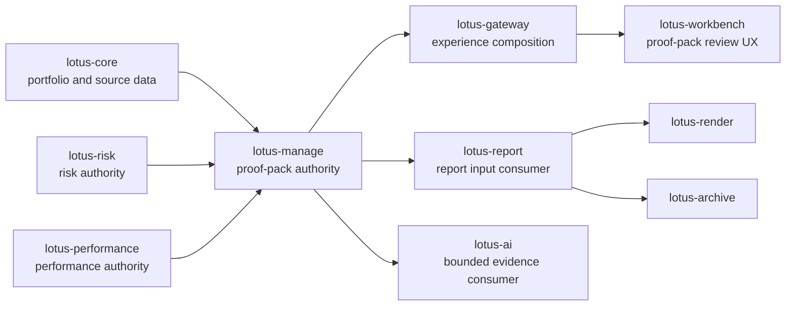

# RFC-0040: Pre-Trade Proof Pack and DPM Evidence Fabric

| Metadata | Details |
| --- | --- |
| **Status** | IN PROGRESS - SLICES 0-10 COMPLETE; SECOND-LAST HARDENING PASSED |
| **Created** | 2026-05-03 |
| **Last Tightened** | 2026-05-03 |
| **Owner** | `lotus-manage` |
| **Business Sponsor Persona** | DPM head, portfolio manager, CIO desk, investment control, compliance, operations, audit, sales/pre-sales |
| **Depends On** | RFC-0017, RFC-0019, RFC-0020, RFC-0021, RFC-0023, RFC-0036, RFC-0037, RFC-0038, RFC-0039, `lotus-core` RFC-0087 |
| **Downstream Realization Depends On** | Gateway proof-pack realization RFC, Workbench proof-pack realization RFC, later RFC-0043 AI PM memo |
| **Implementation Branch** | `feat/rfc0040-gold-standard-tightening` |
| **Doc Location** | `docs/rfcs/RFC-0040-pre-trade-proof-pack-and-evidence-fabric.md` |
| **Slice 0 Evidence** | `docs/rfcs/RFC-0040-source-map-and-gap-analysis.md` |
| **Slice 1 Evidence** | `docs/rfcs/RFC-0040-platform-automation-slice1.md` |
| **Slice 2 Evidence** | `docs/rfcs/RFC-0040-cleanup-and-structure-slice2.md` |
| **Slice 3 Evidence** | `docs/rfcs/RFC-0040-domain-builder-slice3.md` |
| **Slice 4 Evidence** | `docs/rfcs/RFC-0040-markdown-summary-slice4.md` |
| **Slice 5 Evidence** | `docs/rfcs/RFC-0040-persistence-slice5.md` |
| **Slice 6 Evidence** | `docs/rfcs/RFC-0040-api-slice6.md` |
| **Slice 7 Evidence** | `docs/rfcs/RFC-0040-handoffs-slice7.md` |
| **Slice 8 Evidence** | `docs/rfcs/RFC-0040-gateway-workbench-realization-slice8.md` |
| **Slice 9 Evidence** | `docs/rfcs/RFC-0040-implementation-proof-slice9.md` |
| **Slice 10 Evidence** | `docs/rfcs/RFC-0040-hardening-review-slice10.md` |

---

## 0. Executive Summary

RFC-0040 creates the `DpmPreTradeProofPack`: the durable evidence product that explains why a
discretionary portfolio action is being proposed, what action was selected, what trade-offs were
accepted, which sources were used, which controls were checked, who reviewed it, and which
downstream report or AI evidence packages can be generated from it.

This is the trust layer for the DPM operating system created by RFC-0037, the mandate health and
command-center foundation created by RFC-0038, and the construction-alternatives foundation created
by RFC-0039.

The proof pack must be:

1. **machine-readable** enough for Gateway, Workbench, report generation, audit, and support,
2. **business-readable** enough for PM, CIO, compliance, operations, and client-demo explanation,
3. **source-backed** enough that missing or degraded evidence is visible rather than hidden,
4. **bounded and immutable** enough that it can be retained as an audit artifact,
5. **safe for downstream AI** because it supplies structured evidence, not prompts or decisions.

Implementation must not begin until this RFC is strong enough to serve as the execution guide.

---

## 1. Critical Review of the Previous RFC

| Area | Previous state | Gap | Tightening applied |
| --- | --- | --- | --- |
| Scope | Directionally defined a proof pack. | Did not clearly distinguish artifact authority, report handoff, AI handoff, Gateway composition, and Workbench product realization. | Added architecture boundaries and downstream realization rules. |
| Sequencing | Six broad slices. | Slices were too coarse for platform automation, cleanup, live proof, hardening, downstream RFC creation, and final closure. | Replaced with ordered implementation slices plus mandatory platform/cleanup/proof/hardening/closure slices. |
| Source authority | Listed many sections. | Did not map sections to source ownership or degraded-source behavior. | Added source authority matrix and section-state taxonomy. |
| RFC-0038/0039 dependency | Referenced dependencies. | Did not explicitly use mandate health, monitoring exceptions, selected alternatives, authority context, or construction evidence. | Added first-class dependencies on mandate twin, command-center events, and selected alternative evidence. |
| Platform improvement | Mentioned platform automation only briefly. | Did not force repeatable scaffold improvements into `lotus-platform`. | Added a mandatory platform automation and scaffolding slice with concrete default concerns. |
| API quality | Listed endpoints. | Did not require Swagger field quality, examples, error taxonomy, or endpoint certification. | Added API certification and OpenAPI/Swagger standards as merge blockers. |
| Persistence | Named tables. | Did not define immutability, hash boundaries, redaction, retention, replay, or append-only refs strongly enough. | Added persistence and integrity rules. |
| Evidence proof | Asked for examples. | Did not require critical evidence review or iterative fix-forward before closure. | Added proof package, critical review notes, live stack evidence, and no-superficial-proof criteria. |
| Documentation | Included supported features. | Did not separate repo deep docs, wiki, README, and supported-feature claims. | Added documentation layering and implementation-backed promotion rules. |
| Downstream UI | Said Gateway/Workbench later. | Did not require paired RFCs or define how integration should happen. | Added a dedicated Gateway/Workbench realization RFC slice near the end of manage implementation. |

Decision:

1. RFC-0040 remains the owning manage RFC for pre-trade proof packs and evidence-fabric backend
   truth.
2. Gateway and Workbench require paired realization RFCs after manage contracts and live evidence
   are stable.
3. No implementation work should start from the previous draft because it would leave too much
   ambiguity in source authority, evidence quality, and downstream ownership.

---

## 2. Business Outcomes

RFC-0040 delivers business value by giving Lotus one durable, reviewable pre-trade evidence product.

Expected outcomes:

1. **Trustworthy discretionary decisions**
   PMs, CIO, compliance, operations, and audit can see why a portfolio action is proposed and what
   evidence supports it.
2. **Faster approvals**
   Reviewers no longer reconstruct mandate, source, risk, tax, liquidity, FX, rule, and trade
   evidence from separate endpoints.
3. **Better client and investment-committee material**
   `lotus-report` receives a typed report input rather than manually rebuilding DPM context.
4. **Safer AI assistance**
   `lotus-ai` receives a bounded evidence input and forbidden-action guardrails rather than raw
   portfolio payloads or hidden instructions.
5. **Lower operational support cost**
   Support and operations can diagnose a decision from a single artifact with source refs,
   reason codes, hashes, and timeline events.
6. **Premium sales/pre-sales demos**
   Lotus can demonstrate that discretionary actions are not black boxes: every decision has
   evidence, lineage, trade-offs, and downstream readiness.

---

## 3. Architecture Direction

### 3.1 Ownership Model

`lotus-manage` owns:

1. proof-pack domain model,
2. proof-pack section assembly,
3. proof-pack persistence, hash, retention, and retrieval,
4. selected-alternative and direct-run evidence extraction,
5. report-input and AI-evidence-input adapters,
6. proof-pack API contracts and supportability states.

`lotus-gateway` owns:

1. Workbench-facing proof-pack composition contract,
2. user-session and entitlement-aware routing,
3. correlation propagation,
4. degraded upstream presentation contract,
5. command-center integration of proof-pack readiness and evidence refs.

`lotus-workbench` owns:

1. product experience and screen flows,
2. proof-pack evidence drawer / review workspace,
3. action rail affordances,
4. visual, accessibility, and browser evidence,
5. Gateway-only consumption.

`lotus-report` owns:

1. report materialization,
2. PDF/document rendering orchestration,
3. report batch lifecycle,
4. document handoff to render/archive services.

`lotus-ai` owns:

1. AI narrative and PM memo generation,
2. prompt governance,
3. AI output review and safety.

`lotus-core`, `lotus-risk`, and `lotus-performance` remain source authorities for their respective
data products and analytics outputs. `lotus-manage` must not duplicate those methodologies in a
proof pack.

### 3.2 Product Flow

Rules:

1. Workbench must not call `lotus-manage` directly.
2. Gateway must not reconstruct proof-pack sections from raw upstream services.
3. Gateway may compose proof-pack summaries, readiness, actions, and links, but the proof-pack
   artifact remains manage-owned.
4. Workbench must not generate proof-pack facts, risk claims, report inputs, or AI evidence inputs
   in the browser.
5. Report and AI handoffs are typed downstream packages, not unrestricted raw payload exports.

### 3.3 Enterprise Completion Rule

RFC-0040 is not limited to local `lotus-manage` changes. A gold-standard implementation must deliver
the complete enterprise proof-pack capability across the Lotus ecosystem.

Implementation rules:

1. If a proof-pack section requires a data product, calculation, source lineage, supportability
   signal, or policy outcome owned by another Lotus app, the implementing slice must integrate that
   responsible app.
2. If the responsible app lacks a required implementation-backed feature or data point, the slice
   must either:
   - add or tighten the feature in that responsible app with tests, docs, and evidence, or
   - record a deliberate RFC-scoped deferral when the business outcome does not depend on that
     feature for RFC-0040 completion.
3. `lotus-manage` may add adapters, normalization, section assembly, source refs, and supportability
   aggregation, but must not clone domain methodology that belongs in `lotus-core`, `lotus-risk`,
   `lotus-performance`, `lotus-report`, `lotus-ai`, `lotus-gateway`, or `lotus-workbench`.
4. Cross-app changes must use the owning repository's native governance, tests, documentation, and
   PR hygiene. The RFC-0040 proof package must cite those commits, PRs, or evidence artifacts.
5. A section cannot be marked `READY` merely because manage filled a placeholder. It is `READY` only
   when its domain owner, source refs, data freshness, and method supportability are proven.

Deferral is allowed only when it is explicit, source-honest, visible in the supported-features
ledger, and does not undercut the core pre-trade proof-pack outcome.

---

## 4. Current Baseline

Implementation-backed foundations available before RFC-0040:

1. deterministic run artifact contract from RFC-0019,
2. supportability, lineage, and run lookup APIs from RFC-0017/RFC-0023,
3. workflow gate APIs from RFC-0020,
4. OpenAPI governance and API vocabulary guardrails from RFC-0021/RFC-0067,
5. stateful source-data readiness and core sourcing from RFC-0036,
6. mandate digital twin, health, monitoring exceptions, and command-center foundation from
   RFC-0038,
7. construction alternative sets, selected alternatives, method status, objective/constraint
   traces, and authority-backed construction diagnostics from RFC-0039,
8. repo-local wiki source and publication governance.

Current gaps:

1. no first-class durable pre-trade proof-pack aggregate,
2. no normalized evidence section model across mandate, source readiness, selected alternatives,
   trade intent, risk, tax, liquidity, FX, regime stress, rules, workflow, and operations,
3. no immutable hash and retention posture for pre-trade evidence,
4. no typed report-input package for `lotus-report`,
5. no typed AI-evidence package for `lotus-ai`,
6. no Gateway/Workbench realization RFC for proof-pack review UX,
7. no implementation-backed supported-feature material for proof packs.

---

## 5. Goals and Non-Goals

### 5.1 Goals

1. Add `DpmPreTradeProofPack` as a first-class durable manage artifact.
2. Generate proof packs from:
   - selected RFC-0039 construction alternatives,
   - direct rebalance runs when no alternative set exists.
3. Include source-backed sections for:
   - decision summary,
   - mandate and source readiness,
   - before/target/after state,
   - selected alternative,
   - trade intents,
   - drift impact,
   - risk/performance context,
   - tax, turnover, cost, liquidity, FX, currency overlay, regime stress,
   - eligibility, restrictions, sustainability posture,
   - rule results,
   - approval and operations state,
   - decision timeline,
   - lineage,
   - supportability,
   - report/AI refs.
4. Persist immutable proof-pack JSON with content hash, source hashes, and append-only refs.
5. Produce deterministic Markdown summary.
6. Produce typed `DpmProofPackReportInput`.
7. Produce typed `DpmProofPackAiEvidenceInput` with forbidden-field guardrails.
8. Certify API surface, OpenAPI/Swagger, examples, errors, and vocabulary.
9. Generate live evidence against the canonical front-office stack where appropriate.
10. Add downstream Gateway/Workbench realization RFCs near the end of manage implementation when
    contracts and evidence are stable.
11. Make required cross-app changes in the domain-owning Lotus apps when proof-pack sections depend
    on data products or capabilities that are not yet implementation-backed.

### 5.2 Non-Goals

1. Render PDF inside `lotus-manage`.
2. Generate AI narrative inside `lotus-manage`.
3. Execute trades.
4. Replace approval workflows.
5. Replace report, render, archive, risk, performance, or core authority.
6. Build Workbench UI in this manage RFC.
7. Claim full front-office proof-pack outcome before Gateway and Workbench realization are
   implemented and live-proven.

---

## 6. Source Authority and Section Map

| Section | Primary owner | Manage behavior | Missing-source posture |
| --- | --- | --- | --- |
| `decision_summary` | `lotus-manage` | Derived from run or selected alternative plus actor reason. | `DEGRADED` if actor reason or selected source is missing. |
| `mandate_context` | `lotus-manage` + `lotus-core` | Uses RFC-0038 mandate twin and core source refs. | `BLOCKED` for no mandate identity; `DEGRADED` for stale source refs. |
| `source_readiness` | `lotus-core`/manage integration | Records source product readiness and lineage refs. | `DEGRADED` or `BLOCKED` by source criticality. |
| `before_state` | `lotus-core` or request payload | Captures holdings snapshot metadata and refs, not raw unsafe payloads. | `BLOCKED` if no portfolio state exists. |
| `target_state` | `lotus-core`/manage request | Captures target model refs and target summary. | `DEGRADED` if source was caller-supplied only. |
| `selected_alternative` | `lotus-manage` RFC-0039 | Captures selected alternative, method, status, objective/constraint traces. | `DEGRADED` if direct run has no alternative. |
| `trade_intents` | `lotus-manage` | Captures intended trades, not executed orders. | `BLOCKED` if trades cannot be reconciled to after state. |
| `after_state` | `lotus-manage` simulation | Captures simulated after-state summary. | `BLOCKED` if simulation failed. |
| `drift_impact` | `lotus-manage` | Captures before/after drift and improvement metrics. | `DEGRADED` if benchmark/model evidence is incomplete. |
| `risk_impact` | `lotus-risk` authority | Consumes risk outputs or authority context. | `DEGRADED` when missing; no local risk methodology clone. |
| `performance_context` | `lotus-performance` authority | Captures performance context when available. | `DEGRADED` when missing; no local performance calculation clone. |
| `tax_impact` | `lotus-core` tax lots + manage tax logic | Captures source-lot posture, tax budget, and method diagnostics. | `DEGRADED` when tax lots are missing. |
| `turnover_and_cost` | `lotus-manage` + source cost policy | Captures turnover and transaction-cost supportability. | `DEGRADED` if authoritative cost model unavailable. |
| `liquidity_and_cash` | `lotus-manage` settlement engine | Captures settlement ladder, cash buffer, funding deficits. | `BLOCKED` on funding deficits; `PENDING_REVIEW` on policy breach. |
| `fx_funding_plan` | market/FX source + manage diagnostics | Captures FX pair readiness, funding, base currency. | `BLOCKED` on missing required FX pairs. |
| `currency_overlay_evidence` | manage policy + FX source | Captures hedge policy and overlay readiness. | `DEGRADED` if no overlay value; `BLOCKED` on source gaps. |
| `scenario_and_regime_evidence` | risk/CIO authority context | Captures scenario pack, worst-case loss, policy threshold. | `DEGRADED` when scenario pack unavailable. |
| `eligibility_and_restrictions` | core/eligibility/restriction authority | Captures product eligibility and restrictions. | `DEGRADED` until restriction sources are implemented. |
| `sustainability_controls` | future sustainability authority | Captures ESG/sustainability only when source-backed. | `DEGRADED`; no unsupported ESG claim. |
| `rule_results` | `lotus-manage` policy engine | Captures rule pass/warn/block outcomes. | `BLOCKED` if mandatory rules cannot be evaluated. |
| `approval_requirements` | `lotus-manage` workflow gates | Captures review requirements and blockers. | `PENDING_REVIEW` when workflow state incomplete. |
| `operations_handoff` | `lotus-manage` operations posture | Captures operational readiness, blocked actions, handoff refs. | `DEGRADED` when operations refs are incomplete. |
| `decision_timeline` | manage/core/workflow events | Captures ordered decision history. | `DEGRADED` when optional events missing; `BLOCKED` if selected source event missing. |
| `lineage` | all source systems | Captures source refs, hashes, run ids, correlation ids. | `BLOCKED` for missing required source/run identity. |
| `supportability` | `lotus-manage` | Summarizes section states, owners, reason codes. | Never omitted. |
| `reporting_refs` | manage/report handoff | Captures report-input adapter readiness and generated refs. | `READY` after Slice 7 adapter; generated refs are append-only outside the immutable body. |
| `ai_refs` | manage/AI handoff | Captures AI-evidence adapter readiness and guardrails. | `READY` after Slice 7 adapter; generated refs are append-only outside the immutable body. |

Cross-app source rule:

1. `DEGRADED` is a truthful runtime state, not a shortcut for unfinished enterprise scope.
2. If a source marked `DEGRADED` is mandatory for the RFC-0040 business outcome, the slice must
   improve the domain-owning app or explicitly defer that feature from supported status.
3. The final gold-pass assessment must list every cross-app dependency as `proven`, `improved`,
   `already sufficient`, or `deferred`, with evidence.

---

## 7. Section State Taxonomy

Every proof-pack section must expose:

1. `state`: `READY`, `PENDING_REVIEW`, `DEGRADED`, `BLOCKED`, or `NOT_APPLICABLE`,
2. `summary`,
3. `facts`,
4. `metrics`,
5. `evidence_refs`,
6. `source_refs`,
7. `source_supportability`,
8. `reason_codes`,
9. `generated_at`,
10. `redaction_policy`.

State rules:

1. `READY` requires source-backed evidence or explicitly derived manage evidence.
2. `PENDING_REVIEW` means evidence exists but requires human review.
3. `DEGRADED` means non-critical evidence is missing, stale, partial, or caller-supplied only.
4. `BLOCKED` means required decision evidence is missing or contradictory.
5. `NOT_APPLICABLE` must carry a reason code and must not hide source gaps.

---

## 8. Domain Models

### 8.1 `DpmPreTradeProofPack`

Required fields:

1. `proof_pack_id`
2. `proof_pack_version`
3. `portfolio_id`
4. `mandate_id`
5. `source_type`: `REBALANCE_RUN` or `SELECTED_ALTERNATIVE`
6. `rebalance_run_id`
7. `alternative_set_id`
8. `selected_alternative_id`
9. `as_of_date`
10. `status`
11. `decision_summary`
12. `sections`
13. `approval_requirements`
14. `operations_handoff`
15. `decision_timeline`
16. `lineage`
17. `supportability`
18. `content_hash`
19. `source_hashes`
20. `markdown_summary_ref`
21. `report_input_ref`
22. `ai_evidence_ref`
23. `created_at`
24. `created_by`
25. `correlation_id`

### 8.2 `DpmProofPackSection`

Required fields:

1. `section_id`
2. `section_type`
3. `state`
4. `title`
5. `summary`
6. `facts`
7. `metrics`
8. `reason_codes`
9. `evidence_refs`
10. `source_refs`
11. `source_supportability`
12. `redaction_policy`

### 8.3 `DpmProofPackDecisionSummary`

Required fields:

1. `decision_type`
2. `recommended_action`
3. `selected_alternative_type`
4. `business_rationale`
5. `expected_benefit`
6. `main_tradeoffs`
7. `top_risks`
8. `approval_state`
9. `operations_state`

### 8.4 `DpmProofPackDecisionTimeline`

Required timeline events:

1. most recent mandate version event,
2. monitoring exception event that triggered or influenced the action,
3. model-change, tactical house-view, or PM-initiated event when applicable,
4. generated alternative set event,
5. selected alternative event,
6. proof-pack generation event,
7. approval, deferral, or rejection event when available,
8. wave inclusion event when available,
9. downstream execution handoff and post-trade outcome refs when available.

Every event must include:

1. `event_id`
2. `event_type`
3. `event_time`
4. `actor`
5. `source_system`
6. `status`
7. `reason_codes`
8. `artifact_refs`

---

## 9. API Surface

All endpoints must be under the certified DPM API family and must pass the existing OpenAPI quality,
API vocabulary, no-alias, and endpoint certification gates.

### 9.1 Generate Proof Pack

`POST /api/v1/rebalance/proof-packs`

Purpose:

1. generate a durable proof pack from a selected alternative or direct rebalance run,
2. persist immutable JSON and section records,
3. optionally produce Markdown, report input, and AI evidence input refs.

Request fields:

1. `source_type`: `REBALANCE_RUN` or `SELECTED_ALTERNATIVE`
2. `rebalance_run_id`
3. `alternative_set_id`
4. `selected_alternative_id`
5. `include_markdown`
6. `include_report_input`
7. `include_ai_evidence_input`
8. `actor`
9. `reason`
10. `correlation_id`

Required error paths:

1. source run not found,
2. alternative set not found,
3. selected alternative not found,
4. selected alternative does not belong to the set,
5. source evidence incomplete for required sections,
6. idempotency/correlation conflict,
7. persistence unavailable,
8. report/AI adapter rejected due to forbidden fields.

### 9.2 Retrieve Proof Pack

`GET /api/v1/rebalance/proof-packs/{proof_pack_id}`

Purpose:

1. retrieve full durable proof pack,
2. support audit, operations, Gateway, and Workbench evidence views.

### 9.3 Proof Pack Markdown

`GET /api/v1/rebalance/proof-packs/{proof_pack_id}/summary.md`

Purpose:

1. return deterministic human-readable Markdown,
2. support PM review, operations review, and report preview workflows.

### 9.4 Proof Pack Report Input

`GET /api/v1/rebalance/proof-packs/{proof_pack_id}/report-input`

Purpose:

1. return typed package for `lotus-report`,
2. avoid report-side reconstruction of DPM decisions.

### 9.5 Proof Pack AI Evidence Input

`GET /api/v1/rebalance/proof-packs/{proof_pack_id}/ai-evidence-input`

Purpose:

1. return structured, bounded evidence for `lotus-ai`,
2. support later RFC-0043 PM memo generation,
3. prove that AI receives evidence and guardrails, not authority to choose trades.

---

## 10. Persistence, Immutability, and Retention

Tables:

1. `dpm_pre_trade_proof_packs`
2. `dpm_pre_trade_proof_pack_sections`
3. `dpm_pre_trade_proof_pack_refs`
4. `dpm_pre_trade_proof_pack_events`

Integrity requirements:

1. proof-pack content hash,
2. section content hashes,
3. source run hash,
4. source alternative hash when applicable,
5. source-data lineage refs,
6. append-only post-creation refs,
7. immutable proof-pack body after creation,
8. deterministic canonical JSON serialization for hash calculation,
9. explicit redaction policy for sensitive fields,
10. forbidden raw payload storage unless an explicit safe snapshot contract exists.

Retention:

1. proof packs tied to selected alternatives: 7 years,
2. proof packs tied to blocked or rejected workflows: 7 years when audit-linked,
3. draft proof packs: configurable, default 1 year,
4. retention metadata must be queryable in the artifact and observable in operator diagnostics.

---

## 11. Report and AI Handoff Contracts

### 11.1 `DpmProofPackReportInput`

Must include:

1. title,
2. portfolio and mandate identifiers,
3. decision summary,
4. before/after allocation tables,
5. selected alternative summary,
6. trade table,
7. risk/tax/cost/liquidity/FX/scenario sections,
8. rule and diagnostics sections,
9. approval and operations sections,
10. source lineage and evidence refs.

Must not include:

1. raw request payloads,
2. unrestricted internal diagnostics,
3. secrets,
4. raw telemetry paths,
5. hidden optimizer internals beyond bounded traces.

### 11.2 `DpmProofPackAiEvidenceInput`

Must include only structured evidence:

1. bounded facts and metrics,
2. section states,
3. source refs and supportability,
4. forbidden-action guardrails,
5. evidence completeness flags,
6. disclaimer that AI must not choose trades, change evidence, or invent missing facts.

Must not include:

1. raw prompt,
2. hidden calculations,
3. instructions to choose trades,
4. unsupported facts,
5. unrestricted holdings payloads,
6. secrets or internal-only support refs.

---

## 12. Implementation Slices

Work must proceed strictly slice by slice. Do not start the next slice until the current one is
implemented, validated, reviewed, documented where needed, and in a solid state.

### Slice 0 - Critical Review, Source Map, and Artifact Design

Scope:

1. review existing run artifacts, support bundles, lineage APIs, workflow gates, mandate health,
   monitoring exceptions, and construction alternatives,
2. map every proof-pack section to source authority, available implementation evidence, degraded
   behavior, and missing gaps,
3. decide minimum viable proof-pack sections for first implementation without weakening the target
   model,
4. identify cross-app feature/data gaps in `lotus-core`, `lotus-risk`, `lotus-performance`,
   `lotus-report`, `lotus-ai`, `lotus-gateway`, `lotus-workbench`, and other domain-owning apps,
5. decide which gaps must be implemented for RFC-0040 enterprise completion and which are explicitly
   deferred,
6. confirm no existing RFC already owns this exact proof-pack artifact.

Acceptance:

1. section-to-source map is complete,
2. missing-source behavior is explicit,
3. cross-app required changes are listed with owning repository, expected contract, tests, and proof,
4. no unsupported downstream or UI claim is made,
5. implementation order is confirmed against RFC-0038/RFC-0039 reality.

Evidence:

1. source map document or RFC section update,
2. implementation-gap list,
3. cross-app dependency and ownership matrix,
4. critical-review notes.

Slice 0 result:

1. completed in `docs/rfcs/RFC-0040-source-map-and-gap-analysis.md`,
2. confirmed RFC-0040 owns the first `DpmPreTradeProofPack` artifact implementation,
3. confirmed current manage foundations from RFC-0038 and RFC-0039 are sufficient to start the
   proof-pack design after platform/scaffold classification and local cleanup,
4. identified deferred or conditional cross-app gaps for broader risk enrichment, performance
   context, sustainability/restriction profiles, transaction-cost curves, scenario-pack authority,
   report consumption, AI consumption, Gateway composition, and Workbench realization,
5. identified an existing Gateway RFC ownership conflict where proof packs are described as
   `lotus-report` owned; Slice 8 must correct that after manage contracts and evidence stabilize.

### Slice 1 - Platform Automation and Scaffolding Improvement

Scope:

1. identify gaps in `lotus-platform` automation that RFC-0040 would otherwise solve locally,
2. improve platform automation when a gap is cross-cutting,
3. improve app scaffolding so future apps start with stronger governance,
4. cover repeatable concerns:
   - API certification pattern,
   - Swagger/OpenAPI quality,
   - health, liveness, readiness, and metadata endpoints,
   - observability and metrics contracts,
   - structured logging and correlation/trace propagation,
   - problem-details-style error handling,
   - test scaffolding for unit/integration/e2e/coverage,
   - CI defaults and security audit,
   - README/wiki/RFC documentation scaffolding,
   - evidence-output manifest conventions,
   - governance hooks for no-alias, API vocabulary, data mesh, trust telemetry, and wiki sync.
5. if implementation uncovers more platform or scaffold gaps, fix them in `lotus-platform` or
   record a deliberate no-change decision with evidence.
6. when cross-app implementation is required, ensure platform automation supports repeatable
   multi-repository evidence, documentation, and API-certification posture instead of leaving each
   app to invent local proof conventions.

Acceptance:

1. platform gaps are classified as `fixed`, `already covered`, `not applicable`, or `deferred`,
2. any reusable improvement lands in `lotus-platform`, not as a one-off `lotus-manage` workaround,
3. platform changes have their own tests and validation,
4. RFC-0040 documents what future apps gain from the improvement,
5. no local app-specific scaffold workaround remains when a platform fix is appropriate,
6. cross-app RFC-0040 work can produce comparable evidence across repositories.

Evidence:

1. platform diff and tests, or explicit no-change decision,
2. app-scaffold checklist update,
3. validation command output,
4. branch/PR references when platform changes are made separately.

Slice 1 result:

1. completed in `docs/rfcs/RFC-0040-platform-automation-slice1.md`,
2. classified platform scaffold and automation coverage for OpenAPI, Swagger, health/readiness,
   observability, structured logging, problem-details, test scaffolding, CI, supported features,
   wiki sync, API vocabulary, no-alias, mesh/trust telemetry, heartbeat, and background-run
   visibility,
3. fixed the only reusable gap found by adding a platform service-scaffold
   `evidence/rfc-implementation/evidence-manifest.template.json`,
4. recorded the platform branch and commit:
   `lotus-platform` `feat/rfc0040-evidence-manifest-scaffold`
   `4679b07 feat: scaffold rfc evidence manifests`,
5. introduced no manage-local scaffold workaround and made no proof-pack implementation support
   claim.

### Slice 2 - Cleanup and Structure

Scope:

1. remove dead code encountered in proof-pack-adjacent areas,
2. improve module boundaries for proof-pack domain logic, adapters, persistence, and APIs,
3. consolidate overlapping artifact, support-bundle, lineage, workflow, and evidence-builder
   logic where it materially reduces duplication,
4. improve document structure and reduce sprawl,
5. move durable operator/product truth to wiki where appropriate,
6. avoid duplicating deep technical docs in wiki,
7. ensure repo-local `wiki/` source is usable and reflects the true post-RFC state before closure.

Acceptance:

1. proof-pack code has clear domain, infrastructure, API, and adapter boundaries,
2. stale proposal/advisory terminology is removed where it could mislead,
3. docs are layered correctly across README, wiki, RFC, and deep docs,
4. wiki publication is planned and checked before/after merge.

Evidence:

1. code/module diff,
2. documentation layering review,
3. wiki source diff or explicit no-wiki-change decision,
4. targeted cleanup tests.

Slice 2 result:

1. completed in `docs/rfcs/RFC-0040-cleanup-and-structure-slice2.md`,
2. extracted lineage and idempotency-history response mapping from the run-supportability service
   module into reusable serializers,
3. confirmed no tracked compiled Python artifacts were present,
4. recorded the proof-pack boundary decision for domain, persistence, API, report-input, and
   AI-evidence modules before Slice 3 starts,
5. recorded an explicit no-wiki-change decision because no implementation-backed proof-pack
   capability exists yet.

### Slice 3 - Domain Models and Pure Proof Builder

Scope:

1. add proof-pack domain models,
2. build proof pack from an existing rebalance run,
3. build proof pack from a selected RFC-0039 alternative,
4. generate deterministic content hash and section hashes,
5. implement section-state aggregation and supportability summary,
6. ensure missing evidence degrades or blocks truthfully.

Acceptance:

1. every required section is generated or explicitly marked unavailable,
2. deterministic hashing is stable across equivalent inputs,
3. selected-alternative proof captures objective/constraint traces and method status,
4. direct-run proof captures run and workflow evidence without inventing alternative context,
5. no source authority is recomputed locally when it belongs to another service,
6. mandatory source gaps that block enterprise readiness have been fixed in the domain-owning app or
   recorded as explicit deferrals before the section is promoted.

Evidence:

1. pure unit tests for every section,
2. deterministic hash tests,
3. missing-section degraded tests,
4. selected-alternative and direct-run builder tests,
5. cross-app adapter/source-contract tests where manage consumes another app.

Slice 3 result:

1. completed in `docs/rfcs/RFC-0040-domain-builder-slice3.md`,
2. added `src/core/proof_packs` domain models and pure builders,
3. generated every RFC-0040 section with deterministic section hashes and aggregate content hash,
4. proved direct-run and selected-alternative proof generation through unit tests,
5. captured optional workflow decisions in approval and timeline evidence,
6. left Markdown, persistence, report input, AI evidence input, and APIs to later slices without
   supported-feature promotion.

### Slice 4 - Markdown Summary and Human Readability

Scope:

1. add deterministic Markdown renderer,
2. define section ordering and summary tables,
3. use PM-friendly language without unsupported claims,
4. expose degraded/missing evidence clearly,
5. add snapshot or golden tests that prevent unreadable or broken summaries.

Acceptance:

1. Markdown is deterministic,
2. tables are readable and valid,
3. missing evidence is visible,
4. business language is concise, accurate, and source-backed,
5. Markdown does not become a sales claim when source evidence is degraded.

Evidence:

1. Markdown examples,
2. snapshot/golden tests,
3. degraded Markdown example.

Slice 4 result:

1. completed in `docs/rfcs/RFC-0040-markdown-summary-slice4.md`,
2. added deterministic `render_proof_pack_markdown`,
3. included decision summary, supportability counts, section matrix, timeline, evidence gaps, and
   integrity hashes,
4. tested deterministic rendering, section order, and degraded evidence visibility,
5. made no API, persistence, report, AI, Gateway, Workbench, or supported-feature claim.

### Slice 5 - Persistence and Repository Layer

Scope:

1. add PostgreSQL migration and repository contract,
2. add in-memory repository for fast tests,
3. persist immutable proof pack, sections, refs, events, hashes, and retention metadata,
4. enforce append-only post-creation refs,
5. add repository read paths required by APIs and supportability.

Acceptance:

1. proof-pack body is immutable after creation,
2. duplicate identity/idempotency behavior is deterministic,
3. section and source hashes persist and round-trip,
4. retention metadata persists and is queryable,
5. PostgreSQL and in-memory repositories behave consistently.

Evidence:

1. migration smoke,
2. repository contract tests,
3. PostgreSQL behavior tests,
4. idempotency/replay tests.

Slice 5 result:

1. completed in `docs/rfcs/RFC-0040-persistence-slice5.md`,
2. added proof-pack repository contract, in-memory repository, PostgreSQL repository, and migration,
3. persisted proof-pack body, sections, hashes, retention metadata, idempotency lookup, and
   append-only refs,
4. tested round-trip, immutability, idempotency conflict, append-only refs, and migration table
   declaration,
5. made no API or supported-feature claim.

### Slice 6 - Certified Proof-Pack APIs

Scope:

1. add generate/retrieve/markdown/report-input/AI-evidence endpoints,
2. define request and response models separate from domain models,
3. add supportability and error response models,
4. add OpenAPI examples for success, degraded, blocked, and not-found/conflict paths,
5. update API vocabulary inventory.

Acceptance:

1. every endpoint has Swagger summary, description, tags, response descriptions, examples, and
   model field descriptions,
2. every request/response attribute has type, description, and example value,
3. no duplicate or alias endpoints are introduced,
4. errors are complete, correct, and tested,
5. OpenAPI quality, vocabulary, no-alias, and endpoint certification gates pass.

Evidence:

1. API tests,
2. OpenAPI certification matrix,
3. vocabulary validation,
4. no-alias gate,
5. error-path tests.

Slice 6 result:

1. completed in `docs/rfcs/RFC-0040-api-slice6.md`,
2. added certified manage-owned proof-pack generate, retrieve, Markdown, report-input-ref, and
   AI-evidence-ref endpoints under `/api/v1/rebalance/proof-packs`,
3. enforced idempotent generation, source validation, immutable persistence lookup, Markdown
   rendering, and governed `424` report/AI unavailable states before Slice 7 adapters exist,
4. documented proof-pack endpoints in OpenAPI and repo-local wiki endpoint certification,
5. made no Gateway, Workbench, report materialization, AI memo, or full front-office supported
   feature claim.

### Slice 7 - Report and AI Handoff Adapters

Scope:

1. add `DpmProofPackReportInput` adapter,
2. add `DpmProofPackAiEvidenceInput` adapter,
3. add forbidden-field filters,
4. add adapter examples and contract tests,
5. document downstream boundaries for `lotus-report` and `lotus-ai`.

Acceptance:

1. report input contains enough evidence for report generation without reconstruction,
2. AI input is bounded, structured, and explicitly non-decisioning,
3. forbidden fields are rejected or omitted,
4. adapter outputs are deterministic,
5. downstream contracts are documented without claiming downstream implementation,
6. if `lotus-report` or `lotus-ai` needs additional contract support to consume RFC-0040 outputs
   safely, those changes are implemented in the owning app or explicitly deferred with no supported
   feature claim.

Evidence:

1. report-input example,
2. AI-evidence example,
3. forbidden-field tests,
4. adapter contract tests,
5. downstream app PR/evidence refs when report or AI changes are required.

Slice 7 result:

1. completed in `docs/rfcs/RFC-0040-handoffs-slice7.md`,
2. added deterministic `DpmProofPackReportInput` and `DpmProofPackAiEvidenceInput` domain
   adapters,
3. added AI forbidden-action and forbidden-field guardrails,
4. changed report/AI proof-pack sections from future-slice degraded placeholders to adapter-ready
   manage contracts,
5. hydrated append-only report/AI evidence refs into API reads when generation requested them,
6. made no report materialization, AI memo generation, Gateway, Workbench, or full front-office
   supported-feature claim.

### Slice 8 - Gateway and Workbench Realization RFC Slice

This slice must happen near the end of manage implementation, after manage contracts, evidence,
supportability states, and live proof are stable enough to avoid speculative downstream RFCs.

Scope:

1. create or tighten a Gateway RFC for DPM proof-pack composition,
2. create or tighten a Workbench RFC for proof-pack product realization,
3. define Gateway endpoints that consume manage proof-pack APIs without reconstructing evidence,
4. define Workbench screens and states that consume Gateway only,
5. define canonical proof across manage, gateway, and Workbench,
6. explicitly record that `lotus-manage` proof-pack support is backend support only until
   downstream implementation is complete.
7. identify any Gateway or Workbench platform/product gaps that must be implemented before full
   business outcome can be claimed, including entitlement, state hydration, canonical evidence
   capture, accessibility, action affordances, and browser-proof conventions.

Gateway integration direction:

1. Gateway exposes Workbench-facing proof-pack summary/detail/readiness actions inside the DPM
   command-center contract family.
2. Gateway calls manage proof-pack APIs and preserves manage `proof_pack_id`, section states,
   source refs, reason codes, hashes, report refs, and AI refs.
3. Gateway may combine proof-pack readiness with command-center, entitlement, archive, report, and
   workflow affordances, but it must not recalculate proof-pack sections.
4. Gateway returns degraded upstream posture when manage proof-pack APIs are unavailable.

Workbench integration direction:

1. Workbench adds a proof-pack review/evidence workspace under the DPM command center.
2. Workbench renders:
   - proof-pack readiness,
   - decision summary,
   - section state matrix,
   - evidence drawer,
   - Markdown preview,
   - report-ready/AI-ready handoff badges,
   - approval and operations handoff states.
3. Workbench must not call manage directly.
4. Workbench must not generate facts, hashes, report inputs, or AI evidence in browser code.
5. Demo-ready support requires canonical browser validation, accessibility proof, and screenshot
   evidence after Gateway implementation is complete.

Acceptance:

1. Gateway and Workbench RFCs are grounded in implemented manage APIs and live proof,
2. no direct Workbench-to-manage path is allowed,
3. no downstream layer reconstructs manage proof-pack truth,
4. downstream RFCs include product flows, states, error/degraded handling, canonical evidence, and
   supported-feature promotion criteria,
5. downstream RFCs identify whether Gateway/Workbench implementation can proceed on current
   platform support or requires app/platform changes,
6. manage RFC-0040 does not claim full front-office product realization.

Evidence:

1. Gateway RFC file/PR reference,
2. Workbench RFC file/PR reference,
3. manage handoff document or section,
4. current manage OpenAPI/live proof refs used by downstream RFCs,
5. downstream gap matrix and ownership decisions.

Slice 8 result:

1. completed in `docs/rfcs/RFC-0040-gateway-workbench-realization-slice8.md`,
2. aligned `lotus-gateway` RFC-0098 on branch `feat/dpm-command-center-composition-rfc`
   commit `6099ffe`,
3. aligned `lotus-workbench` RFC-0098 on branch `feat/dpm-command-center-experience-rfc`
   commit `4b150d6`,
4. corrected downstream ownership so `lotus-manage` remains the proof-pack authority,
   `lotus-gateway` composes Workbench-facing truth without reconstruction, and
   `lotus-workbench` renders Gateway truth only,
5. added downstream documentation-contract tests in Gateway and Workbench to prevent stale
   `lotus-report` proof-pack authority language from returning,
6. made no Gateway API implementation, Workbench UI implementation, report materialization,
   AI memo, or full front-office product-realization supported-feature claim.

### Slice 9 - Implementation Proof

Scope:

1. prove implementation end to end against this RFC,
2. bring up the live application on the canonical stack where appropriate,
3. generate proof packs from:
   - selected alternative,
   - direct rebalance run,
   - degraded/missing-source case,
4. capture request/response evidence under `output/`,
5. capture JSON, Markdown, report-input, and AI-evidence examples,
6. review evidence critically,
7. fix gaps, inconsistencies, loose ends, and misleading claims before proceeding.

Acceptance:

1. evidence is machine-readable and reproducible,
2. every required section is present or truthfully unavailable,
3. section states match source reality,
4. no unsupported facts appear in Markdown/report/AI outputs,
5. proof identifies and fixes at least the first round of evidence gaps,
6. supported-feature promotion remains blocked until this proof passes,
7. cross-app evidence proves any required domain-owned source products or consumers that were added
   outside `lotus-manage`.

Evidence:

1. live proof summary,
2. request/response captures,
3. proof-pack JSON example,
4. Markdown summary example,
5. report-input example,
6. AI-evidence example,
7. degraded-source example,
8. critical review notes and fixes,
9. cross-app evidence refs for every non-manage change required by RFC-0040.

Slice 9 result:

1. completed in `docs/rfcs/RFC-0040-implementation-proof-slice9.md`,
2. added `scripts/generate_rfc0040_proof_pack_evidence.py` as a repeatable live HTTP evidence
   generator,
3. captured canonical Postgres-backed live evidence under `output/rfc0040-proof/20260503-135112`,
4. proved direct-run JSON/detail/Markdown/report-input/AI-evidence flows, selected-alternative
   proof-pack generation, and missing-mandate blocked-state behavior,
5. found and fixed a selected-alternative proof gap where construction-generated rebalance runs
   were not recorded for later proof-pack hydration,
6. made no Gateway API implementation, Workbench UI implementation, report materialization,
   AI memo, or full front-office product-realization supported-feature claim.

### Slice 10 - Second-Last Hardening and Review

Scope:

1. perform a proper code review of the full implementation,
2. tighten loose ends,
3. verify API certification pattern compliance,
4. verify platform governance and enterprise data mesh standards,
5. certify every API,
6. verify Swagger quality:
   - grouped correctly,
   - clear what/when/how guidance,
   - full request/response examples,
   - every attribute has description, type, and example value,
7. verify error handling is complete and tested,
8. verify immutability, hashing, retention, redaction, report/AI guardrails, observability, and
   supportability,
9. make final quality improvements before closure.

Acceptance:

1. no known dead code, duplicate proof-builder logic, or stale terminology remains,
2. local repo-native gates pass,
3. endpoint certification is complete,
4. coverage gate is protected by meaningful tests, not superficial assertions,
5. data mesh, trust telemetry, observability, OpenAPI, vocabulary, and no-alias gates pass,
6. evidence docs and wiki truth are aligned,
7. all required cross-app changes are reviewed against the owning repository's governance and are
   cited in the RFC-0040 closure evidence.

Evidence:

1. code-review notes,
2. fixed issues list,
3. `make check` or stronger gate output,
4. OpenAPI/API certification output,
5. coverage and test summary,
6. documentation/wiki review,
7. cross-app PR/check/evidence review.

Slice 10 result:

1. completed in `docs/rfcs/RFC-0040-hardening-review-slice10.md`,
2. ran `make check` successfully after Slice 10 hardening,
3. ran full functional coverage suite with 897 passing tests and confirmed `coverage report
   --fail-under=99` exits cleanly,
4. added meaningful Postgres proof-pack repository tests, proof-pack service tests, proof-pack API
   missing-resource tests, and construction supportability helper tests,
5. verified OpenAPI, vocabulary, no-alias, domain-data-product, trust-telemetry, observability,
   mypy, ruff, format, and monetary-float gates,
6. confirmed repo-authored wiki source is updated and published-wiki drift remains expected until
   post-merge wiki publication,
7. made no Gateway API implementation, Workbench UI implementation, report materialization,
   AI memo, or full front-office product-realization supported-feature claim.

### Slice 11 - Final Closure

Scope:

1. update README,
2. update repository context,
3. update RFC index,
4. update wiki source,
5. update supported-features material with implementation-backed wording only,
6. record final gold-pass assessment,
7. consciously review whether skills, guidance, documentation, or agent context should be improved,
8. run local and GitHub gates,
9. publish wiki after merge,
10. reconcile all cross-app commits/PRs/evidence required by RFC-0040,
11. clean branch and remote hygiene.

Acceptance:

1. docs are useful to developers, business users, operations, sales/pre-sales, client demos, and
   engineering,
2. supported features are implementation-backed, not aspirational,
3. skills/context review is explicit:
   - add, remove, tighten, clarify, or no-change decision,
4. GitHub checks are green,
5. wiki check-only passes after publication,
6. required cross-app repositories are clean or have explicit follow-up PR references,
7. local repository is clean on `main`,
8. remote feature branch is deleted after merge.

Evidence:

1. final RFC progress table,
2. final gold-pass assessment,
3. README/wiki/context diff,
4. PR and CI links,
5. wiki publication check,
6. cross-app closure matrix,
7. branch hygiene proof.

---

## 13. Testing Requirements

Required tests:

1. proof-pack section completeness,
2. source-authority mapping,
3. section-state aggregation,
4. content hash determinism,
5. section hash determinism,
6. immutable persistence,
7. append-only refs,
8. retention metadata,
9. missing evidence degradation,
10. selected-alternative generation,
11. direct-run generation,
12. Markdown rendering and snapshots,
13. report-input adapter,
14. AI-evidence adapter,
15. forbidden-field guardrails,
16. repository contract tests,
17. PostgreSQL behavior tests,
18. API success and error paths,
19. OpenAPI examples and certification,
20. canonical live proof,
21. cross-app contract/integration tests for every domain-owned source or consumer touched by
    RFC-0040,
22. documentation current-state tests where applicable.

Status-code-only tests are insufficient. Tests must assert section states, reason codes, refs,
hashes, redaction posture, and supportability.

---

## 14. API Certification and Swagger Standard

Every proof-pack endpoint must satisfy:

1. correct route grouping under DPM proof-pack tags,
2. precise summary and description,
3. what/when/how usage guidance,
4. full request examples,
5. full response examples,
6. degraded and blocked examples,
7. 4xx/5xx error examples,
8. field-level descriptions and example values,
9. canonical vocabulary values,
10. no alias routes,
11. OpenAPI certification matrix inclusion,
12. generated API vocabulary inventory refresh only when semantic contract changes.

---

## 15. Canonical Evidence Package

Implementation proof must produce a non-git-tracked evidence folder, for example:

`output/rfc0040-proof/<timestamp>/`

Required artifacts:

1. generate-from-selected-alternative request/response,
2. generate-from-direct-run request/response,
3. retrieve proof-pack request/response,
4. Markdown request/response,
5. report-input request/response,
6. AI-evidence-input request/response,
7. degraded-source proof-pack request/response,
8. section-state matrix,
9. decision-timeline example,
10. hash verification sample,
11. source-ref and lineage sample,
12. OpenAPI/API certification summary,
13. latency summary,
14. critical review notes,
15. fixes made after evidence review,
16. cross-app evidence matrix for domain-owned features consumed or changed by RFC-0040.

---

## 16. Supported-Features Ledger

| Feature | Support state before implementation | Promotion rule |
| --- | --- | --- |
| Pre-trade proof-pack JSON | Proposed | Promote only after all required sections, lineage, hashes, retention, and retrieval APIs are certified and live-proven. |
| Generate from selected alternative | Proposed | Promote only after RFC-0039 selected alternatives generate proof packs with objective/constraint traces, method status, actor reason, and source refs. |
| Generate from direct rebalance run | Proposed | Promote only after direct-run proof packs degrade missing alternative evidence truthfully. |
| Section-state matrix | Proposed | Promote only after every section exposes `READY`, `PENDING_REVIEW`, `DEGRADED`, `BLOCKED`, or `NOT_APPLICABLE` with reason codes. |
| Human-readable Markdown summary | Proposed | Promote only after deterministic rendering, snapshot tests, and business-language review pass. |
| Immutable proof-pack persistence | Proposed | Promote only after content hash, section hashes, source hashes, append-only refs, and retention posture are tested. |
| Decision timeline anchoring | Proposed | Promote only after mandate, exception, alternative, proof-pack, approval, wave, handoff, and outcome events link where available. |
| Report input handoff | Proposed | Promote only after `DpmProofPackReportInput` contract tests, examples, and forbidden-field checks pass. |
| AI evidence handoff | Proposed | Promote only after `DpmProofPackAiEvidenceInput` guardrail tests prove AI receives bounded evidence only. |
| Proof-pack API certification | Proposed | Promote only after OpenAPI, API vocabulary, no-alias, error-path, and endpoint certification gates pass. |
| Cross-app source/product integration | Proposed | Promote only after required domain-owned features in core/risk/performance/report/AI or other Lotus apps are proven, or explicitly deferred without unsupported claims. |
| Gateway proof-pack composition | Not supported in manage RFC | Promote only in Gateway RFC after it consumes manage proof-pack APIs without reconstruction and passes Gateway CI/live proof. |
| Workbench proof-pack review UX | Not supported in manage RFC | Promote only in Workbench RFC after Gateway-backed browser, accessibility, visual, and canonical evidence pass. |

---

## 17. Risks and Controls

| Risk | Control |
| --- | --- |
| Proof pack becomes a dumping ground for raw payloads | Curated section model, redaction policy, forbidden-field tests, no raw secrets/telemetry paths. |
| Manage duplicates risk/performance methodology | Source authority matrix; risk/performance sections consume upstream outputs or degrade. |
| Markdown overstates evidence | Snapshot tests and business-language review; degraded evidence must remain visible. |
| AI receives unsafe instructions or unsupported facts | AI evidence adapter guardrails and forbidden-field tests. |
| Report side reconstructs DPM truth | Typed report-input contract from manage; report consumes, not rebuilds. |
| Workbench reconstructs evidence client-side | Gateway-only Workbench RFC; no direct manage calls; no browser fact generation. |
| Gateway becomes proof-pack authority | Gateway composes presentation contract only; proof-pack artifact and hashes stay manage-owned. |
| Missing evidence hidden as success | Section-state taxonomy and supportability summary. |
| Hashes are non-deterministic | Canonical serialization and deterministic hash tests. |
| Persistence allows mutation | Immutable body with append-only refs and repository tests. |
| Documentation claims aspirational support | Supported-feature ledger promotion only after proof and wiki publication. |
| Platform/scaffold gaps repeated locally | Mandatory platform automation slice. |
| Domain-owned data gaps are hidden inside manage | Enterprise completion rule; cross-app source matrix; domain app changes or explicit deferrals before promotion. |
| CI drift after local proof | GitHub Feature Lane and PR Merge Gate required before merge. |

---

## 18. Definition of Done

RFC-0040 is complete only when:

1. proof packs can be generated from selected alternatives and direct runs,
2. every required proof-pack section is source-backed or truthfully degraded/blocked,
3. proof packs are durable, immutable, hashed, lineage-backed, and retrievable,
4. Markdown summary is deterministic, readable, and source-honest,
5. report and AI handoff payloads are bounded, certified, and guarded,
6. every endpoint is certified with high-quality Swagger/OpenAPI examples,
7. all error paths are implemented and tested,
8. live evidence exists and has been critically reviewed,
9. platform automation/scaffolding gaps have been fixed or consciously classified,
10. required cross-app data products, consumers, or platform capabilities are implemented in their
    owning apps or explicitly deferred without a supported-feature claim,
11. Gateway/Workbench realization RFCs have been created or tightened from stable manage evidence,
12. README/wiki/supported-features/context are updated truthfully,
13. local and GitHub checks are green,
14. wiki is published after merge,
15. branch and remote hygiene are clean.

---

## 19. Gold-Pass Assessment Template

The final RFC closure update must include:

| Assessment Area | Final Result |
| --- | --- |
| What was truly completed | TBD after implementation. |
| Quality improvements made | TBD after implementation. |
| Debt removed | TBD after implementation. |
| Platform/scaffold improvements | TBD after implementation or explicit no-change decision. |
| Cross-app changes and evidence | TBD after implementation. |
| APIs certified | TBD after implementation. |
| Proof-pack sections proven | TBD after implementation. |
| Report/AI handoff proof | TBD after implementation. |
| Live evidence reviewed | Slice 9 captured canonical Postgres-backed live evidence in `output/rfc0040-proof/20260503-135112`; critical review found and fixed selected-alternative run hydration before rerun. |
| Documentation/wiki result | TBD after implementation. |
| Gateway/Workbench realization RFC result | Slice 8 aligned downstream RFCs and wiki source in `lotus-gateway` commit `6099ffe` and `lotus-workbench` commit `4b150d6`; implementation remains downstream future work. |
| Skills/context/guidance decision | TBD after final closure review. |
| Gold-standard conclusion | TBD after implementation and proof. |

---

## 20. Relationship to Gateway and Workbench Realization

This RFC delivers manage-side pre-trade proof-pack truth. It does not by itself deliver the full
front-office proof-pack review experience.

Full realization requires:

1. Gateway proof-pack composition RFC created or tightened after manage implementation proof,
2. Workbench proof-pack product-realization RFC created or tightened after Gateway contract shape is
   clear,
3. Gateway implementation that exposes proof-pack readiness, detail, Markdown, report/AI handoff
   posture, degraded states, and action affordances to Workbench without reconstructing evidence,
4. Workbench implementation that renders proof-pack review, evidence drawer, Markdown preview,
   report/AI readiness, approval state, and operations handoff through Gateway only,
5. canonical proof across manage, gateway, and Workbench before any full product-outcome claim.

Until those paired RFCs are implemented and live-proven, `lotus-manage` may claim backend
pre-trade proof-pack support only, not the complete front-office proof-pack review experience.

Cross-app completion requirement:

1. If Gateway or Workbench realization exposes missing manage, platform, entitlement, state,
   telemetry, or canonical evidence capabilities, the downstream RFCs must either include those
   implementation slices or link to the owning RFC/PR.
2. If report, AI, archive, risk, performance, core, or any other domain app needs a contract change
   for proof-pack business outcome completion, that change is part of the RFC-0040 enterprise
   delivery plan even when it lands in another repository.
3. No team may promote the full product outcome to supported status until manage, gateway,
   Workbench, and any required domain app changes are all proven with live or repository-native
   evidence.
