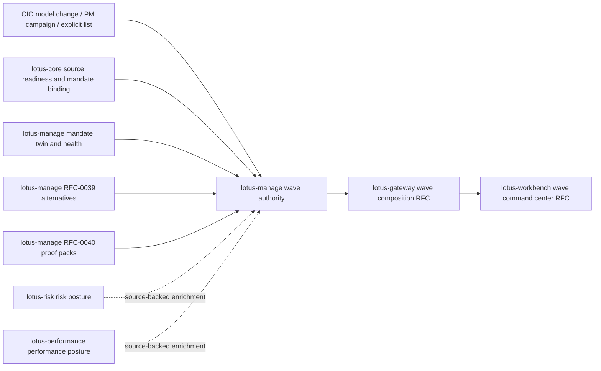

# RFC-0041: Rebalance Wave Orchestration and CIO Model Change Impact

| Metadata | Details |
| --- | --- |
| **Status** | IN PROGRESS - SLICE 9 DOWNSTREAM REALIZATION RFCS COMPLETE |
| **Created** | 2026-05-03 |
| **Last Tightened** | 2026-05-03 |
| **Owner** | `lotus-manage` |
| **Business Sponsor Persona** | CIO desk, DPM head, portfolio manager, investment control, operations, compliance, sales/pre-sales |
| **Depends On** | RFC-0018, RFC-0020, RFC-0023, RFC-0036, RFC-0037, RFC-0038, RFC-0039, RFC-0040, `lotus-core` RFC-0087 |
| **Downstream Realization Depends On** | Gateway wave-composition RFC, Workbench wave-command-center RFC, canonical front-office proof contracts |
| **RFC Tightening Branch** | `feat/rfc0041-gold-standard-tightening` |
| **Implementation Branch** | `feat/rfc0041-implementation` |
| **Slice 0 Evidence** | `docs/rfcs/RFC-0041-source-map-and-gap-analysis.md` |
| **Slice 1 Platform Evidence** | `lotus-platform` PR #296, merge `47d3c7f` |
| **Slice 2 Cleanup Evidence** | `docs/rfcs/RFC-0041-source-map-and-gap-analysis.md#slice-2-cleanup-result` |
| **Slice 3 Domain Evidence** | `src/core/waves/`, `src/infrastructure/waves/`, migration `0007_rebalance_waves.sql`, `tests/unit/dpm/waves/test_wave_domain.py` |
| **Slice 4 API Evidence** | `POST /api/v1/rebalance/waves/preview`, `POST /api/v1/rebalance/waves`, `src/api/services/wave_service.py`, `tests/unit/dpm/api/test_waves_api.py` |
| **Slice 5 Source Check Evidence** | `POST /api/v1/rebalance/waves/{wave_id}/source-check`, `src/core/waves/source_readiness.py`, authoritative mandate twin and health classification, `tests/unit/dpm/api/test_waves_api.py` |
| **Slice 6 Simulation/Selection Evidence** | `POST /api/v1/rebalance/waves/{wave_id}/simulate`, `POST /api/v1/rebalance/waves/{wave_id}/items/{wave_item_id}/select`, RFC-0039 construction delegation, RFC-0040 proof-pack linkage, `tests/unit/dpm/api/test_waves_api.py` |
| **Slice 7 Approval/Handoff Evidence** | `POST /api/v1/rebalance/waves/{wave_id}/approve`, `POST /api/v1/rebalance/waves/{wave_id}/stage`, `POST /api/v1/rebalance/waves/{wave_id}/handoff`, append-only internal handoff refs, no external execution claim, `tests/unit/dpm/api/test_waves_api.py` |
| **Slice 8 Supportability Evidence** | `GET /api/v1/rebalance/waves/{wave_id}/supportability`, product-safe diagnostics, bounded `lotus_manage_wave_supportability_total` metric, observability contract update, `tests/unit/dpm/api/test_waves_api.py`, `tests/unit/dpm/api/test_observability_api.py` |
| **Slice 9 Downstream RFC Evidence** | `lotus-gateway` PR #183 merge `e0e4b1b`, `lotus-workbench` PR #143 merge `c4888d4`, Gateway wiki publish `3fc30e8`, Workbench wiki publish `25566cb` |
| **Doc Location** | `docs/rfcs/RFC-0041-rebalance-wave-orchestration-and-cio-model-change-impact.md` |

---

## 0. Executive Summary

RFC-0041 adds multi-portfolio discretionary portfolio management orchestration to
`lotus-manage`. It turns a CIO model change, tactical house view, PM book review, or explicit
portfolio list into a governed rebalance wave: affected mandates are identified, source readiness
is checked, construction alternatives are generated for ready items, exceptions remain visible,
approvals are actor-attributed, approved actions are staged, and handoff evidence is prepared
without pretending external execution has happened.

This RFC is intentionally a pre-implementation execution guide. It must be strong enough for an
implementer to execute slice by slice with minimal ambiguity. No implementation should begin until
the source map, state machine, API contract, persistence model, evidence requirements, downstream
realization plan, and closure criteria in this document are accepted.

The manage-owned outcome is a durable backend wave authority. The full front-office business
outcome also requires `lotus-gateway` composition and `lotus-workbench` product realization through
paired RFCs. Gateway and Workbench must consume manage truth; they must not reconstruct wave state,
read raw domain services directly, or promote UI support before live proof exists.

---

## 1. Critical Review of the Prior Draft

The first RFC-0041 draft had the right business direction but was not yet an execution-grade plan.
This section records the pre-implementation tightening review so future implementers can understand
the stricter scope.

| Area | Prior weakness | Gold-standard tightening |
| --- | --- | --- |
| Scope | Wave lifecycle was named, but domain ownership and cross-app boundaries were too loose. | Added manage-owned backend authority, explicit downstream Gateway/Workbench realization, and no-local-clone rules for core/risk/performance/report/AI. |
| Sequencing | Feature slices existed but mandatory platform, cleanup, proof, hardening, and closure slices were too compressed. | Rebuilt slice plan with Slice 0 source map, platform scaffolding, cleanup, domain/persistence/API slices, proof, second-last hardening, and final closure. |
| Source data | Affected portfolio selection and model-change impact lacked source authority rules. | Added source map, required source refs, controlled degradation, and explicit gaps that must be implemented in owning apps or deferred without support claims. |
| State machine | States were useful but lacked transition guardrails, idempotency, concurrency, and event lineage. | Added append-only transition contract, command idempotency, optimistic concurrency, actor attribution, and safe partial-completion semantics. |
| API quality | Endpoints were named but lacked Swagger/OpenAPI certification expectations. | Added endpoint certification requirements, attribute examples, error examples, tags, vocabulary, no-alias posture, and API inventory expectations. |
| Evidence | Live proof asked for a wave but did not require critical review or mixed-state proof. | Added machine-readable evidence package, critical review artifacts, mixed ready/pending/blocked live proof, and iteration until gaps are fixed. |
| Supported features | Proposed features were listed but not tied to promotion and wiki truth. | Added implementation-backed supported-feature ledger and explicit prohibition on aspirational wording. |
| Downstream product outcome | Gateway/Workbench were mentioned only indirectly. | Added mandatory slice to create/tighten paired Gateway and Workbench RFCs after manage contracts stabilize. |

---

## 2. Business Outcomes

RFC-0041 must deliver these outcomes.

1. **Scale discretionary portfolio operations**
   Portfolio managers can coordinate action across a PM book instead of running isolated
   single-portfolio analyses.
2. **Improve CIO implementation control**
   CIO and investment-control teams can see how model changes, house views, and campaigns affect
   mandates before trading begins.
3. **Reduce operational bottlenecks**
   Ready, pending-review, blocked, staged, handoff-ready, and failed items are visible in one
   governed workflow.
4. **Improve risk, liquidity, FX, and tax planning**
   Aggregate notional, turnover, cost, FX needs, cash/funding pressure, liquidity warnings,
   concentration warnings, and tax posture are derived from item evidence.
5. **Increase governance quality**
   Every selection, approval, staging, cancellation, retry, and handoff transition is
   actor-attributed and append-only.
6. **Support a premium command-center story**
   Gateway and Workbench can later show CIO/PM wave progress from real backend state, not UI-only
   summaries.

---

## 3. Goals and Non-Goals

### 3.1 Goals

1. Add `DpmRebalanceWave` as the manage-owned durable wave aggregate.
2. Add `DpmRebalanceWaveItem` as the item-level unit of source readiness, simulation, approval,
   staging, proof-pack, and handoff state.
3. Add `DpmCioModelChangeImpact` for source-backed affected-mandate analysis.
4. Identify affected mandates from model, risk profile, region, currency, PM book, trigger event,
   or explicit portfolio list.
5. Evaluate source readiness per wave item using authoritative source products.
6. Generate RFC-0039 construction alternatives for ready items only.
7. Generate or attach RFC-0040 proof packs for selected/approved items where source readiness and
   workflow state allow it.
8. Persist wave state, item state, events, aggregate metrics, lineage, supportability, and retention
   metadata.
9. Expose certified manage APIs for preview, create, source-check, simulate, select, approve,
   stage, handoff, inspect, search, and supportability.
10. Create or tighten Gateway and Workbench realization RFCs after manage contracts and live proof
    are stable.

### 3.2 Non-Goals

1. Actual OMS/EMS order execution.
2. Client consent workflows.
3. Core transaction booking or settlement posting.
4. Replacing `lotus-report` batch scheduling or report materialization.
5. Solving all portfolios as one global optimization problem. First-wave scope is coordinated
   orchestration with item-level construction and aggregate evidence.
6. Recomputing risk, performance, holdings, tax-lot, market-data, or source-readiness methodology
   inside `lotus-manage`.
7. Claiming full front-office product support before Gateway and Workbench RFCs are implemented and
   live-proven.

---

## 4. Architecture Direction

### 4.1 Manage-Owned Backend Authority

`lotus-manage` owns the wave aggregate, wave state machine, item workflow, approvals, staging,
handoff state, wave evidence, and supportability. It may call its own RFC-0038 mandate repository,
RFC-0039 construction alternatives, and RFC-0040 proof-pack authority. It must consume external
domain products only through certified source APIs or explicitly degraded source refs.

### 4.2 Boundary Rules

1. `lotus-core` remains source authority for portfolio identity, mandate binding, holdings, market
   data coverage, instrument eligibility, tax lots, model binding, and source readiness.
2. `lotus-risk` remains authority for risk calculations and risk supportability.
3. `lotus-performance` remains authority for performance calculations and supportability.
4. `lotus-report`, `lotus-render`, and `lotus-archive` remain authorities for report output,
   rendering, archive metadata, retention, legal hold, and controlled document access.
5. `lotus-ai` remains authority for governed narrative/memo generation. Manage may provide bounded
   wave evidence input but must not generate AI narrative.
6. Gateway composes manage wave state for Workbench; it must not become wave authority.
7. Workbench consumes Gateway only; it must not call manage or raw domain services directly.

### 4.3 Enterprise Data Mesh Posture

Wave evidence must preserve product identity, source owner, source version, freshness, lineage,
supportability, and reason codes. If a required domain product is missing or unsupported, the item
or module must be `DEGRADED`, `BLOCKED`, or `NOT_SUPPORTED`; it must not be silently marked ready.

---

## 5. Source Map and Gap Policy

Implementation must begin with a source map and gap analysis. Each row must be classified as
`proven`, `already sufficient`, `must implement in owner`, `deferred with no support claim`, or
`not applicable`.

| Capability | Expected authority | Required for manage backend support | Missing-data behavior |
| --- | --- | --- | --- |
| Trigger identity and rationale | `lotus-manage` request or upstream CIO event source | yes | reject create if required trigger identity is absent |
| Portfolio identity and book membership | `lotus-core` | yes for source-backed selection | item `SOURCE_BLOCKED` or preview degraded |
| Mandate binding and model id | `lotus-core` + RFC-0038 mandate twin | yes | item `SOURCE_BLOCKED`; no synthetic mandate |
| Model-change affected portfolios | `lotus-core` model binding and/or approved trigger manifest | yes for model-change trigger support | model-change trigger remains `DEGRADED` or not promoted |
| Source readiness | `lotus-core` RFC-0087/source-readiness products | yes | item `SOURCE_BLOCKED` with owner/reason |
| Mandate health/exceptions | `lotus-manage` RFC-0038 | yes | item `REVIEW_REQUIRED` or `SOURCE_BLOCKED` depending on missing evidence |
| Construction alternatives | `lotus-manage` RFC-0039 | yes for simulation support | item `SIMULATION_BLOCKED` |
| Proof pack | `lotus-manage` RFC-0040 | yes before proof-pack handoff claim | item handoff `DEGRADED` or blocked |
| Risk enrichment | `lotus-risk` | required for risk-aware aggregate claim | risk module degraded; wave may continue if non-blocking |
| Performance enrichment | `lotus-performance` | required for performance-impact claim | performance module degraded; wave may continue if non-blocking |
| Report materialization | `lotus-report`/`lotus-render`/`lotus-archive` | not manage backend MVP | no report-output claim |
| AI memo | `lotus-ai` | not manage backend MVP | no AI memo claim |

No source-data gap may be hidden in manage-local placeholders. If the RFC business outcome depends
on a missing source product, the implementation must either add it in the owning app or explicitly
defer that feature from supported status.

---

## 6. Trigger Contract

Supported trigger types:

1. `CIO_MODEL_CHANGE`
2. `TACTICAL_HOUSE_VIEW`
3. `PM_BOOK_REVIEW`
4. `RISK_BREACH_REMEDIATION`
5. `CASH_DRAG_CAMPAIGN`
6. `TAX_YEAR_END_REVIEW`
7. `ESG_RESTRICTION_UPDATE`
8. `MANUAL_PORTFOLIO_LIST`

Every trigger must record:

1. `trigger_id`
2. `trigger_type`
3. `source_system`
4. `source_event_id`
5. `effective_date`
6. `as_of_date`
7. `created_by`
8. `rationale`
9. `affected_model_ids`
10. `selection_criteria`
11. `source_refs`
12. `correlation_id`

First implementation may support only `MANUAL_PORTFOLIO_LIST`, `PM_BOOK_REVIEW`, and
`CIO_MODEL_CHANGE` if source-backed model-change selection exists. Unsupported trigger types must
be rejected or returned as `NOT_SUPPORTED`; they must not appear as supported features.

---

## 7. State Machine

### 7.1 Wave States

1. `DRAFT`
2. `SOURCE_CHECK`
3. `SOURCE_CHECKED`
4. `SIMULATING`
5. `SIMULATED`
6. `REVIEWING`
7. `APPROVED`
8. `STAGED`
9. `HANDOFF_READY`
10. `HANDOFF_SENT`
11. `PARTIALLY_COMPLETED`
12. `COMPLETED`
13. `CANCELLED`
14. `FAILED`

### 7.2 Wave Item States

1. `PENDING_SOURCE_CHECK`
2. `SOURCE_BLOCKED`
3. `READY_TO_SIMULATE`
4. `SIMULATION_BLOCKED`
5. `ALTERNATIVES_READY`
6. `REVIEW_REQUIRED`
7. `SELECTED`
8. `APPROVED`
9. `STAGED`
10. `HANDOFF_READY`
11. `HANDOFF_SENT`
12. `COMPLETED`
13. `CANCELLED`
14. `FAILED`

### 7.3 Transition Rules

1. Every transition is append-only and actor-attributed.
2. Every command uses idempotency and correlation identifiers.
3. Concurrent updates use optimistic versioning or equivalent repository-level guardrails.
4. Blocked, failed, and cancelled items do not fail the whole wave unless all eligible items fail.
5. A wave may be `PARTIALLY_COMPLETED` only when at least one item completed and at least one item
   remains blocked, failed, or cancelled.
6. `HANDOFF_SENT` records handoff evidence only; it does not claim external execution.
7. Item state cannot move from blocked to ready without a new source-check event or explicit
   remediation event.
8. State-machine implementation must be pure and unit-tested independently from API handlers.

---

## 8. Domain Models

### 8.1 `DpmRebalanceWave`

Required fields:

1. `wave_id`
2. `wave_name`
3. `trigger`
4. `state`
5. `state_version`
6. `as_of_date`
7. `tenant_id`
8. `portfolio_manager_id`
9. `selection_criteria`
10. `items`
11. `aggregate_metrics`
12. `source_readiness_summary`
13. `approval_summary`
14. `handoff_summary`
15. `supportability`
16. `lineage`
17. `retention`
18. `created_at`
19. `updated_at`

### 8.2 `DpmRebalanceWaveItem`

Required fields:

1. `wave_item_id`
2. `wave_id`
3. `portfolio_id`
4. `mandate_id`
5. `model_portfolio_id`
6. `state`
7. `state_version`
8. `source_readiness_state`
9. `alternative_set_id`
10. `selected_alternative_id`
11. `proof_pack_id`
12. `rebalance_run_id`
13. `blocking_reasons`
14. `review_reasons`
15. `approval_state`
16. `handoff_state`
17. `source_refs`
18. `lineage`

### 8.3 `DpmCioModelChangeImpact`

Required fields:

1. `impact_id`
2. `model_change_event_id`
3. `affected_model_ids`
4. `affected_portfolio_count`
5. `affected_mandate_count`
6. `ready_count`
7. `source_blocked_count`
8. `policy_blocked_count`
9. `approval_required_count`
10. `estimated_trade_count`
11. `estimated_turnover_base`
12. `estimated_cost_base`
13. `estimated_fx_by_currency`
14. `top_exposures`
15. `source_refs`
16. `lineage`

### 8.4 `DpmRebalanceWaveEvent`

Every event must include:

1. `event_id`
2. `wave_id`
3. optional `wave_item_id`
4. `event_type`
5. `from_state`
6. `to_state`
7. `actor`
8. `reason_code`
9. `comment`
10. `command_id`
11. `correlation_id`
12. `source_refs`
13. `created_at`

---

## 9. API Surface

All endpoints are under the DPM rebalance wave tag and require full OpenAPI certification.

| Endpoint | Purpose |
| --- | --- |
| `POST /api/v1/rebalance/waves/preview` | Estimate affected portfolios without durable wave creation. |
| `POST /api/v1/rebalance/waves` | Create a durable draft wave from trigger and selection criteria. |
| `GET /api/v1/rebalance/waves` | Search waves by state, trigger type, book, PM, as-of date, and supportability. |
| `GET /api/v1/rebalance/waves/{wave_id}` | Retrieve wave detail, summary metrics, items, source refs, and latest supportability. |
| `GET /api/v1/rebalance/waves/{wave_id}/items` | Retrieve item list with state, source readiness, selection, proof-pack, and handoff posture. |
| `POST /api/v1/rebalance/waves/{wave_id}/source-check` | Evaluate source readiness and classify each item. |
| `POST /api/v1/rebalance/waves/{wave_id}/simulate` | Generate alternatives for ready items and preserve blocked/review-required item reasons. |
| `POST /api/v1/rebalance/waves/{wave_id}/items/{wave_item_id}/select` | Select a construction alternative with actor, reason code, and comment. |
| `POST /api/v1/rebalance/waves/{wave_id}/approve` | Approve eligible items or the whole wave without approving blocked items. |
| `POST /api/v1/rebalance/waves/{wave_id}/stage` | Stage approved items for operations handoff. |
| `POST /api/v1/rebalance/waves/{wave_id}/handoff` | Create handoff evidence; do not execute externally. |
| `POST /api/v1/rebalance/waves/{wave_id}/cancel` | Cancel draft/review/staged waves where cancellation is valid. |
| `GET /api/v1/rebalance/waves/{wave_id}/supportability` | Operator supportability, degraded reasons, source owners, and remediation hints. |
| `GET /api/v1/rebalance/waves/{wave_id}/proof-pack` | Wave-level proof-pack/handoff posture and linked item proof-pack refs. |

No alias routes are allowed. If implementation finds duplicate pre-live routes, remove or reject
them before support promotion.

---

## 10. Persistence, Immutability, and Retention

Required tables:

1. `dpm_rebalance_waves`
2. `dpm_rebalance_wave_items`
3. `dpm_rebalance_wave_events`
4. `dpm_cio_model_change_impacts`
5. optional `dpm_rebalance_wave_handoff_refs`

Required indexes:

1. `(state, updated_at desc)`
2. `(portfolio_manager_id, created_at desc)`
3. `(trigger_type, created_at desc)`
4. `(wave_id, state)`
5. `(portfolio_id, created_at desc)`
6. unique command/idempotency identity for mutating commands

Retention:

1. completed waves: 7 years,
2. cancelled drafts with no approvals: 1 year,
3. failed waves with operational incident refs: 7 years,
4. wave events and handoff refs inherit the parent wave retention.

Repository implementation must support in-memory and PostgreSQL parity with focused tests. Events
and handoff refs are append-only.

---

## 11. Aggregate Metrics

All aggregate metrics must be derived from item evidence and reproducible.

Required first-wave metrics:

1. portfolio count,
2. mandate count,
3. ready count,
4. source-blocked count,
5. simulation-blocked count,
6. review-required count,
7. selected count,
8. approved count,
9. staged count,
10. handoff-ready count,
11. estimated trade count,
12. estimated turnover,
13. estimated cost,
14. estimated realized tax,
15. FX buy/sell by currency,
16. top instruments by notional,
17. liquidity warnings,
18. risk warnings,
19. source readiness coverage,
20. proof-pack coverage.

Metric inputs, item refs, rounding policy, currency, as-of date, and unavailable source reasons must
be visible in evidence.

---

## 12. Implementation Slices

Work strictly slice by slice. Do not move to the next slice until the current slice is implemented,
validated, reviewed, documented, and in a solid state.

### Slice 0 - Critical Source Map and Execution Design

Scope:

1. produce `docs/rfcs/RFC-0041-source-map-and-gap-analysis.md`,
2. verify exact existing source products, manage modules, repositories, migrations, APIs, and tests,
3. classify every source dependency and feature claim,
4. define first-wave trigger subset and unsupported trigger posture,
5. finalize state-machine transition matrix,
6. decide implementation branch naming and evidence-output path.

Acceptance:

1. no source-data dependency is ambiguous,
2. every missing capability is assigned to the owning app or deferred without a supported claim,
3. first implementation scope is small enough to prove end to end,
4. implementation does not begin until this slice is reviewed.

### Slice 1 - Platform Automation and Scaffolding Improvement

Scope:

1. identify gaps in `lotus-platform` automation that RFC-0041 would otherwise solve locally,
2. improve platform automation or app scaffolding where gaps are cross-cutting,
3. cover API certification pattern, Swagger quality, observability, health endpoints, structured
   logging, error handling, test scaffolding, CI defaults, documentation scaffolding, governance
   hooks, evidence manifests, and workflow/state-machine starter patterns where applicable,
4. ensure improvements benefit future Lotus apps, not only `lotus-manage`,
5. record a no-change decision only when the platform baseline is already sufficient.

Acceptance:

1. platform/scaffolding gaps are fixed in `lotus-platform` or explicitly classified,
2. no manage-local platform workaround is introduced,
3. evidence links to platform PRs/commits or a defensible no-change decision.

### Slice 2 - Cleanup and Structure

Scope:

1. remove dead code and stale DPM wave-adjacent docs encountered during source review,
2. keep wave orchestration separate from alternative construction and proof-pack generation,
3. improve repository structure only where it materially improves maintainability,
4. reduce duplicate docs and move long-lived operator/product material to repo-local `wiki/`,
5. preserve concise repo docs and avoid duplicating the full RFC in wiki.

Acceptance:

1. no stale wave/proof/alternative terminology creates wrong ownership,
2. wiki source reflects current truth where implementation changes product/operator material,
3. `Sync-RepoWikis.ps1 -CheckOnly -Repository lotus-manage` is run before merge; after merge wiki
   publication is required if wiki source changes.

### Slice 3 - Wave Domain, State Machine, and Repository

Scope:

1. implement domain models,
2. implement pure transition guards,
3. implement aggregate metric primitives,
4. implement repository contract,
5. implement in-memory and PostgreSQL persistence plus migrations,
6. implement append-only event and handoff-ref persistence.

Acceptance:

1. state machine tests cover every allowed and rejected transition,
2. repository tests prove immutability, idempotency, optimistic concurrency, event ordering, and
   Postgres parity,
3. migrations pass smoke validation.

### Slice 4 - Affected Portfolio Preview and Wave Creation

Scope:

1. implement preview without durable wave creation,
2. implement durable wave creation,
3. support first-wave trigger subset and source-backed candidate selection,
4. return empty, partial-source, and blocked states truthfully,
5. preserve source refs and lineage.

Acceptance:

1. preview and create APIs are certified,
2. explicit list and at least one source-backed selection path are tested,
3. unsupported trigger types cannot be promoted as supported,
4. OpenAPI includes full request/response/error examples.

### Slice 5 - Source Check and Item Classification

Scope:

1. run source readiness per item,
2. attach core, mandate twin, mandate health, and source-readiness refs,
3. classify ready, pending-review, degraded, and blocked item states,
4. update wave-level source summary and supportability.

Acceptance:

1. mixed ready/pending/blocked wave is proven,
2. missing or stale source evidence is visible with source owner and reason code,
3. source-check is idempotent and safe to retry,
4. no item becomes ready from a caller-supplied id alone when required source evidence is missing.

### Slice 6 - Simulation, Alternative Selection, and Proof-Pack Linkage

Scope:

1. call RFC-0039 construction alternatives for ready items,
2. preserve blocked/review-required item reasons,
3. select alternatives at item level with actor/rationale,
4. generate or attach RFC-0040 proof packs when selection and source readiness permit,
5. compute aggregate metrics from item evidence.

Acceptance:

1. alternatives are not generated for source-blocked items,
2. selected alternatives remain linked after reload,
3. proof-pack refs are source-honest and degrade when proof-pack generation is not available,
4. aggregate metric reconciliation is tested.

### Slice 7 - Approval, Staging, and Operations Handoff

Scope:

1. approve wave or selected eligible items,
2. stage approved items,
3. create operations handoff package,
4. preserve no-external-execution boundary,
5. record actor attribution, reason codes, comments, and support refs.

Acceptance:

1. blocked items cannot be approved or staged,
2. repeated commands are idempotent,
3. handoff evidence is durable and append-only,
4. API errors are precise and tested.

### Slice 8 - Supportability, Observability, and Operator Diagnostics

Scope:

1. implement wave supportability endpoint,
2. add bounded structured logs and metrics,
3. expose safe operator diagnostics without raw payloads, portfolio/client identifiers in metric
   labels, secrets, request bodies, response bodies, or trace details,
4. document operational troubleshooting.

Acceptance:

1. degraded states have source owner, reason, remediation route, and support reference,
2. observability tests prove bounded labels and no sensitive content,
3. diagnostics are product-safe and operator-useful.

### Slice 9 - Gateway and Workbench Realization RFC Slice

Scope:

1. after manage contracts and live proof are stable, create or tighten paired RFCs in
   `lotus-gateway` and `lotus-workbench`,
2. if no suitable active RFC exists, add new downstream RFCs rather than hiding product realization
   inside manage; if an active command-center RFC already exists, add an RFC-0041 wave addendum
   with explicit route/state/evidence contracts,
3. define Gateway wave-composition endpoints that consume manage wave APIs without reconstructing
   state,
4. define Workbench wave-command-center surfaces that consume Gateway only,
5. include diagrams, action eligibility, degraded states, proof-pack/report/AI posture, and
   canonical front-office evidence expectations,
6. record downstream supported-feature promotion rules.

Gateway direction:

1. Gateway owns Workbench-facing wave composition, not wave authority.
2. Gateway consumes manage wave preview/detail/item/source-check/simulate/approve/stage/handoff
   posture through typed clients.
3. Gateway composes risk/performance/report/archive/AI posture only from owning services.
4. Gateway returns module-level `ready`, `degraded`, `blocked`, `not_supported`, `unavailable`, and
   `error` states.
5. Gateway must not create aliases, recompute aggregate metrics, or infer item readiness.

Workbench direction:

1. Workbench exposes a wave command center inside the DPM operating cockpit.
2. Workbench uses BFF wrappers over Gateway only.
3. Workbench renders wave list, wave detail, item matrix, mixed-readiness states, approval/staging
   rail, evidence drawer, proof-pack links, and operations handoff posture.
4. Workbench does not calculate readiness, alternatives, proof-pack state, aggregate metrics, or
   report/AI posture.
5. Browser validation, accessibility, visual checks, and canonical `PB_SG_GLOBAL_BAL_001` evidence
   are required before UI support promotion.

Acceptance:

1. Gateway and Workbench RFCs exist or are tightened and reviewed,
2. downstream RFCs agree on route names, state names, action eligibility, supportability taxonomy,
   and proof requirements,
3. manage RFC does not claim full product realization until downstream implementation is proven.

### Slice 10 - Implementation Proof

Scope:

1. prove implementation end to end against this RFC,
2. run live canonical manage runtime with durable persistence,
3. capture machine-readable evidence under `output/rfc0041-wave-proof/<timestamp>/`,
4. critically review evidence for gaps, inconsistencies, weak states, loose ends, and unsupported
   claims,
5. iterate until the implementation is genuinely gold standard.

Required evidence:

1. preview request/response,
2. create wave request/response,
3. source-check request/response with one ready, one pending-review/degraded, and one blocked item,
4. simulate response,
5. alternative selection response,
6. proof-pack linkage evidence,
7. approval response,
8. stage response,
9. handoff response,
10. retrieve/search/supportability responses,
11. aggregate metric reconciliation,
12. OpenAPI/API certification summary,
13. critical-review JSON/Markdown with fixes made.

### Slice 11 - Second-Last Hardening and Review

Scope:

1. perform a proper code review of the full implementation,
2. remove dead code, duplicated transition logic, brittle tests, and stale docs,
3. verify API certification pattern compliance,
4. verify platform governance and enterprise data mesh standards,
5. certify every API endpoint and every returned figure,
6. verify Swagger/OpenAPI quality,
7. verify error handling and degraded-state behavior,
8. verify tests are meaningful and not shallow,
9. make final quality improvements before closure.

Swagger/OpenAPI must include:

1. correct grouping and tags,
2. clear what/when/how endpoint guidance,
3. full request and response examples,
4. full degraded/blocked/error examples,
5. every attribute description,
6. every attribute type,
7. every attribute example value,
8. canonical vocabulary values,
9. no aliases.

Acceptance:

1. local focused and repo-native gates pass,
2. OpenAPI, vocabulary, no-alias, migration, repository, API, integration, and degraded-state tests
   are green,
3. review findings are fixed or explicitly tracked with no unsupported feature claim.

### Slice 12 - Final Closure

Scope:

1. update README, RFC index, repo context, supported-features, wiki source, and runbooks,
2. publish wiki after merge when wiki source changes,
3. add final gold-pass assessment to this RFC,
4. record local and GitHub evidence,
5. consciously review whether Lotus skills, guidance, documentation, or agent context should be
   improved for future work,
6. update central or repo-local context only when truth changed,
7. complete PR, merge, branch cleanup, and clean worktree.

Acceptance:

1. supported-features contains only implementation-backed claims,
2. wiki is published and check-only reports zero drift,
3. branch and remote hygiene are clean,
4. final RFC status is updated only after implementation and proof are complete,
5. skills/context decision is explicitly recorded as `updated`, `no change needed`, or
   `follow-up required`.

---

## 13. Testing Requirements

Tests must validate behavior and business risk, not only status codes.

Required coverage:

1. source map and unsupported trigger posture,
2. state-machine allowed/rejected transitions,
3. idempotency and optimistic concurrency,
4. affected portfolio selection,
5. preview empty/partial/blocked states,
6. source-check mixed readiness,
7. item simulation and skip behavior for blocked items,
8. aggregate metric reconciliation from item evidence,
9. alternative selection and persistence,
10. proof-pack linkage and degraded proof-pack posture,
11. approval/staging/handoff guards,
12. event append-only ordering,
13. repository contract and PostgreSQL parity,
14. API success and error paths,
15. OpenAPI examples and field descriptions,
16. no-alias and API vocabulary gates,
17. observability and no-sensitive-label tests,
18. documentation current-state guardrails where applicable,
19. live canonical wave proof.

---

## 14. API Certification and Swagger Standard

Every wave endpoint must satisfy:

1. DPM rebalance wave route grouping,
2. precise summary and description,
3. what/when/how guidance,
4. full request examples,
5. full response examples,
6. mixed-readiness examples,
7. degraded, blocked, not-supported, conflict, and validation-error examples,
8. field-level descriptions and example values,
9. canonical state vocabulary,
10. no aliases,
11. generated API vocabulary inventory validation,
12. endpoint certification matrix inclusion.

---

## 15. Supported-Features Ledger

| Feature | Support state before implementation | Promotion rule |
| --- | --- | --- |
| Wave preview | Proposed | Promote only after source-backed candidate selection, empty/partial states, API certification, and live proof. |
| Durable rebalance wave aggregate | Proposed | Promote only after persistence, state machine, events, retention, repository parity, and live retrieval proof. |
| CIO model-change impact | Proposed | Promote only after model-change source evidence and affected-mandate analysis are implemented or explicitly scoped to supported triggers. |
| Wave source check | Proposed | Promote only after item-level readiness, source refs, blocked reasons, and mixed-readiness proof. |
| Wave simulation | Proposed | Promote only after RFC-0039 alternatives run per ready item and blocked items are preserved. |
| Alternative selection | Proposed | Promote only after actor/rationale selection persists and reloads. |
| Proof-pack linkage | Proposed | Promote only after RFC-0040 proof-pack refs are generated or attached source-honestly. |
| Wave approval and staging | Proposed | Promote only after actor attribution, state guards, idempotency, and blocked-item rejection are tested. |
| Operations handoff | Proposed | Promote only after durable append-only handoff evidence is produced without external execution claims. |
| Wave aggregate metrics | Proposed | Promote only after metrics reconcile to item evidence and source gaps are visible. |
| Wave supportability and diagnostics | Proposed | Promote only after safe diagnostics, bounded metrics/logs, and degraded-state tests pass. |
| Gateway wave composition | Not supported in manage RFC | Promote only in Gateway RFC after it consumes manage wave APIs without reconstruction and passes Gateway proof. |
| Workbench wave command center | Not supported in manage RFC | Promote only in Workbench RFC after Gateway-backed browser, accessibility, visual, and canonical evidence pass. |

---

## 16. Documentation and Wiki Expectations

Documentation is part of the product output.

Required outputs during implementation:

1. RFC slice evidence docs,
2. README updates for supported wave APIs and run commands,
3. repository context updates when capability truth changes,
4. endpoint certification docs,
5. supported-features updates with implementation-backed wording only,
6. wiki updates with audience-aware wave material,
7. diagrams for wave lifecycle, integration flow, and PM/CIO/operations journey,
8. final gold-pass assessment.

Wiki content should be useful to developers, business users, operations, sales/pre-sales, and
client demos. It should summarize implementation-backed behavior and link to deeper RFC evidence
without duplicating the full RFC.

---

## 17. Risks and Controls

| Risk | Control |
| --- | --- |
| Manage becomes a cross-domain analytics clone | Source map, domain authority rules, and degraded states for missing risk/performance data. |
| Wave state machine becomes brittle | Pure transition model, exhaustive tests, idempotency, optimistic concurrency, append-only events. |
| Blocked items fail the whole wave | Partial-completion semantics and item-level state. |
| Aggregate metrics are non-reproducible | Item-evidence reconciliation and deterministic rounding/currency policy. |
| Gateway or Workbench reconstructs wave truth | Mandatory downstream RFC slice with no-reconstruction and Gateway-only UI rules. |
| Swagger is shallow | Endpoint certification, field examples, degraded/error examples, and API vocabulary gates. |
| Docs overstate support | Supported-feature promotion only after live proof and wiki publication. |
| Platform gaps are fixed locally | Platform automation slice requires platform-level fixes or explicit no-change decision. |
| Sensitive content leaks through diagnostics or metrics | Bounded diagnostics, no raw payloads, no portfolio/client/document/trace labels, tests. |
| CI drifts after local proof | GitHub Feature Lane and PR Merge Gate monitoring before merge. |

---

## 18. Definition of Done

RFC-0041 is complete only when:

1. source map and gap analysis are complete,
2. platform/scaffolding gaps are fixed or consciously classified,
3. wave domain, state machine, persistence, events, and retention are implemented,
4. preview/create/source-check/simulate/select/approve/stage/handoff/search/supportability APIs are
   implemented and certified,
5. every wave item state is source-backed or truthfully degraded/blocked/not-supported,
6. aggregate metrics reconcile to item evidence,
7. proof-pack linkage is source-honest,
8. safe supportability and observability are implemented,
9. Gateway and Workbench realization RFCs are created or tightened after manage contracts stabilize,
10. live evidence exists, has been critically reviewed, and all material gaps are fixed,
11. second-last hardening review is complete,
12. README/wiki/supported-features/context are truthful,
13. local and GitHub checks are green,
14. wiki is published after merge when source changes,
15. final skills/context/guidance decision is recorded,
16. branch and remote hygiene are clean.

---

## 19. Final Gold-Pass Assessment Template

This section must be completed during Slice 12, not before implementation.

| Assessment Area | Final Result |
| --- | --- |
| What was truly completed | TBD |
| Quality improvements made | TBD |
| Debt removed | TBD |
| Platform/scaffold improvements | TBD |
| Cross-app changes and evidence | TBD |
| APIs certified | TBD |
| Wave states and sections proven | TBD |
| Report/AI/proof-pack handoff posture | TBD |
| Live evidence reviewed | TBD |
| Gateway/Workbench realization RFC result | TBD |
| Documentation/wiki result | TBD |
| Skills/context/guidance decision | TBD |
| Tests and evidence | TBD |
| Gold-standard conclusion | TBD |

Do not mark RFC-0041 `DONE` until this table is complete and evidence-backed.
