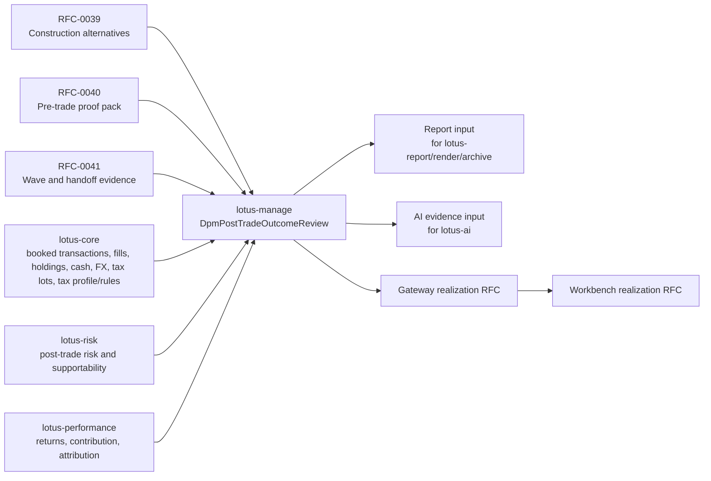

# RFC-0042: Post-Trade Outcome Feedback Loop

| Metadata | Details |
| --- | --- |
| **Status** | DONE - MANAGE BACKEND COMPLETE; FIRST-WAVE PRODUCT REALIZATION COMPLETE; SOURCE-OWNER ENRICHMENT REMAINS |
| **Created** | 2026-05-03 |
| **Gold Tightening Date** | 2026-05-05 |
| **Owner** | `lotus-manage` for outcome-review authority and expected-versus-realized workflow memory |
| **Depends On** | RFC-0017, RFC-0019, RFC-0023, RFC-0036, RFC-0037, RFC-0038, RFC-0039, RFC-0040, RFC-0041 |
| **Source Owners** | `lotus-core`, `lotus-risk`, `lotus-performance`, future execution/OMS owner where execution evidence is required |
| **Downstream Owners** | `lotus-gateway`, `lotus-workbench`, `lotus-report`, `lotus-render`, `lotus-archive`, `lotus-ai` |
| **Tightening Branch** | `docs/rfc0042-gold-standard-tightening` |
| **Future Implementation Branch** | `feat/rfc0042-implementation` unless an active RFC-0042 implementation branch already exists |
| **Slice 0 Source Map** | `docs/rfcs/RFC-0042-source-map-and-gap-analysis.md` |
| **Slice 1 Platform Evidence** | `docs/rfcs/RFC-0042-platform-automation-slice1.md` |
| **Slice 2 Cleanup Evidence** | `docs/rfcs/RFC-0042-cleanup-and-structure-slice2.md` |
| **Slice 3 Domain Evidence** | `docs/rfcs/RFC-0042-domain-model-slice3.md` |
| **Slice 4 Expected Snapshot Evidence** | `docs/rfcs/RFC-0042-expected-snapshot-slice4.md` |
| **Slice 5 Realized Source Evidence** | `docs/rfcs/RFC-0042-realized-source-adapters-slice5.md` |
| **Slice 6 Persistence Evidence** | `docs/rfcs/RFC-0042-persistence-events-slice6.md` |
| **Slice 7 API Evidence** | `docs/rfcs/RFC-0042-api-openapi-slice7.md` |
| **Slice 8 Report/AI Handoff Evidence** | `docs/rfcs/RFC-0042-report-ai-handoffs-slice8.md` |
| **Slice 9 Supportability Evidence** | `docs/rfcs/RFC-0042-supportability-observability-slice9.md` |
| **Slice 10 Gateway/Workbench Evidence** | `docs/rfcs/RFC-0042-gateway-workbench-realization-slice10.md` |
| **Slice 11 Implementation Proof Evidence** | `docs/rfcs/RFC-0042-implementation-proof-slice11.md`; live proof: `output/rfc0042-outcome-proof/20260505-024352/manifest.json` |
| **Slice 12 Hardening Evidence** | `docs/rfcs/RFC-0042-hardening-review-slice12.md`; hardening proof: `output/rfc0042-outcome-proof/20260505-025613/manifest.json` |
| **Slice 13 Final Closure Evidence** | `docs/rfcs/RFC-0042-final-closure-slice13.md` |
| **Doc Location** | `docs/rfcs/RFC-0042-post-trade-outcome-feedback-loop.md` |

---

## 0. Executive Summary

RFC-0042 closes the discretionary portfolio-management feedback loop. It creates a
source-authoritative post-trade outcome review that compares what `lotus-manage` expected before
trade with what actually happened after execution, settlement, risk recalculation, and performance
measurement.

The first implementation target is a `lotus-manage` backend authority for `DpmPostTradeOutcomeReview`.
The review must link back to RFC-0039 construction alternatives, RFC-0040 proof packs, and RFC-0041
waves or operations handoff evidence. It must consume realized evidence from source-owning
applications rather than calculating source truth locally.

RFC-0042 is not complete when a local manage object exists. It is complete only when source lineage,
supportability, persistence, APIs, OpenAPI quality, degraded-state behavior, report/AI evidence
handoffs, live proof, documentation, and downstream realization direction are all implementation
backed. Post-closure WTBD work has since completed the bounded first-wave product path:
`lotus-gateway` composes manage-owned outcome-review truth, `lotus-workbench` renders the
outcome-review surface through Gateway/BFF contracts, report/render/archive materialize governed
outcome-review reports from bounded input, and `lotus-ai` owns guarded narrative execution from
bounded evidence input. PM operating quality preview and immutable score-run lifecycle are now
implemented as a separate Manage-owned, configurable, default-disabled product over source-backed
evidence. Immutable policy-version administration, required bank approval and fairness-review
evidence for enabled policies, optional lotus-core PM-book scope materialization, and bounded
portfolio-memory score-run lineage projection are also implemented for that product.
Execution/OMS integration, client communication, downstream PM quality UI, advanced
cross-segment fairness analytics, and richer source-owner methodology remain outside the supported
claim until their owners implement and prove them.

---

## 1. Critical Review of the Prior Draft

| Area | Prior weakness | Gold-standard correction |
| --- | --- | --- |
| Scope | The draft said "compare expected versus realized outcomes" without defining first-wave boundaries. | This RFC defines source ownership, first-wave support, unsupported states, and promotion rules. |
| Source authority | `lotus-core`, `lotus-risk`, and `lotus-performance` were named but not contractually bounded. | Each source family has an owner, required posture, degraded behavior, and source-gap policy. |
| Execution evidence | Partial fills and slippage were listed as if execution truth already existed. | Execution-quality support is blocked unless `lotus-core` or an execution/OMS owner exposes certified fill/order evidence. |
| PM quality metrics | The draft proposed PM quality and method quality metrics too early. | First-wave outcome review still emits facts and classifications only. PM operating quality is implemented separately as a Manage-owned score-run lifecycle product with scoring disabled by default, explicit bank policy, source refs, decomposed reasons, immutable storage, and prohibited-use boundaries. |
| API quality | Endpoint list lacked supportability, report input, AI input, refresh, and source-check behavior. | API surface now includes certified review, search, supportability, report input, AI evidence input, and source refresh contracts. |
| Persistence | Tables were underspecified and did not cover immutability, hashes, idempotency, or retention. | Persistence now requires immutable review snapshots, append-only events, source hashes, retention, and legal-hold compatibility. |
| Downstream realization | Gateway and Workbench were not explicitly planned. | A dedicated slice creates or tightens Gateway and Workbench RFCs after manage contracts stabilize. |
| Documentation | The draft did not require supported-feature discipline or wiki/product material. | Final closure requires README, wiki, supported-features, RFC, source-map, and context alignment without aspirational claims. |

Implementation must not begin until Slice 0 source-map review confirms which outcome dimensions can
be supported from current source-owner contracts and which must remain blocked or deferred.

---

## 2. Problem Statement

Without a governed post-trade feedback loop:

1. expected drift reduction is not compared with realized drift reduction,
2. expected risk improvement is not reconciled to source-owned post-trade risk,
3. expected return, contribution, and attribution posture is not compared with performance truth,
4. transaction-cost, tax, FX, cash, and liquidity estimates are not checked against booked evidence,
5. partial fills, cancellations, slippage, and execution timing cannot be audited,
6. PMs cannot learn which construction method performed well under specific mandate conditions,
7. CIO teams cannot see whether model-change waves were implemented effectively,
8. audit evidence stops at pre-trade proof and handoff rather than closing the outcome chain,
9. future reports, AI assistance, and demos lack implementation-backed outcome material.

---

## 3. Business Outcomes

RFC-0042 targets these business outcomes:

1. **Close the DPM loop**: connect mandate, construction, proof pack, wave, operations handoff,
   realized source evidence, and outcome review into one traceable chain.
2. **Improve PM accountability**: provide factual expected-versus-realized evidence without manual
   spreadsheet reconciliation.
3. **Improve construction quality**: show which method, constraint, and source-readiness patterns
   produced better realized outcomes.
4. **Improve CIO wave governance**: confirm whether staged model-change or rebalance waves achieved
   intended outcomes across affected portfolios.
5. **Strengthen operations and audit**: expose partial, stale, missing, or conflicting evidence as
   explicit supportability states.
6. **Create product-grade evidence material**: provide report and AI evidence inputs that downstream
   services can consume without recomputing investment truth.
7. **Enable future portfolio memory**: emit outcome events that can later join mandate, proof-pack,
   wave, report, and AI events into a longitudinal portfolio memory.

---

## 4. Goals and Non-Goals

### 4.1 Goals

1. Add `DpmPostTradeOutcomeReview` as the manage-owned outcome-review authority.
2. Compare expected snapshots from RFC-0039/RFC-0040/RFC-0041 with realized source evidence.
3. Preserve source lineage, source hashes, freshness, supportability, and calculation provenance.
4. Persist immutable review snapshots, append-only events, idempotency keys, and retention posture.
5. Expose certified APIs for create, preview/source-check, retrieve, search, refresh, supportability,
   report input, and AI evidence input.
6. Make degraded, blocked, unsupported, stale, partial, and source-conflict states explicit.
7. Produce report input and AI evidence input contracts without generating reports or AI narrative.
8. Create or tighten paired Gateway and Workbench realization RFCs once manage contracts are stable.
9. Capture machine-readable evidence under `output/rfc0042-outcome-proof/<timestamp>/`.
10. Update RFC, source map, README/wiki/support material, supported-features, and context truth at
    closure.

### 4.2 Non-Goals

1. Book trades, create orders, or replace external execution/OMS integration.
2. Calculate authoritative risk, performance, holdings, cash, FX, tax, transaction, or fill truth in
   `lotus-manage`.
3. Generate client reports, rendered documents, archived artifacts, or legal-record output locally.
4. Generate AI memos, AI prompts, PM judgments, or recommendations locally.
5. Rank PMs, score PM quality, or make personnel/performance judgments.
6. Claim Gateway, Workbench, report, archive, or AI support before owning apps implement and prove
   the product surface.
7. Promote automatic external execution feedback unless a certified source-owner contract exists.

---

## 5. Architecture Direction

Ownership rules:

1. `lotus-manage` owns the expected-versus-realized review, review state machine, workflow memory,
   supportability roll-up, and evidence handoff contracts.
2. `lotus-core` owns booked transactions, holdings, cash movements, FX executions, tax lots, future
   client tax profile/rule products, source readiness, and any fill or transaction-window source
   products it exposes.
3. `lotus-risk` owns risk, stress, concentration, drawdown, and risk supportability calculations.
4. `lotus-performance` owns returns, contribution, attribution, benchmark-relative context, and
   performance supportability calculations.
5. External execution, order state, broker acknowledgements, or OMS reconciliation belong to a
   future execution/OMS owner unless already certified through `lotus-core`.
6. `lotus-gateway` composes backend truth for product clients and must not reconstruct outcome
   state.
7. `lotus-workbench` consumes Gateway/BFF routes only and must not call manage directly.

---

## 6. Work-To-Be-Done Ledger Intake

RFC-0042 deliberately pulls in some ledger items and leaves others outside the first implementation
boundary.

| Ledger source | RFC-0042 treatment | Boundary |
| --- | --- | --- |
| `RFC37-WTBD-001` complete post-trade outcome loop | Included as the governing feature scope. | Requires source-owner contracts and live reconciliation proof. |
| `RFC37-WTBD-007` portfolio memory | Partially included through outcome events and review lineage. | Full portfolio memory across all events remains a later cross-app capability. |
| `RFC40-WTBD-010` decision timeline and portfolio memory | Included only where outcome reviews attach to proof-pack and decision timeline references. | Full timeline UI and cross-app memory remain downstream/future. |
| `RFC41-WTBD-004` risk/performance enrichment | Included only through source-owned `lotus-risk` and `lotus-performance` evidence. | Missing analytics must be implemented in owning apps or marked unsupported. |
| `RFC41-WTBD-005` Gateway wave composition | Not implemented in manage. | RFC-0042 must create/tighten Gateway outcome-realization RFC direction. |
| `RFC41-WTBD-006` Workbench wave command center | Not implemented in manage. | RFC-0042 must create/tighten Workbench outcome-realization RFC direction. |
| `RFC41-WTBD-008` report materialization | Only report input contract is included. | Rendering and archive lifecycle remain `lotus-report`, `lotus-render`, and `lotus-archive`. |
| `RFC41-WTBD-009` AI PM memo generation | Only bounded AI evidence input is included. | AI workflow packs, prompts, guardrails, and generated narrative remain RFC-0043/`lotus-ai`. |
| `RFC41-WTBD-010` external execution integration | Treated as a source dependency, not a manage feature. | External execution support requires an owner, contract, controls, and separate proof. |

---

## 7. Source Map and Gap Policy

The detailed source map lives in `docs/rfcs/RFC-0042-source-map-and-gap-analysis.md`. The policy is:

1. no outcome dimension may be `READY` unless every mandatory expected and realized source is
   present, fresh enough, lineage-backed, and tested,
2. missing source-owner capability must be implemented in the owning app or represented as
   `BLOCKED`, `DEGRADED`, or `NOT_SUPPORTED`,
3. `lotus-manage` must not clone risk, performance, tax-lot, fill, cash, holdings, or attribution
   methodology,
4. realized source data must include source refs, source timestamps, freshness posture, and
   supportability,
5. source conflicts must be visible and must not be hidden by best-effort roll-ups,
6. every source adapter must have successful, missing, stale, unavailable, partial, and malformed
   evidence tests,
7. live canonical proof must use source-owner responses, not fixtures, for any supported claim.

| Source family | Owning app | First-wave role | Gap behavior |
| --- | --- | --- | --- |
| Expected construction alternative | `lotus-manage` RFC-0039 | Required | Block create if no selected alternative lineage exists. |
| Expected proof pack | `lotus-manage` RFC-0040 | Required for proof-pack-linked reviews | Allow diagnostic preview only if absent; no supported proof-pack outcome claim. |
| Wave and handoff evidence | `lotus-manage` RFC-0041 | Required for wave outcome reviews | Block wave review if wave state or handoff lineage is inconsistent. |
| Booked transactions, holdings, cash, FX, tax | `lotus-core` | Required for matching outcome dimensions | Mark specific dimensions `BLOCKED` or `NOT_SUPPORTED` if unavailable. |
| Fill/order/execution quality | `lotus-core` or future execution owner | Required only for `EXECUTION_QUALITY` support | `EXECUTION_EVIDENCE_BLOCKED` until certified source exists. |
| Post-trade risk | `lotus-risk` | Required for `RISK_OUTCOME` | `RISK_SOURCE_UNAVAILABLE` or `RISK_OUTCOME_NOT_SUPPORTED`. |
| Returns, contribution, attribution | `lotus-performance` | Required for `PERFORMANCE_OUTCOME` | `PERFORMANCE_SOURCE_UNAVAILABLE` or `PERFORMANCE_OUTCOME_NOT_SUPPORTED`. |
| Report materialization | `lotus-report`, `lotus-render`, `lotus-archive` | Downstream only | Manage emits input; no report output claim. |
| AI narrative | `lotus-ai` | Downstream only | Manage emits evidence input; no AI output claim. |
| Product UI | `lotus-gateway`, `lotus-workbench` | Downstream only | No UI support claim until downstream RFCs are complete. |

---

## 8. First-Wave Support Boundary

First-wave RFC-0042 support is limited to explicitly requested outcome reviews tied to
implementation-backed source evidence. Automatic portfolio cohort discovery, external execution,
PM scoring, AI narrative, and front-office UI realization remain outside the manage backend support
claim.

Supported review anchors:

1. selected RFC-0039 construction alternative,
2. RFC-0040 proof pack,
3. RFC-0041 wave item or operations handoff record,
4. explicit review window with start and end semantics,
5. source-authoritative realized evidence from owning apps.

Outcome dimension states:

1. `READY`: source evidence is complete and the realized value is within or better than tolerance.
2. `PENDING_REVIEW`: source evidence is complete but variance exceeds soft tolerance or needs PM
   explanation.
3. `BREACHED`: source evidence is complete and hard tolerance is breached.
4. `DEGRADED`: non-critical source evidence is missing, stale, partial, or unavailable.
5. `BLOCKED`: mandatory source evidence is missing, conflicting, or invalid.
6. `NOT_SUPPORTED`: no certified source-owner contract exists for the dimension.

Reason codes must include at least:

1. `DRIFT_REDUCTION_ACHIEVED`
2. `DRIFT_REDUCTION_SHORTFALL`
3. `RISK_REDUCTION_ACHIEVED`
4. `RISK_INCREASED`
5. `PERFORMANCE_BELOW_EXPECTATION`
6. `COST_ABOVE_ESTIMATE`
7. `TAX_ABOVE_BUDGET`
8. `SLIPPAGE_ABOVE_TOLERANCE`
9. `PARTIAL_FILL_IMPACT`
10. `FX_RESIDUAL_VARIANCE`
11. `CASH_RESIDUAL_OUT_OF_BAND`
12. `RULE_OUTCOME_BREACHED`
13. `SOURCE_EVIDENCE_INCOMPLETE`
14. `EXECUTION_EVIDENCE_BLOCKED`
15. `RISK_OUTCOME_NOT_SUPPORTED`
16. `PERFORMANCE_OUTCOME_NOT_SUPPORTED`

---

## 9. Domain Models

### 9.1 DpmPostTradeOutcomeReview

Required fields:

1. `outcome_review_id`
2. `outcome_review_version`
3. `state`
4. `portfolio_id`
5. `mandate_id`
6. `rebalance_run_id`
7. `alternative_set_id`
8. `selected_alternative_id`
9. `proof_pack_id`
10. `wave_id`
11. `wave_item_id`
12. `operations_handoff_ref_id`
13. `execution_evidence_ref`
14. `review_window`
15. `expected_snapshot`
16. `realized_snapshot`
17. `dimension_results`
18. `overall_outcome`
19. `variance_summary`
20. `supportability`
21. `source_lineage`
22. `source_hashes`
23. `section_hashes`
24. `events`
25. `report_input_ref`
26. `ai_evidence_ref`
27. `retention_policy`
28. `legal_hold_state`
29. `created_at`
30. `created_by`
31. `correlation_id`
32. `idempotency_key`

### 9.2 DpmOutcomeDimensionResult

Required fields:

1. `dimension`
2. `state`
3. `reason_code`
4. `expected`
5. `realized`
6. `variance`
7. `tolerance`
8. `materiality`
9. `explanation`
10. `source_refs`
11. `source_freshness`
12. `supportability`
13. `calculation_trace`

### 9.3 DpmExecutionQualitySummary

Required fields:

1. `expected_trade_count`
2. `executed_trade_count`
3. `cancelled_trade_count`
4. `partial_fill_count`
5. `unfilled_trade_count`
6. `estimated_cost_base`
7. `realized_cost_base`
8. `estimated_tax_base`
9. `realized_tax_base`
10. `slippage_base`
11. `residual_cash_base`
12. `execution_source_state`
13. `source_refs`

### 9.4 DpmOutcomeEvent

Outcome reviews must emit append-only events suitable for future portfolio memory:

1. `OUTCOME_REVIEW_CREATED`
2. `OUTCOME_REVIEW_SOURCE_REFRESHED`
3. `OUTCOME_REVIEW_DEGRADED`
4. `OUTCOME_REVIEW_BLOCKED`
5. `OUTCOME_REVIEW_READY`
6. `OUTCOME_REVIEW_PM_EXPLANATION_ADDED`
7. `OUTCOME_REVIEW_REPORT_INPUT_CREATED`
8. `OUTCOME_REVIEW_AI_EVIDENCE_INPUT_CREATED`

---

## 10. API Surface

Every endpoint must be certified against the Lotus API certification pattern and OpenAPI quality
rules. Swagger must state what the endpoint is for, when to use it, how to call it, example
requests/responses, error responses, and every attribute description/type/example.

| Endpoint | Purpose |
| --- | --- |
| `POST /api/v1/rebalance/outcome-reviews/preview` | Validate expected and realized source availability before durable review creation. |
| `POST /api/v1/rebalance/outcome-reviews` | Create an immutable outcome review with idempotency and source lineage. |
| `GET /api/v1/rebalance/outcome-reviews/{outcome_review_id}` | Retrieve the full review. |
| `GET /api/v1/rebalance/outcome-reviews` | Search reviews by portfolio, mandate, wave, run, state, reason code, and date window. |
| `GET /api/v1/rebalance/runs/{rebalance_run_id}/outcome-review` | Find the review for a run when one exists. |
| `GET /api/v1/rebalance/waves/{wave_id}/outcome-reviews` | Retrieve outcome reviews associated with a wave. |
| `POST /api/v1/rebalance/outcome-reviews/{outcome_review_id}/refresh-sources` | Re-evaluate realized source evidence and append a source-refresh event. |
| `GET /api/v1/rebalance/outcome-reviews/{outcome_review_id}/supportability` | Retrieve operator-safe source, state, freshness, and degraded diagnostics. |
| `GET /api/v1/rebalance/outcome-reviews/{outcome_review_id}/report-input` | Return bounded report input for downstream report/render/archive services. |
| `GET /api/v1/rebalance/outcome-reviews/{outcome_review_id}/ai-evidence-input` | Return bounded, provenance-rich AI evidence input for RFC-0043/`lotus-ai`. |

API guardrails:

1. create and refresh must be idempotent,
2. preview must not persist durable review state,
3. supportability must not expose sensitive client data or raw upstream payloads,
4. report and AI input endpoints must not generate downstream artifacts,
5. search must be bounded and indexed,
6. source-unavailable responses must be structured and test-covered,
7. no endpoint may return a supported state for an unsupported source dimension.

---

## 11. Persistence

The implementation must provide immutable review storage and queryable operational metadata.

Required storage:

1. `dpm_outcome_reviews` for immutable review body, state, hashes, lineage, review window, and
   searchable columns,
2. `dpm_outcome_review_events` for append-only lifecycle and source-refresh events,
3. `dpm_outcome_review_idempotency` for create/refresh idempotency replay,
4. generated or indexed columns for `portfolio_id`, `mandate_id`, `rebalance_run_id`, `wave_id`,
   `wave_item_id`, `proof_pack_id`, `state`, `review_window_end`, `created_at`, and supportability
   state,
5. section/source hashes for expected snapshot, realized snapshot, dimension results, report input,
   and AI evidence input,
6. retention metadata and legal-hold compatibility.

Retention:

1. selected/approved rebalance outcomes: 7 years minimum,
2. diagnostic previews: not persisted as durable reviews,
3. diagnostic-only created reviews not tied to execution: 3 years unless legal hold applies,
4. archive handoff must remain compatible with future `lotus-archive` policy.

---

## 12. Implementation Slices

Work must proceed slice by slice. Do not move to the next slice until the current slice is
implemented, validated, reviewed, documented, and in a solid state.

### Slice 0 - Source Map, Boundary, and Critical Review

1. complete `docs/rfcs/RFC-0042-source-map-and-gap-analysis.md`,
2. classify every source family as supported, source-owner required, blocked, or not supported,
3. map work-to-be-done ledger items into RFC-0042 or out of scope,
4. define review-window semantics,
5. define first-wave outcome dimensions and blocked dimensions,
6. record no supported-feature promotion because implementation has not started.

Acceptance:

1. source map is reviewed and linked from this RFC,
2. unsupported claims are removed,
3. tests pin the source-map and no-claim boundary.

### Slice 1 - Platform Automation and Scaffolding Improvement

1. identify gaps in `lotus-platform` automation that should be scaffolded by default,
2. improve platform/app scaffolding for API certification pattern, Swagger quality, observability,
   health/readiness, structured logging, error handling, test scaffolding, CI defaults,
   documentation scaffolding, and governance hooks where gaps are real,
3. add reusable docs/test examples for source-degraded reconciliation APIs if platform lacks them,
4. record a no-change decision if platform automation is already sufficient.

Acceptance:

1. platform improvements are merged or a documented no-change decision exists,
2. future apps benefit from any cross-cutting fix,
3. local manage code does not carry a platform concern that belongs in scaffolding.

Slice 1 evidence:

`docs/rfcs/RFC-0042-platform-automation-slice1.md`

### Slice 2 - Cleanup and Structure

1. remove dead or misleading post-trade, execution, proof, or outcome-adjacent code,
2. separate pure comparison logic, source adapters, persistence, API presentation, supportability,
   and handoff contracts,
3. reduce documentation sprawl by keeping long-lived product and operator material in wiki and
   detailed execution evidence in RFC/source-map docs,
4. ensure no duplicate or stale supported-feature text exists.

Acceptance:

1. code and docs are simpler than before,
2. no cosmetic-only cleanup is counted as slice completion,
3. docs tests guard current truth.

Slice 2 evidence:

`docs/rfcs/RFC-0042-cleanup-and-structure-slice2.md`

### Slice 3 - Domain Model and Pure Comparison Engine

1. implement typed outcome-review domain models,
2. implement deterministic expected-versus-realized comparison from provided source snapshots,
3. implement tolerance, materiality, state, and reason-code logic,
4. implement supportability roll-up without source clients or persistence coupling,
5. add high-value unit tests for all dimensions and edge cases.

Acceptance:

1. pure tests prove variance and classification behavior,
2. unsupported dimensions cannot become `READY`,
3. PM scoring or AI judgment is absent.

Slice 3 evidence:

`docs/rfcs/RFC-0042-domain-model-slice3.md`

### Slice 4 - Expected Snapshot Assembly

1. assemble expected snapshots from RFC-0039 selected alternatives,
2. attach RFC-0040 proof-pack source lineage and section hashes,
3. attach RFC-0041 wave item and handoff refs when applicable,
4. reject inconsistent run/portfolio/mandate/proof/wave linkages,
5. preserve source refs and supportability from upstream manage artifacts.

Acceptance:

1. integration tests cover selected alternative, proof pack, wave item, and handoff combinations,
2. missing or mismatched expected evidence blocks durable creation,
3. no expected value is silently defaulted.

Slice 4 evidence:

`docs/rfcs/RFC-0042-expected-snapshot-slice4.md`

### Slice 5 - Realized Source Adapters and Degraded Source Handling

1. consume booked transactions, holdings, cash, FX, tax, and fill evidence from `lotus-core` or
   execution-owner contracts where available,
2. consume risk evidence from `lotus-risk` only through certified owner contracts,
3. consume performance evidence from `lotus-performance` only through certified owner contracts,
4. implement missing source-owner capabilities in the owning app when a dimension is required for
   support,
5. represent missing, stale, unavailable, partial, malformed, and conflicting sources explicitly.

Acceptance:

1. adapter tests cover ready and degraded paths,
2. source-owner contract tests exist for any upstream change,
3. manage does not duplicate source-owner calculations,
4. `EXECUTION_EVIDENCE_BLOCKED` is emitted where execution truth is unavailable.

Slice 5 evidence:

`docs/rfcs/RFC-0042-realized-source-adapters-slice5.md`

### Slice 6 - Persistence, Repository, Events, and Retention

1. add migrations and repositories,
2. persist immutable review JSON and queryable metadata,
3. persist append-only outcome events,
4. implement idempotency replay,
5. implement retention and legal-hold metadata,
6. add repository tests for create, replay, retrieve, search, refresh, and event order.

Acceptance:

1. Postgres-backed tests cover persistence behavior,
2. hashes and lineage are stable,
3. review history is auditable.

Slice 6 evidence:

`docs/rfcs/RFC-0042-persistence-events-slice6.md`

### Slice 7 - Certified Manage APIs and OpenAPI Quality

1. implement the API surface in Section 10,
2. certify each endpoint using the Lotus endpoint certification loop,
3. add OpenAPI examples for success, degraded, blocked, unsupported, not found, validation, and
   idempotency replay cases,
4. ensure every request/response/error attribute has description, type, and example,
5. update endpoint certification wiki/source docs.

Acceptance:

1. API, integration, and OpenAPI tests pass,
2. no alias, undocumented route, or unsupported endpoint exists,
3. Swagger is useful to developers, operators, demos, and downstream teams.

Slice 7 evidence:

`docs/rfcs/RFC-0042-api-openapi-slice7.md`

### Slice 8 - Report Input and AI Evidence Input Handoffs

1. create `DpmOutcomeReportInput` with bounded report-ready facts,
2. create `DpmOutcomeAiEvidenceInput` with provenance, source hashes, forbidden-field posture, and
   unsupported-action posture,
3. add guardrail tests proving manage does not generate reports, rendered artifacts, archived
   records, AI prompts, or AI narrative,
4. document downstream owner expectations.

Acceptance:

1. report and AI inputs are deterministic and hash-linked,
2. no report/AI product claim is made in manage,
3. RFC-0043 can consume AI evidence without re-sourcing outcome truth.

Slice 8 evidence:

`docs/rfcs/RFC-0042-report-ai-handoffs-slice8.md`

### Slice 9 - Supportability, Observability, and Operator Diagnostics

1. add bounded metrics for review creation, states, degraded sources, blocked dimensions, and source
   refresh outcomes,
2. add structured logs with correlation ids and no sensitive raw payloads,
3. expose operator-safe supportability diagnostics,
4. update health/readiness posture if new dependencies require it,
5. add degraded-state tests for source outages and partial evidence.

Acceptance:

1. diagnostics identify source owner and dimension without leaking sensitive data,
2. metrics are bounded and product-safe,
3. operators can distinguish source gaps from manage defects.

Slice 9 evidence:

`docs/rfcs/RFC-0042-supportability-observability-slice9.md`

### Slice 10 - Gateway and Workbench Realization RFC Slice

After manage contracts and live proof are stable, create or tighten downstream RFCs:

1. `lotus-gateway` RFC/addendum for outcome-review composition,
2. `lotus-workbench` RFC/addendum for post-trade outcome review surfaces,
3. route and payload strategy that preserves manage outcome truth and source supportability,
4. Workbench UX boundaries for review list, review detail, source-degraded states, PM explanation,
   proof-pack/wave links, report/AI posture, and operator diagnostics,
5. canonical front-office validation plan using `PB_SG_GLOBAL_BAL_001` where demo-ready proof is
   required.

Acceptance:

1. downstream RFCs exist before Gateway/Workbench implementation starts,
2. no product-surface support is claimed from manage-only proof,
3. Gateway and Workbench docs state that UI must consume Gateway/BFF only.

Slice 10 evidence:

`docs/rfcs/RFC-0042-gateway-workbench-realization-slice10.md`

### Slice 11 - Implementation Proof

1. prove one or more outcome reviews end to end against live canonical source evidence,
2. capture machine-readable evidence under `output/rfc0042-outcome-proof/<timestamp>/`,
3. include create request/response, retrieved review, search result, supportability response,
   report input, AI evidence input, OpenAPI certification summary, source responses or source refs,
   and critical review notes,
4. review each expected value, realized value, variance, tolerance, state, source ref, and degraded
   reason critically,
5. fix gaps found during evidence review before proceeding.

Acceptance:

1. evidence proves implemented behavior rather than fixture-only behavior,
2. every supported dimension reconciles to source-owner truth,
3. degraded examples are present and clear.

Slice 11 evidence:

`docs/rfcs/RFC-0042-implementation-proof-slice11.md`

Live proof output:

`output/rfc0042-outcome-proof/20260505-024352/`

### Slice 12 - Second-Last Hardening and Review

1. perform a proper code review of the full implementation,
2. remove dead code and reduce coupling discovered during review,
3. verify API certification pattern compliance,
4. verify platform governance and enterprise data-mesh standards,
5. verify Swagger completeness and examples,
6. verify error handling, idempotency, retention, source-refresh, and degraded-state tests,
7. run local and GitHub checks and fix failures promptly.

Acceptance:

1. review findings are closed or explicitly documented with owner and reason,
2. tests are high-value and not superficial,
3. API and OpenAPI posture is production-grade.

Slice 12 evidence:

`docs/rfcs/RFC-0042-hardening-review-slice12.md`

Hardening proof output:

`output/rfc0042-outcome-proof/20260505-025613/`

### Slice 13 - Final Closure

1. update this RFC with final gold-pass assessment,
2. update source-map evidence and implementation proof links,
3. update README, wiki, supported-features, endpoint certification, and repository context,
4. publish wiki after merge using governed wiki synchronization,
5. consciously review whether skills, guidance, documentation, or agent context need changes,
6. record explicit no-change decisions where appropriate,
7. ensure branch hygiene, PR merge, CI, wiki publication, and cleanup are complete.

Acceptance:

1. supported-features list contains only implementation-backed claims,
2. wiki is useful for developers, business users, operations, sales/pre-sales, client demos, and
   engineering,
3. all PRs are merged or explicitly linked as downstream pending work,
4. the repository is clean before moving to RFC-0043.

Slice 13 evidence:

`docs/rfcs/RFC-0042-final-closure-slice13.md`

---

## 13. Testing and Evidence Requirements

Required tests:

1. pure variance and tolerance calculations,
2. dimension state and reason-code classification,
3. selected-alternative/proof-pack/wave/handoff expected snapshot assembly,
4. source adapters for success, missing, stale, unavailable, partial, malformed, and conflicting
   responses,
5. unsupported source dimensions,
6. repository persistence, idempotency, hashes, events, retention, and search,
7. API behavior and error contracts,
8. OpenAPI/Swagger contract quality,
9. report input and AI evidence input guardrails,
10. supportability, metrics, logs, and no-sensitive-telemetry behavior,
11. live canonical evidence for supported dimensions,
12. Gateway/Workbench RFC guardrail tests if docs are added in downstream repositories.

Evidence root:

`output/rfc0042-outcome-proof/<timestamp>/`

Required evidence files at closure:

1. `manifest.json`
2. `source-map-review.json`
3. `create-request.json`
4. `create-response.json`
5. `retrieved-review.json`
6. `search-response.json`
7. `supportability-response.json`
8. `report-input.json`
9. `ai-evidence-input.json`
10. `source-lineage.json`
11. `variance-worked-example.json`
12. `degraded-source-example.json`
13. `openapi-certification.json`
14. `critical-review.json`
15. `test-summary.json`

---

## 14. API Certification and Swagger Quality Standard

Every RFC-0042 endpoint must satisfy:

1. route is grouped under the correct rebalance/outcome API tag,
2. summary states what the endpoint does,
3. description states when to use it and how it participates in the DPM workflow,
4. request model has complete descriptions, types, examples, constraints, and validation errors,
5. response model has complete descriptions, types, examples, supportability fields, and source
   lineage fields,
6. error model includes validation, not found, conflict, blocked source, unsupported dimension,
   upstream unavailable, stale source, and idempotency replay cases,
7. examples are realistic and source-authoritative,
8. OpenAPI snapshot and API vocabulary governance pass,
9. endpoint certification wiki/source docs are updated,
10. no route alias or undocumented compatibility path is added.

---

## 15. Supported-Features Ledger

Support below includes the manage backend authority plus the bounded first-wave product realization
that has been implemented and proven in the owning repositories. PM operating quality policy
administration and score-run lifecycle are supported as a separate Manage-owned product;
score-run PM-book materialization through lotus-core `PortfolioManagerBookMembership:v1` is
supported when explicitly requested, and bounded portfolio-memory score-run lineage is supported
for persisted source-backed PM-book members. Execution/OMS integration, client communication,
downstream PM quality UI, advanced cross-segment fairness analytics, and richer source-owner
methodology remain outside the support claim.

| Feature | Current state | Promotion rule |
| --- | --- | --- |
| Outcome review creation | Supported as manage backend authority | Durable source-backed create/retrieve/search APIs are certified and live-proven. |
| Expected-versus-realized variance decomposition | Supported for source-backed supplied dimensions | Supported where expected and realized evidence reconcile with lineage, hashes, and tests. |
| Source-degraded outcome review | Supported as explicit state behavior | Degraded, blocked, unsupported, stale, partial, malformed, conflicting, and execution-evidence-blocked states are tested and documented. |
| Searchable outcome memory | Supported as manage backend memory | Immutable persistence, events, source hashes, run lookup, wave lookup, and indexed search are proven. |
| Report input from outcome review | Supported as manage handoff contract plus first-wave materialization path | Manage emits bounded report input; `lotus-report`, `lotus-render`, and `lotus-archive` own generated report and archive lifecycle without recomputing outcome truth. |
| AI evidence input from outcome review | Supported as bounded evidence contract plus governed narrative path | Manage emits bounded AI evidence input; `lotus-ai` owns guarded workflow-pack narrative execution. No recommendation, PM scoring, or client-contact support is claimed. |
| Gateway outcome composition | Supported through `lotus-gateway` PR #186/#187/#188/#189 | Gateway composes manage outcome-review truth and report/AI handoff posture without recomputing expected values, realized values, variance, tolerance, lineage, freshness, or review state. |
| Workbench outcome review UX | Supported through `lotus-workbench` PR #146/#147/#148 | Workbench consumes Gateway/BFF contracts only and renders the first-wave outcome-review, report-request, and AI-narrative request posture with canonical proof. |
| PM operating quality policy and score-run lifecycle | Supported as separate Manage-owned first-wave product | `PUT /api/v1/rebalance/pm-operating-quality/policies/{policy_id}/versions/{policy_version}`, `GET /policies`, and `GET /policies/{policy_id}/versions/{policy_version}` administer immutable policy versions; `POST /score-runs/preview` emits `PmOperatingQualityScoreRun:v1`; `POST /score-runs`, `GET /score-runs`, and `GET /score-runs/{score_run_id}` persist and retrieve immutable score-run evidence. Enabled policies require bank approval and fairness-review evidence; score-run preview/create emits `governance_evidence` and fails closed for missing approval, invalid/expired expiry, unauthorized actors, and missing scoring evidence. Optional `pm_book_scope` materializes source-owned lotus-core `PortfolioManagerBookMembership:v1` scope evidence and fails closed for unavailable, incomplete, degraded, or empty PM-book membership. Scoring is disabled by default, and HR, compensation, conduct-enforcement, autonomous-ranking, AI-generated scoring, and source-owner methodology claims are prohibited. |
| External execution integration | Not supported | Requires execution/OMS owner, certified contract, controls, and proof. |

---

## 16. Documentation, Wiki, and Product Material Requirements

Documentation is part of the product. Closure must update:

1. this RFC with implementation evidence and final gold-pass assessment,
2. `docs/rfcs/RFC-0042-source-map-and-gap-analysis.md`,
3. `docs/rfcs/README.md`,
4. README and repository engineering context if commands, dependencies, or supported behavior change,
5. `wiki/RFC-Index.md`,
6. `wiki/Roadmap.md`,
7. `wiki/Supported-Features.md` only for implementation-backed support,
8. endpoint certification and API examples,
9. downstream Gateway/Workbench RFCs and wiki pages when product realization work begins.

The wiki must remain useful to developers, business users, operations, sales/pre-sales, client
demos, and engineering. It should explain feature coverage, upstream/downstream integrations,
business flows, non-functional posture, architecture, operational behavior, and diagrams where they
improve understanding.

---

## 17. Risks and Controls

| Risk | Control |
| --- | --- |
| Manage fabricates realized truth | Enforce source-owner adapters and tests; no local methodology clone. |
| Execution-quality claims lack fill/order evidence | Emit `EXECUTION_EVIDENCE_BLOCKED` until certified source exists. |
| PM scoring is inferred from outcome facts | Keep outcome reviews factual. PM operating quality is only available through the separate explicit policy administration and score-run preview/create/read/list routes with bank policy, source evidence, non-use posture, immutable storage, and bounded portfolio-memory score-run lineage that omits raw score payloads and portfolio-level rankings. |
| Source outages look like manage defects | Expose operator-safe supportability and source-owner diagnostics. |
| UI claims outrun backend truth | Require Gateway/Workbench RFCs, implementation, and canonical proof before promotion. |
| Report/AI claims outrun handoff contracts | Manage emits only bounded inputs; owning apps generate artifacts/narratives. |
| OpenAPI is too thin for downstream consumers | Enforce endpoint certification and examples for every field and error case. |
| Documentation becomes aspirational | Supported-features promotion requires implementation-backed proof and wiki publication. |

---

## 18. Definition of Done

RFC-0042 is done only when:

1. all slices are completed in order,
2. source-owner dependencies are implemented or explicitly represented as blocked/not supported,
3. outcome reviews are durable, immutable, searchable, source-backed, and idempotent,
4. every supported dimension has expected and realized evidence with lineage and hashes,
5. APIs and Swagger/OpenAPI are certified,
6. report input and AI evidence input are bounded and guardrailed,
7. supportability, metrics, logs, retention, and diagnostics are production-ready,
8. local and GitHub CI gates are green,
9. live canonical evidence is captured and critically reviewed,
10. downstream Gateway and Workbench RFCs exist or are explicitly tightened for realization,
11. README/wiki/supported-features/context truth is updated,
12. final gold-pass assessment is written,
13. PRs are merged, wiki is published, and branches are clean.

---

## 19. Final Gold-Pass Assessment

RFC-0042 reached `DONE - MANAGE BACKEND COMPLETE; FIRST-WAVE PRODUCT REALIZATION COMPLETE; SOURCE-OWNER ENRICHMENT REMAINS`.

Truly completed:

1. source-map and work-to-be-done ledger intake with explicit source-owner boundaries,
2. platform-scaffold evidence and cleanup/structure documentation,
3. pure expected-versus-realized comparison domain with bounded state/reason behavior,
4. expected snapshot assembly from RFC-0039/RFC-0040/RFC-0041 manage artifacts,
5. realized source adapter posture for ready, degraded, blocked, unavailable, malformed,
   conflicting, unsupported, and execution-evidence-blocked states,
6. immutable in-memory and Postgres outcome-review persistence with retention metadata, events,
   source refs, hashes, search, run lookup, and wave lookup,
7. certified manage APIs for preview, create, retrieve, search, source refresh, supportability,
   report input, AI evidence input, run lookup, and wave lookup,
8. deterministic `DpmOutcomeReportInput` and `DpmOutcomeAiEvidenceInput` handoff contracts,
9. supportability logs, metrics, dashboard/alert contract posture, and operator diagnostics,
10. downstream Gateway and Workbench RFC-0098 realization alignment,
11. live manage proof and hardening proof under `output/rfc0042-outcome-proof/`.

Quality improvements made:

1. live proof found and fixed stale canonical runtime restart handling in
   `scripts/Start-CanonicalManage.ps1`,
2. live proof found and fixed missing What/When/How OpenAPI guidance on outcome-review GET routes,
3. generated proof payloads now use true SHA-256 source and section hashes,
4. same-key changed-evidence idempotency now raises `DPM_OUTCOME_REVIEW_IDEMPOTENCY_CONFLICT`,
5. search `state` is validated as `OutcomeReviewState`,
6. misleading `_placeholder_ref` handoff naming was removed,
7. documentation guard tests now pin RFC, wiki, roadmap, supported-feature, and evidence truth.

Debt removed:

1. no manage-local clone of risk, performance, execution, tax, FX, cash, report, archive, or AI
   authority was introduced,
2. stale restart behavior was removed from canonical manage startup,
3. misleading handoff naming was removed,
4. invalid state filters no longer degrade silently to empty results.

Proof:

1. live proof: `output/rfc0042-outcome-proof/20260505-024352/critical-review.json` => `passed`,
2. hardening proof: `output/rfc0042-outcome-proof/20260505-025613/critical-review.json` =>
   `passed`,
3. post-merge audit proof:
   `output/rfc0042-outcome-proof/20260505-040212/critical-review.json` => `passed`,
4. targeted RFC-0042 API/domain/observability gate: `73 passed`,
5. documentation/current-state guard: `13 passed`,
6. OpenAPI certification matrix: `80 passed`,
7. OpenAPI quality gate, API vocabulary inventory, no-alias guard, Ruff, and diff whitespace gates
   passed during closure.

Post-merge gold-pass audit addendum:

1. The cross-RFC work-to-be-done ledger was found missing from `main`, restored from historical
   commit `b3ba7bf`, extended with RFC-0042 remaining-work ownership, and pinned by
   `tests/unit/test_documentation_current_state.py`.
2. Current manage live proof was rerun on 2026-05-05 at
   `output/rfc0042-outcome-proof/20260505-040212/`; the critical review passed and revalidated
   preview/create/retrieve/search, idempotency replay/conflict, supportability, report input,
   AI-evidence input, source lineage, degraded-source example, refresh eventing, run lookup, wave
   lookup, and OpenAPI coverage.
3. Canonical front-office validation was run through `lotus-workbench` using
   `npm run live:stack:up` and `npm run live:validate`; after stale manage action-register evidence
   was refreshed, validation passed for `PB_SG_GLOBAL_BAL_001` with screenshots under
   `lotus-workbench/output/playwright/live-canonical`.
4. The later WTBD audit and downstream owning-repo implementations promote only the bounded
   first-wave outcome-review product path. Gateway, Workbench, report/render/archive, and AI remain
   consumers or owning downstream artifact services; manage remains the outcome-review evidence
   authority.

Remaining outside the support claim:

1. execution/OMS integration and acknowledgements require a future execution owner,
2. PM operating quality now has a bounded Manage-owned policy administration, score-run preview, and lifecycle product with explicit
   bank enablement, governance approval, fairness-review evidence, source-backed evidence, no-use
   posture for HR/compensation/conduct/autonomous ranking, decomposed reasons, source refs,
   deterministic hashes, immutable storage, read/list retrieval, optional source-owned lotus-core
   PM-book scope materialization, and bounded portfolio-memory score-run lineage projection;
   downstream UI and advanced cross-segment fairness analytics remain future expansion,
3. client communication execution remains future downstream scope,
4. automatic source-owner calculation beyond implemented source-emitted measures and
   source-owner risk/performance/tax/FX/cash methodologies remain outside manage support.

Gold-standard conclusion:

RFC-0042 genuinely reached the expected enterprise standard for the manage-owned backend outcome
review authority and the bounded first-wave outcome-review product path. The implementation-backed
path now covers Gateway composition, Workbench outcome-review UX, outcome-review report
materialization, archive lifecycle, and governed AI narrative request flow while preserving manage
as the evidence authority. Execution/OMS integration, client communication, downstream PM quality
UI, advanced cross-segment fairness analytics, and richer source-owner methodology remain explicit
future scope, not hidden gaps in the supported path. PM operating quality first-wave policy
administration, preview, score-run lifecycle, optional source-owned PM-book scope materialization,
and bounded portfolio-memory score-run lineage projection are now owned by `lotus-manage` and
implementation-backed with strict policy, governance, evidence, storage, and non-use boundaries.

---

## 20. Post-Closure WTBD Integration Audit

The 2026-05-09 WTBD audit moved completed RFC42 work back into this owning RFC so durable product
truth is not stranded only in the WTBD ledger or wiki.

| WTBD | Integrated result | Current boundary |
| --- | --- | --- |
| RFC42-WTBD-001 | `lotus-gateway` PR #186 implements Gateway outcome-review composition over manage APIs without recomputation. | Gateway remains a composition layer and does not own outcome-review calculations or source truth. |
| RFC42-WTBD-002 | `lotus-workbench` PR #146 implements the post-trade outcome-review UX through Gateway/BFF contracts and live canonical proof. | Workbench does not call manage directly or synthesize source lineage, variance, report input, AI evidence, or review state. |
| RFC42-WTBD-003 | `lotus-gateway` PR #187, `lotus-workbench` PR #146, `lotus-platform` PR #300, and `lotus-core` PR #336 complete the first-wave front-office product path. | Reporting, AI, OMS, source-owner methodology, and PM operating quality scoring remain separately owned where not listed below. |
| RFC42-WTBD-004 | `lotus-render` PR #9, `lotus-archive` PR #21, `lotus-report` PR #88, `lotus-gateway` PR #188, and `lotus-workbench` PR #147 implement rendered outcome reports and archive lifecycle from bounded manage report input. | Report/render/archive own generated artifact lifecycle; manage remains report-input and evidence authority. |
| RFC42-WTBD-005 | `lotus-ai` PR #59/#60, `lotus-gateway` PR #189, and `lotus-workbench` PR #148 implement governed outcome-review AI narrative request flow from bounded evidence input. | AI does not approve, score PMs, recommend trades, contact clients, or reconstruct source truth. |
| RFC42-WTBD-006 | Source-owner methodology enrichment has progressed across risk, performance, and core source products and is consumed by manage adapters where implemented. `lotus-performance` now has merged source-owner methodology and evidence truth for RFC-046 TWR daily calculation evidence, supportability, benchmark FX/calendar posture, stateful MWR, contribution, and attribution source-resolution boundaries through PR #144 (`37e125b6`), PR #145 (`7aa83fe5`), PR #146 (`817c5bbc`), and PR #156 (`bf173b4`). Live audit on 2026-05-10 confirmed current canonical `PB_SG_GLOBAL_BAL_001` performance evidence through `POST /performance/twr`, Gateway performance summary/details, canonical TWR inspection, Workbench live validation, and clean performance/gateway logs. `TransactionLedgerWindow:v1` now restates reporting-currency fields by source-currency basis: book-currency measures use book currency, trade/local measures use trade currency when present, and explicit row-level realized FX P&L local evidence is exposed through `realized_fx_pnl_local_reporting_currency` for reporting surfaces. Canonical front-office seed data also carries USD/SGD and EUR/SGD reporting-currency FX coverage for live proof from `lotus-core` PR #359. `PortfolioCashflowProjection:v1` now emits total, booked, and projected-settlement cashflow measures, and `PortfolioLiquidityLadder:v1` now emits opening cash, fixed horizon bucket, booked/projected/net cashflow, cumulative cash, shortfall, and asset-liquidity-tier exposure evidence from `lotus-core` PR #356 / wiki `28c4ae2`. Client tax ownership is decided for future `lotus-core` `ClientTaxProfile:v1` and `ClientTaxRuleSet:v1`, potentially ingested from external bank/tax systems. Client income-needs and liquidity-reserve ownership is decided for future `lotus-core` `ClientIncomeNeedsSchedule:v1`, `LiquidityReserveRequirement:v1`, and optional `PlannedWithdrawalSchedule:v1`. | Aggregated tax/profile-rule implementation, portfolio-level FX attribution beyond source-owned performance attribution, income-needs/liquidity-reserve implementation, predictive execution, and OMS acknowledgements remain source-owner follow-on work. |
| RFC42-WTBD-007 | External execution/OMS integration remains unsupported. | Requires a future execution/OMS owner, certified controls, acknowledgements, and reconciliation contract. |
| RFC42-WTBD-008 | `lotus-manage` implements the first bounded PM operating quality policy administration, score-run preview, lifecycle product, and portfolio-memory score-run lineage projection at `PUT /api/v1/rebalance/pm-operating-quality/policies/{policy_id}/versions/{policy_version}`, `GET /api/v1/rebalance/pm-operating-quality/policies`, `GET /api/v1/rebalance/pm-operating-quality/policies/{policy_id}/versions/{policy_version}`, `POST /api/v1/rebalance/pm-operating-quality/score-runs/preview`, `POST /api/v1/rebalance/pm-operating-quality/score-runs`, `GET /api/v1/rebalance/pm-operating-quality/score-runs`, `GET /api/v1/rebalance/pm-operating-quality/score-runs/{score_run_id}`, and `GET /api/v1/rebalance/portfolio-memory/{portfolio_id}`, emitting and persisting `PmOperatingQualityScoreRun:v1` from explicit bank policy, governance approval, fairness-review evidence, source-owned evidence, optional persisted outcome reviews, and optional lotus-core `PortfolioManagerBookMembership:v1` PM-book scope evidence. | Scoring is disabled by default; enabled policies fail closed for missing evidence, missing approval, invalid/expired expiry, or unauthorized actors and reject prohibited use. PM-book materialization fails closed for unavailable, incomplete, degraded, or empty source membership. Portfolio memory projects only bounded `PM_QUALITY_SCORE_RUN` lineage for matching source-backed PM-book members and omits raw score payloads. Downstream UI and advanced cross-segment fairness analytics remain future expansion. |

Audit evidence:

1. Stranded-truth reconciliation before this slice found no unmerged Lotus remote governance
   branches against `origin/main`.
2. Manage proof remains anchored in
   `output/rfc0042-outcome-proof/20260505-024352/critical-review.json`,
   `output/rfc0042-outcome-proof/20260505-025613/critical-review.json`, and
   `output/rfc0042-wtbd-audit-outcome-proof/20260505-211611/critical-review.json`.
3. Canonical Workbench proof remains anchored in
   `lotus-workbench/output/playwright/rfc42-wtbd-audit-20260506-fixed/live-validation-summary.json`
   and `lotus-workbench/output/playwright/rfc42-wtbd-audit-20260506-fixed/dpm-outcome-review-live.png`.
4. The 2026-05-09 canonical front-office QA pass remains available at
   `lotus-platform/output/front-office-qa/canonical-front-office-qa-20260509-225912.json` and
   confirms the governed DPM front-office stack remains healthy after the current WTBD audit cycle.
5. Documentation regression now guards RFC42 RFC/WTBD/wiki truth so stale downstream-unclaimed
   wording cannot return after the first-wave product path has been implemented.
6. `lotus-core` PR #359 anchors the audited `TransactionLedgerWindow:v1` reporting-currency
   correction: field-aware book versus trade/local currency selection, canonical USD/SGD and
   EUR/SGD front-office seed coverage, focused source-product tests and gates, live
   `PB_SG_GLOBAL_BAL_001` transaction-ledger proof, clean Gateway/core logs after the passing run,
   and a successful canonical Workbench validation with `31` API checks, `12` screenshots, `19` UI
   checks, `0` console errors, and `17/17` panels ready.
7. The 2026-05-10 performance source-owner live audit found stale numerical certification text in
   `lotus-performance` and corrected it to match current canonical evidence: stateful TWR
   calculation `9c448568-f2a7-4a3f-8570-f7189d3390b0` returned `ready` supportability,
   `-0.6917915976265676%` YTD net TWR, `5.095680231948784%` benchmark return, and
   `-5.7874718295753524%` active return as of `2026-04-10`; Gateway performance summary/details
   returned current `2026-05-08` workspace evidence with `-0.691792%` net TWR, `-0.671493%`
   gross TWR, `6.997327%` benchmark return, `-7.689119%` active return, `-1.926818%` MWR,
   contribution total `-0.691791%`, attribution active return `-7.016227%`, supported evidence
   view, and explicit stale input-freshness posture for the `2026-05-10` Workbench as-of date.
8. `lotus-core` PR #360 anchors the current-horizon cashflow/liquidity front-office proof:
   canonical seeding adds `TXN-WITHDRAWAL-CURRENT-HORIZON-001` for `PB_SG_GLOBAL_BAL_001`, Core
   `PortfolioCashflowProjection:v1` returns projected-settlement and total net cashflow of
   `-12000` for `2026-05-08` plus a 30-day projected horizon, Gateway liquidity returns
   `cashflow_outlook.total_net_cashflow_base=-12000.0` with no warnings or partial failures,
   `npm run live:validate` passes on the canonical Workbench stack, Core PR Merge Gate passes, and
   `lotus-core.wiki` publication is synchronized at commit `3956cb6`.

Gold-pass decision:

RFC-0042 reaches the expected standard for manage-owned outcome-review authority and the bounded
first-wave product path on merged `lotus-manage` `main` truth with repo-local wiki publication and
final branch hygiene confirming no stranded governance truth.
