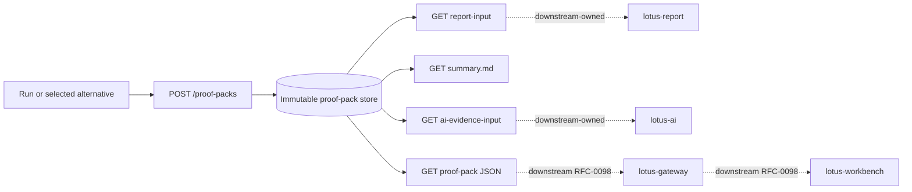
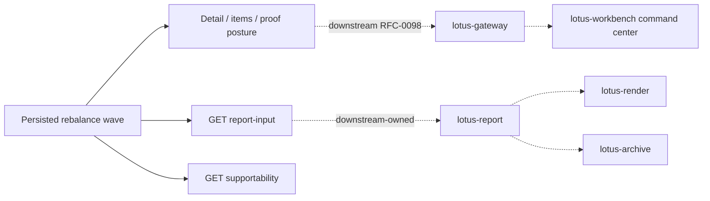

# API Surface

## Core management surfaces

- `POST /api/v1/rebalance/simulate`
  deterministic rebalance execution
- `POST /api/v1/rebalance/analyze`
  synchronous what-if analysis
- `POST /api/v1/rebalance/analyze/async`
  async what-if orchestration

Async operation correlation ids are unique operation handles. Reusing an existing async
correlation id returns `409 DPM_ASYNC_OPERATION_CORRELATION_CONFLICT` instead of leaking a
storage-layer constraint.

## Run supportability surfaces

- `/api/v1/rebalance/runs/*`
  run lookup, workflow state, artifacts, and support bundles
- `/api/v1/rebalance/operations/*`
  async operation status and execution
- `/api/v1/rebalance/lineage/*`
  lineage traversal
- `/api/v1/rebalance/idempotency/*`
  idempotency history and replay support
- `/api/v1/rebalance/supportability/summary`
  store-wide supportability snapshot

## Policy and capability surfaces

- `/api/v1/rebalance/policies/*`
  effective policy resolution and catalog supportability
- `/api/v1/integration/capabilities`
  backend-owned feature and workflow discovery for gateway and platform consumers

## Construction alternative surfaces

- `POST /api/v1/construction/alternative-sets/generate`
  generates and persists a comparable RFC-0039 construction alternative set with do-nothing,
  explainable heuristic, minimum-turnover, tax-aware, solver-constrained, risk-aware,
  liquidity-aware, currency-overlay, and regime-stress-aware alternatives with explicit
  supportability and source-authority posture. Liquidity-aware alternatives can consume optional
  `lotus-core` `PortfolioCashflowProjection:v1` evidence to flag projected cash-pressure policy
  breaches. Currency-overlay alternatives preserve fail-closed `lotus-core`
  `ExternalHedgeExecutionReadiness:v1`, `ExternalCurrencyExposure:v1`,
  `ExternalHedgePolicy:v1`, `ExternalEligibleHedgeInstrument:v1`, and
  `ExternalFXForwardCurve:v1` posture as blocked external treasury evidence without claiming
  eligible-instrument selection, suitability approval, product recommendation, forward pricing,
  hedge advice, execution, OMS, fills, or settlement. Construction authority diagnostics also
  preserve fail-closed `lotus-core` `ExternalOrderExecutionAcknowledgement:v1` posture as
  execution-boundary evidence without claiming order generation, venue routing, best execution,
  OMS acknowledgement ingestion, fills, settlement, execution-status certification, or autonomous
  execution.
  Client income-need planning and ESG/restriction-aware construction are intentionally deferred
  until source-backed owner products exist.
- `GET /api/v1/construction/alternative-sets/{alternative_set_id}`
  retrieves a previously generated alternative set without recomputation.
- `POST /api/v1/construction/alternative-sets/{alternative_set_id}/selections`
  records the actor-attributed selected alternative for audit and later workflow handoff.

These routes are manage-owned backend contracts. Gateway and Workbench are not yet integrated with
this surface; construction-specific realization requirements now live in Gateway RFC-0098,
Workbench RFC-0098, and
[`docs/architecture/dpm-construction-alternatives-gateway-workbench-handoff.md`](../docs/architecture/dpm-construction-alternatives-gateway-workbench-handoff.md).

## Proof-pack surfaces

- `POST /api/v1/rebalance/proof-packs`
  generates and persists an immutable RFC-0040 pre-trade proof pack from a persisted rebalance run
  or selected RFC-0039 construction alternative. Calls require `Idempotency-Key` and preserve
  source-backed degraded or blocked section states instead of inventing missing evidence.
- `GET /api/v1/rebalance/proof-packs/{proof_pack_id}`
  retrieves the persisted proof-pack JSON contract with section states, hashes, lineage, retention
  posture, source references, and supportability summary.
- `GET /api/v1/rebalance/proof-packs/{proof_pack_id}/summary.md`
  renders deterministic human-readable Markdown from the persisted proof pack.
- `GET /api/v1/rebalance/proof-packs/{proof_pack_id}/report-input`
  returns deterministic `DpmProofPackReportInput` for downstream report materialization without
  requiring `lotus-report` to reconstruct proof-pack truth.
- `GET /api/v1/rebalance/proof-packs/{proof_pack_id}/ai-evidence-input`
  returns bounded `DpmProofPackAiEvidenceInput` with forbidden-action guardrails and forbidden-field
  filtering for downstream AI workflows.

These are manage-owned backend authority endpoints. Gateway and Workbench must consume these
contracts later without reconstructing proof-pack evidence. Report materialization and AI memo
generation remain downstream responsibilities and are not claimed by this manage implementation.

## Rebalance wave surfaces

- `POST /api/v1/rebalance/waves/preview`
  builds a non-durable RFC-0041 explicit portfolio-list wave preview.
- `POST /api/v1/rebalance/waves`
  persists a durable wave with idempotency protection.
- `GET /api/v1/rebalance/waves`
  searches bounded durable wave pages.
- `GET /api/v1/rebalance/waves/{wave_id}`
  retrieves persisted wave detail with supportability and proof-pack posture.
- `GET /api/v1/rebalance/waves/{wave_id}/items`
  returns item-level source, selection, proof-pack, and handoff posture.
- `POST /api/v1/rebalance/waves/{wave_id}/source-check`
  classifies item readiness from manage-owned mandate and source-readiness evidence.
- `POST /api/v1/rebalance/waves/{wave_id}/simulate`
  delegates ready items to RFC-0039 construction alternatives.
- `POST /api/v1/rebalance/waves/{wave_id}/items/{wave_item_id}/select`
  records actor-attributed construction selection for a wave item.
- `POST /api/v1/rebalance/waves/{wave_id}/approve`
  approves eligible selected or proof-pack-ready items.
- `POST /api/v1/rebalance/waves/{wave_id}/stage`
  stages approved items for internal operations handoff.
- `POST /api/v1/rebalance/waves/{wave_id}/handoff`
  creates append-only internal handoff evidence with `external_execution_claimed=false`.
- `POST /api/v1/rebalance/waves/{wave_id}/cancel`
  records pre-execution cancellation evidence.
- `GET /api/v1/rebalance/waves/{wave_id}/proof-pack`
  returns linked proof-pack and handoff posture for the persisted wave, including structured
  `DPM_WAVE_EXTERNAL_EXECUTION_BOUNDARY` evidence.
- `GET /api/v1/rebalance/waves/{wave_id}/report-input`
  returns deterministic `DpmWaveReportInput` for downstream report materialization without
  claiming external execution or requiring `lotus-report` to reconstruct wave state, proof-pack
  linkage, internal handoff refs, source hashes, or the fail-closed execution-boundary object. If
  persisted handoff evidence contains an external execution claim, this endpoint fails closed with
  `DPM_WAVE_EXTERNAL_EXECUTION_BOUNDARY` instead of propagating unsupported OMS truth downstream.
- `GET /api/v1/rebalance/waves/{wave_id}/supportability`
  returns product-safe operator diagnostics and bounded reason-code posture.
- `GET /api/v1/rebalance/waves/campaign-definitions/{campaign_id}/versions/{campaign_version}/preview-readiness`
  checks whether a persisted bulk-review campaign definition is ready for new preview/create use.
- `GET /api/v1/rebalance/waves/campaign-definitions/{campaign_id}/versions/{campaign_version}/launch-package`
  returns a bounded launch package with readiness, preview/create request draft, and create headers.
- `POST /api/v1/rebalance/waves/campaign-definitions/{campaign_id}/versions/{campaign_version}/launch`
  creates a durable `BULK_REVIEW_CAMPAIGN` wave only when launch-package readiness is `READY`
  and records append-only launch history on the persisted definition.
- `POST /api/v1/rebalance/waves/campaign-definitions/{campaign_id}/versions/{campaign_version}/approval-decisions`
  records append-only campaign approval posture evidence on an active definition without trade
  approval, order generation, routing, client contact, maker-checker workflow, or OMS claims.
- `GET /api/v1/rebalance/waves/campaign-definitions/{campaign_id}/versions/{campaign_version}/approval-decisions`
  returns a bounded `BulkReviewCampaignDefinitionApprovalDecisionPage` audit page.

These are manage-owned backend authority endpoints. PM-book wave discovery is supported for
`PM_BOOK_REVIEW` through lotus-core `PortfolioManagerBookMembership:v1`. CIO model-change
affected-mandate discovery is supported for `CIO_MODEL_CHANGE` through lotus-core
`CioModelChangeAffectedCohort:v1`. Bounded risk-event wave discovery is supported for
`RISK_EVENT` through lotus-risk `RiskEventAffectedCohort:v1` when callers supply candidate
portfolios and source-supplied exposure weights. Report materialization, rendering, archive
lifecycle, AI memo generation, tactical/campaign cohort discovery, and external OMS execution
remain downstream or source-owner responsibilities unless their owning repos have implemented and
proven support. The manage report-input seam is explicitly bounded to internal operations handoff
evidence and will not emit report input for contaminated external-execution claims.

Default capability posture is intentionally conservative: inline bundle execution is enabled,
stateful `portfolio_id` execution is disabled until a governed `lotus-core` resolver is configured,
and solver target generation is runtime-discovered from installed solver dependencies.

Source-service callers must use the canonical snake_case query parameters `consumer_system` and
`tenant_id`. Gateway may expose camelCase on its public BFF contract, but direct calls into
`lotus-manage` should not rely on Gateway naming.

Endpoint certification details are tracked in [Endpoint Certification](Endpoint-Certification).

## Platform surfaces

- `/health`
  lightweight service health
- `/health/live`
  process liveness without persistence dependency checks
- `/health/ready`
  readiness with persistence guardrails and production migration cutover validation
- `/docs`
