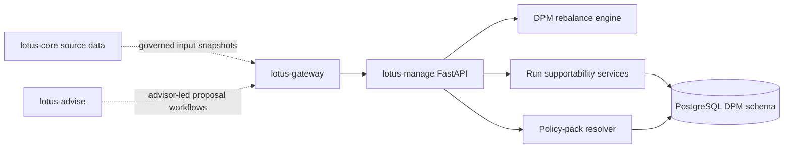
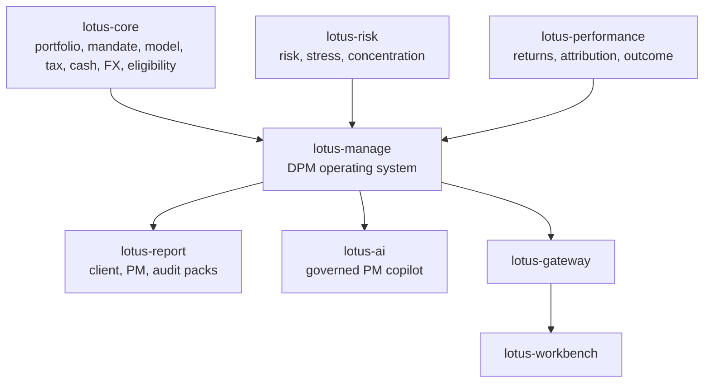
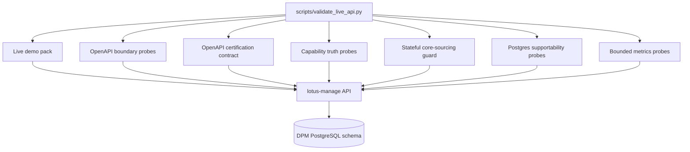

# Architecture

## Runtime model

- FastAPI service
- management-side domain logic in `src/core/rebalance/` and `src/core/rebalance_runs/`
- PostgreSQL-backed persistence and migrations under `src/infrastructure/`
- consumed primarily through `lotus-gateway`
- stateless execution is active and advertised
- stateful core-sourced execution is implemented behind explicit runtime gates and advertised only
  when core source-product readiness, stateful capability flags, and resolver configuration prove
  the posture

## Execution Modes

The default product mode is `stateless`. Stateful request models, resolver client, transformation
helpers, and lineage fields are implemented behind explicit runtime gates. Capabilities advertise
stateful execution only when `DPM_CAP_INPUT_MODE_PORTFOLIO_ID_ENABLED`,
`DPM_STATEFUL_CORE_SOURCING_ENABLED`, and `DPM_CORE_BASE_URL` prove a usable core-sourcing posture.

## Target DPM Operating System Architecture

Target-state RFCs may redesign or delete existing manage APIs. The architecture preference is a
clean, certified, domain-driven `/api/v1` contract rather than backward-compatible aliases for stale
or poorly named endpoints.

## Evidence flow

This evidence path is API-first. It certifies `lotus-manage` and its managed core-sourcing posture
before broader Gateway or Workbench product-surface integration is treated as proof.

## Code map

- `src/api/`
  routers, request handling, readiness, observability, and OpenAPI enrichment
- `src/core/rebalance/`
  rebalance engine, policy-pack resolution, turnover, settlement, tax, and constraint logic
- `src/core/rebalance_runs/`
  async operation, workflow, artifact, and supportability services
- `src/core/mandates.py`
  RFC-0038 mandate digital-twin, health-score, and monitoring-exception domain foundation; this
  is pure domain logic and does not yet expose mandate APIs or persistence
- `src/core/mandate_repository.py` and `src/infrastructure/mandates/`
  RFC-0038 mandate, health, and monitoring-exception repository contract plus in-memory and
  Postgres-backed persistence foundation
- `src/core/common/`
  shared simulation primitives, diagnostics, workflow gates, and canonical helpers
- `src/infrastructure/`
  persistence backends, policy-pack repositories, and PostgreSQL migrations

## Boundary notes

1. `lotus-manage` owns execution decisions produced from governed inputs
2. `lotus-core` remains source-data authority when request inputs are core-referenced
3. `lotus-gateway` is the primary downstream product consumer
4. REST/OpenAPI remains the canonical integration contract
5. capability discovery is backend-owned through `/api/v1/integration/capabilities`
