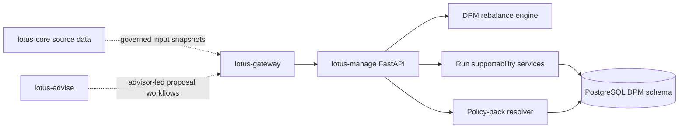
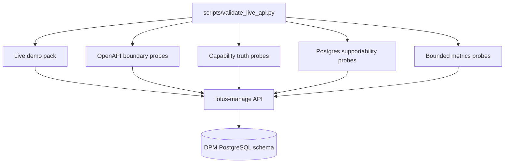

# Architecture

## Runtime model

- FastAPI service
- management-side domain logic in `src/core/dpm/` and `src/core/dpm_runs/`
- PostgreSQL-backed persistence and migrations under `src/infrastructure/`
- consumed primarily through `lotus-gateway`

## Evidence flow

This evidence path is API-first. It is intended for `lotus-manage` certification before broader
Gateway or Workbench integration is treated as a product-surface dependency.

## Code map

- `src/api/`
  routers, request handling, readiness, observability, and OpenAPI enrichment
- `src/core/dpm/`
  rebalance engine, policy-pack resolution, turnover, settlement, tax, and constraint logic
- `src/core/dpm_runs/`
  async operation, workflow, artifact, and supportability services
- `src/core/common/`
  shared simulation primitives, diagnostics, workflow gates, and canonical helpers
- `src/infrastructure/`
  persistence backends, policy-pack repositories, and PostgreSQL migrations

## Boundary notes

1. `lotus-manage` owns execution decisions produced from governed inputs
2. `lotus-core` remains source-data authority when request inputs are core-referenced
3. `lotus-gateway` is the primary downstream product consumer
4. REST/OpenAPI remains the canonical integration contract
5. capability discovery is backend-owned through `/integration/capabilities`
