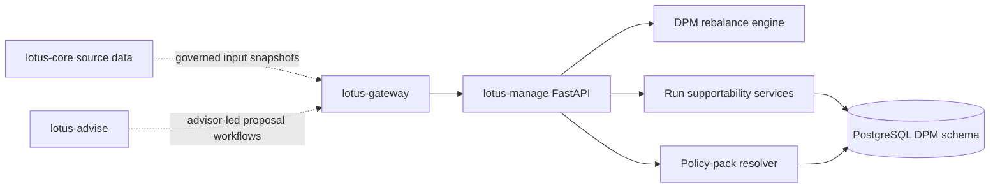
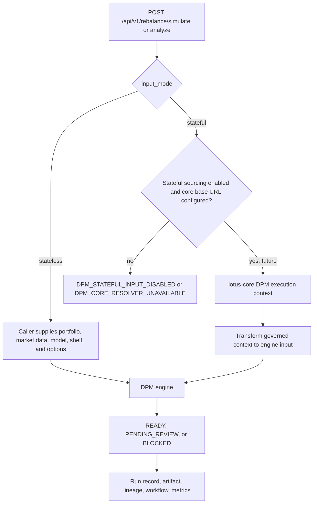
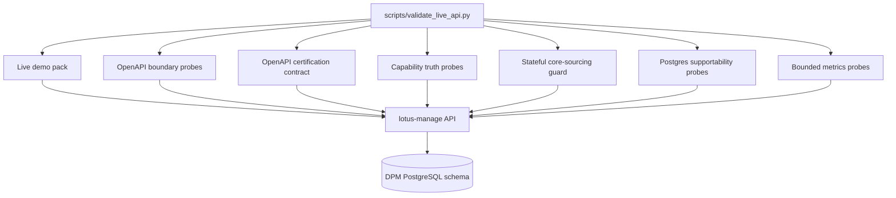

# Architecture

## Runtime model

- FastAPI service
- management-side domain logic in `src/core/dpm/` and `src/core/dpm_runs/`
- PostgreSQL-backed persistence and migrations under `src/infrastructure/`
- consumed primarily through `lotus-gateway`
- stateless execution is active and advertised
- stateful core-sourced execution is modeled, guarded, and intentionally disabled until upstream
  resolver certification is complete

## Execution Modes

The current implemented product mode is `stateless`. Stateful request models, resolver client,
transformation helpers, and lineage fields are present so the integration boundary is explicit, but
capabilities do not advertise stateful execution until the governed `lotus-core` source-data
contract is live-certified.

## Evidence flow

This evidence path is API-first. It certifies `lotus-manage` and its managed core-sourcing posture
before broader Gateway or Workbench product-surface integration is treated as proof.

## Code map

- `src/api/`
  routers, request handling, readiness, observability, and OpenAPI enrichment
- `src/core/dpm/`
  rebalance engine, policy-pack resolution, turnover, settlement, tax, and constraint logic
- `src/core/dpm_runs/`
  async operation, workflow, artifact, and supportability services
- `src/core/common/`
  shared simulation primitives, diagnostics, workflow gates, and canonical helpers
- `src/infrastructure/`
  persistence backends, policy-pack repositories, and PostgreSQL migrations

## Boundary notes

1. `lotus-manage` owns execution decisions produced from governed inputs
2. `lotus-core` remains source-data authority when request inputs are core-referenced
3. `lotus-gateway` is the primary downstream product consumer
4. REST/OpenAPI remains the canonical integration contract
5. capability discovery is backend-owned through `/api/v1/integration/capabilities`
