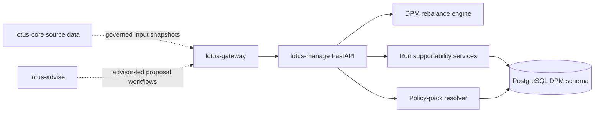
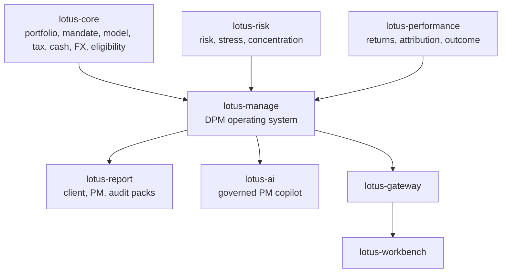
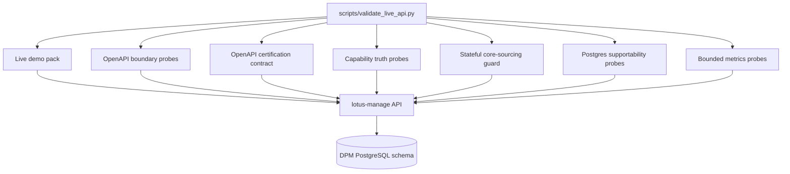
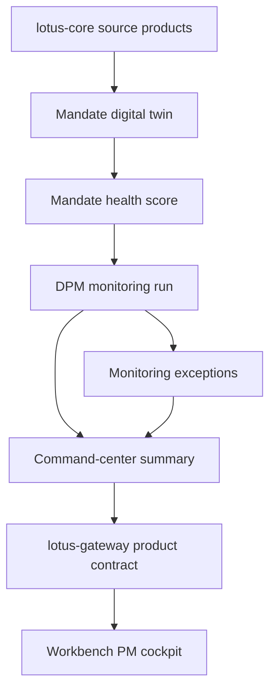
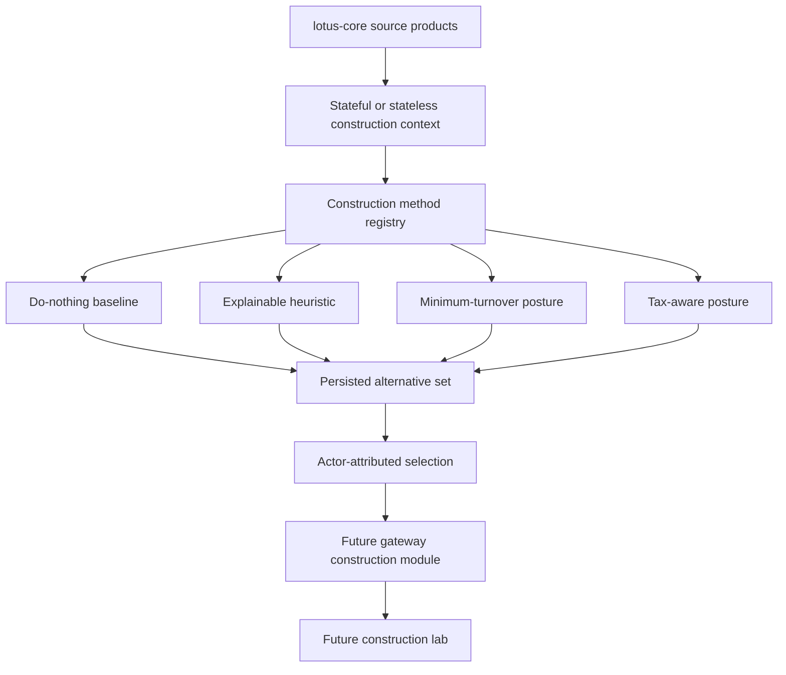

# Architecture

## Runtime model

- FastAPI service
- management-side domain logic in `src/core/rebalance/` and `src/core/rebalance_runs/`
- PostgreSQL-backed persistence and migrations under `src/infrastructure/`
- consumed primarily through `lotus-gateway`
- stateless execution is active and advertised
- stateful core-sourced execution is implemented behind explicit runtime gates and advertised only
  when core source-product readiness, stateful capability flags, and resolver configuration prove
  the posture

## Execution Modes

The default product mode is `stateless`. Stateful request models, resolver client, transformation
helpers, and lineage fields are implemented behind explicit runtime gates. Capabilities advertise
stateful execution only when `DPM_CAP_INPUT_MODE_PORTFOLIO_ID_ENABLED`,
`DPM_STATEFUL_CORE_SOURCING_ENABLED`, and `DPM_CORE_BASE_URL` prove a usable core-sourcing posture.

## Target DPM Operating System Architecture

Target-state RFCs may redesign or delete existing manage APIs. The architecture preference is a
clean, certified, domain-driven `/api/v1` contract rather than backward-compatible aliases for stale
or poorly named endpoints.

## Evidence flow

This evidence path is API-first. It certifies `lotus-manage` and its managed core-sourcing posture
before broader Gateway or Workbench product-surface integration is treated as proof.

## Mandate Command-Center Flow

RFC-0038 introduces a command-center foundation for discretionary mandate supervision. The
backend-owned flow is:

The important boundary is that `lotus-manage` owns health and command-center truth, while Gateway
and Workbench own composition and presentation. Workbench should not call `lotus-manage` directly or
reconstruct health state client-side.

## Construction Alternatives Flow

RFC-0039 introduces a construction-alternative foundation for discretionary mandate decisioning.
The backend-owned flow is:

The important boundary is that `lotus-manage` owns construction alternatives and selection truth.
Gateway and Workbench must consume that truth without recomputing construction methods or bypassing
the experience API. The downstream handoff is maintained in
[`docs/architecture/dpm-construction-alternatives-gateway-workbench-handoff.md`](../docs/architecture/dpm-construction-alternatives-gateway-workbench-handoff.md).

## Code map

- `src/api/`
  routers, request handling, readiness, observability, and OpenAPI enrichment
- `src/core/rebalance/`
  rebalance engine, policy-pack resolution, turnover, settlement, tax, and constraint logic
- `src/core/rebalance_runs/`
  async operation, workflow, artifact, and supportability services
- `src/core/mandates.py`
  RFC-0038 mandate digital-twin, health-score, and monitoring-exception domain foundation
- `src/core/mandate_repository.py` and `src/infrastructure/mandates/`
  RFC-0038 mandate, health, and monitoring-exception repository contract plus in-memory and
  Postgres-backed persistence foundation
- `src/api/routers/mandates.py` and `src/api/services/mandate_service.py`
  RFC-0038 mandate refresh, read, version, diff, health, monitoring orchestration, and exception
  service foundation backed by product-specific `lotus-core` sourcing and the mandate repository
- `src/api/routers/monitoring.py`
  RFC-0038 bounded monitoring run, exception queue, and command-center summary APIs
- `docs/architecture/dpm-command-center-gateway-workbench-handoff.md`
  RFC-0038 downstream integration handoff for Gateway and Workbench command-center adoption
- `src/core/construction/`, `src/api/routers/construction.py`,
  `src/api/services/construction_service.py`, and `src/infrastructure/construction/`
  RFC-0039 construction-alternative domain, API, service, and persistence foundation
- `docs/architecture/dpm-construction-alternatives-gateway-workbench-handoff.md`
  RFC-0039 downstream integration handoff for Gateway and Workbench construction-lab adoption
- `src/core/common/`
  shared simulation primitives, diagnostics, workflow gates, and canonical helpers
- `src/infrastructure/`
  persistence backends, policy-pack repositories, and PostgreSQL migrations

## Boundary notes

1. `lotus-manage` owns execution decisions produced from governed inputs
2. `lotus-core` remains source-data authority when request inputs are core-referenced
3. `lotus-gateway` is the primary downstream product consumer
4. REST/OpenAPI remains the canonical integration contract
5. capability discovery is backend-owned through `/api/v1/integration/capabilities`
