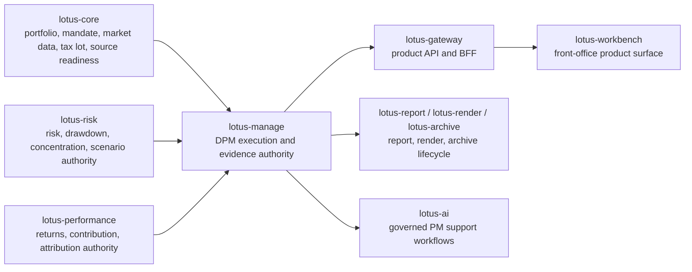
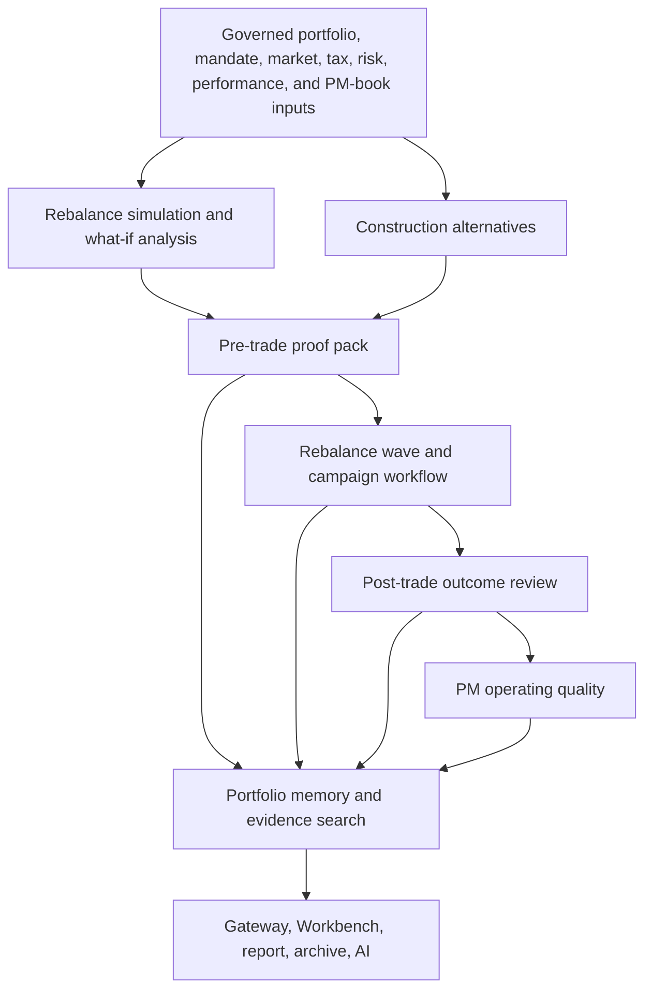
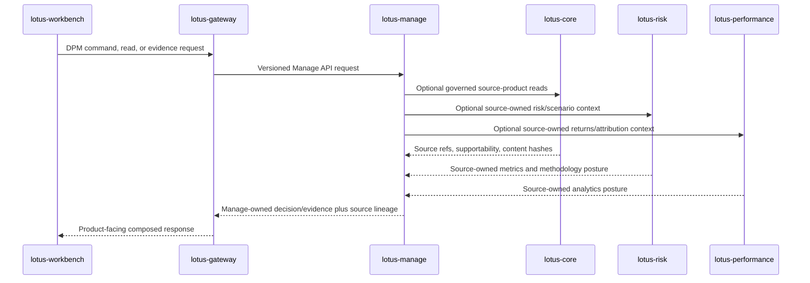

# Current State

This page is the implementation-backed current-state brief for `lotus-manage`. It is written for
client demos, business walkthroughs, operations review, sales/pre-sales enablement, and engineering
onboarding.

Use this page as the executive map. Use [Supported Features](Supported-Features) for the detailed
feature ledger, [API Surface](API-Surface) for route-level contracts, [Integrations](Integrations)
for upstream/downstream posture, and [RFC Index](RFC-Index) for implementation history.

## Audience Map

| Audience | What this page should answer |
| --- | --- |
| Business users | Which discretionary portfolio-management workflows are implemented and what decisions they support. |
| Operations | Which supportability, lineage, readiness, and escalation surfaces exist today. |
| Sales and client demos | Which claims are implementation-backed and which boundaries must be stated clearly. |
| Engineering | Which owning modules, APIs, source products, and validation gates prove the current posture. |
| Product leadership | Where the current backend is ready, where downstream realization exists, and where target-state work remains. |

## Current Role

`lotus-manage` is the discretionary mandate portfolio-management execution and operational
supportability service. It owns management-side rebalance execution, mandate supervision,
construction alternatives, proof packs, explicit rebalance waves, outcome feedback, PM operating
quality evidence, and portfolio memory.

It does not own canonical portfolio books and records, risk methodology, performance methodology,
advisor-led proposal workflows, external OMS execution, client communication delivery, HR or conduct
decisions, or global portfolio-universe discovery.

## Functional Capability Matrix

| Capability area | Implementation-backed support | Demo and operating posture |
| --- | --- | --- |
| Rebalance simulation and what-if analysis | Stateless execution is supported by caller-supplied portfolio, market-data, model, shelf, and option bundles. Stateful `portfolio_id` execution is implemented behind explicit source-data gates. | Suitable for technical and product demos when the supported input mode is stated. Stateful demos require configured `lotus-core` source products and readiness evidence. |
| Run supportability | Async operations, run records, artifacts, workflow history, idempotency history, lineage, metrics, and support bundles are owned here. | Operations can review execution state, correlation, replay posture, and evidence without inspecting raw infrastructure stores. |
| Mandate digital twin and command center | Mandate twin refresh/read/version/diff, health scoring, monitoring runs, exceptions, and command-center summary are implemented. | First-wave command-center path is implementation-backed through Gateway/Workbench where downstream proof exists. |
| Construction alternatives | Alternative generate/read/select is implemented with baseline, heuristic, minimum-turnover, tax-aware, solver-constrained, risk-aware, liquidity-aware, currency-overlay, ESG/restriction-aware, and regime-stress-aware posture where source evidence is available. | Suitable for PM review demos. Manage preserves source-owned analytics and constraints but does not calculate external risk/performance methodology locally. |
| Pre-trade proof packs | Durable proof-pack JSON, deterministic Markdown, report input, AI evidence input, hashes, lineage, retention metadata, and source-backed sections are implemented. | Suitable for evidence-review demos. Downstream report, archive, and AI workflows are owned by their respective services. |
| Explicit rebalance waves | Explicit portfolio-list wave preview/create/source-check/simulate/select/approve/stage/handoff, campaign definition workflows, launch packages, launch history, approval inbox, assignment tasks, and maker-checker evidence are implemented. | Suitable for PM/CIO operating cockpit demos when the no-order, no-OMS, no-client-contact boundaries are stated. |
| Post-trade outcome feedback | Outcome-review preview/create/read/search, source-owned realized source adapters, supportability diagnostics, report input, AI evidence input, and append-only events are implemented. | Suitable for outcome-review and operating-quality demos. External execution and client communication remain explicit non-claims. |
| PM operating quality | Policy, score-run, fairness-analysis, review-action, and summary-invocation evidence lifecycles are implemented with bounded PM-book membership and support-only boundaries. | Suitable for operating-quality governance demos. It is not a PM ranking, HR, compensation, conduct, trade approval, or autonomous decisioning engine. |
| Portfolio memory | Deterministic source-backed portfolio timeline, search, source-system/source-type facets, exact event lookup, report/AI/archive lineage, PM-quality lineage, campaign workflow lineage, and source-family posture are implemented. | Suitable for audit and demo lineage walkthroughs. Search is bounded to Manage-local persisted evidence and explicit caller-supplied portfolio identifiers; deduplicated explicit identifiers must stay within `source_scan_limit`. |
| Integration capability publication | `/api/v1/integration/capabilities` publishes runtime capability posture and stateful mode only when gates prove the source configuration. | Consumers can distinguish configured support from disabled or blocked runtime posture. |

## Non-Functional Capability Matrix

| Quality area | Current posture | Evidence and operating value |
| --- | --- | --- |
| API governance | Versioned `/api/v1` routers, OpenAPI enrichment, no-alias governance, and API vocabulary checks are part of the validation posture. | Protects Gateway/Workbench integration and client demo scripts from stale route claims. |
| Source authority and data mesh | Governed source products are consumed from owning services; Manage preserves source refs, content hashes, and supportability state instead of becoming the source owner. | Supports auditability, source-lineage review, and clear ownership in client conversations. |
| Idempotency and lineage | Rebalance runs, async operations, proof packs, waves, outcome reviews, campaign workflow evidence, and portfolio memory carry deterministic identity and content-hash posture where relevant. | Operations can reconcile repeated requests and evidence packs without timestamp-only churn. |
| Observability | Health, readiness, metrics, bounded logs, supportability summaries, and diagnostics are implementation-backed for current surfaces. | Operators can triage runtime and source-readiness posture without exposing sensitive payloads. |
| Security and sensitive-data posture | Boundaries avoid raw prompt bodies, model responses, raw score payloads, raw review rationale, client contact details, OMS claims, and source-owner methodology leakage. | Enables sales and client demos without overstating data exposure or control ownership. |
| Validation and CI | Repo-native gates include lint, typecheck, unit/integration/e2e coverage posture, OpenAPI, vocabulary, migration smoke, and security checks. | Current-state claims should be backed by local or GitHub evidence before promotion. |
| Runtime coexistence | Canonical local runtime uses port `8001` so `lotus-manage` can coexist with `lotus-advise`. | Supports integrated front-office development and canonical platform validation. |
| Downstream product realization | Gateway and Workbench consume supported Manage capabilities where merged realization exists; Workbench should not call Manage directly. | Keeps demo and product claims aligned with the governed front-office runtime path. |

## Primary Feature Flow

## Source Authority And Boundary Flow

Boundary principle: Manage consumes source-owned evidence, makes Manage-owned management workflow
decisions, and publishes lineage. It does not recalculate source-owner methodology, invent global
portfolio discovery, generate orders, claim OMS execution, or create client communication records.

## Demo-Ready Claims

The following claims are implementation-backed when the matching runtime and source gates are
configured:

1. Manage can demonstrate discretionary mandate rebalance simulation and what-if analysis.
2. Manage can demonstrate run supportability, artifact lookup, idempotency history, workflow
   history, lineage, and capability publication.
3. Manage can demonstrate mandate health, monitoring exceptions, and command-center posture.
4. Manage can demonstrate construction alternatives and actor-attributed selection.
5. Manage can demonstrate proof-pack evidence generation and downstream handoff posture.
6. Manage can demonstrate explicit rebalance waves, campaign workflow evidence, assignment tasks,
   maker-checker evidence, launch packages, and launch history.
7. Manage can demonstrate outcome reviews and PM operating-quality support evidence.
8. Manage can demonstrate portfolio-memory timeline, bounded search, exact event lookup, and
   source-lineage facets.

## Explicit Non-Claims

These statements should be preserved in client demos and presentations:

1. Manage does not own canonical portfolio books and records.
2. Manage does not own risk, performance, tax, cashflow, FX, benchmark, or scenario methodology.
3. External OMS execution remains unsupported: Manage does not route orders, select venues, certify
   best execution, ingest fills, confirm settlement, or own external OMS acknowledgement truth.
4. Manage does not contact clients, generate client-ready communications, record delivery
   confirmation, record client approval, or own client-communication audit truth.
5. Manage does not rank portfolio managers, make HR/conduct/compensation decisions, infer protected
   classes, or autonomously approve trades.
6. Manage portfolio-memory search is bounded to Manage-local persisted evidence and explicit
   caller-supplied identifiers; deduplicated explicit identifiers must stay within
   `source_scan_limit`, and the route is not global cross-app source-event search.

## Where To Go Next

| Need | Page |
| --- | --- |
| Detailed feature ledger | [Supported Features](Supported-Features) |
| Endpoint groups and request examples | [API Surface](API-Surface) |
| Upstream/downstream contracts | [Integrations](Integrations) |
| Runtime, health, and operations | [Operations Runbook](Operations-Runbook) |
| Validation gates and local proof | [Validation and CI](Validation-and-CI) |
| Architecture and module map | [Architecture](Architecture) |
| RFC implementation history | [RFC Index](RFC-Index) |
