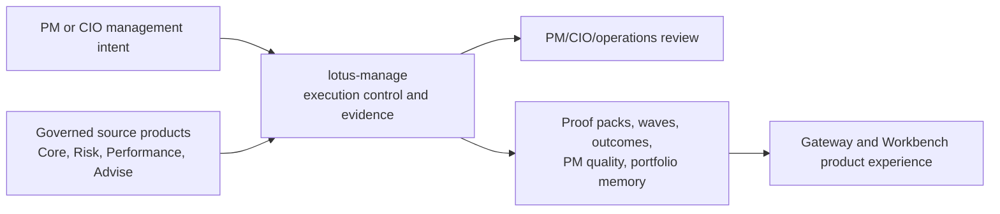
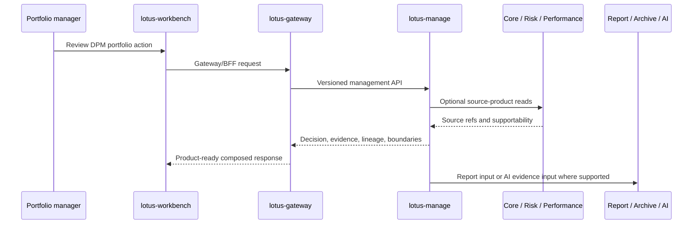

# Demo Guide

This page turns the implementation-backed `lotus-manage` current state into demo and presentation
material. It is intended for sales/pre-sales, client-facing walkthroughs, business stakeholders,
operations, and engineers preparing evidence-backed demonstrations.

Use it with [Current State](Current-State), [Supported Features](Supported-Features),
[Integrations](Integrations), and [Operations Runbook](Operations-Runbook). It is not a target-state
marketing script; every supported claim below must remain grounded in implemented repo truth and
the governed downstream Gateway/Workbench realization path where product UI is part of the demo.

## Demo Positioning

`lotus-manage` demonstrates how Lotus turns discretionary portfolio-management intent into
controlled, auditable, source-backed management workflows. The strongest demo story is not only
"the system can calculate a rebalance"; it is:

1. the service knows which source authority owns each fact,
2. it produces deterministic management evidence from governed inputs,
3. it preserves lineage, supportability, and content hashes,
4. it keeps external execution, client communication, and source-owner methodology out of scope
   until those owners publish certified products,
5. it gives PMs, CIO reviewers, operations, and audit teams a shared evidence trail.

## Recommended Demo Path

| Step | Story beat | Implementation-backed surface | What to emphasize |
| --- | --- | --- | --- |
| 1 | Establish governed source posture | `/api/v1/integration/capabilities`, source-readiness contracts, stateful gates | Capabilities are advertised only when configured and source-backed. |
| 2 | Show portfolio-management decisioning | `POST /api/v1/rebalance/simulate` and `POST /api/v1/rebalance/analyze` | Stateless execution is default; stateful execution requires governed core-sourcing configuration. |
| 3 | Show mandate supervision | `/api/v1/mandates/*`, `/api/v1/dpm/monitoring/*`, `/api/v1/dpm/command-center` | Mandate health, exceptions, and command-center posture are Manage-owned evidence. |
| 4 | Show construction alternatives | `/api/v1/construction/alternative-sets/*` | Alternatives preserve risk/performance/liquidity/source evidence without local source-methodology claims. |
| 5 | Show proof-pack evidence | `/api/v1/rebalance/proof-packs/*` | Proof packs package pre-trade review evidence, hashes, source refs, report input, and AI evidence input. |
| 6 | Show rebalance-wave control | `/api/v1/rebalance/waves/*` | Explicit waves, campaigns, approval inbox, assignment tasks, maker-checker controls, launch package, and launch history are managed as bounded evidence. |
| 7 | Show outcome and quality loop | `/api/v1/rebalance/outcome-reviews/*`, `/api/v1/rebalance/pm-operating-quality/*` | Post-trade review and PM operating quality are support and governance evidence, not autonomous ranking or HR decisions. |
| 8 | Close with portfolio memory | `/api/v1/rebalance/portfolio-memory/*` | Memory gives audit/search/drilldown over Manage-local persisted evidence, source refs, and event identities. |

## Client-Facing Flow

Talk track:

1. Workbench and Gateway are the product path; Manage is the management evidence authority.
2. Manage does not hide degraded source posture; it emits ready, partial, degraded, empty, or
   blocked posture where implemented.
3. Source refs and content hashes make the evidence explainable and repeatable.
4. Unsupported execution and client-communication capabilities are explicit, not implied.

## Feature Demonstration Scenarios

### Scenario 1: Mandate Control And Readiness

Use when the audience cares about day-to-day portfolio-manager supervision.

Implementation-backed points:

1. mandate digital twin refresh/read/version/diff,
2. mandate health score and reason codes,
3. monitoring run and exception queue,
4. command-center summary and PM-book-backed monitoring posture,
5. source-readiness supportability for complete, partial, empty, degraded, or blocked source states.

Demo boundary:

Manage can explain mandate health and operating exceptions. It does not own canonical account,
holding, benchmark, risk, or performance books and records.

### Scenario 2: Construction Alternative Review

Use when the audience wants to understand portfolio decision support.

Implementation-backed points:

1. alternative generation, persisted alternative sets, and actor-attributed selection,
2. baseline, heuristic, minimum-turnover, tax-aware, solver-constrained, risk-aware,
   liquidity-aware, currency-overlay, ESG/restriction-aware, and regime-stress-aware posture,
3. source-owned risk, performance, liquidity, cashflow, sustainability, and restriction evidence
   preserved as diagnostics,
4. proposed-change diagnostics for PM review without order generation.

Demo boundary:

Manage supports construction evidence and selection. It does not calculate external risk or
performance methodology, provide tax advice, create orders, route venues, or claim OMS execution.

### Scenario 3: Proof-Pack Evidence Review

Use when the audience cares about investment committee, audit, or pre-trade sign-off.

Implementation-backed points:

1. durable proof-pack JSON and deterministic Markdown,
2. report-input and AI-evidence handoff posture,
3. section hashes, source lineage, retention metadata, and supportability states,
4. source-backed mandate context and selected construction alternative evidence.

Demo boundary:

Proof packs are review evidence. They do not generate client-ready communications, delivery
confirmation, client approval, autonomous AI decisions, or OMS actions.

### Scenario 4: Rebalance Wave And Campaign Control

Use when the audience wants a PM/CIO operating cockpit story.

Implementation-backed points:

1. explicit wave preview/create/source-check/simulate/select/approve/stage/handoff,
2. campaign definition list/get/upsert, discovery, operating queue, approval inbox, workflow board,
   assignment plan, assignment actions, assignment tasks, maker-checker controls, launch packages,
   and launch history,
3. bounded Core `DpmPortfolioUniverseCandidate:v1` campaign-candidate source mode where configured,
4. source-owned PM-book, CIO model-change, risk-event, tactical house-view, and campaign candidate
   evidence where implemented.

Demo boundary:

Wave and campaign workflows are evidence and control surfaces. They do not approve trades,
generate orders, contact clients, orchestrate external workflow systems, or claim OMS execution.

### Scenario 5: Outcome, PM Quality, And Portfolio Memory

Use when the audience wants a closed-loop operating model.

Implementation-backed points:

1. outcome-review preview/create/read/search and realized source adapters,
2. PM operating-quality policy, score-run, fairness-analysis, review-action, and summary-invocation
   evidence lifecycles,
3. portfolio-memory timeline, bounded search, source-system/source-type facets, exact event lookup,
   and report/AI/archive/PM-quality lineage,
4. structured external-execution and client-communication boundary evidence.

Demo boundary:

PM operating quality is a support and governance surface. It is not a portfolio-manager ranking,
HR, compensation, conduct, protected-class inference, client-contact, trade-approval, or execution
engine.

## Demo Evidence Checklist

Before presenting a capability as demo-ready, confirm:

1. the capability appears in [Supported Features](Supported-Features) as implementation-backed,
2. the relevant downstream Gateway/Workbench realization exists when showing product UI,
3. the runtime path is configured for the claim being made,
4. source readiness is ready or explicitly explained as partial/degraded/blocked,
5. the no-order, no-OMS, no-client-contact, no-autonomous-AI, and no-local-source-methodology
   boundaries are included where relevant,
6. the demo uses current wiki source and not an unpublished, stale, or side-branch-only page,
7. any screenshot or live proof follows the governed canonical runtime path when presenting
   product UI.

## Objection Handling

| Question | Grounded answer |
| --- | --- |
| Does Manage replace the portfolio book of record? | No. `lotus-core` remains source-data authority; Manage consumes and preserves governed source evidence. |
| Does Manage calculate risk or performance? | No. It preserves source-owned `lotus-risk` and `lotus-performance` evidence and supportability posture where implemented. |
| Does Manage send orders to an OMS? | No. External OMS execution remains an explicit non-claim until a certified execution/OMS owner publishes governed source products and downstream realization. |
| Does Manage contact clients? | No. Client communication records, delivery confirmation, client approval, and communication audit truth are future source-owner scope. |
| Does PM operating quality rank PMs? | No. It creates bounded support and governance evidence; it does not create PM rankings, HR, compensation, conduct, or autonomous decision outcomes. |
| Can the UI call Manage directly? | No for product posture. Workbench should consume Gateway/BFF contracts; direct Manage APIs are backend/source evidence surfaces. |

## Presentation Structure

Recommended slide sequence:

1. `lotus-manage` role in the Lotus ecosystem.
2. Functional capability matrix from [Current State](Current-State).
3. Source authority and boundary diagram.
4. One live or screenshot-backed workflow: mandate control, construction alternatives, proof pack,
   wave/campaign control, outcome/PM-quality loop, or portfolio memory.
5. Non-functional posture: lineage, idempotency, supportability, OpenAPI, validation, and security
   boundaries.
6. Explicit non-claims and future promotion requirements.
7. Next steps for downstream product rollout or client-specific demo proof.

## Source Pages

| Need | Source |
| --- | --- |
| Current-state executive map | [Current State](Current-State) |
| Full implementation-backed feature ledger | [Supported Features](Supported-Features) |
| Route groups and examples | [API Surface](API-Surface) |
| Upstream and downstream integration posture | [Integrations](Integrations) |
| Runtime and operating checks | [Operations Runbook](Operations-Runbook) |
| Validation evidence model | [Validation and CI](Validation-and-CI) |
| Roadmap and target-state separation | [Roadmap](Roadmap) |
