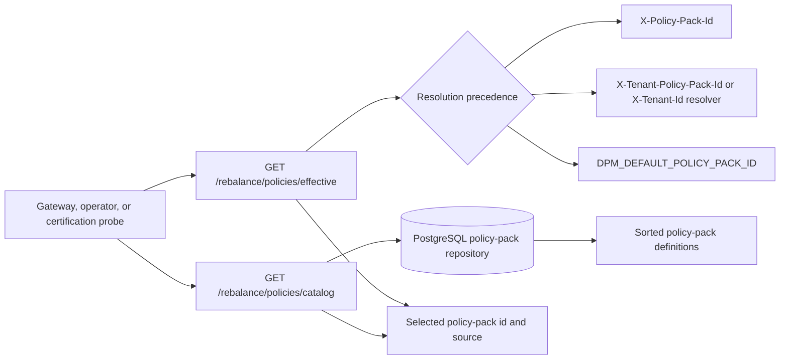
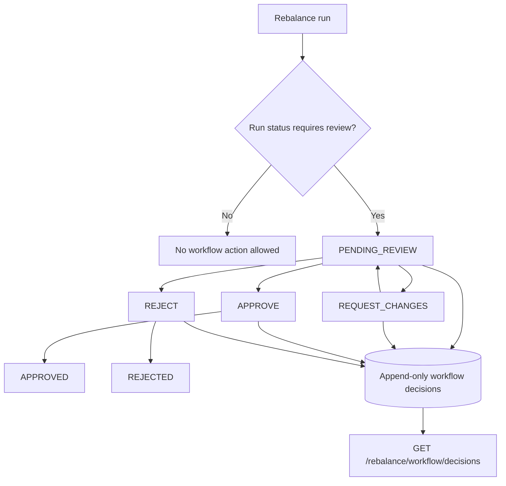

# Endpoint Certification

This page records endpoint-by-endpoint certification evidence for `lotus-manage`. It is scoped to
implementation-backed API readiness before broader Gateway or Workbench integration is treated as
demo proof.

## Certification standard

An endpoint is complete only when these checks are true:

1. functional behavior is tested across supported options, flags, and output fields,
2. non-functional posture is clear: latency shape, statefulness, retry/idempotency behavior,
   supportability, and bounded failure modes,
3. upstream source-data authority is identified and any missing upstream integration is explicit,
4. downstream consumers are identified and stale or duplicate usage has a tracked remediation issue,
5. Swagger explains what the endpoint is for, when to use it, and documents every request and
   response attribute with examples,
6. live API evidence has been captured against a running `lotus-manage` instance.

## Certified endpoint: capabilities discovery

Routes:

- `GET /integration/capabilities`
- `GET /platform/capabilities`

Purpose:

Backend-owned discretionary mandate feature and workflow discovery for Gateway, platform consumers,
and future UI gating. This is a control-plane contract, not a source-data read and not a simulation
state read.

Canonical request shape:

- `consumer_system`
- `tenant_id`

The endpoint intentionally uses canonical source-service snake_case query parameters. Gateway may
continue exposing camelCase on its public BFF contract, but direct source-service calls must use
snake_case.

Functional coverage:

- default consumer and tenant resolution,
- explicit consumer and tenant resolution,
- `/platform/capabilities` alias parity with `/integration/capabilities`,
- conservative default input-mode posture,
- environment-controlled stateful `portfolio_id` publication,
- environment-controlled `inline_bundle` publication,
- runtime solver dependency discovery,
- noncanonical camelCase direct-source query parameters do not override defaults.

Default capability posture:

- `inline_bundle` execution is enabled,
- stateful `portfolio_id` execution is disabled until governed `lotus-core` state resolution is
  configured,
- workflow review gates are disabled until explicitly enabled,
- solver-backed target generation is runtime-discovered,
- action-register supportability is always published as a source-backed feature.

Upstream integration posture:

This endpoint has no outbound source-data dependency. It publishes runtime and policy posture from
environment configuration plus local solver dependency discovery. Future stateful `portfolio_id`
execution must integrate through governed `lotus-core` contracts before the feature is enabled by
default.

Downstream consumers:

- `lotus-gateway` platform capabilities aggregation is the strategic downstream consumer.
- `lotus-workbench` consumes the Gateway BFF contract rather than calling `lotus-manage` directly.

Tracked downstream remediation:

- `sgajbi/lotus-gateway#178` tracks Gateway cleanup for direct source-service query parameters,
  stale proposal/advisory-era DPM client methods, and normalized capability mapping from strategic
  `lotus-manage` DPM feature/workflow keys.

Evidence commands:

```bash
python -m pytest tests/unit/dpm/api/test_integration_capabilities_api.py tests/unit/dpm/contracts/test_contract_openapi_supportability_docs.py -q
LOTUS_MANAGE_BASE_URL=http://127.0.0.1:8001 make live-api-validate
```

## Certified endpoint family: policy-pack read supportability

Routes:

- `GET /rebalance/policies/effective`
- `GET /rebalance/policies/catalog`

Purpose:

Management-side discretionary mandate policy controls for supportability, tenant diagnostics, and
pre-execution integration checks. These endpoints are not advisory proposal APIs; advisor-led
proposal and lifecycle flows belong in `lotus-advise`.

Functional behavior:

- Effective policy resolution uses deterministic precedence: request-scoped `X-Policy-Pack-Id`,
  then tenant default `X-Tenant-Policy-Pack-Id`, then tenant resolver lookup by `X-Tenant-Id`, then
  global default `DPM_DEFAULT_POLICY_PACK_ID`.
- Resolution context is header-only. Unsupported query parameters return `422` instead of being
  ignored or treated as aliases.
- The effective endpoint returns `enabled`, `selected_policy_pack_id`, and `source`.
- The catalog endpoint returns `enabled`, `total`, selected policy-pack id and source,
  `selected_policy_pack_present`, and sorted policy-pack definitions.
- Catalog storage is the governed PostgreSQL policy-pack repository; missing or unavailable storage
  returns `503`.



Non-functional posture:

- `/rebalance/policies/effective` performs no repository read and is a low-latency configuration
  resolution endpoint.
- `/rebalance/policies/catalog` performs a bounded local repository read, returns a deterministic
  sorted catalog, and performs no upstream calls to `lotus-core`, `lotus-advise`, Gateway, or
  Workbench.
- Header-only resolution avoids query-alias sprawl and keeps the direct source-service contract
  aligned with OpenAPI.
- The policy-pack read surface supports mandate execution governance without reintroducing advisory
  ownership into `lotus-manage`.

Upstream integration posture:

Policy-pack selection may be supplied by Gateway or tenant runtime context through headers.
`lotus-core` remains authoritative for portfolio and mandate source data, but it is not a source for
policy-pack catalog definitions in this endpoint family.

Downstream consumers:

- `lotus-gateway` is the strategic downstream integration boundary before any Workbench product
  surface consumes these controls.
- `lotus-workbench` should consume policy-pack posture through Gateway after integration, not by
  calling `lotus-manage` directly.
- No duplicate strategic source-service route was found in `lotus-manage`.

Client-demo and operations value:

These endpoints let business users and operations explain how a discretionary mandate execution is
governed before the run is submitted: which policy pack will apply, where it came from, and whether
the configured catalog contains the selected pack.

Evidence commands:

```bash
python -m pytest tests/unit/dpm/api/test_api_rebalance.py::test_effective_policy_pack_endpoint_resolution_precedence tests/unit/dpm/api/test_api_rebalance.py::test_policy_pack_supportability_routes_reject_unexpected_query_params tests/unit/dpm/api/test_api_rebalance.py::test_policy_pack_catalog_endpoint_returns_resolution_and_items tests/unit/dpm/api/test_dpm_policy_pack_config.py tests/unit/dpm/contracts/test_contract_openapi_supportability_docs.py::test_rebalance_async_and_supportability_endpoints_use_expected_request_response_contracts -q
LOTUS_MANAGE_BASE_URL=http://127.0.0.1:8001 make live-api-validate
```

## Certified endpoint: run inventory

Route:

- `GET /rebalance/runs`

Purpose:

Returns a bounded, filtered page of persisted discretionary mandate rebalance runs for operator,
audit, and supportability investigations. Use this endpoint when the caller needs a run inventory
or the latest runs for a portfolio. Use direct lookup routes when the caller already has a run id,
correlation id, idempotency key, or request hash.

Request surface:

- Filters: `created_from`, `created_to`, `status_filter`, `request_hash`, and `portfolio_id`.
- Pagination: `limit` and `cursor`.
- Ordering: `created_at` descending, then `rebalance_run_id` descending for deterministic ties.
- `next_cursor` is the last returned `rebalance_run_id`.
- Unsupported aliases such as `status`, `from`, or `to` return `422`.

Functional coverage:

- filtering by run status, request hash, portfolio id, and creation window,
- deterministic pagination across same-timestamp rows,
- invalid cursor behavior returns an empty page with no next cursor,
- retention cleanup excludes expired runs before listing,
- unsupported aliases are rejected instead of silently ignored.

Non-functional posture:

- The endpoint is a local supportability read and does not call upstream portfolio, market-data,
  advisory, or gateway services.
- SQLite and Postgres repositories push status predicates and cursor pagination into storage,
  reducing unnecessary in-process filtering and improving latency as run volume grows.
- Page size is bounded by the OpenAPI `limit` contract.

Upstream integration posture:

The endpoint reads persisted `lotus-manage` run records captured from execution requests. Source
portfolio, model, market, and policy authority remains with the original caller and future
`lotus-core` stateful resolution design.

Downstream consumers:

- `lotus-gateway` uses this endpoint with canonical `portfolio_id` and `limit` parameters for
  Workbench and foundation portfolio snapshots.
- No Workbench direct source-service consumer was found; Workbench should continue using Gateway.
- Stale proposal-listing methods still exist in Gateway legacy tests/client surface and are already
  tracked under `sgajbi/lotus-gateway#178`.

Evidence commands:

```bash
python -m pytest tests/unit/dpm/api/test_api_rebalance.py::test_dpm_support_runs_list_filters_and_cursor tests/unit/dpm/supportability/test_dpm_run_repository_backends.py::test_repository_list_runs_filter_and_cursor_contract tests/unit/dpm/supportability/test_dpm_postgres_repository_scaffold.py::test_postgres_repository_list_runs_filters_and_cursor tests/unit/dpm/contracts/test_contract_openapi_supportability_docs.py::test_rebalance_async_and_supportability_endpoints_use_expected_request_response_contracts -q
LOTUS_MANAGE_BASE_URL=http://127.0.0.1:8001 make live-api-validate
```

## Certified endpoint family: direct run lookup

Routes:

- `GET /rebalance/runs/{rebalance_run_id}`
- `GET /rebalance/runs/by-correlation/{correlation_id}`
- `GET /rebalance/runs/by-request-hash/{request_hash}`
- `GET /rebalance/runs/idempotency/{idempotency_key}`

Purpose:

Returns exact persisted supportability records for discretionary mandate rebalance runs when the
caller already has a specific investigation handle. These routes are intentionally narrow point
lookups. Use `/rebalance/runs` for inventory search, `/rebalance/runs/{run_id}/artifact` for the
deterministic audit artifact, and support-bundle routes when workflow, lineage, async operation, or
idempotency history context is required.

Functional behavior:

- Run-id, correlation-id, and request-hash routes return the same `DpmRunLookupResponse` shape:
  run id, correlation id, canonical request hash, optional idempotency key, portfolio id, creation
  timestamp, and full persisted rebalance result.
- The idempotency route returns the current key-to-run mapping with idempotency key, request hash,
  run id, and mapping timestamp.
- Missing run, correlation, and request-hash handles return `DPM_RUN_NOT_FOUND`.
- Missing idempotency keys return `DPM_IDEMPOTENCY_KEY_NOT_FOUND`.
- `DPM_SUPPORT_APIS_ENABLED=false` returns `DPM_SUPPORT_APIS_DISABLED` before storage lookup.
- All four routes reject unsupported query parameters with `422`; they do not silently ignore
  filters or include flags.

```mermaid
flowchart LR
    Operator[Operator, Gateway trace, or incident ticket] --> Handle{Available handle}
    Handle -->|run id| ByRun[GET /rebalance/runs/{run_id}]
    Handle -->|correlation id| ByCorrelation[GET /rebalance/runs/by-correlation/{correlation_id}]
    Handle -->|request hash| ByRequestHash[GET /rebalance/runs/by-request-hash/{request_hash}]
    Handle -->|idempotency key| ByIdempotency[GET /rebalance/runs/idempotency/{idempotency_key}]
    ByRun --> Store[(Supportability store)]
    ByCorrelation --> Store
    ByRequestHash --> Store
    ByIdempotency --> Store
    Store --> Result[Persisted run or current idempotency mapping]
    Result --> Bundle[Use support-bundle only when broader evidence is needed]
```

Non-functional posture:

- The routes are local supportability reads over the configured repository backend and perform no
  upstream calls to `lotus-core`, `lotus-advise`, market-data services, Gateway, or Workbench.
- Lookup by run id and idempotency key are primary-key style reads in the persistence layer.
- Correlation-id and request-hash lookups resolve the latest mapped run and should remain indexed in
  persistent backends as data volume grows.
- The API surface is low-latency and deterministic; callers should avoid polling these endpoints for
  inventory workflows and use the bounded list endpoint instead.

Upstream integration posture:

These lookup routes expose records captured by `lotus-manage` during execution. The original
portfolio, model, market, and policy inputs remain governed by the request contract and future
`lotus-core` stateful resolution path. The direct lookup family does not create new upstream source
authority.

Downstream consumers:

- `lotus-gateway` can use these routes for source-service supportability and incident resolution
  when it has a run id, correlation id, request hash, or idempotency key.
- Workbench should not call these source-service routes directly; any product surface should remain
  Gateway-mediated.
- No duplicate strategic route was found in `lotus-manage`. Support bundles are complementary, not
  replacements, because they intentionally return a broader investigation payload.

Client-demo and operations value:

- Business and operations users can explain these endpoints as the traceability layer behind a
  discretionary mandate action: every submitted run can be recovered by the operational handle a
  banker, support analyst, or platform trace is likely to have.
- Sales and client-facing demos should position this as auditability and operational resilience,
  not as advisory proposal management. Advisory proposal lifecycle remains owned by `lotus-advise`.

Evidence commands:

```bash
python -m pytest tests/unit/dpm/api/test_api_rebalance.py::test_dpm_support_apis_lookup_by_run_correlation_and_idempotency tests/unit/dpm/api/test_api_rebalance.py::test_dpm_support_apis_not_found_and_disabled tests/unit/dpm/contracts/test_contract_openapi_supportability_docs.py::test_rebalance_async_and_supportability_endpoints_use_expected_request_response_contracts -q
LOTUS_MANAGE_BASE_URL=http://127.0.0.1:8001 make live-api-validate
```

## Certified endpoint: supportability summary

Route:

- `GET /rebalance/supportability/summary`

Purpose:

Returns a store-wide supportability and readiness snapshot for discretionary mandate operations
without requiring direct database access. Use this endpoint for operational health checks, Gateway
portfolio workspace supportability posture, and Workbench readiness surfaces. Use run inventory or
direct lookup endpoints when row-level run details are required.

Request surface:

- No query options.
- Unsupported query parameters return `422`.
- Feature gates: `DPM_SUPPORT_APIS_ENABLED` and `DPM_SUPPORTABILITY_SUMMARY_APIS_ENABLED`.

Functional coverage:

- run and async-operation totals,
- run and operation status distributions,
- workflow decision totals plus action and reason-code distributions,
- lineage edge totals,
- oldest and newest run/operation timestamps,
- bounded `supportability` state, reason, freshness bucket, and supporting counts,
- metrics emission through bounded action-register labels,
- disabled feature gates and unsupported query parameters.

Non-functional posture:

- The endpoint is a local supportability read and does not call upstream portfolio, market-data,
  advisory, or gateway services.
- SQLite and Postgres repositories aggregate run status counts in storage instead of loading every
  run result payload into application memory.
- The response is bounded by aggregate counts and timestamps rather than row-level payloads.

Upstream integration posture:

The endpoint summarizes persisted `lotus-manage` records captured from execution, async-operation,
workflow, and lineage flows. It does not resolve fresh source state from `lotus-core`; source
authority remains with the original execution request and future stateful source-data design.

Downstream consumers:

- `lotus-gateway` reads this endpoint for portfolio workspace supportability posture.
- `lotus-workbench` receives supportability posture through Gateway portfolio contracts, not direct
  source-service calls.
- No stale downstream source-service consumer was found for this endpoint.

Evidence commands:

```bash
python -m pytest tests/unit/dpm/api/test_api_rebalance.py::test_dpm_supportability_summary_endpoint tests/unit/dpm/api/test_api_rebalance.py::test_dpm_supportability_summary_rejects_unexpected_query_params tests/unit/dpm/supportability/test_dpm_run_repository_backends.py::test_repository_supportability_summary_contract tests/unit/dpm/supportability/test_dpm_postgres_repository_scaffold.py::test_postgres_repository_supportability_summary tests/unit/dpm/contracts/test_contract_openapi_supportability_docs.py::test_rebalance_async_and_supportability_endpoints_use_expected_request_response_contracts -q
LOTUS_MANAGE_BASE_URL=http://127.0.0.1:8001 make live-api-validate
```

## Certified endpoint: deterministic run artifact

Route:

- `GET /rebalance/runs/{rebalance_run_id}/artifact`

Purpose:

Returns only the deterministic artifact for a discretionary mandate rebalance run. Use this endpoint
when an operator, auditor, replay job, or incident-support tool needs the replayable artifact
payload and hash evidence. Use the support-bundle endpoint instead when workflow history, lineage,
async operation, or idempotency context is also required.

Request surface:

- Path parameter: `rebalance_run_id`.
- No query options.
- Unsupported query parameters return `422`.
- Feature gates: `DPM_SUPPORT_APIS_ENABLED` and `DPM_ARTIFACTS_ENABLED`.
- Artifact modes: `DERIVED` and `PERSISTED`.

Functional coverage:

- returned artifact identity, run id, correlation id, idempotency key, portfolio id, status,
  request snapshot, before/after summaries, order intents, rule outcomes, diagnostics, full result,
  and evidence fields are tied to the persisted run,
- `artifact_hash` is recomputed from the canonical response payload with the hash field excluded,
- repeated retrieval returns the same deterministic hash,
- persisted mode stores artifacts and backfills missing persisted artifacts from run data,
- missing run ids and disabled artifact APIs return governed `404` details,
- unsupported query parameters are rejected instead of silently ignored.

Non-functional posture:

- The endpoint performs local deterministic artifact resolution only.
- `DERIVED` mode avoids a separate artifact read and is stateless beyond persisted run data.
- `PERSISTED` mode supports durable storage while retaining deterministic backfill behavior for
  older runs without stored artifacts.
- The route has no outbound source-data calls and no advisory proposal artifact responsibility.

Upstream integration posture:

The artifact is generated from persisted `lotus-manage` run output. The original run payload carries
caller-supplied portfolio, model, market, and policy context; future stateful `portfolio_id` source
resolution remains governed by the `lotus-core` integration design.

Downstream consumers:

- No direct strategic Gateway or Workbench consumer was found for this source-service artifact
  route.
- `lotus-advise` owns advisory proposal artifacts; this endpoint must remain limited to
  discretionary mandate run artifacts.
- Future audit or replay consumers should use this route for artifact-only reads and the
  support-bundle route for broader investigation context.

Evidence commands:

```bash
python -m pytest tests/unit/dpm/api/test_api_rebalance.py::test_dpm_support_apis_lookup_by_run_correlation_and_idempotency tests/unit/dpm/api/test_api_rebalance.py::test_dpm_support_apis_not_found_and_disabled tests/unit/dpm/supportability/test_dpm_run_support_service_coverage.py::test_service_persisted_artifact_mode_stores_and_reads_artifact tests/unit/dpm/supportability/test_dpm_run_support_service_coverage.py::test_service_persisted_artifact_mode_backfills_missing_persisted_artifact tests/unit/dpm/contracts/test_contract_openapi_supportability_docs.py::test_rebalance_async_and_supportability_endpoints_use_expected_request_response_contracts -q
LOTUS_MANAGE_BASE_URL=http://127.0.0.1:8001 make live-api-validate
```

## Certified endpoint: run supportability bundle

Route:

- `GET /rebalance/runs/{rebalance_run_id}/support-bundle`

Purpose:

Returns one aggregated supportability bundle for a discretionary mandate rebalance run so operator
or audit investigations can start from a single payload. Use this endpoint when the caller already
has the run id. Use the by-correlation, by-idempotency, or by-operation variants when the caller has
only one of those alternate handles.

Request surface:

- Path parameter: `rebalance_run_id`.
- Optional include flags: `include_artifact`, `include_async_operation`,
  `include_idempotency_history`.
- Always included: `run`, `workflow_history`, and `lineage`.
- Optional: `artifact`, `async_operation`, and `idempotency_history`.
- Unsupported query parameters return `422`.

Functional coverage:

- full bundle includes run payload, deterministic artifact, async operation, workflow history,
  lineage, and idempotency history when each backing record exists,
- compact bundle excludes optional artifact, async operation, and idempotency history while
  retaining core workflow and lineage context,
- by-correlation, by-idempotency, and by-operation variants resolve to the same run bundle,
- missing run, idempotency key, or operation ids return governed `404` details,
- disabled support-bundle feature gate returns governed `404`,
- unsupported query parameters are rejected instead of silently ignored.

Non-functional posture:

- The route performs local supportability aggregation only; it does not call upstream portfolio,
  market-data, advisory, or gateway services.
- Optional include flags let callers reduce payload size and latency when artifact, async detail,
  or idempotency history are not needed.
- `workflow_history` and `lineage` remain always included because they are core audit context for
  run reconstruction.

Upstream integration posture:

The endpoint reports persisted `lotus-manage` supportability records captured during simulation and
async operation handling. Upstream systems remain responsible for source-governed portfolio, model,
market, and policy identifiers in the original run payload.

Downstream consumers:

- Integration and e2e tests use support-bundle variants for supportability proof.
- No direct strategic Gateway or Workbench consumer was found for source-service support-bundle
  routes.
- Future incident tooling should use this endpoint instead of adding duplicate bundle or lineage
  joins downstream.

Evidence commands:

```bash
python -m pytest tests/unit/dpm/api/test_api_rebalance.py::test_dpm_run_support_bundle_endpoint tests/unit/dpm/api/test_api_rebalance.py::test_dpm_run_support_bundle_endpoint_by_correlation_and_idempotency tests/unit/dpm/api/test_api_rebalance.py::test_dpm_run_support_bundle_endpoint_by_operation tests/unit/dpm/contracts/test_contract_openapi_supportability_docs.py::test_rebalance_async_and_supportability_endpoints_use_expected_request_response_contracts -q
LOTUS_MANAGE_BASE_URL=http://127.0.0.1:8001 make live-api-validate
```

## Certified endpoint: supportability lineage lookup

Route:

- `GET /rebalance/lineage/{entity_id}`

Purpose:

Returns persisted supportability lineage edges where `entity_id` is either the source or target of a
relation. Use this endpoint for incident reconstruction, audit evidence, run-to-correlation
traversal, idempotency retry analysis, and async operation traceability.

Request surface:

- Path parameter: `entity_id`.
- Filters: `edge_type`, `created_from`, `created_to`.
- Pagination: `limit` and opaque `cursor`.
- Valid edge types: `CORRELATION_TO_RUN`, `IDEMPOTENCY_TO_RUN`,
  `OPERATION_TO_CORRELATION`.
- Response: `DpmLineageResponse`.
- Unknown entity ids return an empty lineage page rather than `404`.

Functional coverage:

- run-id lookup returns both correlation-to-run and idempotency-to-run edges,
- correlation, idempotency, run, and operation entity ids are supported by the repository lookup,
- edge-type filtering validates against the governed enum,
- created-at windows can produce an empty bounded page,
- cursor pagination is deterministic,
- unsupported query aliases return `422`,
- invalid edge types return `422`,
- metadata preserves request hashes for run and idempotency lineage edges.

Non-functional posture:

- Results are ordered by `created_at`, `source_entity_id`, `edge_type`, and `target_entity_id` for
  deterministic audit review.
- The endpoint is page-bounded with a maximum `limit` of 200.
- Lineage lookup is a local supportability read and never calls upstream portfolio, market-data, or
  advisory systems.

Upstream integration posture:

The endpoint reports lineage captured during `lotus-manage` supportability writes. Upstream systems
remain responsible for source-governed portfolio, model, market, and policy identifiers passed into
the original request.

Downstream consumers:

- Integration tests use lineage lookup for supportability round trips.
- No direct strategic Gateway or Workbench consumer was found for `/rebalance/lineage/{entity_id}`.
- Future downstream incident tooling should use this endpoint for DPM supportability graph
  traversal rather than adding duplicate lineage routes.

Evidence commands:

```bash
python -m pytest tests/unit/dpm/api/test_dpm_lineage_filters.py tests/unit/dpm/api/test_api_rebalance.py::test_dpm_lineage_api_disabled_and_enabled tests/unit/dpm/api/test_api_rebalance.py::test_lineage_supportability_route_rejects_unexpected_query_params tests/unit/dpm/contracts/test_contract_openapi_supportability_docs.py::test_rebalance_async_and_supportability_endpoints_use_expected_request_response_contracts -q
LOTUS_MANAGE_BASE_URL=http://127.0.0.1:8001 make live-api-validate
```

## Certified endpoint: idempotency history lookup

Route:

- `GET /rebalance/idempotency/{idempotency_key}/history`

Purpose:

Returns append-only idempotency mapping history for one idempotency key, including run ids,
correlation ids, request hashes, and event timestamps. Use this endpoint for retry-history
investigations, idempotency conflict reconstruction, and audit evidence when replay-disabled runs
share an idempotency key. Use `GET /rebalance/runs/idempotency/{idempotency_key}` when only the
latest mapping is needed.

Request surface:

- Path parameter: `idempotency_key`.
- Query parameters: none.
- Response: `DpmRunIdempotencyHistoryResponse`.
- Feature gate: `DPM_IDEMPOTENCY_HISTORY_APIS_ENABLED=true`.

Functional coverage:

- disabled history API returns governed `404`,
- enabled history API returns append-only events for repeated idempotency keys,
- event payloads include `rebalance_run_id`, `correlation_id`, `request_hash`, and `created_at`,
- events are ordered by `created_at`, `rebalance_run_id`, `correlation_id`, and `request_hash`,
- missing keys return `404` with `DPM_IDEMPOTENCY_KEY_NOT_FOUND`,
- unsupported query parameters return `422`.

Non-functional posture:

- The endpoint is a bounded supportability read for one idempotency key and does not accept ad hoc
  filters.
- The route reads persisted local supportability state only and does not call upstream services.
- Keeping the history endpoint feature-gated by default avoids exposing retry internals unless an
  operator or certification workflow explicitly enables it.

Upstream integration posture:

The endpoint reports idempotency events captured when `lotus-manage` records simulation runs. It
does not source or mutate upstream portfolio, market, model, or policy data.

Downstream consumers:

- Demo and integration tests use this endpoint for supportability proof when the feature gate is
  enabled.
- No direct strategic Gateway or Workbench consumer was found for the idempotency history route.
- Future incident tooling should use this route rather than scraping run lists for retry history.

Evidence commands:

```bash
python -m pytest tests/unit/dpm/api/test_api_rebalance.py::test_dpm_idempotency_history_api_disabled_enabled_and_history_payload tests/unit/dpm/contracts/test_contract_openapi_supportability_docs.py::test_rebalance_async_and_supportability_endpoints_use_expected_request_response_contracts tests/unit/test_local_docker_runtime_contract.py -q
LOTUS_MANAGE_BASE_URL=http://127.0.0.1:8001 make live-api-validate
```

## Certified endpoint family: workflow review supportability

Routes:

- `GET /rebalance/runs/{rebalance_run_id}/workflow`
- `GET /rebalance/runs/by-correlation/{correlation_id}/workflow`
- `GET /rebalance/runs/idempotency/{idempotency_key}/workflow`
- `POST /rebalance/runs/{rebalance_run_id}/workflow/actions`
- `POST /rebalance/runs/by-correlation/{correlation_id}/workflow/actions`
- `POST /rebalance/runs/idempotency/{idempotency_key}/workflow/actions`
- `GET /rebalance/runs/{rebalance_run_id}/workflow/history`
- `GET /rebalance/runs/by-correlation/{correlation_id}/workflow/history`
- `GET /rebalance/runs/idempotency/{idempotency_key}/workflow/history`
- `GET /rebalance/workflow/decisions`
- `GET /rebalance/workflow/decisions/by-correlation/{correlation_id}`

Purpose:

Provides the discretionary mandate review-control layer for rebalance runs that require human
review before execution. Workflow supportability is deliberately management-side: it captures
review posture, reviewer actions, reason codes, comments, actors, decision timestamps, and action
correlation ids. It is not an advisory proposal lifecycle and must not be used for advisor-led
client recommendation consent flows; those remain in `lotus-advise`.

Functional behavior:

- Workflow state routes return current run status, workflow status, review-required flag, and latest
  decision when present.
- Workflow action routes accept only `APPROVE`, `REJECT`, or `REQUEST_CHANGES` plus uppercase
  `reason_code`, optional `comment`, required `actor_id`, and optional `X-Correlation-Id`.
- Workflow history routes return append-only decisions in chronological order for the resolved run.
- The global decision list supports bounded search by `rebalance_run_id`, `action`, `actor_id`,
  `reason_code`, `decided_from`, `decided_to`, `limit`, and `cursor`.
- Missing run handles return `DPM_RUN_NOT_FOUND`; missing idempotency handles return
  `DPM_IDEMPOTENCY_KEY_NOT_FOUND`.
- Disabled workflow APIs return `DPM_WORKFLOW_DISABLED`.
- Invalid transitions return `409` with governed workflow transition details.
- Point lookup, history, and action routes reject unsupported query parameters with `422`.



Non-functional posture:

- Workflow routes are local supportability reads or writes over the configured repository backend.
- State and history reads do not call upstream `lotus-core`, `lotus-advise`, Gateway, Workbench, or
  market-data services.
- Workflow decision list is page-bounded with a maximum `limit` of 200 and uses explicit canonical
  filters.
- The state/action/history routes are low-latency point operations keyed by run id, correlation id,
  or idempotency key.
- The feature gate keeps review-control internals disabled unless the management workflow is
  intentionally enabled for the runtime.

Upstream integration posture:

Workflow decisions are derived from `lotus-manage` run status and local reviewer actions. They do
not source new portfolio data. The original execution run still carries caller-supplied portfolio,
model, market, and policy context; future stateful source resolution remains governed by the
`lotus-core` integration design.

Downstream consumers:

- `lotus-gateway` is the strategic downstream boundary if workflow posture becomes product-facing.
- Workbench should consume workflow posture through Gateway only, not direct source-service calls.
- No duplicate strategic route was found in `lotus-manage`; workflow history and global decision
  list are complementary because one is run-scoped and the other is filter/search oriented.

Client-demo and operations value:

- Business users can describe this as discretionary mandate control evidence: the platform can show
  which rebalance runs required review, who acted, why, when, and under which trace id.
- Operations can use it to reconstruct review events without database access.
- Sales and client-pitch material should position this as governance and auditability for managed
  portfolio operations, not as an advisory recommendation workflow.

Evidence commands:

```bash
python -m pytest tests/unit/dpm/api/test_api_rebalance.py::test_dpm_run_workflow_endpoints_happy_path_and_invalid_transition tests/unit/dpm/api/test_api_rebalance.py::test_dpm_workflow_decision_list_endpoint_filters_and_cursor tests/unit/dpm/api/test_api_rebalance.py::test_dpm_run_workflow_endpoints_disabled_and_not_required_behavior tests/unit/dpm/contracts/test_contract_openapi_supportability_docs.py::test_rebalance_async_and_supportability_endpoints_use_expected_request_response_contracts -q
LOTUS_MANAGE_BASE_URL=http://127.0.0.1:8001 make live-api-validate
```

## Certified endpoint: single rebalance simulation

Route:

- `POST /rebalance/simulate`

Purpose:

Runs one deterministic discretionary mandate portfolio rebalance from a complete inline request
bundle. This is the core manage-owned execution endpoint for portfolio management, policy-pack
application, run supportability, lineage, idempotency, and workflow-gate outcome publication. It is
not an advisory proposal endpoint and must not be used as a canonical portfolio read API.

Request surface:

- Body: `portfolio_snapshot`, `market_data_snapshot`, `model_portfolio`, `shelf_entries`, `options`
- Required header: `Idempotency-Key`
- Optional headers: `X-Correlation-Id`, `X-Policy-Pack-Id`, `X-Tenant-Policy-Pack-Id`,
  `X-Tenant-Id`

Functional coverage:

- success response with all audit families: before state, universe, target trace, intents,
  after-state, reconciliation, tax impact, rule results, explanation, diagnostics, gate decision,
  and lineage,
- missing idempotency header validation,
- invalid payload validation,
- idempotent replay and hash-conflict behavior,
- optional replay disablement,
- generated correlation id when caller omits `X-Correlation-Id`,
- policy-pack request override,
- explicit tenant policy-pack override,
- tenant resolver fallback,
- blocked and pending-review domain statuses,
- settlement, tax, turnover, group-constraint, and missing-price control branches,
- supportability persistence, artifact, workflow, lineage, idempotency, and summary integration.

Non-functional posture:

- Synchronous execution is intended for one bounded simulation request.
- Idempotency protects client retries and prevents same-key/different-request ambiguity.
- The endpoint records supportability state when persistence is enabled; replay-enabled persistence
  failures return service-unavailable responses rather than falsely accepting a run.
- For multi-scenario or deferred execution, use `/rebalance/analyze` or `/rebalance/analyze/async`.

Upstream integration posture:

The current route accepts inline snapshots and does not make outbound source-data reads. Upstream
portfolio, price, FX, and instrument-source authority remains outside `lotus-manage`; callers must
provide source-governed snapshots and preserve lineage identifiers. Stateful `portfolio_id`
execution remains disabled in capabilities until governed `lotus-core` resolution is implemented.

Downstream consumers:

- No strategic Gateway or Workbench consumer should call this endpoint as an advisory proposal
  surface.
- Current stale Gateway proposal routing and Workbench proposal documentation are tracked under
  `sgajbi/lotus-gateway#178` and `sgajbi/lotus-workbench#135` for migration away from removed
  manage proposal endpoints and toward strategic advisory or DPM run/operation/workflow contracts
  where needed.

Evidence commands:

```bash
python -m pytest tests/unit/dpm/api/test_api_rebalance.py tests/unit/dpm/contracts/test_contract_openapi_supportability_docs.py -q
LOTUS_MANAGE_BASE_URL=http://127.0.0.1:8001 make live-api-validate
```

## Certified endpoint: synchronous what-if analysis

Route:

- `POST /rebalance/analyze`

Purpose:

Runs a bounded set of named discretionary mandate what-if scenarios against shared inline snapshots
and returns the full batch result synchronously. Use this endpoint when the caller needs immediate
scenario comparison. Use `/rebalance/analyze/async` for polling-based orchestration or
accept-now/execute-later flows.

Request surface:

- Body: shared `portfolio_snapshot`, `market_data_snapshot`, `model_portfolio`, `shelf_entries`,
  plus a named `scenarios` map.
- Optional headers: `X-Correlation-Id`, `X-Policy-Pack-Id`, `X-Tenant-Policy-Pack-Id`,
  `X-Tenant-Id`.
- Scenario names must match `[a-z0-9_\-]{1,64}`.
- Maximum scenario count is 20.

Functional coverage:

- successful multi-scenario batch with deterministic scenario-key ordering,
- explicit and fallback snapshot identifiers,
- explicit and generated scenario correlation ids,
- request-level and tenant-default policy-pack resolution,
- invalid scenario option isolation,
- runtime failure isolation,
- partial-failure warning publication,
- maximum scenario boundary,
- comparison metrics keyed only to successful scenarios,
- gross turnover metric reconciliation to returned `SECURITY_TRADE` intents,
- mixed `READY`, `PENDING_REVIEW`, and `BLOCKED` scenario outcomes.

Non-functional posture:

- Synchronous analysis is bounded by the 20-scenario request limit.
- Scenarios execute in deterministic sorted-key order for reproducible supportability and tests.
- One scenario failure does not discard successful scenario evidence.
- For latency-sensitive or deferred batches, callers should use `/rebalance/analyze/async`.

Upstream integration posture:

The endpoint accepts inline source-governed snapshots and does not perform outbound source-data reads.
Upstream data authority remains outside `lotus-manage`; lineage and snapshot identifiers must be
preserved by callers. Policy-pack resolution is local to `lotus-manage`.

Downstream consumers:

- No direct strategic Gateway or Workbench consumer was found for `/rebalance/analyze`.
- Future Gateway/Workbench mandate-analysis integration should capability-gate this endpoint and
  preserve scenario names, correlation ids, and policy-pack context.

Evidence commands:

```bash
python -m pytest tests/unit/dpm/api/test_api_rebalance.py tests/unit/dpm/contracts/test_contract_openapi_supportability_docs.py -q
LOTUS_MANAGE_BASE_URL=http://127.0.0.1:8001 make live-api-validate
```

## Certified endpoint: async what-if analysis submission

Route:

- `POST /rebalance/analyze/async`

Purpose:

Accepts the same named discretionary mandate scenario batch as synchronous analysis, but returns an
operation handle for polling or accept-now/execute-later orchestration. Use this endpoint when the
caller needs deferred execution, operation-level supportability, or explicit manual execution in
`DPM_ASYNC_EXECUTION_MODE=ACCEPT_ONLY`.

Request surface:

- Body: `BatchRebalanceRequest`.
- Optional headers: `X-Correlation-Id`, `X-Policy-Pack-Id`, `X-Tenant-Policy-Pack-Id`,
  `X-Tenant-Id`.
- Response: `DpmAsyncAcceptedResponse` with `operation_id`, initial `status`, `correlation_id`,
  `status_url`, and `execute_url`.
- Retrieval: `GET /rebalance/operations/{operation_id}` or
  `GET /rebalance/operations/by-correlation/{correlation_id}`.

Functional coverage:

- inline execution accepts and then persists terminal `SUCCEEDED` operation state,
- accept-only mode keeps operation `PENDING` and executable,
- manual execution transitions pending operation to terminal status,
- duplicate correlation ids return `409` with `DPM_ASYNC_OPERATION_CORRELATION_CONFLICT`,
- generated correlation ids are echoed in the response body and `X-Correlation-Id` response header,
- operation failures are captured as `FAILED` status with structured error details,
- async disabled/manual-execution disabled modes return governed `404` responses,
- invalid execution mode falls back to inline execution,
- request and tenant-default policy-pack context is persisted and applied during manual execution,
- accepted Swagger example validates against `DpmAsyncAcceptedResponse`.

Non-functional posture:

- The accepted response is deliberately small and stable for low-latency submission.
- Terminal results are retrieved through operation status endpoints rather than overloading the
  submission response.
- Correlation ids are unique operation handles to prevent ambiguous supportability lookups.
- Accept-only mode enables external orchestration without losing policy context.

Upstream integration posture:

The endpoint persists caller-supplied inline snapshots and policy context for later execution. It
does not perform outbound source-data reads; snapshot authority and lineage remain with upstream
callers and `lotus-core`-governed data products.

Downstream consumers:

- No direct strategic Gateway or Workbench consumer was found for `/rebalance/analyze/async`.
- Future downstream integration should treat this endpoint as the strategic deferred DPM analysis
  submission route, not as an advisory proposal lifecycle route.

Evidence commands:

```bash
python -m pytest tests/unit/dpm/api/test_api_rebalance.py tests/unit/dpm/contracts/test_contract_openapi_supportability_docs.py -q
LOTUS_MANAGE_BASE_URL=http://127.0.0.1:8001 make live-api-validate
```

## Certified endpoint: async operation manual execution

Route:

- `POST /rebalance/operations/{operation_id}/execute`

Purpose:

Executes one pending asynchronous DPM scenario-analysis operation that was accepted through
`POST /rebalance/analyze/async` in `DPM_ASYNC_EXECUTION_MODE=ACCEPT_ONLY`. Use this endpoint for
external orchestration flows that intentionally separate operation acceptance from execution.

Request surface:

- Path: `operation_id`.
- Body: none.
- Response: `DpmAsyncOperationStatusResponse`.
- Terminal `SUCCEEDED` responses include the `BatchRebalanceResult` payload in `result`.
- Terminal `FAILED` responses include structured `error` details and leave `result=null`.

Functional coverage:

- pending accept-only operations execute successfully and become non-executable,
- execution failures are captured as terminal `FAILED` operation status,
- failed operations cannot be re-executed and return `409`,
- missing operations return `404`,
- already terminal inline-executed operations return `409`,
- disabled manual execution returns governed `404`,
- request and tenant-default policy-pack context persists from async submission and is applied at
  manual execution time,
- Swagger documents body-less execution, terminal success/failure status behavior, and 404/409
  error surfaces.

Non-functional posture:

- The endpoint is deliberately body-less so execution is bound to the persisted, audited operation
  request and policy context.
- Terminal operation lookup remains stable through `GET /rebalance/operations/{operation_id}`;
  repeated execute calls are rejected instead of replaying the calculation.
- Manual execution supports low-latency acceptance while allowing an external orchestrator to start
  compute work under its own scheduling controls.

Upstream integration posture:

Manual execution uses the snapshots and policy context persisted at async submission time. It does
not fetch additional upstream portfolio or market data at execution time, which keeps the operation
auditable and reproducible.

Downstream consumers:

- No direct strategic Gateway or Workbench consumer was found for the manual execute route.
- Future consumers should call this endpoint only for `ACCEPT_ONLY` deferred DPM analysis workflows.

Evidence commands:

```bash
python -m pytest tests/unit/dpm/api/test_api_rebalance.py tests/unit/dpm/contracts/test_contract_openapi_supportability_docs.py -q
LOTUS_MANAGE_BASE_URL=http://127.0.0.1:8001 make live-api-validate
```

## Certified endpoint: async operation list

Route:

- `GET /rebalance/operations`

Purpose:

Returns a bounded page of asynchronous DPM operation records for supportability, operator triage,
polling dashboards, and recent-operation review after async analysis submission. Use this endpoint
for list/filter views. Use `GET /rebalance/operations/{operation_id}` when the caller already has a
single operation handle.

Request surface:

- Query filters: `created_from`, `created_to`, `operation_type`, `status_filter`,
  `correlation_id`.
- Pagination: `limit` and opaque `cursor` from the prior response's `next_cursor`.
- Unsupported aliases such as `status` are rejected.

Functional coverage:

- status filtering with canonical `status_filter`,
- unsupported query-parameter rejection,
- operation type filtering,
- created-at window filtering,
- correlation-id filtering,
- cursor pagination,
- executable flag derivation for pending operations with stored request payloads.

Non-functional posture:

- The endpoint is page-bounded by `limit` with a maximum of 200 rows.
- Results are ordered by newest `created_at`, then operation id descending for deterministic
  supportability review.
- The list item shape excludes raw request payloads and terminal result bodies; callers retrieve
  a specific operation for terminal detail.

Upstream integration posture:

The endpoint reads persisted `lotus-manage` operation state only. It does not call upstream data
providers. Upstream lineage remains available through operation result payloads and supportability
bundle endpoints.

Downstream consumers:

- No direct strategic Gateway or Workbench consumer was found for `/rebalance/operations`.
- Future dashboards should use this list route for bounded operation summaries and then call the
  by-id operation endpoint for terminal result/error detail.

Evidence commands:

```bash
python -m pytest tests/unit/dpm/api/test_api_rebalance.py::test_dpm_async_operation_list_filters_and_cursor tests/unit/dpm/api/test_api_rebalance.py::test_dpm_async_operation_list_filters_by_created_window_and_operation_type tests/unit/dpm/contracts/test_contract_openapi_supportability_docs.py::test_rebalance_async_and_supportability_endpoints_use_expected_request_response_contracts -q
LOTUS_MANAGE_BASE_URL=http://127.0.0.1:8001 make live-api-validate
```

## Certified endpoint: async operation detail by id

Route:

- `GET /rebalance/operations/{operation_id}`

Purpose:

Returns one asynchronous operation status record when the caller has the exact operation handle.
Use this endpoint for polling a submitted async analysis operation, inspecting terminal result/error
payloads, or checking manual-execution eligibility. Use
`GET /rebalance/operations/by-correlation/{correlation_id}` when only a correlation id is available.

Request surface:

- Path parameter: `operation_id`.
- Response: `DpmAsyncOperationStatusResponse`.
- Terminal success: `result` contains a `BatchRebalanceResult`.
- Terminal failure: `error` contains structured `code` and `message`.
- Missing operation or disabled async operations return `404`.

Functional coverage:

- pending operation lookup by id,
- successful terminal operation lookup with typed `BatchRebalanceResult` payload,
- failed terminal operation lookup with structured error payload,
- missing operation `404`,
- async-disabled `404`,
- by-correlation parity for the same operation record.

Non-functional posture:

- The endpoint returns a single bounded operation record without exposing persisted raw request
  payloads.
- `is_executable` is derived from operation status and stored request availability, avoiding caller
  inference from status alone.
- The route reads local persisted operation state and does not call upstream services.

Upstream integration posture:

The endpoint is a supportability read over `lotus-manage` async operation state. Upstream snapshot
and lineage truth remains in the operation result payload and supportability bundle routes.

Downstream consumers:

- Integration and e2e tests use this endpoint after async submission.
- No direct strategic Gateway or Workbench consumer was found for by-id operation detail.
- Future downstream polling should use this endpoint when it already has `operation_id`.

Evidence commands:

```bash
python -m pytest tests/unit/dpm/api/test_api_rebalance.py::test_dpm_async_operation_lookup_by_id_and_correlation tests/unit/dpm/api/test_api_rebalance.py::test_dpm_async_operation_lookup_by_id_returns_typed_terminal_result tests/unit/dpm/contracts/test_contract_openapi_supportability_docs.py::test_rebalance_async_and_supportability_endpoints_use_expected_request_response_contracts -q
LOTUS_MANAGE_BASE_URL=http://127.0.0.1:8001 make live-api-validate
```

## Certified endpoint: async operation detail by correlation id

Route:

- `GET /rebalance/operations/by-correlation/{correlation_id}`

Purpose:

Returns one asynchronous operation status record when the caller has the submitted correlation id but
not the generated operation id. Use this endpoint for polling after submitting `X-Correlation-Id` to
`POST /rebalance/analyze/async`, or for supportability lookup from external logs keyed by
correlation id.

Request surface:

- Path parameter: `correlation_id`.
- Response: `DpmAsyncOperationStatusResponse`.
- Terminal success: `result` contains a `BatchRebalanceResult`.
- Terminal failure: `error` contains structured `code` and `message`.
- Missing correlation id or disabled async operations return `404`.

Functional coverage:

- pending operation lookup by correlation id,
- successful terminal operation lookup with typed `BatchRebalanceResult` payload,
- same operation identity as by-id lookup,
- missing correlation id `404`,
- async-disabled `404`.

Non-functional posture:

- Correlation ids are unique operation handles for async operations.
- The endpoint returns a single bounded operation record without exposing persisted raw request
  payloads.
- The route reads local persisted operation state and does not call upstream services.

Upstream integration posture:

The endpoint is a supportability read over `lotus-manage` async operation state. It depends on the
correlation id captured at submission time and does not query upstream services.

Downstream consumers:

- Integration and e2e tests use this endpoint after async submission.
- No direct strategic Gateway or Workbench consumer was found for by-correlation operation detail.
- Future downstream polling should use this endpoint when the caller owns the correlation id but not
  the operation id.

Evidence commands:

```bash
python -m pytest tests/unit/dpm/api/test_api_rebalance.py::test_dpm_async_operation_lookup_by_id_and_correlation tests/unit/dpm/api/test_api_rebalance.py::test_dpm_async_operation_lookup_by_correlation_returns_typed_terminal_result tests/unit/dpm/contracts/test_contract_openapi_supportability_docs.py::test_rebalance_async_and_supportability_endpoints_use_expected_request_response_contracts -q
LOTUS_MANAGE_BASE_URL=http://127.0.0.1:8001 make live-api-validate
```
