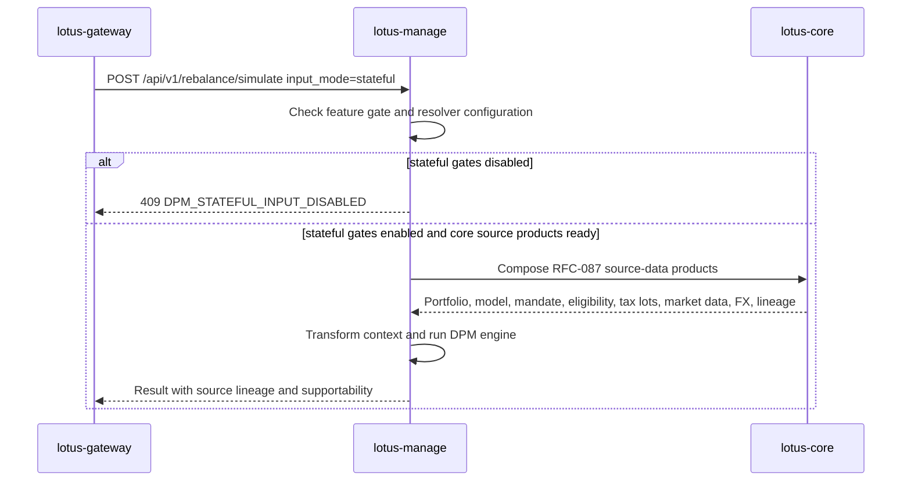
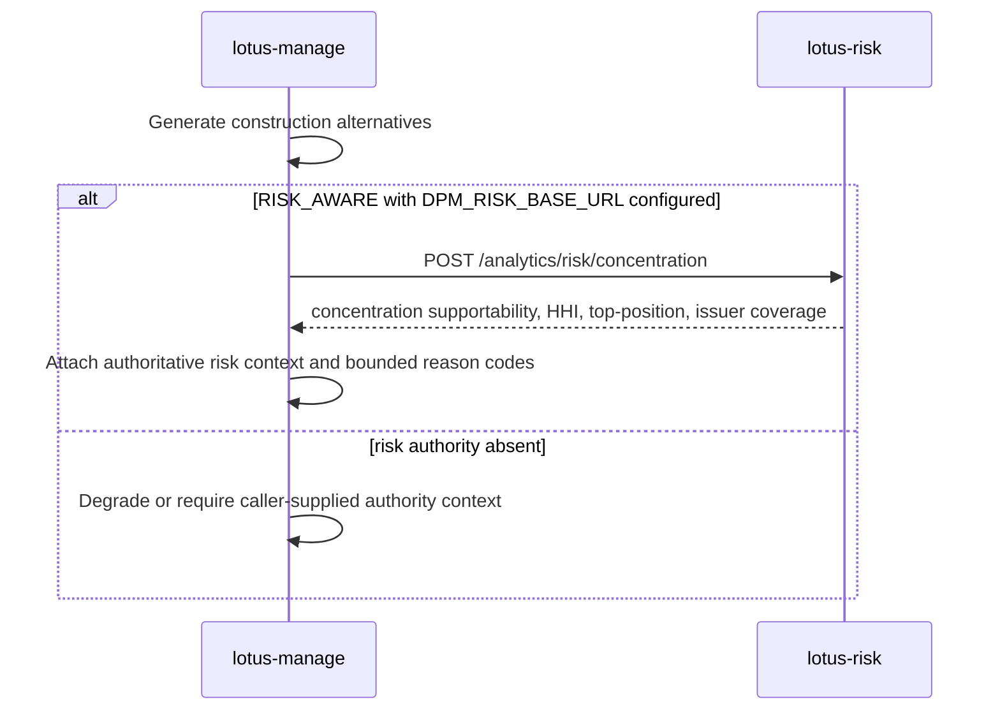
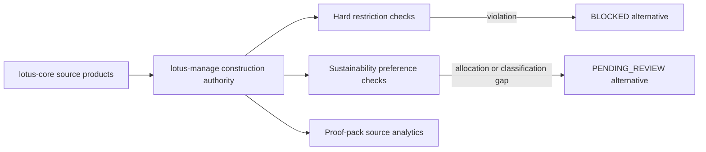
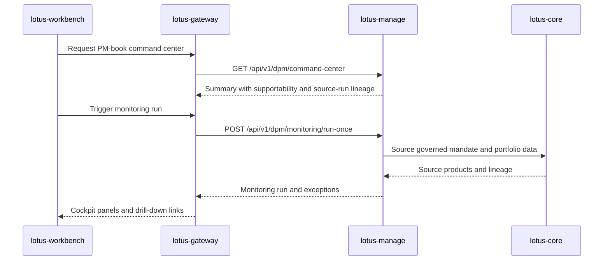
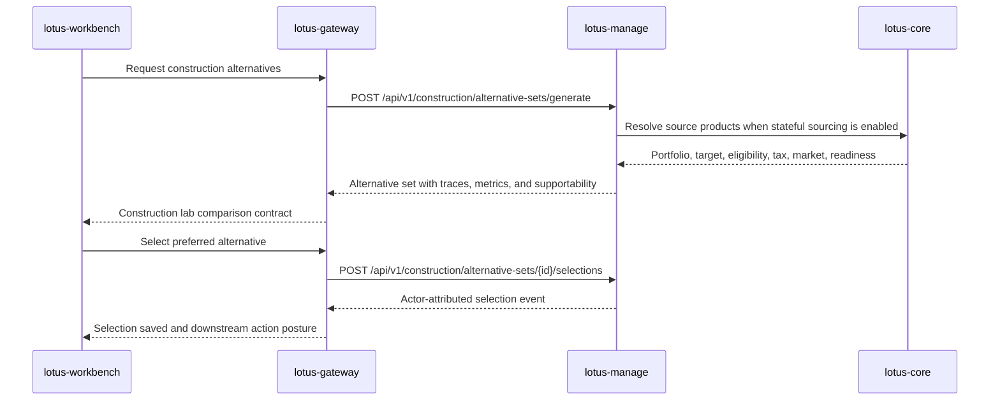

# Integrations

## Upstream and downstream posture

- `lotus-core`
  source-data authority when management flows use core-referenced portfolio or market inputs
- `lotus-risk`
  risk-methodology authority for concentration outputs consumed by RFC-0039 risk-aware construction
- `lotus-gateway`
  primary consumer of management execution, supportability, and capability-discovery contracts
- `lotus-advise`
  owner of advisor-led proposal simulation, proposal artifacts, and proposal lifecycle workflows;
  `lotus-manage` must not reintroduce those concerns

## Boundary rules

1. `lotus-manage` may execute deterministic rebalance decisions from governed inputs
2. inline bundles do not transfer source-data authority to `lotus-manage`
3. `portfolio_id` and future stateful modes must stay grounded in governed `lotus-core` contracts
4. capability consumers should use canonical snake_case query parameters `consumer_system` and
   `tenant_id`
5. advisory proposal workflows should be integrated through `lotus-advise`
6. risk-aware construction must consume `lotus-risk` authority or source-backed authority context;
   `lotus-manage` must not recalculate risk methodology locally

## Core Sourcing Target



Current state:

1. `lotus-manage` has the typed stateful request models, resolver client, transformation helpers,
   and lineage fields.
2. The first RFC-087 source-product integrations exist for `DpmModelPortfolioTarget:v1` through
   `POST /integration/model-portfolios/{model_portfolio_id}/targets` and
   `DiscretionaryMandateBinding:v1` through
   `POST /integration/portfolios/{portfolio_id}/mandate-binding`, and
   `InstrumentEligibilityProfile:v1` through `POST /integration/instruments/eligibility-bulk`, and
   `PortfolioTaxLotWindow:v1` through `POST /integration/portfolios/{portfolio_id}/tax-lots`, and
   `MarketDataCoverageWindow:v1` through `POST /integration/market-data/coverage`.
3. `lotus-core` RFC-087 source APIs passed canonical live proof for the governed
   `PB_SG_GLOBAL_BAL_001` mandate portfolio.
4. Capability discovery does not advertise stateful execution unless the stateful gate,
   `DPM_CORE_BASE_URL`, non-legacy resolver configuration, and capability flag are all enabled.
   Stateful construction also needs `DPM_CORE_QUERY_BASE_URL` when query-plane products such as
   `PortfolioCashflowProjection:v1` are part of the proof.
5. RFC-0036 now tracks the upstream gap through `lotus-core` RFC-087 and updated
   `sgajbi/lotus-core#330`.

Current source-product integration status:

| Source product | lotus-manage posture | Promotion impact |
| --- | --- | --- |
| `DpmModelPortfolioTarget:v1` | Client method and transformer implemented; live proof passed. | Supplies discretionary model targets. |
| `DiscretionaryMandateBinding:v1` | Client method, policy-context transformer, and mandate-twin transformer implemented; live proof passed for the first source wave. | Supplies mandate authority, objective, review cadence, review dates, policy pack, and booking context. |
| `InstrumentEligibilityProfile:v1` | Client method and shelf-entry transformer implemented; live proof passed. | Supplies buy/sell eligibility, restrictions, settlement, issuer, and taxonomy. |
| `PortfolioTaxLotWindow:v1` | Client method and tax-lot-to-portfolio transformer implemented; live proof passed. | Supplies tax-aware lot context. |
| `MarketDataCoverageWindow:v1` | Client method and market-data transformer implemented; stale or missing price/FX coverage blocks stateful source assembly. Live proof passed. | Supplies price and FX coverage. |
| `PortfolioCashflowProjection:v1` | Query-plane client method and liquidity-context transformer implemented; live proof is enforced through `stateful_source_backed_construction`. | Supplies operational projected cash-pressure evidence for liquidity-aware construction without turning manage into a forecasting source. |
| `DpmSourceReadiness:v1` | Core source-family readiness product implemented; live proof passed. | Operator/control-plane readiness summary for source families. |

`TransactionCostCurve:v1` uses a configurable observed-cost lookback through
`DPM_CORE_TRANSACTION_COST_LOOKBACK_DAYS`, defaulting to 400 days. The longer default reflects
private-banking portfolio turnover patterns and remains bounded to observed booked fees; it is not a
market-impact, venue, fill-quality, or best-execution model.

Live proof on 2026-05-02:

1. `POST http://core-control.dev.lotus/integration/portfolios/PB_SG_GLOBAL_BAL_001/dpm-execution-context`
   returned `404`.
2. `POST http://core-query.dev.lotus/integration/portfolios/PB_SG_GLOBAL_BAL_001/dpm-execution-context`
   returned `404`.
3. `POST http://manage.dev.lotus/api/v1/rebalance/simulate` with `input_mode=stateful` returned
   `200` with `lineage.input_mode=stateful`, `lineage.source_system=lotus-core`,
   `lineage.source_supportability_state=READY`, model version `2026.04`, and a populated
   `stateful_context_hash`.
4. The executable proof command covers manage behavior, composed source posture, and historical
   monolithic route absence:

```powershell
$env:LOTUS_MANAGE_EXPECT_STATEFUL_CORE_SOURCING="available"
make live-api-validate-core
```

Runtime guardrail: `lotus-manage` no longer defaults to the retired monolithic
`/integration/portfolios/{portfolio_id}/dpm-execution-context` route.

## Manage API Consumers

Strategic downstream consumption should use:

1. `GET /api/v1/integration/capabilities`
2. `POST /api/v1/rebalance/simulate`
3. `POST /api/v1/rebalance/analyze`
4. `POST /api/v1/rebalance/analyze/async`
5. `/api/v1/rebalance/runs/*` supportability and artifact routes
6. `/api/v1/rebalance/operations/*` async-operation routes
7. `/api/v1/rebalance/policies/*` policy-pack supportability routes
8. `/api/v1/mandates/*` mandate digital-twin, health, version, and diff routes
9. `/api/v1/dpm/monitoring/*` monitoring-run routes
10. `/api/v1/dpm/exceptions*` exception queue and resolution routes
11. `GET /api/v1/dpm/command-center` bounded command-center summary
12. `/api/v1/construction/alternative-sets/*` construction alternative generate/read/selection
    routes

## Construction Alternatives Upstream Authority

RFC-0039 authority-backed construction adds one direct upstream analytical dependency:



Liquidity-aware construction uses manage execution diagnostics, cash/settlement posture, bounded
policy context, and optional `lotus-core` `PortfolioCashflowProjection:v1` evidence when supplied
through `AuthoritativeLiquidityContext.cashflow_projection`. Manage applies the source-owned total
net cashflow only as projected cash-pressure evidence against the minimum-cash policy; it does not
invent client income needs, liability ladders, or planning forecasts. Currency-overlay construction
uses FX readiness and bounded policy context. Regime-stress-aware construction consumes `lotus-risk`
`RegimeScenarioPackEvaluation:v1` through the bounded risk-authority client when `DPM_RISK_BASE_URL`
is configured, and still accepts caller-supplied source-backed scenario-pack authority context.
When a selected construction alternative carries that context, proof packs preserve it in
`scenario_and_regime_evidence` with source refs, canonical source hash, scenario pack id,
worst-case loss, policy threshold, supportability state, and bounded reason codes. Manage does not
generate scenario methodology, contribution rows, or CIO approval evidence locally.
ESG/restriction-aware construction consumes `lotus-core` `ClientRestrictionProfile:v1` and
`SustainabilityPreferenceProfile:v1` through the same stateful core-sourcing path. Manage can block
candidate trades that violate hard client restrictions and can flag sustainability allocation or
classification evidence gaps for review. It does not infer unsupported ESG classifications or
convert sustainability preferences into automatic compliance approval.

Mandate-health refresh also consumes `ClientRestrictionProfile:v1`,
`SustainabilityPreferenceProfile:v1`, and `PortfolioCashflowProjection:v1` when those optional
core products are available. Manage preserves their lineage on the mandate twin, keeps gap codes
when a product is unavailable, blocks restricted active model targets, flags sustainability
preferences for review, and treats source-owned negative projected net cashflow as cash-liquidity
attention. This is not a client income-needs, security-level ESG classification, or suitability
approval engine.

Risk-event rebalance waves consume `lotus-risk` `RiskEventAffectedCohort:v1` through the bounded
risk-authority client when `DPM_RISK_BASE_URL` is configured. Manage requires caller-supplied
candidate portfolios and source-supplied exposure weights, preserves lotus-risk cohort/event/member
lineage, and fails closed instead of calculating risk-event impact or full-book membership locally.
Tactical house-view Manage consumption and implicit campaign cohorts remain unpromoted until their owning implementations
publish governed cohort products.



Removed or stale consumers should not call unversioned `/rebalance/*` routes, removed
`/api/v1/platform/capabilities`, or proposal/advisory-era DPM endpoints.

## DPM Command Center Downstream Handoff

RFC-0038 adds the backend foundation for mandate digital twins, health scoring, monitoring
exceptions, monitoring runs, and command-center summaries. Downstream integration should follow this
boundary:

1. `lotus-workbench` must consume the command center through `lotus-gateway`.
2. `lotus-gateway` may compose `lotus-manage` APIs but must not recompute health, reason codes,
   recommended actions, or source-readiness supportability.
3. Workbench panels should surface complete, partial, and empty command-center states explicitly.
4. Canonical demo data should include `PB_SG_GLOBAL_BAL_001`,
   `MANDATE_PB_SG_GLOBAL_BAL_001`, `PM_SG_DPM_001`, and `BOOK_SG_BALANCED_DPM`.



The implementation handoff contract is maintained in
[`docs/architecture/dpm-command-center-gateway-workbench-handoff.md`](../docs/architecture/dpm-command-center-gateway-workbench-handoff.md).

Downstream tracking:

1. `lotus-gateway`: [sgajbi/lotus-gateway#180](https://github.com/sgajbi/lotus-gateway/issues/180)
2. `lotus-workbench`:
   [sgajbi/lotus-workbench#140](https://github.com/sgajbi/lotus-workbench/issues/140)
3. `lotus-platform`: [sgajbi/lotus-platform#294](https://github.com/sgajbi/lotus-platform/issues/294)

## DPM Construction Alternatives Downstream Handoff

RFC-0039 adds the backend foundation for generating, reading, and selecting construction
alternative sets. Downstream integration should follow this boundary:

1. `lotus-workbench` must consume construction alternatives through `lotus-gateway`.
2. `lotus-gateway` may compose `lotus-manage` alternatives but must not recompute methods,
   comparison metrics, supportability states, or reason codes.
3. Workbench should render do-nothing, explainable heuristic, minimum-turnover, and tax-aware
   alternatives with clear ready, pending-review, degraded, blocked, and infeasible states.
4. Canonical demo data for `PB_SG_GLOBAL_BAL_001` should exercise meaningful drift, turnover, tax,
   source-readiness, and selection evidence.



The implementation handoff contract is maintained in
[`docs/architecture/dpm-construction-alternatives-gateway-workbench-handoff.md`](../docs/architecture/dpm-construction-alternatives-gateway-workbench-handoff.md).

## Reference

- [docs/standards/RFC-0082-upstream-contract-family-map.md](../docs/standards/RFC-0082-upstream-contract-family-map.md)
