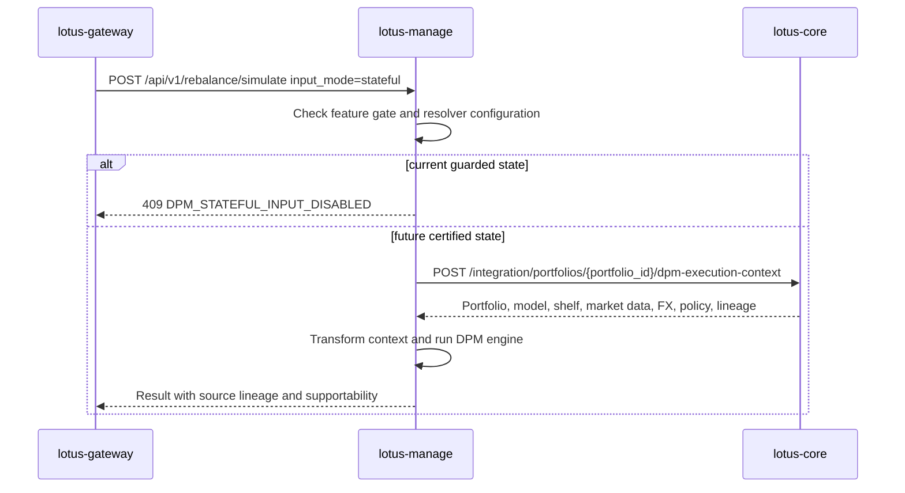

# Integrations

## Upstream and downstream posture

- `lotus-core`
  source-data authority when management flows use core-referenced portfolio or market inputs
- `lotus-gateway`
  primary consumer of management execution, supportability, and capability-discovery contracts
- `lotus-advise`
  owner of advisor-led proposal simulation, proposal artifacts, and proposal lifecycle workflows;
  `lotus-manage` must not reintroduce those concerns

## Boundary rules

1. `lotus-manage` may execute deterministic rebalance decisions from governed inputs
2. inline bundles do not transfer source-data authority to `lotus-manage`
3. `portfolio_id` and future stateful modes must stay grounded in governed `lotus-core` contracts
4. capability consumers should use canonical snake_case query parameters `consumer_system` and
   `tenant_id`
5. advisory proposal workflows should be integrated through `lotus-advise`

## Core Sourcing Target



Current state:

1. `lotus-manage` has the typed stateful request models, resolver client, transformation helpers,
   and lineage fields.
2. `lotus-core` does not yet expose the certified DPM execution-context contract required for
   production stateful promotion.
3. Capability discovery does not advertise stateful execution unless the stateful gate,
   `DPM_CORE_BASE_URL`, and capability flag are all enabled.
4. RFC-0036 tracks the upstream gap through `sgajbi/lotus-core#330`.

Live proof on 2026-05-02:

1. `POST http://core-control.dev.lotus/integration/portfolios/PB_SG_GLOBAL_BAL_001/dpm-execution-context`
   returned `404`.
2. `POST http://core-query.dev.lotus/integration/portfolios/PB_SG_GLOBAL_BAL_001/dpm-execution-context`
   returned `404`.
3. `POST http://manage.dev.lotus/api/v1/rebalance/simulate` with `input_mode=stateful` returned
   `409 DPM_STATEFUL_INPUT_DISABLED`.
4. The executable proof command now covers both manage behavior and core route posture:

```powershell
python scripts/validate_live_api.py --base-url http://manage.dev.lotus --skip-demo-pack --core-base-url http://core-control.dev.lotus --core-base-url http://core-query.dev.lotus --expect-core-dpm-route absent --json-output output/rfc-0036-s12-core-manage-api-summary.json
```

This is the correct current behavior: manage is ready for the implemented stateless surface, while
stateful core-sourced execution remains withheld until the upstream route is certified.

## Manage API Consumers

Strategic downstream consumption should use:

1. `GET /api/v1/integration/capabilities`
2. `POST /api/v1/rebalance/simulate`
3. `POST /api/v1/rebalance/analyze`
4. `POST /api/v1/rebalance/analyze/async`
5. `/api/v1/rebalance/runs/*` supportability and artifact routes
6. `/api/v1/rebalance/operations/*` async-operation routes
7. `/api/v1/rebalance/policies/*` policy-pack supportability routes

Removed or stale consumers should not call unversioned `/rebalance/*` routes, removed
`/api/v1/platform/capabilities`, or proposal/advisory-era DPM endpoints.

## Reference

- [docs/standards/RFC-0082-upstream-contract-family-map.md](../docs/standards/RFC-0082-upstream-contract-family-map.md)
