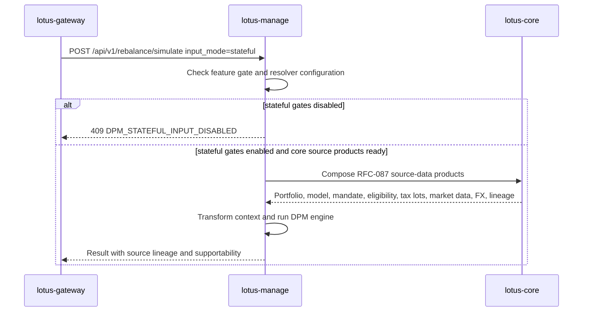

# Integrations

## Upstream and downstream posture

- `lotus-core`
  source-data authority when management flows use core-referenced portfolio or market inputs
- `lotus-gateway`
  primary consumer of management execution, supportability, and capability-discovery contracts
- `lotus-advise`
  owner of advisor-led proposal simulation, proposal artifacts, and proposal lifecycle workflows;
  `lotus-manage` must not reintroduce those concerns

## Boundary rules

1. `lotus-manage` may execute deterministic rebalance decisions from governed inputs
2. inline bundles do not transfer source-data authority to `lotus-manage`
3. `portfolio_id` and future stateful modes must stay grounded in governed `lotus-core` contracts
4. capability consumers should use canonical snake_case query parameters `consumer_system` and
   `tenant_id`
5. advisory proposal workflows should be integrated through `lotus-advise`

## Core Sourcing Target



Current state:

1. `lotus-manage` has the typed stateful request models, resolver client, transformation helpers,
   and lineage fields.
2. The first RFC-087 source-product integrations exist for `DpmModelPortfolioTarget:v1` through
   `POST /integration/model-portfolios/{model_portfolio_id}/targets` and
   `DiscretionaryMandateBinding:v1` through
   `POST /integration/portfolios/{portfolio_id}/mandate-binding`, and
   `InstrumentEligibilityProfile:v1` through `POST /integration/instruments/eligibility-bulk`, and
   `PortfolioTaxLotWindow:v1` through `POST /integration/portfolios/{portfolio_id}/tax-lots`, and
   `MarketDataCoverageWindow:v1` through `POST /integration/market-data/coverage`.
3. `lotus-core` RFC-087 source APIs passed canonical live proof for the governed
   `PB_SG_GLOBAL_BAL_001` mandate portfolio.
4. Capability discovery does not advertise stateful execution unless the stateful gate,
   `DPM_CORE_BASE_URL`, non-legacy resolver configuration, and capability flag are all enabled.
5. RFC-0036 now tracks the upstream gap through `lotus-core` RFC-087 and updated
   `sgajbi/lotus-core#330`.

Current source-product integration status:

| Source product | lotus-manage posture | Promotion impact |
| --- | --- | --- |
| `DpmModelPortfolioTarget:v1` | Client method and transformer implemented; live proof passed. | Supplies discretionary model targets. |
| `DiscretionaryMandateBinding:v1` | Client method and policy-context transformer implemented; live proof passed. | Supplies mandate authority, policy pack, and booking context. |
| `InstrumentEligibilityProfile:v1` | Client method and shelf-entry transformer implemented; live proof passed. | Supplies buy/sell eligibility, restrictions, settlement, issuer, and taxonomy. |
| `PortfolioTaxLotWindow:v1` | Client method and tax-lot-to-portfolio transformer implemented; live proof passed. | Supplies tax-aware lot context. |
| `MarketDataCoverageWindow:v1` | Client method and market-data transformer implemented; stale or missing price/FX coverage blocks stateful source assembly. Live proof passed. | Supplies price and FX coverage. |
| `DpmSourceReadiness:v1` | Core source-family readiness product implemented; live proof passed. | Operator/control-plane readiness summary for source families. |

Live proof on 2026-05-02:

1. `POST http://core-control.dev.lotus/integration/portfolios/PB_SG_GLOBAL_BAL_001/dpm-execution-context`
   returned `404`.
2. `POST http://core-query.dev.lotus/integration/portfolios/PB_SG_GLOBAL_BAL_001/dpm-execution-context`
   returned `404`.
3. `POST http://manage.dev.lotus/api/v1/rebalance/simulate` with `input_mode=stateful` returned
   `200` with `lineage.input_mode=stateful`, `lineage.source_system=lotus-core`,
   `lineage.source_supportability_state=READY`, model version `2026.04`, and a populated
   `stateful_context_hash`.
4. The executable proof command covers manage behavior, composed source posture, and historical
   monolithic route absence:

```powershell
$env:LOTUS_MANAGE_EXPECT_STATEFUL_CORE_SOURCING="available"
make live-api-validate-core
```

Runtime guardrail: `lotus-manage` no longer defaults to the retired monolithic
`/integration/portfolios/{portfolio_id}/dpm-execution-context` route.

## Manage API Consumers

Strategic downstream consumption should use:

1. `GET /api/v1/integration/capabilities`
2. `POST /api/v1/rebalance/simulate`
3. `POST /api/v1/rebalance/analyze`
4. `POST /api/v1/rebalance/analyze/async`
5. `/api/v1/rebalance/runs/*` supportability and artifact routes
6. `/api/v1/rebalance/operations/*` async-operation routes
7. `/api/v1/rebalance/policies/*` policy-pack supportability routes

Removed or stale consumers should not call unversioned `/rebalance/*` routes, removed
`/api/v1/platform/capabilities`, or proposal/advisory-era DPM endpoints.

## Reference

- [docs/standards/RFC-0082-upstream-contract-family-map.md](../docs/standards/RFC-0082-upstream-contract-family-map.md)
