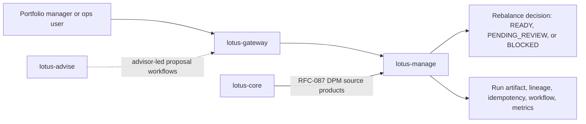

# Overview

## Business role

`lotus-manage` owns discretionary mandate portfolio-management execution, management-side workflow
review, and operational supportability. It turns governed portfolio inputs into deterministic
rebalance decisions, supportability evidence, policy controls, and operational workflow state.

In business terms, `lotus-manage` is the execution-control service for mandate portfolio managers
and operations teams. It answers: "given the governed portfolio context and mandate policy, what
rebalance action is allowed, what evidence supports that decision, and what operational review is
required before execution?"

## Ownership boundaries

This repo owns:

1. rebalance simulation and what-if analysis
2. async operation execution and run lookup
3. policy-pack resolution and workflow-gate supportability
4. run artifacts, lineage, idempotency, and management-side lifecycle support

This repo does not own:

1. advisor-led proposal workflows, which belong to `lotus-advise`
2. canonical portfolio state and source-data truth, which belong to `lotus-core`
3. risk methodology or performance analytics authority, which belong to `lotus-risk` and
   `lotus-performance`

## Current posture

- management-side service after the `lotus-advise` split
- canonical host runtime on port `8001` so both services can coexist locally
- explicit no-alias, OpenAPI, vocabulary, migration, and security governance in CI
- proposal simulation, artifacts, consent, and lifecycle routes are owned by `lotus-advise`
- stateless execution is the implemented and advertised runtime mode
- stateful `portfolio_id` execution is modeled behind guardrails, but not promoted until
  `lotus-core` exposes the RFC-087 certified composed DPM source-data products

## Current Proof Posture

Current branch code has strengthened API, OpenAPI, mesh, observability, and live core-sourcing
validation. After bringing up the core/manage proof path on 2026-05-02, direct canonical-host
manage API proof passed 11/11 probes against `http://manage.dev.lotus`,
`http://core-control.dev.lotus`, and `http://core-query.dev.lotus`.

That proof covers the implemented stateless API surface and the explicitly gated stateful
`portfolio_id` path. Stateful mode composes RFC-087 `lotus-core` source products and publishes
`stateful` capability truth only when the stateful capability flag, stateful core-sourcing flag,
and core base URL are configured.
