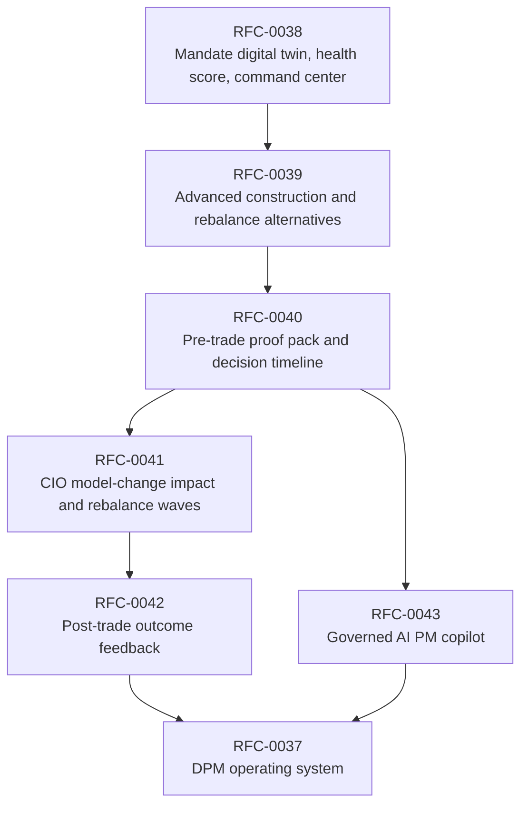
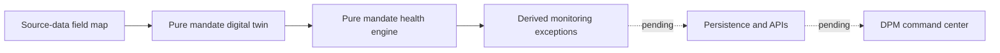

# Roadmap

## Direction

`lotus-manage` is being rebuilt as the discretionary mandate portfolio-management operating system
for Lotus. The goal is not to preserve the old API shape. The goal is a clean, certified,
enterprise-grade DPM service that can support portfolio managers, CIO offices, compliance,
operations, sales, and client-demo teams with implementation-backed evidence.

Current implementation-backed posture:

1. management-side rebalance execution and what-if analysis are supported,
2. run supportability, artifacts, lineage, idempotency, workflow gates, policy packs, and
   PostgreSQL-backed operational evidence are supported or feature-gated as documented in
   [Supported Features](Supported-Features),
3. stateful `portfolio_id` execution is implemented behind explicit runtime gates and composes
   governed `lotus-core` RFC-087 source products when the canonical core/manage stack is configured,
4. advisory proposal workflows remain outside this repository and belong to `lotus-advise`.
5. RFC-0038 has started with a pure mandate digital-twin and health-engine foundation; no
   mandate/health/command-center APIs are supported yet.

Strategic posture:

1. no production downstream dependency is assumed for the target RFC-0037 through RFC-0043 surfaces,
2. duplicate, advisory-era, poorly named, or misleading manage endpoints may be deleted rather than
   kept for backward compatibility,
3. future gateway and Workbench integration should be rebuilt against the certified target contract,
4. every feature must improve enterprise posture through better source authority, auditability,
   observability, supportability, tests, and documentation.

## Strategic Roadmap

| RFC | Business outcome | Enterprise posture raised by |
| --- | --- | --- |
| RFC-0038 | PMs see mandate state, health, exceptions, and book attention queues. | Source-lineage-backed mandate twin, deterministic scoring, certified command-center APIs. |
| RFC-0039 | PMs compare construction alternatives with visible risk, tax, liquidity, FX, ESG, and cost trade-offs. | Objective/constraint traces, solver supportability, degraded-source handling, certified alternative APIs. |
| RFC-0040 | PMs, compliance, operations, CIO, and audit can inspect one pre-trade evidence artifact. | Durable proof packs, decision timeline, report/AI handoff contracts, lineage and retention posture. |
| RFC-0041 | CIO and PM teams can orchestrate book-level model-change and rebalance waves. | Item-level readiness, state-machine governance, actor-attributed approvals, bounded aggregate metrics. |
| RFC-0042 | PMs learn from expected-versus-realized outcomes after execution. | Source-authoritative realized evidence, variance decomposition, searchable outcome memory. |
| RFC-0043 | AI assists PM productivity without owning investment truth. | Structured evidence input, forbidden-action guardrails, no-sensitive telemetry, AI-unavailable fallback. |

## Business Value Themes

1. scale PM capacity through exception-based monitoring and wave orchestration,
2. improve investment discipline through mandate, policy, CIO, risk, tax, liquidity, currency, and
   ESG controls,
3. improve trust through proof packs, lineage, decision timelines, and outcome reviews,
4. strengthen sales and demo material through implementation-backed DPM stories,
5. raise Lotus ecosystem value by orchestrating `lotus-core`, `lotus-risk`, `lotus-performance`,
   `lotus-report`, `lotus-ai`, `lotus-gateway`, and `lotus-workbench`.

## Non-Negotiable Delivery Rules

1. target-state features remain `Proposed` until live evidence proves them,
2. OpenAPI must explain what each endpoint is for, when to use it, how to call it, and every
   request/response/error field,
3. every endpoint must expose source-readiness and degraded states rather than hiding missing data,
4. every implementation must satisfy data-mesh, structured logging, metrics, health, readiness,
   audit, and supportability standards,
5. documentation is part of the product and must serve business, engineering, sales, marketing,
   operations, and client-demo preparation.

## RFC-0038 Current Implementation Progress

The first RFC-0038 slice establishes source-mapped domain primitives only. It is useful engineering
foundation, but it is not yet a supported product feature because persistence, APIs, OpenAPI
certification, live core/manage proof, and Workbench/Gateway handoff remain pending.
