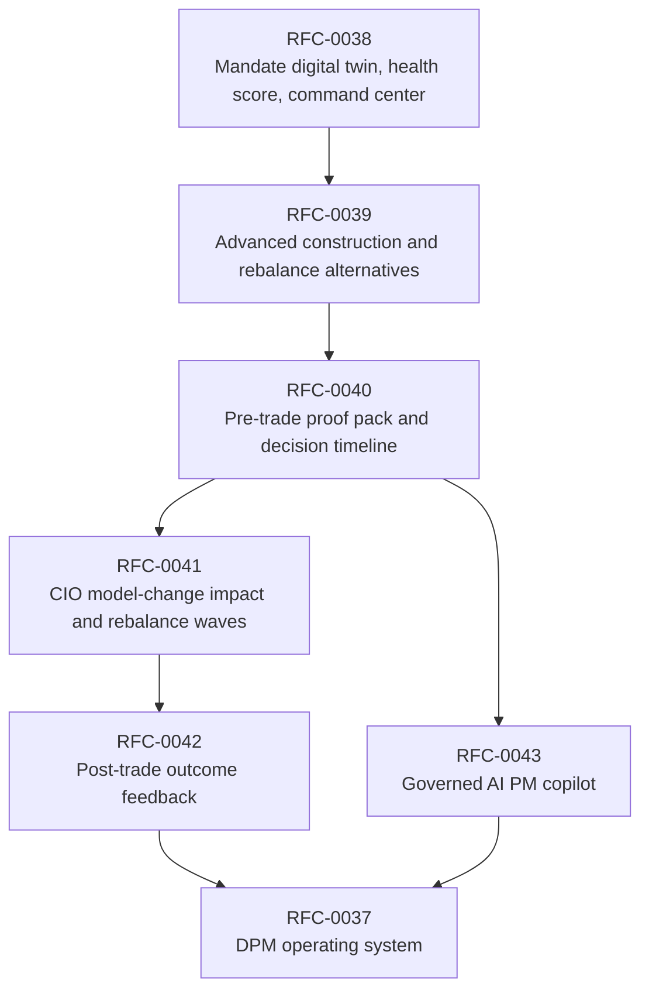

# Roadmap

## Direction

`lotus-manage` is being rebuilt as the discretionary mandate portfolio-management operating system
for Lotus. The goal is not to preserve the old API shape. The goal is a clean, certified,
enterprise-grade DPM service that can support portfolio managers, CIO offices, compliance,
operations, sales, and client-demo teams with implementation-backed evidence.

Current implementation-backed posture:

1. management-side rebalance execution and what-if analysis are supported,
2. run supportability, artifacts, lineage, idempotency, workflow gates, policy packs, and
   PostgreSQL-backed operational evidence are supported or feature-gated as documented in
   [Supported Features](Supported-Features),
3. stateful `portfolio_id` execution is implemented behind explicit runtime gates and composes
   governed `lotus-core` RFC-087 source products when the canonical core/manage stack is configured,
4. advisory proposal workflows remain outside this repository and belong to `lotus-advise`.
5. RFC-0038 has delivered the first implementation-backed DPM operating-system foundation:
   mandate digital-twin, health-engine, repository, migration, mandate refresh/read/version/diff
   APIs, standalone health APIs, bounded monitoring/exception APIs, and a bounded command-center
   summary API with local manage and live core/manage proof.
6. RFC-0039 has delivered the manage-side construction-alternative foundation with first-wave
   generate/read/select APIs, Postgres-backed proof, and Gateway/Workbench realization requirements
   for the later product-surface journey.

Strategic posture:

1. no production downstream dependency is assumed for the target RFC-0037 through RFC-0043 surfaces,
2. duplicate, advisory-era, poorly named, or misleading manage endpoints may be deleted rather than
   kept for backward compatibility,
3. future gateway and Workbench integration should be rebuilt against the certified target contract,
4. every feature must improve enterprise posture through better source authority, auditability,
   observability, supportability, tests, and documentation.

## Strategic Roadmap

| RFC | Business outcome | Enterprise posture raised by |
| --- | --- | --- |
| RFC-0038 | PMs see mandate state, health, exceptions, and book attention queues. | Source-lineage-backed mandate twin, deterministic scoring, certified command-center APIs. |
| RFC-0039 | PMs compare construction alternatives with visible risk, tax, liquidity, FX, regime-stress, ESG/restriction, and cost trade-offs. | Manage backend foundation is implementation-backed for first-wave methods, mandatory authority-backed advanced methods, objective/constraint traces, solver/fallback supportability posture, `lotus-risk` concentration authority integration, optional `lotus-core` `PortfolioCashflowProjection:v1` projected cash-pressure evidence for liquidity-aware construction, `lotus-risk` `RegimeScenarioPackEvaluation:v1` scenario-pack evaluation for regime-stress-aware construction, source-backed `ClientRestrictionProfile:v1` and `SustainabilityPreferenceProfile:v1` consumption for ESG/restriction-aware construction, certified alternative APIs, Postgres proof, explicit client-income-need deferral, and downstream Gateway/Workbench realization requirements for the new profile surface. Full product-outcome claims wait for downstream implementation and live proof. |
| RFC-0040 | PMs, compliance, operations, CIO, and audit can inspect one pre-trade evidence artifact. | Manage-owned durable proof-pack JSON, Markdown summary, report-input and AI-evidence input contracts, lineage and retention posture, Gateway/Workbench realization RFC alignment, and canonical Postgres-backed live proof. Full front-office product support waits for downstream Gateway/Workbench/report/AI implementation. |
| RFC-0041 | CIO and PM teams can orchestrate book-level model-change and rebalance waves. | Manage backend implementation is `DONE` for explicit portfolio-list waves, source-owned PM-book wave discovery, source-owned CIO model-change affected-mandate discovery, bounded source-owned risk-event discovery, bounded source-owned tactical house-view discovery, bounded bulk-review campaign membership, persisted campaign discovery, campaign-definition preview-readiness, campaign-definition launch packages, and campaign-definition lifecycle controls: source-map, platform scaffold evidence improvement, cleanup review, wave domain contracts, Postgres-backed persistence, preview/create, `PM_BOOK_REVIEW` over lotus-core `PortfolioManagerBookMembership:v1`, `CIO_MODEL_CHANGE` over lotus-core `CioModelChangeAffectedCohort:v1`, `RISK_EVENT` over lotus-risk `RiskEventAffectedCohort:v1`, `TACTICAL_HOUSE_VIEW` over lotus-advise `TacticalHouseViewAffectedCohort:v1`, `BULK_REVIEW_CAMPAIGN` over Manage-owned `BulkReviewCampaignMembership:v1` / `BulkReviewCampaignDefinition:v1`, `BulkReviewCampaignDiscovery:v1` at `GET /api/v1/rebalance/waves/campaign-discovery`, `BulkReviewCampaignDefinitionPreviewReadiness` at `GET /api/v1/rebalance/waves/campaign-definitions/{campaign_id}/versions/{campaign_version}/preview-readiness`, `BulkReviewCampaignDefinitionLaunchPackage` at `GET /api/v1/rebalance/waves/campaign-definitions/{campaign_id}/versions/{campaign_version}/launch-package`, retired and superseded campaign definitions that remain auditable but fail closed for new preview/create use, mixed source-check, RFC-0039-backed ready-item simulation, item-level selection, RFC-0040 proof-pack linkage, approval-with-exceptions, staging, internal operations handoff evidence with no external execution claim, actor-attributed pre-execution cancellation, retrieve/search/item/proof-pack/supportability read models, product-safe diagnostics, OpenAPI certification, hardening review, final gold-pass assessment, downstream Gateway/Workbench RFC-0098 wave realization addenda, Gateway campaign-definition BFF composition, and Workbench active campaign-definition list rendering. Broader campaign workflow surfaces beyond bounded definition lifecycle controls, global portfolio-universe campaign discovery, and external OMS execution remain deferred until owning implementations are proven. Full product support remains governed by owning downstream implementation and canonical front-office proof. |
| RFC-0042 | PMs learn from expected-versus-realized outcomes after execution. | `DONE` for the manage backend authority and first-wave product realization. Manage Slice 0-13 authority is complete, post-merge audit proof exists at `output/rfc0042-outcome-proof/20260505-040212/`, and WTBD audit proof exists at `output/rfc0042-wtbd-audit-outcome-proof/20260505-211611/`. Gateway/Workbench outcome-review product support, report submission/materialization/archive lifecycle, and governed AI narrative request have since been implemented in owning apps and canonically proven at `lotus-workbench/output/playwright/rfc42-wtbd-audit-20260506-fixed/`. Source-owned realized adapters now cover `lotus-risk` `RiskMetricsReport:v1`, drawdown analytics maximum drawdown, average drawdown, ulcer index, and time under water, concentration response position HHI, top-position weight, top-N cumulative weight, issuer HHI, top issuer weight, and selected measures, rolling metrics selected metric/statistic/window measures, and historical attribution selected set/contributor measures, `lotus-performance` workspace-summary TWR/active/MWR returns, contribution selected measures, and attribution reconciliation/level/currency selected measures, and `lotus-core` `HoldingsAsOf:v1` cash totals, `TransactionLedgerWindow:v1` explicit transaction-row trade-fee, withholding-tax, realized-FX-P&L, linked-cashflow measures, `PortfolioCashflowProjection:v1` total net cashflow, `PortfolioLiquidityLadder:v1` operational liquidity bucket measures, `PortfolioCashMovementSummary:v1` signed operational cash movement buckets, source-owned `PortfolioRealizedTaxSummary:v1` portfolio-level explicit realized-tax evidence, and planned external treasury source-product contract boundaries for currency exposure, hedge policy, FX forward curves, eligible hedge instruments, plus active fail-closed external hedge-readiness posture now consumed by Manage as blocked currency-overlay diagnostics. PM operating quality now has Manage policy/score-run/fairness-analysis backend support, Gateway BFF composition, portfolio-memory score-run lineage, and `lotus-ai` `pm_quality_summary.pack@v1` support-only summary over score-run evidence. Remaining roadmap work is source-owner methodology enrichment for portfolio-level FX beyond performance-owned Karnosky-Singer totals, runtime external treasury ingestion, income-needs planning, execution families, external execution/OMS integration, tax advice or tax optimization boundaries, Workbench PM-quality UI, and Gateway/Workbench fairness-analysis plus PM-quality summary invocation. |
| RFC-0043 | AI assists PM productivity without owning investment truth. | `lotus-ai` DPM workflow packs now cover proof-pack PM memo, wave PM memo, outcome-review narrative, operations handoff summary, exception summary, PM quality summary, conservative default-version resolution, forbidden-action/output guardrails, no-raw-payload posture, review-required output, and no-sensitive telemetry boundaries. Gateway and Workbench now expose first-wave operations-handoff and exception-summary invocation through governed Gateway routes. PM-quality summary invocation, full copilot workspace, and additional future product surfaces remain future owner work. |

2026-05-16 source-owner FX attribution update: `lotus-performance` PR #167 (`16261c9`, wiki
`41bdaa3`) tightens portfolio-level `currency_attribution_totals` so grouped attribution requests
that include `currency` plus another dimension recompute a date/currency panel from summed weights
and weight-averaged local/FX returns before applying Karnosky-Singer formulas. This is Performance
methodology truth consumed by Manage; it does not add Manage-local FX attribution, tax,
execution/OMS, or Workbench product claims.

2026-05-16 source-owner historical-attribution supportability update: `lotus-risk` PR #139
(`40ac7a5`, wiki `421ae79`) tightens `HistoricalRiskAttributionReport:v1` so attribution-set
quality flags degrade response-level calculation supportability. Manage consumes that degraded
posture as risk source truth and does not promote flagged attribution to ready evidence locally.

2026-05-16 external treasury source-boundary update: `lotus-core` PR #365 (`c7fa07b0`, wiki
`067f919`) declares planned source-product contracts for `ExternalCurrencyExposure:v1`,
`ExternalHedgePolicy:v1`, `ExternalFXForwardCurve:v1`, and
`ExternalEligibleHedgeInstrument:v1`. `lotus-core` PR #366 (`9e86df3b`, wiki `617e4e6`) exposes
`ExternalHedgeExecutionReadiness:v1` as an active fail-closed `UNAVAILABLE` route, PR #367
(`3d0a7bbd`, wiki `d719c74`) exposes `ExternalCurrencyExposure:v1`, and PR #368 (`763db4c1`,
wiki `50fff30`) exposes `ExternalHedgePolicy:v1`; PR #369 (`89225766`, wiki `72dc91d`) exposes
`ExternalFXForwardCurve:v1`, mirrored by `lotus-platform` PR #335 (`72be854`); PR #370
(`bacad356`, wiki `6e7c706`) exposes `ExternalEligibleHedgeInstrument:v1`. Manage now consumes all
five routes through stateful core sourcing and preserves their unavailable postures in
currency-overlay construction diagnostics as blocked external treasury readiness, exposure, policy,
eligible-instrument, and FX forward-curve context. Manage still makes no FX attribution,
hedge-policy approval, eligible-instrument selection, suitability approval, product recommendation,
hedge advice, forward-pricing, FX valuation methodology, counterparty-selection, best-execution,
treasury-instruction, OMS, fills, or settlement claim.

2026-05-17 external OMS acknowledgement boundary update: `lotus-core` PR #371 (`9774bc40`) exposes
`ExternalOrderExecutionAcknowledgement:v1` as an active fail-closed `UNAVAILABLE` route. Manage
consumes that posture through stateful core sourcing and preserves acknowledgement count, empty
acknowledgement rows, missing data families, blocked capabilities, lineage, and source hash in
construction authority diagnostics. Manage still makes no order-generation, venue-routing,
best-execution, OMS acknowledgement-ingestion, fill, settlement, execution-status-certification, or
autonomous execution claim.

## Business Value Themes

1. scale PM capacity through exception-based monitoring and wave orchestration,
2. improve investment discipline through mandate, policy, CIO, risk, tax, liquidity, currency, and
   ESG controls,
3. improve trust through proof packs, lineage, decision timelines, and outcome reviews,
4. strengthen sales and demo material through implementation-backed DPM stories,
5. raise Lotus ecosystem value by orchestrating `lotus-core`, `lotus-risk`, `lotus-performance`,
   `lotus-report`, `lotus-ai`, `lotus-gateway`, and `lotus-workbench`.

## Non-Negotiable Delivery Rules

1. target-state features remain `Proposed` until live evidence proves them,
2. OpenAPI must explain what each endpoint is for, when to use it, how to call it, and every
   request/response/error field,
3. every endpoint must expose source-readiness and degraded states rather than hiding missing data,
4. every implementation must satisfy data-mesh, structured logging, metrics, health, readiness,
   audit, and supportability standards,
5. documentation is part of the product and must serve business, engineering, sales, marketing,
   operations, and client-demo preparation.

## RFC-0038 Current Implementation Progress

```mermaid
flowchart LR
    FieldMap[Source-data field map] --> Twin[Pure mandate digital twin]
    Twin --> Health[Pure mandate health engine]
    Health --> Exceptions[Derived monitoring exceptions]
    Exceptions --> Persistence[Repository and Postgres migration foundation]
    Persistence --> APIs[Mandate refresh, read, version, diff APIs]
    APIs --> HealthApis[Standalone health and monitoring APIs]
    HealthApis --> Command[DPM command center]
```

The first RFC-0038 implementation wave establishes source-mapped domain primitives, a deterministic
health engine, repository contracts, in-memory persistence, a Postgres repository foundation, and a
Postgres migration. Slice 3 adds the first certified mandate API foundation for refreshing a twin
from product-specific `lotus-core` source products and reading versioned mandate state. Slice 4
adds standalone health read/recalculate plus bounded monitoring run and exception APIs. Slice 5 adds
bounded command-center aggregation over persisted monitoring runs and active exceptions. Local
manage proof and local canonical manage plus live `lotus-core` proof passed; Gateway/Workbench
product-surface integration remains downstream handoff work.
