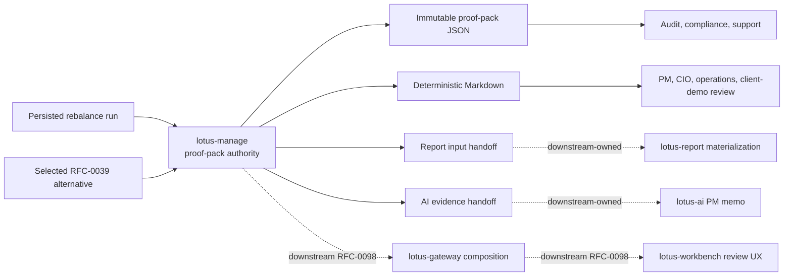
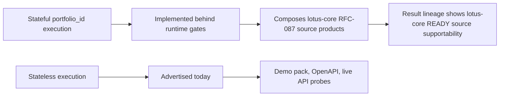

# Supported Features

This page summarizes implementation-backed `lotus-manage` capabilities after the advisory cleanup.
It is intentionally a navigation and demo-prep page; deep mechanics stay in `docs/`.

## Functional Capabilities

| Capability | Primary APIs | Current state | Evidence |
| --- | --- | --- | --- |
| Rebalance simulation | `POST /api/v1/rebalance/simulate` | Supported | unit goldens, OpenAPI gate, API vocabulary gate |
| What-if analysis | `POST /api/v1/rebalance/analyze` | Supported | unit and demo scenarios |
| Async what-if execution | `POST /api/v1/rebalance/analyze/async`, `/api/v1/rebalance/operations/*` | Supported | async operation tests and demo scenario 26 |
| Explicit execution envelope | simulate, analyze, async analyze | Supported with `input_mode=stateless`; `input_mode=stateful` is modeled and feature-gated | envelope contract tests and demo payloads |
| Run supportability | `/api/v1/rebalance/runs/*`, `/api/v1/rebalance/supportability/summary` | Supported | supportability service tests and contract docs tests |
| Deterministic run artifact | `/api/v1/rebalance/runs/{rebalance_run_id}/artifact` | Supported | artifact service tests and demo scenario 27 |
| Lineage lookup | `/api/v1/rebalance/lineage/*` | Feature-gated | lineage service tests |
| Idempotency history | `/api/v1/rebalance/idempotency/*` | Feature-gated | idempotency history service tests and demo scenario 30 |
| Workflow review gates | `/api/v1/rebalance/runs/*/workflow*`, `/api/v1/rebalance/workflow/decisions*` | Feature-gated | workflow service tests and demo scenario 29 |
| Policy-pack supportability | `/api/v1/rebalance/policies/*` | Supported when policy packs are enabled | policy-pack tests and demo scenario 31 |
| Integration capabilities | `/api/v1/integration/capabilities` | Supported | capability contract tests |
| Solver target generation | `POST /api/v1/rebalance/simulate` | Runtime-discovered optional capability | capability contract tests and live demo scenario 08 |
| Stateful `portfolio_id` execution | simulate, analyze, async analyze | Implemented behind explicit runtime gates. When `DPM_CAP_INPUT_MODE_PORTFOLIO_ID_ENABLED=true`, `DPM_STATEFUL_CORE_SOURCING_ENABLED=true`, and `DPM_CORE_BASE_URL` is configured, manage advertises `stateful` and composes governed core data for execution. | resolver unit tests, transformation tests, feature-gate API tests, live `manage.dev.lotus` stateful proof |
| Core model portfolio target sourcing | internal stateful source assembly | Dedicated client method for `DpmModelPortfolioTarget:v1` and transformer to the DPM engine `ModelPortfolio`; live canonical proof passed. | core-sourcing client tests, source-context transformation tests, RFC-087 live validator |
| Core mandate binding sourcing | internal stateful source assembly | Dedicated client method for `DiscretionaryMandateBinding:v1` and transformer to management policy context; live canonical proof passed. | core-sourcing client tests, source-context transformation tests, RFC-087 live validator |
| Core instrument eligibility sourcing | internal stateful source assembly | Dedicated client method for `InstrumentEligibilityProfile:v1` and transformer to DPM engine `ShelfEntry` records carrying shelf status, buy/sell flags, restriction codes, settlement days, liquidity tier, issuer, and taxonomy attributes; live canonical proof passed. | core-sourcing client tests, source-context transformation tests, RFC-087 live validator |
| Core portfolio tax-lot sourcing | internal stateful source assembly | Dedicated client method for `PortfolioTaxLotWindow:v1` and transformer to DPM engine `TaxLot` records carrying lot quantity, unit cost, purchase date, and core lineage-backed cost basis for tax-aware sell allocation; live canonical proof passed. | core-sourcing client tests, source-context transformation tests, RFC-087 live validator |
| Core market-data coverage sourcing | internal stateful source assembly | Dedicated client method for `MarketDataCoverageWindow:v1` and transformer to DPM engine `MarketDataSnapshot`; stale or missing price/FX coverage is rejected before stateful execution can run. Live canonical proof passed. | core-sourcing client tests, source-context transformation tests, RFC-087 live validator |
| Mandate digital-twin APIs | `/api/v1/mandates/*` | Supported as RFC-0038 foundation for refresh/read/version/diff and health read/recalculate. Refresh composes product-specific lotus-core mandate binding, model targets, and optional market-data coverage; source-data gaps remain explicit. Local manage proof and local canonical manage plus live `lotus-core` proof passed; Gateway/Workbench product-surface adoption remains downstream handoff work. | `src/api/routers/mandates.py`, `src/api/services/mandate_service.py`, `tests/unit/dpm/api/test_mandates_api.py`, OpenAPI certification matrix, RFC-0038 proof log |
| Mandate monitoring and exceptions | `/api/v1/dpm/monitoring/*`, `/api/v1/dpm/exceptions*` | Supported as bounded Slice 4 foundation for caller-supplied mandate ids that have already been refreshed. PM-book discovery remains explicit in supportability until Gateway/Core book discovery is added. | `src/api/routers/monitoring.py`, `tests/unit/dpm/api/test_monitoring_api.py`, OpenAPI certification matrix |
| DPM command center foundation | `/api/v1/dpm/command-center` | Supported as a bounded Slice 5 read model over persisted monitoring runs and active exceptions generated by the selected monitoring run. It returns health distribution, attention buckets, recommended actions, latest-run lineage, and supportability state; Workbench/Gateway integration has a Slice 6 handoff contract but is not yet implemented downstream. | `src/api/routers/monitoring.py`, `src/api/services/mandate_service.py`, `tests/unit/dpm/api/test_monitoring_api.py`, OpenAPI certification matrix, `docs/architecture/dpm-command-center-gateway-workbench-handoff.md` |
| Mandate health engine foundation | refresh/health APIs and internal RFC-0038 foundation | Pure deterministic health scoring across ten dimensions with hard-gate overrides, persistence foundation, refresh output, health read/recalculate, monitoring-run integration, and command-center aggregation. | `src/core/mandates.py`, `tests/unit/dpm/core/test_mandate_health.py`, `tests/unit/dpm/api/test_mandates_api.py`, `tests/unit/dpm/api/test_monitoring_api.py` |
| Mandate persistence foundation | internal RFC-0038 foundation | Repository contract, in-memory store, Postgres repository foundation, migration, idempotent snapshot persistence, exception resolution, and retention hooks implemented and used by mandate APIs. | `src/core/mandate_repository.py`, `src/infrastructure/mandates/`, `src/infrastructure/postgres_migrations/dpm/0003_mandate_health_foundation.sql`, `tests/unit/dpm/supportability/test_dpm_mandate_repository.py` |
| Construction alternative generation | `/api/v1/construction/alternative-sets/generate` | Supported as RFC-0039 manage backend foundation for first-wave and authority-backed methods: do-nothing baseline, explainable heuristic, minimum-turnover, tax-aware, solver-constrained, risk-aware through `lotus-risk` concentration authority, liquidity-aware, currency-overlay, and regime-stress-aware. ESG/restriction-aware construction is explicitly deferred until source-backed restriction and sustainability profiles exist. Full product realization through Gateway/Workbench is not yet implemented. | `src/api/routers/construction.py`, `src/api/services/construction_service.py`, `src/core/construction/`, `src/infrastructure/risk_authority/`, `tests/unit/dpm/api/test_construction_api.py`, `tests/unit/dpm/infrastructure/test_risk_authority_client.py`, OpenAPI certification matrix, `scripts/validate_live_api.py` first-wave and authority-backed construction probes |
| Construction alternative read and selection | `GET /api/v1/construction/alternative-sets/{alternative_set_id}`, `POST /api/v1/construction/alternative-sets/{alternative_set_id}/selections` | Supported as persisted backend read and actor-attributed selection foundation. Selection records the preferred alternative but does not execute orders. Postgres-backed live proof passed generate/read/select and supportability summary checks. | `src/core/construction/repository.py`, `src/infrastructure/construction/`, `src/infrastructure/postgres_migrations/dpm/0005_construction_alternatives.sql`, `tests/unit/dpm/construction/test_repository.py`, `tests/unit/dpm/api/test_construction_api.py`, `output/rfc0039-proof/20260503-173624-canonical-postgres/summary.json` |
| Pre-trade proof packs | `POST /api/v1/rebalance/proof-packs`, `GET /api/v1/rebalance/proof-packs/{proof_pack_id}`, `GET /api/v1/rebalance/proof-packs/{proof_pack_id}/summary.md`, `GET /api/v1/rebalance/proof-packs/{proof_pack_id}/report-input`, `GET /api/v1/rebalance/proof-packs/{proof_pack_id}/ai-evidence-input` | Supported as RFC-0040 manage backend authority for durable proof-pack JSON, deterministic Markdown, report-input handoff, AI-evidence handoff, immutable persistence, append-only refs, retention metadata, hashes, lineage, source-backed mandate-context attachment, and truthful degraded/pending-review/blocked section states. Gateway composition, Workbench review UX, report materialization, and AI memo generation are not supported by `lotus-manage`. | `src/core/proof_packs/`, `src/api/routers/proof_packs.py`, `src/infrastructure/proof_packs/`, `tests/unit/dpm/proof_packs/`, `tests/unit/dpm/api/test_proof_pack_api.py`, `scripts/generate_rfc0040_proof_pack_evidence.py`, `output/rfc0040-proof/20260503-145818/manifest.json`, `output/rfc0040-proof/20260503-145818/critical-review.json` |
| Explicit portfolio-list rebalance waves | `POST /api/v1/rebalance/waves/preview`, `POST /api/v1/rebalance/waves`, `GET /api/v1/rebalance/waves`, `GET /api/v1/rebalance/waves/{wave_id}`, `GET /api/v1/rebalance/waves/{wave_id}/items`, `POST /api/v1/rebalance/waves/{wave_id}/source-check`, `POST /api/v1/rebalance/waves/{wave_id}/simulate`, `POST /api/v1/rebalance/waves/{wave_id}/items/{wave_item_id}/select`, `POST /api/v1/rebalance/waves/{wave_id}/approve`, `POST /api/v1/rebalance/waves/{wave_id}/stage`, `POST /api/v1/rebalance/waves/{wave_id}/handoff`, `POST /api/v1/rebalance/waves/{wave_id}/cancel`, `GET /api/v1/rebalance/waves/{wave_id}/proof-pack`, `GET /api/v1/rebalance/waves/{wave_id}/supportability` | Supported as RFC-0041 `DONE` manage backend authority for explicit portfolio-list waves. Manage persists wave state, item states, events, aggregate metrics, proof-pack refs, supportability posture, internal handoff refs, and pre-execution cancellation evidence; it delegates construction to RFC-0039, proof-pack generation to RFC-0040, preserves degraded/review/blocked exceptions, and never claims external execution. Automatic PM-book/CIO cohort discovery, Gateway composition, Workbench UX, and full front-office product support are not supported by `lotus-manage`. | `src/core/waves/`, `src/api/routers/waves.py`, `src/api/services/wave_service.py`, `src/infrastructure/waves/`, `tests/unit/dpm/api/test_waves_api.py`, `tests/unit/dpm/waves/test_wave_domain.py`, `tests/unit/dpm/waves/test_source_readiness.py`, `scripts/generate_rfc0041_wave_evidence.py`, `output/rfc0041-wave-proof/20260504-231914/manifest.json`, `output/rfc0041-wave-proof/20260504-231914/critical-review.json` |

## Pre-Trade Proof Pack Flow

RFC-0040 makes `lotus-manage` the backend authority for pre-trade proof-pack evidence. The proof
pack is the audit object that ties a proposed discretionary portfolio action to mandate context,
source readiness, selected alternative evidence, trade intent, supportability, hashes, lineage, and
downstream handoff packages.



Current supported behavior:

1. generate proof packs from selected construction alternatives and direct rebalance runs,
2. preserve source-honest section states: `READY`, `DEGRADED`, `BLOCKED`, `PENDING_REVIEW`, and
   `NOT_APPLICABLE`,
3. keep the persisted body immutable and add report/AI handoff refs through append-only records,
4. expose content hashes, section hashes, source hashes, lineage, retention metadata, and reason
   codes for operations and audit review,
5. attach persisted RFC-0038 mandate digital-twin and mandate-health evidence when available, and
   degrade `mandate_context` when only a mandate id is supplied,
6. produce bounded report input and AI evidence input without generating reports, prompts, memos,
   approvals, or execution instructions inside `lotus-manage`.

Audience notes:

1. PM and CIO users can treat the Markdown as a readable decision-evidence summary, not as a trade
   execution instruction.
2. Compliance and audit users can use hashes, lineage, retention, and section states to inspect why
   a decision was supportable or blocked at generation time.
3. Operations users can diagnose missing or degraded upstream evidence from reason codes and
   supportability counts.
4. Sales, pre-sales, and client-demo material can show the evidence-fabric flow, but must not claim
   a full Workbench review product until Gateway and Workbench RFC-0098 implementations are live
   and canonical front-office QA passes.

## Rebalance Wave Flow

RFC-0041 makes `lotus-manage` the backend authority for explicit portfolio-list rebalance waves.
It is a manage-owned orchestration and evidence surface, not an order-execution engine and not a
Workbench product claim.

```mermaid
flowchart LR
    PM[PM or CIO operator] --> Preview[Preview explicit portfolio-list wave]
    Preview --> Create[Create durable wave]
    Create --> SourceCheck[Source-check mandate health and readiness]
    SourceCheck --> Ready[Ready item]
    SourceCheck --> Exceptions[Degraded / review / blocked exceptions]
    Ready --> Simulate[RFC-0039 construction alternatives]
    Simulate --> Select[Actor-attributed selection]
    Select --> Proof[RFC-0040 proof pack]
    Proof --> Approve[Approve eligible item]
    Approve --> Stage[Stage approved item]
    Stage --> Handoff[Internal operations handoff<br/>external_execution_claimed=false]
    Exceptions --> Support[Product-safe supportability]
    Handoff --> ReadModels[Search, detail, item, proof-pack posture APIs]
    Support --> ReadModels
    ReadModels -. downstream RFC-0098 .-> Gateway[lotus-gateway composition]
    Gateway -. downstream RFC-0098 .-> Workbench[lotus-workbench command center]
```



Current supported manage-backend behavior:

1. explicit portfolio-list wave preview and durable create,
2. source-check classification across `SOURCE_READY`, `SOURCE_DEGRADED`, `REVIEW_REQUIRED`, and
   `SOURCE_BLOCKED`,
3. RFC-0039 construction delegation for ready items only,
4. RFC-0040 proof-pack linkage from selected alternatives,
5. approval-with-exceptions, approved-item-only staging, internal handoff evidence, and
   pre-execution cancellation,
6. retrieve/search/item/proof-pack/supportability read models for Gateway and operations,
7. bounded supportability diagnostics and telemetry without portfolio/client labels,
8. Postgres-backed live proof under `output/rfc0041-wave-proof/20260504-231914/`.

Current boundaries:

1. automatic PM-book and CIO model-change affected-cohort discovery are not supported yet,
2. Gateway and Workbench command-center realization are planned but not implemented here,
3. manage handoff refs are internal readiness evidence and must not be described as external
   execution or order routing.



## Non-Functional Capabilities

| Capability | Current state | Evidence |
| --- | --- | --- |
| OpenAPI governance | Enforced | `scripts/openapi_quality_gate.py` |
| API vocabulary inventory | Enforced | `scripts/api_vocabulary_inventory.py --validate-only` |
| No-alias contract | Enforced | `scripts/no_alias_contract_guard.py` |
| Monetary precision guard | Enforced | `scripts/check_monetary_float_usage.py` |
| Production persistence guardrails | Enforced | `src/api/persistence_profile.py` and production cutover tests |
| PostgreSQL migration checks | Enforced | `scripts/postgres_migrate.py --target dpm` and migration tests |
| Docker startup readiness | Enforced | local Docker runtime contract tests |
| Live API evidence | Enforced before API readiness claims | `scripts/validate_live_api.py` and `make live-api-validate` |
| Async correlation conflict handling | Enforced | API tests and live API duplicate-correlation probe |
| Source-safe core resolver errors | Enforced for modeled stateful mode | resolver timeout/retry tests, no-core-base-url API test, and stateful feature-gate API test |
| Capability truth gating | Enforced | integration capability tests proving stateful is not published without resolver readiness |
| Mesh product validation | Enforced for repo-native declarations and trust telemetry | `make mesh-contract-validate`, domain product tests, trust telemetry tests |
| Sensitive-safe access and service logging | Enforced | observability and API tests proving route-template logging, redaction of sensitive extra fields, and no raw identifiers in service messages |
| Stateful resolver metrics | Enforced with bounded labels | observability tests and stateful resolver API tests |
| DPM execution and workflow metrics | Enforced with bounded labels | observability tests, API route tests, and monitoring contract validation |
| Monitoring contract governance | Enforced for implemented custom metrics | observability contract validator, monitoring contract tests, `make mesh-contract-validate` |
| Live manage API proof | Passed for implemented stateless/manage API surface after targeted manage refresh | `scripts/validate_live_api.py --base-url http://manage.dev.lotus` checks demo pack, readiness, capability truth, no advisory/proposal routes, deployed OpenAPI certification quality including error examples, stateful core-sourcing guardrails, async conflict behavior, supportability summary, and metrics |
| Manage/core integration posture proof | Passed for stateful available posture | `LOTUS_MANAGE_EXPECT_STATEFUL_CORE_SOURCING=available make live-api-validate-core` proves capability truth, composed core sourcing, READY lineage, supportability persistence, metrics, and old monolithic core route absence |
| Swagger error-response examples | Enforced | central OpenAPI enrichment, `scripts/openapi_quality_gate.py`, contract tests, and live validation require bounded JSON examples for every documented `4xx`, `5xx`, and `default` response |

## Explicit Non-Goals

`lotus-manage` does not own advisor-led proposal simulation, proposal artifacts, advisor client
consent, or proposal lifecycle APIs. Those workflows belong in `lotus-advise`.

It also does not own canonical portfolio ledger state, source-data truth, risk methodology,
performance analytics authority, or UI composition.

## Demo Notes

Use `docs/demo/README.md` for executable API demo payloads. Demo evidence should be captured from
the live application only after the relevant API, persistence, and supportability checks pass.

For RFC-0036 final proof, use the direct manage API path first:

```powershell
python scripts/validate_live_api.py --base-url http://manage.dev.lotus --json-output output/rfc-0036-gold-pass/live-api-summary.json
```

For manage/core integration proof with stateful sourcing active, add the explicit expectation:

```powershell
$env:LOTUS_MANAGE_EXPECT_STATEFUL_CORE_SOURCING="available"
make live-api-validate-core
```

Final proof is not complete if the validator reports stale OpenAPI certification drift, including
missing request, response, or error examples, even when business execution probes pass. Stateful
execution is not complete unless the RFC-087 `lotus-core` product-specific source APIs pass
canonical live proof and manage live proof shows READY stateful source lineage.

## Target-State Roadmap Features

The following are proposed strategic features. They are not supported-feature claims until the
owning RFC is implemented, certified, live-proven, and this page is updated with implementation
evidence.

| Proposed capability | Owning RFC | Promotion requirement |
| --- | --- | --- |
| Mandate digital twin | RFC-0038 | Refresh/read/version/diff API foundation exists; promote to full command-center story only after live core/manage proof and later health/monitoring APIs. |
| Mandate health score | RFC-0038 | Scoring, persistence, refresh-response output, standalone health APIs, bounded monitoring integration, and command-center aggregation are implementation-backed and live-proven at the manage/core API layer. |
| DPM command center | RFC-0038 | Bounded command-center summary API is implemented over monitoring runs and active exceptions scoped to the selected monitoring run; PM-book discovery and Workbench/Gateway product-surface integration remain downstream implementation work governed by the Slice 6 handoff contract. |
| Advanced construction alternatives | RFC-0039 | Manage backend foundation is supported for first-wave and mandatory authority-backed generation/read/selection after implementation proof and hardening. Full product-surface promotion still requires the paired Gateway/Workbench realization RFCs to be implemented and proven. |
| Tax, liquidity, risk, currency, and regime-aware construction | RFC-0039 | Supported as manage backend construction capabilities with explicit source-authority context. ESG/restriction-aware construction remains deferred until source-backed restriction and sustainability profiles exist. Promote to full product outcome only after Gateway/Workbench implementation and canonical browser proof. |
| Full front-office proof-pack review | RFC-0040, Gateway RFC-0098, Workbench RFC-0098 | Manage backend proof-pack authority is supported. Promote full product outcome only after Gateway composition, Workbench review UX, report materialization posture, AI memo posture, browser validation, and canonical front-office proof are implemented in the owning apps. |
| Decision timeline and portfolio memory | RFC-0040, RFC-0042 | Linked mandate, exception, alternative, approval, wave, and handoff events are supported where implementation-backed. Outcome events remain proposed until RFC-0042 source-backed implementation, live proof, Gateway/Workbench realization where surfaced, wiki publication, and supported-feature promotion are complete. |
| CIO model-change and full front-office rebalance waves | RFC-0041, Gateway RFC-0098, Workbench RFC-0098 | Manage backend support is implementation-backed and closed as `DONE` for explicit portfolio-list waves. Automatic PM-book/CIO model-change cohort discovery remains deferred until source-owning products are proven. Full Gateway/Workbench command-center product support remains proposed until Gateway implementation, Workbench implementation, canonical browser evidence, wiki publication, and supported-feature evidence are complete. |
| Post-trade outcome feedback | RFC-0042 | Proposed only. RFC-0042 is tightened as an implementation guide, but no outcome-review support is claimed until source-backed manage implementation, Gateway/Workbench realization where surfaced, live evidence, and wiki publication are complete. |
| Governed AI PM copilot | RFC-0043 | `lotus-ai` workflow-pack integration, guardrail tests, provenance, and AI-unavailable fallback. |

Target-state features may replace or remove older manage APIs where the new strategic contract is
cleaner. No backward compatibility adapter should be added unless a later downstream migration RFC
proves a real production dependency.
