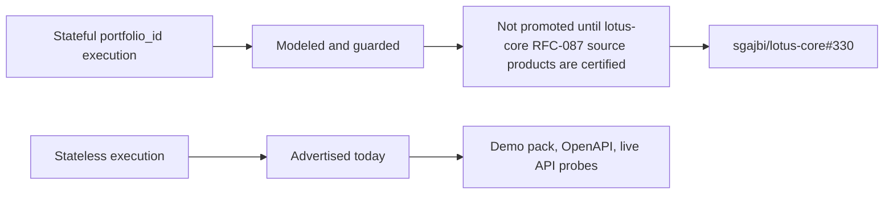

# Supported Features

This page summarizes implementation-backed `lotus-manage` capabilities after the advisory cleanup.
It is intentionally a navigation and demo-prep page; deep mechanics stay in `docs/`.

## Functional Capabilities

| Capability | Primary APIs | Current state | Evidence |
| --- | --- | --- | --- |
| Rebalance simulation | `POST /api/v1/rebalance/simulate` | Supported | unit goldens, OpenAPI gate, API vocabulary gate |
| What-if analysis | `POST /api/v1/rebalance/analyze` | Supported | unit and demo scenarios |
| Async what-if execution | `POST /api/v1/rebalance/analyze/async`, `/api/v1/rebalance/operations/*` | Supported | async operation tests and demo scenario 26 |
| Explicit execution envelope | simulate, analyze, async analyze | Supported with `input_mode=stateless`; `input_mode=stateful` is modeled and feature-gated | envelope contract tests and demo payloads |
| Run supportability | `/api/v1/rebalance/runs/*`, `/api/v1/rebalance/supportability/summary` | Supported | supportability service tests and contract docs tests |
| Deterministic run artifact | `/api/v1/rebalance/runs/{rebalance_run_id}/artifact` | Supported | artifact service tests and demo scenario 27 |
| Lineage lookup | `/api/v1/rebalance/lineage/*` | Feature-gated | lineage service tests |
| Idempotency history | `/api/v1/rebalance/idempotency/*` | Feature-gated | idempotency history service tests and demo scenario 30 |
| Workflow review gates | `/api/v1/rebalance/runs/*/workflow*`, `/api/v1/rebalance/workflow/decisions*` | Feature-gated | workflow service tests and demo scenario 29 |
| Policy-pack supportability | `/api/v1/rebalance/policies/*` | Supported when policy packs are enabled | policy-pack tests and demo scenario 31 |
| Integration capabilities | `/api/v1/integration/capabilities` | Supported | capability contract tests |
| Solver target generation | `POST /api/v1/rebalance/simulate` | Runtime-discovered optional capability | capability contract tests and live demo scenario 08 |
| Stateful `portfolio_id` execution | simulate, analyze, async analyze | Resolver client, source-context models, transformation, and lineage fields implemented; not advertised in capabilities unless stateful sourcing is enabled, `DPM_CORE_BASE_URL` is configured, and resolver configuration is non-legacy; composed source-product integrations exist for `DpmModelPortfolioTarget:v1`, `DiscretionaryMandateBinding:v1`, `InstrumentEligibilityProfile:v1`, and `PortfolioTaxLotWindow:v1`, but live promotion remains blocked until the remaining RFC-087 core source products are implemented and proven | resolver unit tests, transformation tests, feature-gate API test, mocked simulate/analyze/async lineage tests, RFC-0036 evidence |
| Core model portfolio target sourcing | internal stateful source assembly | Dedicated client method for `DpmModelPortfolioTarget:v1` and transformer to the DPM engine `ModelPortfolio`; live canonical proof pending refreshed `lotus-core` runtime | core-sourcing client tests and source-context transformation tests |
| Core mandate binding sourcing | internal stateful source assembly | Dedicated client method for `DiscretionaryMandateBinding:v1` and transformer to management policy context; live canonical proof pending refreshed `lotus-core` runtime | core-sourcing client tests and source-context transformation tests |
| Core instrument eligibility sourcing | internal stateful source assembly | Dedicated client method for `InstrumentEligibilityProfile:v1` and transformer to DPM engine `ShelfEntry` records carrying shelf status, buy/sell flags, restriction codes, settlement days, liquidity tier, issuer, and taxonomy attributes; live canonical proof pending refreshed `lotus-core` runtime | core-sourcing client tests and source-context transformation tests |
| Core portfolio tax-lot sourcing | internal stateful source assembly | Dedicated client method for `PortfolioTaxLotWindow:v1` and transformer to DPM engine `TaxLot` records carrying lot quantity, unit cost, purchase date, and core lineage-backed cost basis for tax-aware sell allocation; live canonical proof pending refreshed `lotus-core` runtime | core-sourcing client tests and source-context transformation tests |



## Non-Functional Capabilities

| Capability | Current state | Evidence |
| --- | --- | --- |
| OpenAPI governance | Enforced | `scripts/openapi_quality_gate.py` |
| API vocabulary inventory | Enforced | `scripts/api_vocabulary_inventory.py --validate-only` |
| No-alias contract | Enforced | `scripts/no_alias_contract_guard.py` |
| Monetary precision guard | Enforced | `scripts/check_monetary_float_usage.py` |
| Production persistence guardrails | Enforced | `src/api/persistence_profile.py` and production cutover tests |
| PostgreSQL migration checks | Enforced | `scripts/postgres_migrate.py --target dpm` and migration tests |
| Docker startup readiness | Enforced | local Docker runtime contract tests |
| Live API evidence | Enforced before API readiness claims | `scripts/validate_live_api.py` and `make live-api-validate` |
| Async correlation conflict handling | Enforced | API tests and live API duplicate-correlation probe |
| Source-safe core resolver errors | Enforced for modeled stateful mode | resolver timeout/retry tests, no-core-base-url API test, and stateful feature-gate API test |
| Capability truth gating | Enforced | integration capability tests proving stateful is not published without resolver readiness |
| Mesh product validation | Enforced for repo-native declarations and trust telemetry | `make mesh-contract-validate`, domain product tests, trust telemetry tests |
| Sensitive-safe access and service logging | Enforced | observability and API tests proving route-template logging, redaction of sensitive extra fields, and no raw identifiers in service messages |
| Stateful resolver metrics | Enforced with bounded labels | observability tests and stateful resolver API tests |
| DPM execution and workflow metrics | Enforced with bounded labels | observability tests, API route tests, and monitoring contract validation |
| Monitoring contract governance | Enforced for implemented custom metrics | observability contract validator, monitoring contract tests, `make mesh-contract-validate` |
| Live manage API proof | Passed for implemented stateless/manage API surface after targeted manage refresh | `scripts/validate_live_api.py --base-url http://manage.dev.lotus` checks demo pack, readiness, capability truth, no advisory/proposal routes, deployed OpenAPI certification quality including error examples, stateful core-sourcing guardrails, async conflict behavior, supportability summary, and metrics |
| Manage/core integration posture proof | Passed for current blocked state | `make live-api-validate-core` proves manage stays stateless-only while RFC-087 core source products are not yet available; update the validator and rerun only after core implements the certified composed products |
| Swagger error-response examples | Enforced | central OpenAPI enrichment, `scripts/openapi_quality_gate.py`, contract tests, and live validation require bounded JSON examples for every documented `4xx`, `5xx`, and `default` response |

## Explicit Non-Goals

`lotus-manage` does not own advisor-led proposal simulation, proposal artifacts, advisor client
consent, or proposal lifecycle APIs. Those workflows belong in `lotus-advise`.

It also does not own canonical portfolio ledger state, source-data truth, risk methodology,
performance analytics authority, or UI composition.

## Demo Notes

Use `docs/demo/README.md` for executable API demo payloads. Demo evidence should be captured from
the live application only after the relevant API, persistence, and supportability checks pass.

For RFC-0036 final proof, use the direct manage API path first:

```powershell
python scripts/validate_live_api.py --base-url http://manage.dev.lotus --json-output output/rfc-0036-gold-pass/live-api-summary.json
```

For current manage/core integration proof before stateful promotion, add the core route posture
checks:

```powershell
make live-api-validate-core
```

Final proof is not complete if the validator reports stale OpenAPI certification drift, including
missing request, response, or error examples, even when business execution probes pass. Stateful
execution is also not complete until `lotus-core` exposes the RFC-087 certified composed DPM
source-data products including market-data/FX coverage and source-family readiness, and manage live
proof shows stateful source lineage.
