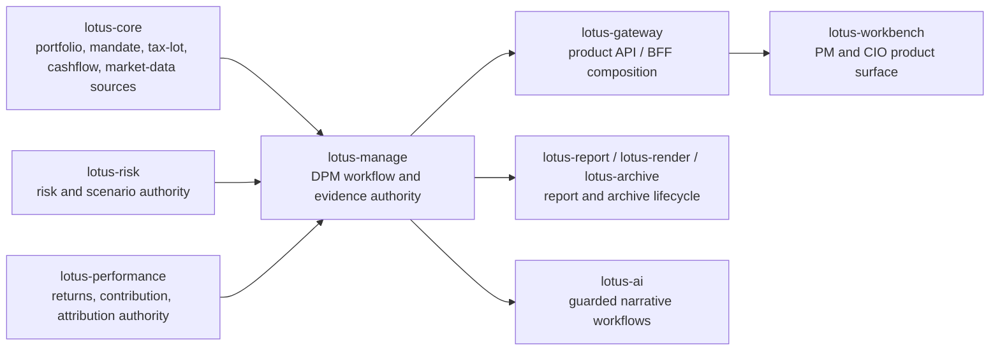
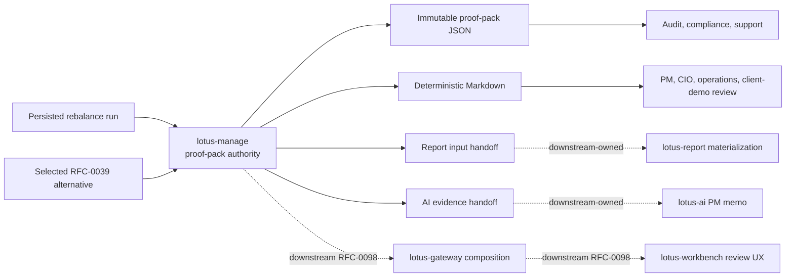
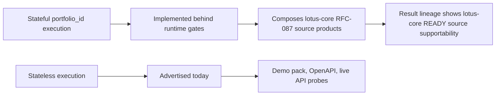

# Supported Features

This page summarizes implementation-backed `lotus-manage` capabilities after the advisory cleanup.
It is intentionally a navigation and demo-prep page; deep mechanics stay in `docs/`. The page is
written for developers, business users, operations, sales/pre-sales, and client-demo preparation, so
it distinguishes supported capabilities from product-roadmap WTBD items that still need owning-app
implementation and proof.

## Product Readiness At A Glance

`lotus-manage` is implementation-backed today as the discretionary portfolio management execution
and evidence authority. It can support private-banking demos and operating review for the backend
capabilities listed below, but full front-office product claims require the governed
`lotus-gateway` and `lotus-workbench` realization path to be implemented, validated, merged, and
published.



Current first-wave product posture:

| Product area | Implementation-backed state | Product/demo posture |
| --- | --- | --- |
| Stateful DPM source execution | Manage composes governed `lotus-core` source products behind explicit runtime gates. | Backend and integration proof are suitable for technical demos when source gates are enabled. |
| DPM command center foundation | Manage command-center APIs, Gateway composition, Workbench cockpit rendering, and populated canonical seed proof are merged and live-proven. | First-wave populated command-center demo path is implementation-backed; PM-book discovery and partial/empty seed fixtures remain future scope. |
| Construction alternatives | Manage alternative generation/read/selection is implemented, with first-wave Gateway/Workbench realization for generated alternatives. | Suitable for demos of generated alternatives and selection posture; richer lifecycle choreography remains roadmap. |
| Pre-trade proof packs | Manage owns durable proof-pack JSON, Markdown, report input, AI evidence input, hashes, lineage, supportability states, and source-owned risk/performance analytics posture from selected construction alternatives; Gateway composes proof-pack BFF truth; Workbench renders the first-wave proof-pack review panel and canonical browser proof classifies `dpm.proof_pack` as `ready`; report/render/archive owning services materialize governed proof-pack documents from manage report input; `lotus-ai` now owns review-gated PM memo execution consumed through Gateway/Workbench only. | First-wave PM/CIO proof-pack product realization, generated proof-pack report lifecycle, and governed PM memo request posture are implementation-backed for the canonical portfolio; manage proof-pack risk/performance enrichment is also implementation-backed for selected construction alternatives. |
| Explicit portfolio-list waves | Manage owns explicit wave preview/create/source-check/simulate/select/approve/stage/handoff, source-owned PM-book wave discovery, source-owned risk/performance aggregate analytics posture, report-input, and supportability; Gateway composes the command-center BFF; Workbench renders the first-wave Rebalance Wave Command Center for the canonical portfolio; report/render/archive materialize governed rebalance-wave reports from manage report input; `lotus-ai` owns the guarded wave PM memo workflow pack; Gateway and Workbench consume that AI workflow without local prompt or memo generation. | First-wave PM operating cockpit, governed wave report lifecycle, and governed AI PM memo request posture are implementation-backed, CI-proven, live-proven where product-surfaced, and wiki-published. PM-book wave discovery is source-backed through lotus-core `PortfolioManagerBookMembership:v1`; wave aggregate analytics preserve `lotus-risk` and `lotus-performance` supportability, lineage refs, reason codes, and source-emitted scalar values without manage-local risk/performance methodology. CIO/risk-event cohort discovery and external OMS execution remain future WTBDs. |
| Portfolio memory foundation | Manage composes a deterministic source-backed portfolio-memory read model over mandate health snapshots, monitoring exceptions, proof packs, proof-pack decision timelines, rebalance wave events, internal operations handoffs, and outcome-review events; Gateway composes it for the command center; Workbench renders the first-wave portfolio-memory timeline panel with canonical browser proof. | First-wave PM, operations, audit, report-lineage, AI-support, and demo-facing event lineage is implementation-backed, source-owned, queryable, live-proven, and wiki-published. Manage now emits stable event identity plus retention, redaction, access, audit policy, and bounded `portfolio_memory_context` on proof-pack, rebalance-wave, and outcome-review report inputs. `lotus-report` PR #92 consumes that context without reconstructing portfolio-memory events. `lotus-ai` PR #62 validates the bounded context for DPM PM memo and outcome-review narrative packs without reconstructing timeline facts. Future report, AI, OMS, PM-scoring, and client-communication source-event families remain future source-owner scope before the broader WTBD is closed. |
| Post-trade outcome feedback | Manage backend, Gateway/Workbench first-wave product path, rendered reports, archive lifecycle, and governed AI narrative request path are implemented in owning repos. | First-wave product path is implementation-backed; remaining source-owner methodology depth and OMS/PM-scoring work are not supported claims. |

## WTBD Product-Readiness Roadmap

`docs/rfcs/RFC-worktobedone.md` is the governed WTBD ledger. As of the current mainline snapshot it
tracks 59 WTBD items: 29 done on merged/published truth, 4 partial or in progress, and 26 remaining
or open. The next execution wave should focus on product surfaces that materially improve
bank-buyable demo and operating value without inventing unsupported source truth.

| Priority | WTBD | Business value | Required proof before support claim |
| ---: | --- | --- | --- |
| 1 | RFC40-WTBD-010 - Decision timeline and portfolio memory | Links mandate, exception, wave, proof-pack, handoff, outcome, and report-input lineage into portfolio memory without inventing source truth. First-wave Manage/Gateway/Workbench product realization is merged, live-proven, and wiki-published; manage now emits mandate-health, monitoring-exception, event identity, retention, redaction, access, audit policy, and bounded report-input context; `lotus-report` now has the bounded context consumer seam; and `lotus-ai` has bounded DPM memo/narrative consumers. | Future source-event families are implemented by their owners, tested, and canonically proven without reconstructing source facts. |
| 2 | RFC41-WTBD-003 - Additional command-center seed postures | Extends the DPM command-center canonical seed beyond populated `ready` proof into partial, empty, degraded, and blocked states. | Platform/Workbench canonical validation proves those states with screenshots, contracts, and supportability evidence. |
| 3 | RFC40-WTBD-007 - Authoritative transaction-cost curve | Distinguishes estimated manage cost from source-owned transaction-cost evidence. | A source owner publishes `TransactionCostCurve:v1` or equivalent with lineage, applicability, tests, live proof, and supported-feature promotion. |
| 4 | RFC42-WTBD-006 - Source-owner realized methodology depth | Promotes aggregate risk, performance, tax, FX, cash, liquidity, and execution methodology from selected adapters into auditable source-owned products. | Owning services provide methodology docs, contracts, degraded-state tests, live proof, and product-surface preservation without manage-local recalculation. |

Roadmap boundaries:

1. Unsupported source products remain explicit gaps; do not fill them with local placeholders.
2. Gateway and Workbench must consume supported backend APIs through the governed product path.
3. README, RFC, wiki, and supported-feature updates are part of implementation, not post-work notes.
4. A WTBD is not complete until merged to `main`, validated, wiki-published where needed, and branch
   hygiene confirms no durable truth remains stranded.

## Functional Capabilities

| Capability | Primary APIs | Current state | Evidence |
| --- | --- | --- | --- |
| Rebalance simulation | `POST /api/v1/rebalance/simulate` | Supported | unit goldens, OpenAPI gate, API vocabulary gate |
| What-if analysis | `POST /api/v1/rebalance/analyze` | Supported | unit and demo scenarios |
| Async what-if execution | `POST /api/v1/rebalance/analyze/async`, `/api/v1/rebalance/operations/*` | Supported | async operation tests and demo scenario 26 |
| Explicit execution envelope | simulate, analyze, async analyze | Supported with `input_mode=stateless`; `input_mode=stateful` is modeled and feature-gated | envelope contract tests and demo payloads |
| Run supportability | `/api/v1/rebalance/runs/*`, `/api/v1/rebalance/supportability/summary` | Supported | supportability service tests and contract docs tests |
| Deterministic run artifact | `/api/v1/rebalance/runs/{rebalance_run_id}/artifact` | Supported | artifact service tests and demo scenario 27 |
| Lineage lookup | `/api/v1/rebalance/lineage/*` | Feature-gated | lineage service tests |
| Idempotency history | `/api/v1/rebalance/idempotency/*` | Feature-gated | idempotency history service tests and demo scenario 30 |
| Workflow review gates | `/api/v1/rebalance/runs/*/workflow*`, `/api/v1/rebalance/workflow/decisions*` | Feature-gated | workflow service tests and demo scenario 29 |
| Policy-pack supportability | `/api/v1/rebalance/policies/*` | Supported when policy packs are enabled | policy-pack tests and demo scenario 31 |
| Integration capabilities | `/api/v1/integration/capabilities` | Supported | capability contract tests |
| Solver target generation | `POST /api/v1/rebalance/simulate` | Runtime-discovered optional capability | capability contract tests and live demo scenario 08 |
| Stateful `portfolio_id` execution | simulate, analyze, async analyze | Implemented behind explicit runtime gates. When `DPM_CAP_INPUT_MODE_PORTFOLIO_ID_ENABLED=true`, `DPM_STATEFUL_CORE_SOURCING_ENABLED=true`, and `DPM_CORE_BASE_URL` is configured, manage advertises `stateful` and composes governed core data for execution. | resolver unit tests, transformation tests, feature-gate API tests, live `manage.dev.lotus` stateful proof |
| Core model portfolio target sourcing | internal stateful source assembly | Dedicated client method for `DpmModelPortfolioTarget:v1` and transformer to the DPM engine `ModelPortfolio`; live canonical proof passed. | core-sourcing client tests, source-context transformation tests, RFC-087 live validator |
| Core mandate binding sourcing | internal stateful source assembly | Dedicated client method for `DiscretionaryMandateBinding:v1` and transformer to management policy context; live canonical proof passed. | core-sourcing client tests, source-context transformation tests, RFC-087 live validator |
| Core instrument eligibility sourcing | internal stateful source assembly | Dedicated client method for `InstrumentEligibilityProfile:v1` and transformer to DPM engine `ShelfEntry` records carrying shelf status, buy/sell flags, restriction codes, settlement days, liquidity tier, issuer, and taxonomy attributes; live canonical proof passed. | core-sourcing client tests, source-context transformation tests, RFC-087 live validator |
| Core portfolio tax-lot sourcing | internal stateful source assembly | Dedicated client method for `PortfolioTaxLotWindow:v1` and transformer to DPM engine `TaxLot` records carrying lot quantity, unit cost, purchase date, and core lineage-backed cost basis for tax-aware sell allocation; live canonical proof passed. | core-sourcing client tests, source-context transformation tests, RFC-087 live validator |
| Core market-data coverage sourcing | internal stateful source assembly | Dedicated client method for `MarketDataCoverageWindow:v1` and transformer to DPM engine `MarketDataSnapshot`; stale or missing price/FX coverage is rejected before stateful execution can run. Live canonical proof passed. | core-sourcing client tests, source-context transformation tests, RFC-087 live validator |
| Mandate digital-twin APIs | `/api/v1/mandates/*` | Supported as RFC-0038 foundation for refresh/read/version/diff and health read/recalculate. Refresh composes product-specific lotus-core mandate binding, model targets, and optional market-data coverage; source-data gaps remain explicit. Local manage proof and local canonical manage plus live `lotus-core` proof passed; Gateway/Workbench product-surface adoption and populated canonical DPM seed proof are implementation-backed in the owning repositories. | `src/api/routers/mandates.py`, `src/api/services/mandate_service.py`, `tests/unit/dpm/api/test_mandates_api.py`, OpenAPI certification matrix, RFC-0038 proof log, `docs/rfcs/RFC-worktobedone.md` |
| Mandate monitoring and exceptions | `/api/v1/dpm/monitoring/*`, `/api/v1/dpm/exceptions*` | Supported as bounded Slice 4 foundation for caller-supplied mandate ids that have already been refreshed. PM-book wave discovery is now source-backed through `PM_BOOK_REVIEW`, but monitoring-run PM-book expansion remains separate until command-center monitoring selectors consume the same core product. | `src/api/routers/monitoring.py`, `tests/unit/dpm/api/test_monitoring_api.py`, OpenAPI certification matrix |
| DPM command center foundation | `/api/v1/dpm/command-center` | Supported as a bounded Slice 5 read model over persisted monitoring runs and active exceptions generated by the selected monitoring run. It returns health distribution, attention buckets, recommended actions, latest-run lineage, and supportability state. Gateway composition, Workbench cockpit rendering, and populated canonical command-center seed proof are now implementation-backed and live-proven in the owning repositories. PM-book wave discovery is source-backed separately through `PM_BOOK_REVIEW`; command-center monitoring selectors and partial/empty canonical seed fixtures remain downstream scope. | `src/api/routers/monitoring.py`, `src/api/services/mandate_service.py`, `tests/unit/dpm/api/test_monitoring_api.py`, OpenAPI certification matrix, `docs/architecture/dpm-command-center-gateway-workbench-handoff.md`, `docs/rfcs/RFC-worktobedone.md` |
| Mandate health engine foundation | refresh/health APIs and internal RFC-0038 foundation | Pure deterministic health scoring across ten dimensions with hard-gate overrides, persistence foundation, refresh output, health read/recalculate, monitoring-run integration, and command-center aggregation. | `src/core/mandates.py`, `tests/unit/dpm/core/test_mandate_health.py`, `tests/unit/dpm/api/test_mandates_api.py`, `tests/unit/dpm/api/test_monitoring_api.py` |
| Mandate persistence foundation | internal RFC-0038 foundation | Repository contract, in-memory store, Postgres repository foundation, migration, idempotent snapshot persistence, exception resolution, and retention hooks implemented and used by mandate APIs. | `src/core/mandate_repository.py`, `src/infrastructure/mandates/`, `src/infrastructure/postgres_migrations/dpm/0003_mandate_health_foundation.sql`, `tests/unit/dpm/supportability/test_dpm_mandate_repository.py` |
| Construction alternative generation | `/api/v1/construction/alternative-sets/generate` | Supported as RFC-0039 manage backend foundation for first-wave and authority-backed methods: do-nothing baseline, explainable heuristic, minimum-turnover, tax-aware, solver-constrained, risk-aware through `lotus-risk` concentration authority, liquidity-aware with optional `lotus-core` `PortfolioCashflowProjection:v1` projected cash-pressure evidence, currency-overlay, and regime-stress-aware through `lotus-risk` `RegimeScenarioPackEvaluation:v1` when `DPM_RISK_BASE_URL` is configured. ESG/restriction-aware construction is explicitly deferred until source-backed restriction and sustainability profiles exist. Client income-need planning remains unsupported until an owning source product exists. Full product realization through Gateway/Workbench is not yet implemented. | `src/api/routers/construction.py`, `src/api/services/construction_service.py`, `src/core/construction/`, `src/infrastructure/risk_authority/`, `tests/unit/dpm/api/test_construction_api.py`, `tests/unit/dpm/infrastructure/test_risk_authority_client.py`, OpenAPI certification matrix, `scripts/validate_live_api.py` first-wave and authority-backed construction probes |
| Construction alternative read and selection | `GET /api/v1/construction/alternative-sets/{alternative_set_id}`, `POST /api/v1/construction/alternative-sets/{alternative_set_id}/selections` | Supported as persisted backend read and actor-attributed selection foundation. Selection records the preferred alternative but does not execute orders. Postgres-backed live proof passed generate/read/select and supportability summary checks. | `src/core/construction/repository.py`, `src/infrastructure/construction/`, `src/infrastructure/postgres_migrations/dpm/0005_construction_alternatives.sql`, `tests/unit/dpm/construction/test_repository.py`, `tests/unit/dpm/api/test_construction_api.py`, `output/rfc0039-proof/20260503-173624-canonical-postgres/summary.json` |
| Pre-trade proof packs | `POST /api/v1/rebalance/proof-packs`, `GET /api/v1/rebalance/proof-packs/{proof_pack_id}`, `GET /api/v1/rebalance/proof-packs/{proof_pack_id}/summary.md`, `GET /api/v1/rebalance/proof-packs/{proof_pack_id}/report-input`, `GET /api/v1/rebalance/proof-packs/{proof_pack_id}/ai-evidence-input` | Supported as RFC-0040 manage backend authority for durable proof-pack JSON, deterministic Markdown, report-input handoff, AI-evidence handoff, immutable persistence, append-only refs, retention metadata, hashes, lineage, source-backed mandate-context attachment, truthful degraded/pending-review/blocked section states, replay-safe deterministic source identity, and source-owned risk/performance enrichment from selected construction alternatives. The `risk_impact` and `performance_context` sections preserve source-owner supportability, source refs, content hashes, reason codes, and bounded source-emitted measures; manage does not recalculate risk or performance methodology. Gateway proof-pack composition is implementation-backed through `lotus-gateway` PR #195 and preserves manage proof-pack truth without reconstruction. Workbench proof-pack review UX is implementation-backed through `lotus-workbench` PR #156 and renders Gateway-owned proof-pack identity, sections, source hashes, Markdown/report/AI posture, and action eligibility without browser-side proof-pack synthesis. Full first-wave canonical product realization is live-proven through platform QA evidence `canonical-front-office-qa-20260507-124405.json`, with `dpm.proof_pack` ready for `dpp_c09f73d0`. Proof-pack report materialization is implementation-backed through `lotus-render` PR #11, `lotus-report` PR #90, and `lotus-archive` PR #23; report/render/archive own document generation and lifecycle while manage remains evidence authority. | `src/core/proof_packs/`, `src/core/proof_packs/source_analytics.py`, `src/api/routers/proof_packs.py`, `src/infrastructure/proof_packs/`, `tests/unit/dpm/proof_packs/`, `tests/unit/dpm/api/test_proof_pack_api.py`, `scripts/generate_rfc0040_proof_pack_evidence.py`, `output/rfc0040-proof/20260503-145818/manifest.json`, `output/rfc0040-proof/20260503-145818/critical-review.json`, `output/rfc0040-proof/20260507-230235/manifest.json`, `output/rfc0040-proof/20260507-230235/critical-review.json`, `lotus-gateway` PR #195, `lotus-workbench` PR #156, `lotus-manage` PR #117, `lotus-render` PR #11, `lotus-report` PR #90, `lotus-archive` PR #23, `lotus-platform/output/front-office-qa/canonical-front-office-qa-20260507-124405.json` |
| Portfolio memory | `GET /api/v1/rebalance/portfolio-memory/{portfolio_id}` plus report-input context on proof-pack, wave, and outcome-review report inputs | Supported as a manage backend foundation and first-wave Gateway/Workbench product path for source-backed event lineage. The read model composes persisted mandate health snapshots, monitoring exceptions, proof packs, proof-pack-local decision timeline events, RFC-0041 wave events, internal operations handoff refs, and RFC-0042 outcome-review events into a deterministic, hashable portfolio timeline with source systems, source refs, content hashes, stable event identity, supportability state, reason codes, retention policy, redaction policy, audit policy, access classification, and bounded metadata. Gateway PR #199 exposes the command-center composition, Workbench PR #167 renders the timeline panel, platform PR #307 registers `dpm.portfolio_memory`, and canonical live validation captured `dpm-portfolio-memory-live.png`. Manage now attaches bounded `portfolio_memory_context` to proof-pack, rebalance-wave, and outcome-review report inputs; `lotus-report` PR #92 consumes that context for lineage without reconstructing portfolio-memory events; and `lotus-ai` PR #62 validates it for DPM PM memo and outcome-review narrative outputs without reconstructing timeline facts. The context carries its own portfolio-memory content hash and remains outside recursive report-input evidence hashes. It does not compute or reconstruct mandate health, risk, performance, execution, tax, cash, FX, report, AI, or source-owner methodology. Future report, AI, OMS, PM-scoring, and client-communication source-event families remain downstream scope. | `src/core/portfolio_memory/`, `src/core/portfolio_memory/handoffs.py`, `src/api/services/portfolio_memory_context_service.py`, `src/api/routers/portfolio_memory.py`, `src/core/mandate_repository.py`, `src/infrastructure/mandates/`, `src/core/proof_packs/repository.py`, `src/infrastructure/proof_packs/`, `tests/unit/dpm/api/test_portfolio_memory_api.py`, `tests/unit/dpm/api/test_proof_pack_api.py`, `tests/unit/dpm/api/test_waves_api.py`, `tests/unit/dpm/proof_packs/test_proof_pack_handoffs.py`, `tests/unit/core/test_outcome_handoffs.py`, `lotus-gateway` PR #199, `lotus-workbench` PR #167, `lotus-platform` PR #307, `lotus-report` PR #92, `lotus-ai` PR #62, `lotus-workbench/output/playwright/live-canonical/dpm-portfolio-memory-live.png` |
| Source-owned PM-book rebalance waves | `POST /api/v1/rebalance/waves/preview`, `POST /api/v1/rebalance/waves` with `trigger_type=PM_BOOK_REVIEW` | Supported as RFC41-WTBD-001 manage consumer authority for PM-book wave discovery. Manage requires `portfolio_manager_id`, as-of date, optional tenant and booking-center filters, and eligible portfolio types; rejects caller-supplied portfolios for this trigger; calls lotus-core `PortfolioManagerBookMembership:v1`; attaches trigger-level and item-level source refs; persists the resolved cohort as a normal RFC-0041 wave; and returns dependency failures instead of fabricating a cohort. Simulation can carry source-owned risk/performance aggregate posture when item construction inputs supply authority context or configured lotus-risk concentration authority resolves risk evidence. `lotus-ai` PR #63 implements owner-side wave PM memo generation from bounded wave report input, but Gateway/Workbench product consumption is not yet a supported feature. Tactical house-view, risk-event, campaign cohort discovery, and external OMS execution remain unsupported future WTBDs. | `src/api/routers/waves.py`, `src/api/services/wave_service.py`, `src/infrastructure/core_sourcing/client.py`, `src/core/dpm_source_context.py`, `tests/unit/dpm/api/test_waves_api.py`, `tests/unit/dpm/infrastructure/test_core_sourcing_client.py`, `lotus-core` PR #339, `lotus-ai` PR #63 |
| Source-owned CIO model-change rebalance waves | `POST /api/v1/rebalance/waves/preview`, `POST /api/v1/rebalance/waves` with `trigger_type=CIO_MODEL_CHANGE` | Supported as RFC41-WTBD-002 manage consumer authority for CIO model-change affected-mandate discovery. Manage requires `model_portfolio_id`, as-of date, and optional tenant/booking-center filters; rejects caller-supplied portfolios for this trigger; calls lotus-core `CioModelChangeAffectedCohort:v1`; attaches trigger-level source refs for the cohort snapshot and model-change event plus item-level affected mandate refs; persists the resolved cohort as a normal RFC-0041 wave; and returns dependency failures instead of fabricating a model-impact cohort. Downstream Gateway/Workbench rendering and tactical house-view/risk-event/campaign cohorts remain separate future support claims. | `src/api/routers/waves.py`, `src/api/services/wave_service.py`, `src/infrastructure/core_sourcing/client.py`, `src/core/dpm_source_context.py`, `tests/unit/dpm/api/test_waves_api.py`, `tests/unit/dpm/infrastructure/test_core_sourcing_client.py`, `lotus-core` `CioModelChangeAffectedCohort:v1` |
| Explicit portfolio-list rebalance waves | `POST /api/v1/rebalance/waves/preview`, `POST /api/v1/rebalance/waves`, `GET /api/v1/rebalance/waves`, `GET /api/v1/rebalance/waves/{wave_id}`, `GET /api/v1/rebalance/waves/{wave_id}/items`, `POST /api/v1/rebalance/waves/{wave_id}/source-check`, `POST /api/v1/rebalance/waves/{wave_id}/simulate`, `POST /api/v1/rebalance/waves/{wave_id}/items/{wave_item_id}/select`, `POST /api/v1/rebalance/waves/{wave_id}/approve`, `POST /api/v1/rebalance/waves/{wave_id}/stage`, `POST /api/v1/rebalance/waves/{wave_id}/handoff`, `POST /api/v1/rebalance/waves/{wave_id}/cancel`, `GET /api/v1/rebalance/waves/{wave_id}/proof-pack`, `GET /api/v1/rebalance/waves/{wave_id}/report-input`, `GET /api/v1/rebalance/waves/{wave_id}/supportability` | Supported as RFC-0041 `DONE` manage backend authority for explicit portfolio-list waves. Manage persists wave state, item states, events, aggregate metrics, source-owned risk/performance analytics posture, proof-pack refs, supportability posture, internal handoff refs, report-input handoff facts, and pre-execution cancellation evidence; it delegates construction to RFC-0039, proof-pack generation to RFC-0040, preserves degraded/review/blocked exceptions, and never claims external execution. `aggregate_metrics.source_analytics` carries source-family, supportability state, represented item counts, source systems, source refs, source-owner reason codes, and source-emitted scalar values only; manage does not recalculate risk or performance. Gateway command-center composition and Workbench first-wave wave command-center UX are implementation-backed, CI-proven, live-proven, and wiki-published through the owning repositories. Wave report materialization is implementation-backed through `lotus-manage` PR #124, `lotus-report` PR #91, `lotus-render` PR #12, and `lotus-archive` PR #24. `lotus-ai` PR #63 implements owner-side `dpm_wave_pm_memo.pack@v1` for bounded wave evidence, but Gateway/Workbench product consumption and canonical proof remain open before this becomes a supported product claim. Automatic CIO/risk-event cohort discovery and external OMS execution remain unsupported future WTBDs. | `src/core/waves/`, `src/core/waves/handoffs.py`, `src/api/routers/waves.py`, `src/api/services/wave_service.py`, `src/infrastructure/waves/`, `tests/unit/dpm/api/test_waves_api.py`, `tests/unit/dpm/waves/test_wave_domain.py`, `tests/unit/dpm/waves/test_source_readiness.py`, `scripts/generate_rfc0041_wave_evidence.py`, `tests/unit/test_rfc0041_evidence_script.py`, `output/rfc0041-wave-proof/20260504-231914/manifest.json`, `output/rfc0041-wave-proof/20260504-231914/critical-review.json`, `lotus-manage` PR #124, `lotus-gateway` PR #197, `lotus-platform` PR #306, `lotus-workbench` PR #165, `lotus-report` PR #91, `lotus-render` PR #12, `lotus-archive` PR #24, `lotus-ai` PR #63, `lotus-platform/output/front-office-qa/canonical-front-office-qa-20260507-142715.json`, `lotus-workbench/output/playwright/live-canonical/dpm-wave-command-center-live.png` |

## Pre-Trade Proof Pack Flow

RFC-0040 makes `lotus-manage` the backend authority for pre-trade proof-pack evidence. The proof
pack is the audit object that ties a proposed discretionary portfolio action to mandate context,
source readiness, selected alternative evidence, trade intent, supportability, hashes, lineage, and
downstream handoff packages.



Current supported behavior:

1. generate proof packs from selected construction alternatives and direct rebalance runs,
2. preserve source-honest section states: `READY`, `DEGRADED`, `BLOCKED`, `PENDING_REVIEW`, and
   `NOT_APPLICABLE`,
3. keep the persisted body immutable and add report/AI handoff refs through append-only records,
4. expose content hashes, section hashes, source hashes, lineage, retention metadata, and reason
   codes for operations and audit review,
5. attach persisted RFC-0038 mandate digital-twin and mandate-health evidence when available, and
   degrade `mandate_context` when only a mandate id is supplied,
6. produce bounded report input and AI evidence input without generating reports, prompts, memos,
   approvals, or execution instructions inside `lotus-manage`.

Audience notes:

1. PM and CIO users can treat the Markdown as a readable decision-evidence summary, not as a trade
   execution instruction.
2. Compliance and audit users can use hashes, lineage, retention, and section states to inspect why
   a decision was supportable or blocked at generation time.
3. Operations users can diagnose missing or degraded upstream evidence from reason codes and
   supportability counts.
4. Sales, pre-sales, and client-demo material can show the first-wave Workbench proof-pack review
   product for `PB_SG_GLOBAL_BAL_001` when using the canonical evidence pack. Do not claim report
   materialization, AI memo generation, unrestricted source-owner enrichment, or non-canonical
   portfolio coverage until the owning WTBDs are implemented and proven.

## Rebalance Wave Flow

RFC-0041 makes `lotus-manage` the backend authority for explicit portfolio-list rebalance waves.
It is a manage-owned orchestration and evidence surface, not an order-execution engine and not a
Workbench product claim.

```mermaid
flowchart LR
    PM[PM or CIO operator] --> Preview[Preview explicit portfolio-list wave]
    Preview --> Create[Create durable wave]
    Create --> SourceCheck[Source-check mandate health and readiness]
    SourceCheck --> Ready[Ready item]
    SourceCheck --> Exceptions[Degraded / review / blocked exceptions]
    Ready --> Simulate[RFC-0039 construction alternatives]
    Simulate --> Select[Actor-attributed selection]
    Select --> Proof[RFC-0040 proof pack]
    Proof --> Approve[Approve eligible item]
    Approve --> Stage[Stage approved item]
    Stage --> Handoff[Internal operations handoff<br/>external_execution_claimed=false]
    Exceptions --> Support[Product-safe supportability]
    Handoff --> ReadModels[Search, detail, item, proof-pack posture APIs]
    Support --> ReadModels
    ReadModels -. downstream RFC-0098 .-> Gateway[lotus-gateway composition]
    Gateway -. downstream RFC-0098 .-> Workbench[lotus-workbench command center]
```



Current supported manage-backend behavior:

1. explicit portfolio-list wave preview and durable create,
2. source-check classification across `SOURCE_READY`, `SOURCE_DEGRADED`, `REVIEW_REQUIRED`, and
   `SOURCE_BLOCKED`,
3. RFC-0039 construction delegation for ready items only,
4. RFC-0040 proof-pack linkage from selected alternatives,
5. approval-with-exceptions, approved-item-only staging, internal handoff evidence, and
   pre-execution cancellation,
6. retrieve/search/item/proof-pack/report-input/supportability read models for Gateway, report,
   and operations,
7. bounded supportability diagnostics and telemetry without portfolio/client labels,
8. Postgres-backed live proof under `output/rfc0041-wave-proof/20260504-231914/`.

Current boundaries:

1. CIO model-change affected-cohort discovery is not supported yet,
2. Gateway command-center composition and the first-wave Workbench wave command center are implemented and proven for the canonical explicit-list path,
3. manage handoff refs are internal readiness evidence and must not be described as external
   execution or order routing.



## Non-Functional Capabilities

| Capability | Current state | Evidence |
| --- | --- | --- |
| OpenAPI governance | Enforced | `scripts/openapi_quality_gate.py` |
| API vocabulary inventory | Enforced | `scripts/api_vocabulary_inventory.py --validate-only` |
| No-alias contract | Enforced | `scripts/no_alias_contract_guard.py` |
| Monetary precision guard | Enforced | `scripts/check_monetary_float_usage.py` |
| Production persistence guardrails | Enforced | `src/api/persistence_profile.py` and production cutover tests |
| PostgreSQL migration checks | Enforced | `scripts/postgres_migrate.py --target dpm` and migration tests |
| Docker startup readiness | Enforced | local Docker runtime contract tests |
| Live API evidence | Enforced before API readiness claims | `scripts/validate_live_api.py` and `make live-api-validate` |
| Async correlation conflict handling | Enforced | API tests and live API duplicate-correlation probe |
| Source-safe core resolver errors | Enforced for modeled stateful mode | resolver timeout/retry tests, no-core-base-url API test, and stateful feature-gate API test |
| Capability truth gating | Enforced | integration capability tests proving stateful is not published without resolver readiness |
| Mesh product validation | Enforced for repo-native declarations and trust telemetry | `make mesh-contract-validate`, domain product tests, trust telemetry tests |
| Sensitive-safe access and service logging | Enforced | observability and API tests proving route-template logging, redaction of sensitive extra fields, and no raw identifiers in service messages |
| Stateful resolver metrics | Enforced with bounded labels | observability tests and stateful resolver API tests |
| DPM execution and workflow metrics | Enforced with bounded labels | observability tests, API route tests, and monitoring contract validation |
| Monitoring contract governance | Enforced for implemented custom metrics | observability contract validator, monitoring contract tests, `make mesh-contract-validate` |
| Live manage API proof | Passed for implemented stateless/manage API surface after targeted manage refresh | `scripts/validate_live_api.py --base-url http://manage.dev.lotus` checks demo pack, readiness, capability truth, no advisory/proposal routes, deployed OpenAPI certification quality including error examples, stateful core-sourcing guardrails, async conflict behavior, supportability summary, and metrics |
| Manage/core integration posture proof | Passed for stateful available posture | `LOTUS_MANAGE_EXPECT_STATEFUL_CORE_SOURCING=available make live-api-validate-core` proves capability truth, composed core sourcing, READY lineage, supportability persistence, metrics, and old monolithic core route absence |
| Swagger error-response examples | Enforced | central OpenAPI enrichment, `scripts/openapi_quality_gate.py`, contract tests, and live validation require bounded JSON examples for every documented `4xx`, `5xx`, and `default` response |

## Explicit Non-Goals

`lotus-manage` does not own advisor-led proposal simulation, proposal artifacts, advisor client
consent, or proposal lifecycle APIs. Those workflows belong in `lotus-advise`.

It also does not own canonical portfolio ledger state, source-data truth, risk methodology,
performance analytics authority, or UI composition.

## Demo Notes

Use `docs/demo/README.md` for executable API demo payloads. Demo evidence should be captured from
the live application only after the relevant API, persistence, and supportability checks pass.

For RFC-0036 final proof, use the direct manage API path first:

```powershell
python scripts/validate_live_api.py --base-url http://manage.dev.lotus --json-output output/rfc-0036-gold-pass/live-api-summary.json
```

For manage/core integration proof with stateful sourcing active, add the explicit expectation:

```powershell
$env:LOTUS_MANAGE_EXPECT_STATEFUL_CORE_SOURCING="available"
make live-api-validate-core
```

Final proof is not complete if the validator reports stale OpenAPI certification drift, including
missing request, response, or error examples, even when business execution probes pass. Stateful
execution is not complete unless the RFC-087 `lotus-core` product-specific source APIs pass
canonical live proof and manage live proof shows READY stateful source lineage.

## Target-State Roadmap Features

The following are proposed strategic features. They are not supported-feature claims until the
owning RFC is implemented, certified, live-proven, and this page is updated with implementation
evidence.

| Proposed capability | Owning RFC | Promotion requirement |
| --- | --- | --- |
| Mandate digital twin | RFC-0038 | Refresh/read/version/diff API foundation is supported and live-proven with core/manage proof. Populated Gateway/Workbench command-center product proof is implementation-backed in owning repositories. |
| Mandate health score | RFC-0038 | Scoring, persistence, refresh-response output, standalone health APIs, bounded monitoring integration, and command-center aggregation are implementation-backed and live-proven at the manage/core API layer. |
| DPM command center | RFC-0038 | Bounded command-center summary API is implemented over monitoring runs and active exceptions scoped to the selected monitoring run. Gateway composition, Workbench cockpit rendering, and populated canonical seed proof are implementation-backed in the owning repositories; PM-book wave discovery is source-backed separately through `PM_BOOK_REVIEW`, while command-center monitoring selectors and partial/empty canonical fixtures remain future scope. |
| Advanced construction alternatives | RFC-0039 | Manage backend foundation is supported for first-wave and mandatory authority-backed generation/read/selection after implementation proof and hardening. Full product-surface promotion still requires the paired Gateway/Workbench realization RFCs to be implemented and proven. |
| Tax, liquidity, risk, currency, and regime-aware construction | RFC-0039 | Supported as manage backend construction capabilities with explicit source-authority context. Liquidity-aware construction accepts source-owned `PortfolioCashflowProjection:v1` evidence to flag projected cash-pressure policy breaches; regime-stress-aware construction consumes `lotus-risk` `RegimeScenarioPackEvaluation:v1` when configured. Client income-need planning remains unsupported. ESG/restriction-aware construction remains deferred until source-backed restriction and sustainability profiles exist. Promote to full product outcome only after Gateway/Workbench implementation and canonical browser proof. |
| Full front-office proof-pack review | RFC-0040, Gateway RFC-0098, Workbench RFC-0098 | First-wave full proof-pack product realization is supported for the canonical portfolio after manage backend authority, Gateway proof-pack composition, Workbench proof-pack review UX, replay-safe deterministic proof-pack generation, governed platform QA proof, and report/render/archive proof-pack materialization in owning services. Governed AI memo generation, richer source-owner enrichment, transaction-cost authority, client restriction/sustainability profiles, and cross-RFC portfolio memory remain separate WTBDs. |
| Decision timeline and portfolio memory | RFC-0038, RFC-0040, RFC-0041, RFC-0042 | Manage backend portfolio memory is implementation-backed through `/api/v1/rebalance/portfolio-memory/{portfolio_id}` for mandate health, monitoring exception, proof-pack, wave, handoff, and outcome-review lineage. Gateway command-center composition, Workbench timeline rendering, platform panel registration, canonical browser proof, and Workbench wiki publication are also implementation-backed. Manage now emits event identity plus retention, redaction, access, audit policy, and bounded `portfolio_memory_context` on proof-pack, rebalance-wave, and outcome-review report inputs. `lotus-report` PR #92 implements report-side bounded context consumption. `lotus-ai` PR #62 implements bounded DPM PM memo and outcome-review narrative context consumption. Future source-event families remain downstream until implemented and canonically proven in the owning apps. |
| CIO model-change and full front-office rebalance waves | RFC-0041, Gateway RFC-0098, Workbench RFC-0098 | Manage backend support is implementation-backed and closed as `DONE` for explicit portfolio-list waves, source-owned `PM_BOOK_REVIEW` wave discovery through lotus-core `PortfolioManagerBookMembership:v1`, and source-owned `CIO_MODEL_CHANGE` wave discovery through lotus-core `CioModelChangeAffectedCohort:v1`. Gateway wave composition, first-wave Workbench wave command center support, governed rebalance-wave report materialization in report/render/archive, and AI memo generation from wave evidence are implementation-backed, live-proven or CI-proven as applicable, and wiki-published where changed. Risk-event/tactical house-view/campaign cohort discovery and external OMS execution remain deferred until source-owning products and owning-service implementations are complete. |
| Post-trade outcome feedback | RFC-0042 | Supported as RFC-0042 manage backend authority plus first-wave product realization. Manage owns source-backed preview/create/retrieve/search, immutable persistence/events, source-refresh eventing, supportability diagnostics, report-input and AI-evidence input handoff contracts, source-owned realized adapters for `lotus-risk` `RiskMetricsReport:v1`, drawdown response max drawdown, concentration response selected measures, rolling metrics selected metric/statistic/window measures, and historical attribution selected set/contributor measures, `lotus-performance` workspace-summary TWR/active/MWR returns, contribution selected measures, and attribution reconciliation/level/currency selected measures, and `lotus-core` `HoldingsAsOf:v1` cash totals, `TransactionLedgerWindow:v1` explicit transaction-row trade-fee, withholding-tax, realized-FX-P&L, linked-cashflow measures, and `PortfolioCashflowProjection:v1` total net cashflow, live manage proof at `output/rfc0042-outcome-proof/20260505-024352/`, hardening proof at `output/rfc0042-outcome-proof/20260505-025613/`, post-merge audit proof at `output/rfc0042-outcome-proof/20260505-040212/`, and WTBD audit proof at `output/rfc0042-wtbd-audit-outcome-proof/20260505-211611/`. Gateway/Workbench outcome-review product support, outcome report submission/materialization, archive lifecycle, and governed AI narrative request are implemented in their owning apps and canonically proven at `lotus-workbench/output/playwright/rfc42-wtbd-audit-20260506-fixed/`. Execution/OMS integration, PM quality scoring, and aggregated source-owner tax/FX/cash beyond source-emitted totals and execution methodologies remain unsupported until owned RFCs implement and prove them. |
| Governed AI PM copilot | RFC-0043 | `lotus-ai` workflow-pack integration, guardrail tests, provenance, and AI-unavailable fallback. |

Target-state features may replace or remove older manage APIs where the new strategic contract is
cleaner. No backward compatibility adapter should be added unless a later downstream migration RFC
proves a real production dependency.
