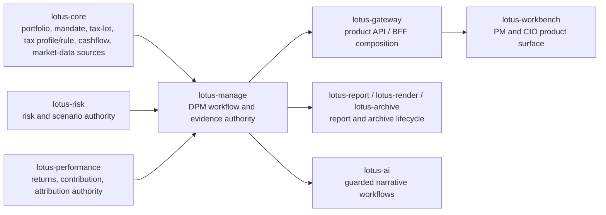
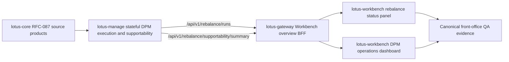
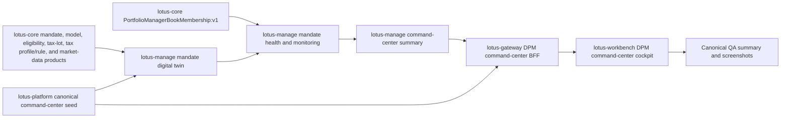
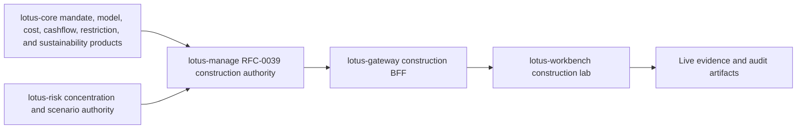
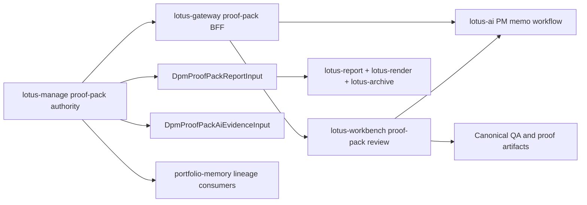
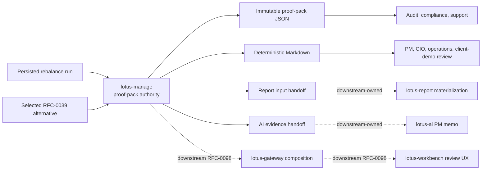
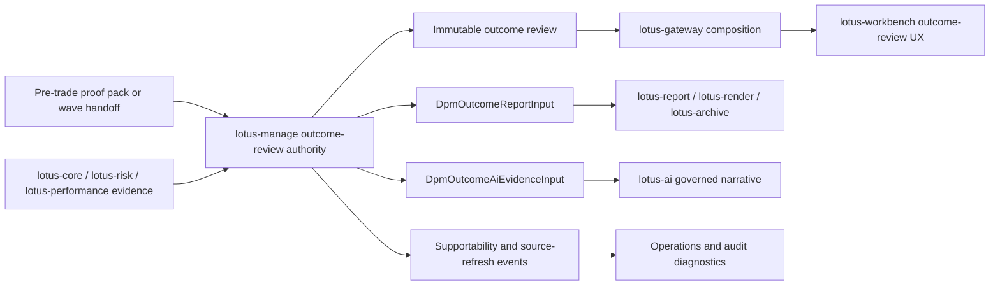
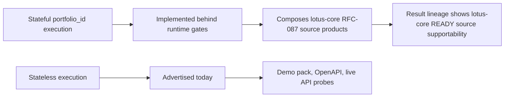

# Supported Features

This page summarizes implementation-backed `lotus-manage` capabilities after the advisory cleanup.
It is intentionally a navigation and demo-prep page; deep mechanics stay in `docs/`. The page is
written for developers, business users, operations, sales/pre-sales, and client-demo preparation, so
it distinguishes supported capabilities from product-roadmap WTBD items that still need owning-app
implementation and proof.

## Product Readiness At A Glance

`lotus-manage` is implementation-backed today as the discretionary portfolio management execution
and evidence authority. It can support private-banking demos and operating review for the backend
capabilities listed below, but full front-office product claims require the governed
`lotus-gateway` and `lotus-workbench` realization path to be implemented, validated, merged, and
published.



Current first-wave product posture:

| Product area | Implementation-backed state | Product/demo posture |
| --- | --- | --- |
| Stateful DPM source execution | Manage composes governed `lotus-core` source products behind explicit runtime gates. | Backend and integration proof are suitable for technical demos when source gates are enabled. |
| DPM command center foundation | Manage command-center APIs, PM-book-backed monitoring cohort resolution, Gateway composition, Workbench cockpit rendering, and canonical seed proof are merged and live-proven for the populated path. Manage now publishes bounded command-center supportability state across ready, partial, empty, degraded, and blocked source-readiness posture. | First-wave populated command-center path is implementation-backed. The run-monitoring action can resolve the PM book from lotus-core `PortfolioManagerBookMembership:v1`; platform seed automation can now record populated ready, selector-driven partial, and empty command-center posture checks while degraded/blocked canonical fixtures remain source-owner follow-up. |
| Construction alternatives | Manage alternative generation/read/selection is implemented, with first-wave Gateway/Workbench realization for generated alternatives. | Suitable for demos of generated alternatives and selection posture; richer lifecycle choreography remains roadmap. |
| Pre-trade proof packs | Manage owns durable proof-pack JSON, Markdown, report input, AI evidence input, hashes, lineage, supportability states, and source-owned risk/performance analytics posture from selected construction alternatives; Gateway composes proof-pack BFF truth; Workbench renders the first-wave proof-pack review panel and canonical browser proof classifies `dpm.proof_pack` as `ready`; report/render/archive owning services materialize governed proof-pack documents from manage report input; `lotus-ai` now owns review-gated PM memo execution consumed through Gateway/Workbench only. | First-wave PM/CIO proof-pack product realization, generated proof-pack report lifecycle, and governed PM memo request posture are implementation-backed for the canonical portfolio; manage proof-pack risk/performance enrichment is also implementation-backed for selected construction alternatives. |
| Explicit portfolio-list waves | Manage owns explicit wave preview/create/source-check/simulate/select/approve/stage/handoff, source-owned PM-book wave discovery, source-owned CIO model-change discovery, bounded source-owned risk-event wave discovery, bounded source-owned tactical house-view wave consumption, bounded Manage-owned bulk-review campaign membership with optional governance evidence, persisted Manage-owned campaign discovery, campaign-definition preview-readiness checks, launch packages, launch-history audit pages, source-owned risk/performance aggregate analytics posture, bounded proposed-change diagnostics from construction alternatives, report-input, operations handoff evidence, and supportability; Gateway composes the command-center BFF, including campaign-definition list/get/upsert, lifecycle-events, launch-history, launch-package, launch, and campaign-discovery surfaces; Workbench renders the first-wave Rebalance Wave Command Center for the canonical portfolio, active campaign-definition list, READY-gated launch, and launch-history boundaries; report/render/archive materialize governed rebalance-wave reports from manage report input; `lotus-ai` owns the guarded wave PM memo workflow pack and operations handoff summary workflow pack; Gateway and Workbench consume those AI workflows without local prompt or memo generation, including first-wave operations-handoff product invocation. | First-wave PM operating cockpit, governed wave report lifecycle, governed AI PM memo request posture, governed operations-handoff summary invocation, Gateway campaign-definition BFF composition, and Workbench active campaign-definition list plus launch/history boundary rendering are implementation-backed, CI-proven, live-proven where canonical runtime evidence exists, and wiki-published. Operations handoff summary support is implemented in `lotus-ai` as `dpm_operations_handoff_summary.pack@v1` over bounded Manage `DpmWaveReportInput` handoff evidence with source refs, handoff refs, forbidden-action/output guardrails, review-required support-only output, and no external execution claim; `lotus-gateway` PR #210 and `lotus-workbench` PR #182 expose the governed product invocation path. PM-book wave discovery is source-backed through lotus-core `PortfolioManagerBookMembership:v1`; CIO model-change discovery is source-backed through lotus-core `CioModelChangeAffectedCohort:v1`; bounded risk-event wave discovery is source-backed through lotus-risk `RiskEventAffectedCohort:v1` with caller-supplied candidate portfolios and source-supplied exposure weights; bounded tactical house-view wave discovery is source-backed through lotus-advise `TacticalHouseViewAffectedCohort:v1` with bank-authored tactical-view refs and caller-supplied source-backed candidate portfolios; bounded bulk-review campaign membership is Manage-owned through `BulkReviewCampaignMembership:v1` over source-backed candidate portfolios with source-owned portfolio type, DPM portfolio-type filtering, deterministic membership source refs, optional approval/expiry/actor-entitlement governance evidence, and fail-closed validation. `GET /api/v1/rebalance/waves/campaign-discovery` emits `BulkReviewCampaignDiscovery:v1` summaries over persisted campaign definitions, including governance posture, expiry posture, source-ref count, source-backed candidate counts, and preview references without discovering the global portfolio universe or recalculating membership. `GET /api/v1/rebalance/waves/campaign-definitions/{campaign_id}/versions/{campaign_version}/preview-readiness` emits fail-closed `BulkReviewCampaignDefinitionPreviewReadiness` over lifecycle status, requested as-of date, candidate eligibility, governance approval, expiry, and optional actor entitlement before new preview/create use. `GET /api/v1/rebalance/waves/campaign-definitions/{campaign_id}/versions/{campaign_version}/launch-history` emits paged append-only launch audit evidence with no-order/no-OMS boundaries. Gateway PR #212 exposes `/api/v1/dpm/command-center/waves/campaign-definitions*` list/get/upsert while preserving Manage campaign payloads; Gateway PR #231 (`ea6c036`, Main Releasability Gate `25989936539`) extends bounded lifecycle-events, launch-history, launch-package, durable launch, and campaign-discovery BFF preservation without Gateway-local cohort, membership, readiness, idempotency, order, or OMS calculation. Workbench PR #184 renders the active definition list, and Workbench PR #244 (`31ea877`, Main Releasability Gate `25989936388`) validates Gateway-only READY-gated launch and paged launch-history/empty-state/no-order/no-OMS boundary rendering without browser-side cohort, membership, readiness, or execution calculation. Wave item diagnostics now preserve construction-derived `proposed_changes` with security id, action, quantity, estimated value, rationale, and constraints where available; these rows are review evidence only, not orders, executions, fills, venue-routing, or OMS instructions. Wave aggregate analytics preserve `lotus-risk` and `lotus-performance` supportability, lineage refs, reason codes, and source-emitted scalar values without manage-local risk/performance methodology. Report input now fails closed with `DPM_WAVE_EXTERNAL_EXECUTION_BOUNDARY` if persisted handoff evidence contains an external execution claim, preventing unsupported OMS truth from propagating downstream. Broader campaign workflow surfaces and external OMS execution remain future WTBDs. |
| Report, archive, and evidence materialization | Supported proof-pack, rebalance-wave, and outcome-review evidence paths now emit manage-owned report inputs and AI evidence inputs consumed by `lotus-report`, `lotus-render`, `lotus-archive`, and `lotus-ai` owning services. | RFC37-WTBD-005 is complete for first-wave generated report, archive lifecycle, Gateway/Workbench request posture, AI evidence handoff, report-owned source events, and generated-document/client-delivery source events. `lotus-manage` remains evidence/report-input authority only; client communication execution, external OMS execution, autonomous AI decisions, and new evidence artifact families remain future owner scope. PM operating quality score-run lifecycle is now a separate Manage-owned product, not a report/archive/AI artifact claim. |
| Portfolio memory foundation | Manage composes a deterministic source-backed portfolio-memory read model over mandate health snapshots, monitoring exceptions, construction alternative set generation, selected-alternative decisions, proof packs, proof-pack decision timelines, rebalance wave events, internal operations handoffs, outcome-review events, and bounded PM quality score-run lineage events; Gateway composes it for the command center; Workbench renders the first-wave portfolio-memory timeline panel with canonical browser proof. | First-wave PM, operations, audit, construction-decision, report-lineage, AI-support, generated-document/client-delivery archive lineage, PM quality score-run lineage, and demo-facing event lineage is implementation-backed, source-owned, queryable, live-proven where product-surfaced, and wiki-published. Manage now emits stable event identity plus retention, redaction, access, audit policy, bounded `portfolio_memory_context` on proof-pack, rebalance-wave, and outcome-review report inputs, and `source_event_family_posture` naming supported manage construction/report/AI/archive event families, explicit `DEFERRED_SOURCE_OWNER` posture for external OMS execution and Core `ExternalOrderExecutionAcknowledgement:v1` source-product posture, and `SUPPORTED` posture for PM quality score-run lineage. Persisted construction alternatives project `CONSTRUCTION_ALTERNATIVE_SET` and `CONSTRUCTION_ALTERNATIVE_SELECTED` lineage without copying raw request/selection payloads or recalculating construction, risk, performance, tax, cash, FX, or execution methodology. Persisted PM quality score runs with source-owned Core PM-book member evidence project `PM_QUALITY_SCORE_RUN` events for matching portfolios without copying raw score payloads or creating portfolio-level rankings; `DPM_PORTFOLIO_MEMORY_EXTERNAL_EXECUTION_BOUNDARY` evidence names blocked OMS capabilities, required future execution/OMS owner, required `ExternalOrderExecutionAcknowledgement:v1` source product, and deterministic content hash. External acknowledgement posture remains fail-closed supportability evidence and does not project acknowledgement, fill, settlement, or execution-status events. |
| Post-trade outcome feedback | Manage backend, Gateway/Workbench first-wave product path, rendered reports, archive lifecycle, governed AI narrative request path, bounded PM operating quality policy/score-run/fairness-analysis lifecycle, Gateway PM-quality BFF composition, Workbench PM-quality product surface, and bounded portfolio-memory score-run lineage are implemented in owning repos where applicable. | First-wave product path is implementation-backed. Outcome-review supportability, report input, and AI evidence input now emit structured `DPM_OUTCOME_EXTERNAL_EXECUTION_BOUNDARY` evidence derived from persisted source refs and realized `EXECUTION_QUALITY` posture, naming blocked capabilities, required future execution/OMS owner, required `ExternalOrderExecutionAcknowledgement:v1` source product, acknowledgement-count posture, and deterministic content hash without promoting OMS acknowledgement, fill, settlement, best-execution, venue-routing, or execution-status reconciliation. PM operating quality policy administration plus preview/create/read/list consumes outcome-review evidence when explicitly requested and bank policy enables scoring; enabled policies require bank approval and fairness-review evidence, emit `governance_evidence`, and fail closed for missing approval, invalid/expired expiry, and unauthorized actors. Optional `pm_book_scope` materializes lotus-core `PortfolioManagerBookMembership:v1` evidence and fails closed for unavailable, incomplete, degraded, or empty source membership. Optional `peer_group_policy` and `lookback_window_policy` materialize into score-run `scope_evidence`, preserve peer-group/lookback source refs in the content hash, and fail closed for dated evidence outside the approved lookback window without Manage discovering peers, ranking PMs, or owning source methodology. `POST /api/v1/rebalance/pm-operating-quality/fairness-analyses/preview` emits bounded `PmOperatingQualityFairnessAnalysis:v1` from persisted score-run ids and source-defined operating segments, validates common policy/as-of scope, minimum scorable segment counts, and governed average-score spread, and does not infer protected classes or create PM rankings. `lotus-gateway` PR #213 (`62ce4c4`, wiki `a4c9db9`) exposes `/api/v1/dpm/command-center/pm-operating-quality/*` without calculating scores, ranking PMs, administering policy locally, approving trades, contacting clients, routing orders, claiming execution, or creating HR, compensation, conduct, or autonomous-ranking decisions. `lotus-workbench` PR #245 (`2af063b`, wiki `2ba368d`, Main Releasability Gate `25991445845`) completes the Gateway-only PM-quality policy/score-run/fairness-analysis/support-summary UI without browser-side score, segment-average, fairness-spread, protected-class, ranking, HR, conduct, client-contact, trade, order, OMS, or execution logic. Portfolio memory projects only bounded `PM_QUALITY_SCORE_RUN` lineage for persisted source-backed score runs. Remaining source-owner methodology depth, persisted PM-quality summary history, review-action workflow, and OMS remain future scope. |
| Canonical DPM demo story | Platform owns the governed cross-app canonical DPM demo story for `PB_SG_GLOBAL_BAL_001`, with deep docs, wiki landing page, diagrams, audience-specific talk track, canonical contract links, Workbench panel registry links, platform QA command, and explicit unsupported-claim boundaries. | `lotus-platform` PR #310 and wiki publication commit `884bec3` make the demo story implementation-backed and publishable for business users, operations, engineering, sales/pre-sales, and client demos. It does not claim external OMS execution, client communication execution, autonomous AI decisioning, PM ranking, HR/compensation/conduct decisions, protected-class inference, or local Workbench recomputation. PM operating quality remains a bounded support-only operating-quality surface, not an autonomous scoring or employment-decision engine. |

PM operating quality fairness-analysis lifecycle addendum: Manage now supports immutable
`PmOperatingQualityFairnessAnalysis:v1` create/list/get in addition to preview at
`/api/v1/rebalance/pm-operating-quality/fairness-analyses*`. Persisted analyses are
content-addressed evidence over persisted score-run ids and source-defined segments, and stored
reads do not recompute score runs, infer protected classes, rank PMs, or create HR, compensation,
conduct, approval, client-contact, execution, or OMS decisions.

## RFC-0036 Stateful Execution Product Path

RFC-0036 is no longer only a backend cleanup record. The certified manage API surface now has a
completed first-wave downstream product path through Gateway and Workbench for canonical stateful
DPM execution supportability and operations visibility.



Current functional behavior:

1. Gateway reads manage only through canonical `/api/v1` contracts and preserves manage-owned
   source supportability.
2. Workbench displays source support state, freshness, run count, operation count, workflow
   decision count, last-run identity, and reason posture on `/workbench/{portfolioId}`.
3. The operations dashboard displays recent manage rebalance runs, issue count, workflow posture,
   run status, timestamp, and explicit no-runs posture.
4. Missing supportability is rendered as unknown/N/A instead of false readiness or false zero
   activity.

Non-functional controls:

| Control area | Current implementation-backed posture |
| --- | --- |
| Contract governance | Gateway tests prove manage consumption remains on `/api/v1` route families and rejects retired aliases. |
| Source ownership | Workbench does not calculate manage supportability, source readiness, freshness, or run posture locally. |
| Observability | UI and Gateway evidence use bounded supportability and state labels rather than portfolio-sensitive metric labels. |
| Operational diagnosis | PM and operations users can distinguish ready, action-required, stale, no-runs, and unknown-supportability states. |
| Demo readiness | Canonical proof uses governed `PB_SG_GLOBAL_BAL_001` evidence and must be captured through the front-office runtime before screenshots are treated as demo-ready. |

Audience use:

1. Business and sales users can describe this as a discretionary portfolio management operating
   surface that shows whether stateful execution evidence is ready for review.
2. Operations users can use the same panel to spot source-readiness gaps, failed runs, stale
   supportability, and missing upstream evidence.
3. Engineering users can trace the feature from Workbench to Gateway to the manage `/api/v1`
   contracts and RFC-087 core source products.
4. Client demos should claim first-wave supportability and operations visibility only; richer
   book-level aggregation, alerting, external OMS execution, and additional source-product depth
   remain future work.

## RFC-0038 DPM Command Center Product Path

RFC-0038 now has a complete first-wave product path for mandate health and command-center
visibility. The backend authority, Gateway composition, Workbench cockpit, canonical seed
automation, and PM-book cohort discovery are implementation-backed for the governed populated
portfolio.



Current functional behavior:

1. Manage owns mandate digital twins, mandate health scores, monitoring runs, active exceptions,
   and the command-center summary.
2. PM-book monitoring can resolve the populated cohort from lotus-core
   `PortfolioManagerBookMembership:v1` instead of relying on caller-supplied mandate lists.
3. Gateway exposes the command-center route family without recalculating mandate health or
   becoming source authority.
4. Workbench renders health distribution, attention queue, active exceptions, mandate health
   dimensions, source-readiness posture, and monitoring action state through the Gateway/BFF only.
5. Platform seed automation verifies ready, partial, and empty command-center postures before the
   screenshot pack is treated as demo-ready evidence.

Non-functional controls:

| Control area | Current implementation-backed posture |
| --- | --- |
| Source authority | Core owns PM-book membership and source products; manage owns mandate health interpretation; Gateway and Workbench do not reconstruct either layer. |
| Failure behavior | Missing selector, unavailable PM-book source, incomplete supportability, empty membership, and missing refreshed mandate twins fail closed with bounded error or non-ready posture. |
| Observability | Command-center and monitoring surfaces use bounded supportability, reason, and state vocabulary instead of sensitive portfolio, mandate, run, or exception labels. |
| Auditability | Monitoring filters retain PM, book, tenant, booking center, source product, source version, supportability, snapshot id, and source content hash. |
| Demo readiness | `canonical-front-office-qa-20260509-214551.json` proves command-center seed status `ok`; `dpm-command-center-live.png` is demo-ready for the populated canonical portfolio. |

Audience use:

1. Business users can describe the cockpit as the daily discretionary mandate control surface for
   source readiness, health, and exception triage.
2. Operations teams can use it to separate ready mandates from partial source selectors, empty
   filters, stale source posture, and active exception queues.
3. Sales and pre-sales teams can show populated command-center evidence for
   `PB_SG_GLOBAL_BAL_001` while avoiding claims about degraded/blocked fixtures that are still
   source-owner follow-up.
4. Engineers can trace the flow from core source products through manage health and monitoring,
   Gateway BFF composition, Workbench rendering, and platform QA evidence.

## RFC-0039 Construction Alternatives Product Path

RFC-0039 now has a bounded first-wave product path for discretionary portfolio construction
alternatives. Manage remains the construction authority, Gateway composes manage-owned contracts,
and Workbench renders the construction lab without browser optimization or local methodology
reconstruction.



Current functional behavior:

1. Manage generates, reads, and records selected construction alternatives through the
   `/api/v1/construction` route family.
2. Gateway exposes Workbench-facing construction BFF routes while preserving manage alternative
   identifiers, method status, objective/constraint traces, source supportability, reason codes,
   and selected state.
3. Workbench renders the canonical construction lab with generation action, comparison table,
   method status, drift/turnover metrics, objective/constraint trace counts, source posture,
   correlation evidence, selected-alternative state, Gateway mediation, and manage authority.
4. Source-backed method depth includes `TransactionCostCurve:v1`,
   `PortfolioCashflowProjection:v1`, `ClientRestrictionProfile:v1`,
   `SustainabilityPreferenceProfile:v1`, and `RegimeScenarioPackEvaluation:v1` where owning
   services are configured and ready.
5. The 2026-05-09 live audit found and fixed repeated-generation identity defects in Workbench:
   deterministic idempotency produced HTTP 409, deterministic correlation then produced HTTP 500,
   and merged `lotus-workbench` PR #171 moved generation to unique per-mutation idempotency and
   correlation identifiers.

Non-functional controls:

| Control area | Current implementation-backed posture |
| --- | --- |
| Source authority | Core and risk own their source products; manage owns construction interpretation; Gateway and Workbench do not reconstruct construction facts. |
| Data mesh posture | Construction alternatives preserve source service, source product, source reference, supportability state, reason codes, and content-hash lineage where emitted by source owners. |
| Retry safety | Workbench generation uses unique mutation identity for idempotency and correlation while retaining deterministic injection for unit tests. |
| Observability | Construction responses carry bounded supportability, authority, reason, and correlation fields suitable for diagnosis without sensitive metric-label sprawl. |
| Failure behavior | Missing cost curves, cashflow projections, restriction profiles, sustainability profiles, or risk scenario packs degrade, block, or mark alternatives pending review instead of fabricating readiness. |
| Demo readiness | The canonical path is live-proven for `PB_SG_GLOBAL_BAL_001`; `construction-alternatives-live-summary.json` evidence shows source service `lotus-manage`, authority `lotus-manage:RFC-0039`, three alternatives, visible Gateway mediation, and no local optimizer/methodology claim. |

Audience use:

1. Business users can describe the feature as a governed PM comparison surface for alternatives,
   source posture, trade-offs, and selected intent before execution.
2. Operations users can inspect degraded, blocked, or pending-review reasons without assuming
   missing source products are ready.
3. Sales and pre-sales teams can demo generated alternatives and selection posture while avoiding
   unsupported claims about OMS execution, predictive execution quotes, automatic suitability,
   autonomous PM choice, or AI narrative completion.
4. Engineers can trace the product path from source products through manage construction,
   Gateway composition, Workbench rendering, and live evidence artifacts.

## RFC-0040 Pre-Trade Proof-Pack Product Path

RFC-0040 is the governed evidence layer for discretionary portfolio actions. Manage owns immutable
proof-pack truth; Gateway composes it; Workbench renders the review experience; report/render/archive
own generated documents; and `lotus-ai` owns review-gated PM memo execution from bounded evidence.



Current functional behavior:

1. Manage generates immutable pre-trade proof packs from direct rebalance runs and selected
   construction alternatives, including section state, hashes, lineage, retention metadata,
   deterministic Markdown, report input, and AI evidence input.
2. Gateway exposes Workbench-facing proof-pack routes without reconstructing proof-pack sections,
   hashes, report input, AI evidence, or source readiness.
3. Workbench renders proof-pack identity, section posture, source hashes, Markdown/report/AI
   availability, action eligibility, and canonical proof-pack review from Gateway truth.
4. Report/render/archive materialize governed proof-pack documents from
   `DpmProofPackReportInput` while preserving manage evidence authority.
5. `lotus-ai` owns review-gated PM memo workflow execution from bounded
   `DpmProofPackAiEvidenceInput`; Workbench exposes only governed request/status posture.
6. Portfolio-memory consumers preserve proof-pack, report, and AI lineage without reconstructing
   source events or exposing raw payloads.

Non-functional controls:

| Control area | Current implementation-backed posture |
| --- | --- |
| Evidence authority | Manage owns proof-pack JSON, hashes, section states, Markdown, report input, AI evidence input, and source context. |
| Composition boundary | Gateway and Workbench consume proof-pack truth and do not synthesize facts, hashes, report payloads, AI payloads, or PM recommendations. |
| Document lifecycle | Report, render, and archive own generated report creation, template rendering, retention, legal hold, retrieval, purge, and access audit. |
| AI safety | AI receives bounded evidence with forbidden-action and forbidden-field controls; output is review-gated narrative assistance, not autonomous advice. |
| Data mesh posture | Source-owner risk, performance, transaction cost, restriction, sustainability, scenario, and portfolio-memory context is preserved with supportability, source refs, content hashes, and reason codes where available. |
| Demo readiness | Canonical proof classifies `dpm.proof_pack` as ready for `PB_SG_GLOBAL_BAL_001`; the 2026-05-09 audit passed canonical QA in `canonical-front-office-qa-20260509-225912.json` with screenshots under `wtbd-rfc40-audit-20260509`. |

Audience use:

1. PMs and CIO reviewers can use the proof pack as the evidence artifact explaining a proposed
   discretionary action before approval or execution.
2. Operations and compliance teams can trace section readiness, degraded evidence, source refs,
   hashes, report lineage, AI workflow posture, and audit controls.
3. Sales and pre-sales teams can demo proof-pack review, governed report materialization, and
   review-gated AI assistance while avoiding unsupported claims about autonomous advice, external
   OMS execution, PM ranking, HR/compensation/conduct decisions, or client communication.
4. Engineers can follow the path from manage proof-pack authority through Gateway, Workbench,
   report/render/archive, AI, portfolio-memory consumers, and canonical QA evidence.

## WTBD Product-Readiness Roadmap

`docs/rfcs/RFC-worktobedone.md` is the governed WTBD ledger. As of the 2026-05-18 clean mainline
snapshot after `lotus-manage` PR #273, it tracks 59 WTBD items: 44 done on merged/published truth, 4 partial or in progress, and 11 remaining or open. The next execution wave should focus on product
surfaces that materially improve bank-buyable demo and operating value without inventing
unsupported source truth.

| Priority | WTBD | Business value | Required proof before support claim |
| ---: | --- | --- | --- |
| 1 | RFC42-WTBD-006 - Source-owner realized methodology depth | Promotes aggregate risk, performance, tax, FX, cash, liquidity, and execution methodology from selected adapters into auditable source-owned products. The current risk slices add merged and wiki-published risk volatility methodology truth through `lotus-risk` PR #121 / wiki `2c09ab2`, risk Sharpe methodology truth through `lotus-risk` PR #122 / wiki `cdb25df`, risk Sortino methodology truth through `lotus-risk` PR #126 / wiki `81f787e`, risk drawdown methodology truth through `lotus-risk` PR #128 / wiki `edde5df`, risk VaR methodology truth through `lotus-risk` PR #127 / wiki `85116ab`, risk beta methodology truth through `lotus-risk` PR #123 / wiki `7738cac`, risk tracking-error methodology truth through `lotus-risk` PR #124 / wiki `a1d8898`, and risk information-ratio methodology truth through `lotus-risk` PR #125 / wiki `7a0aa9e` for `RiskMetricsReport:v1`, rolling tracking-error methodology truth through `lotus-risk` PR #113 / wiki `d1330ee`, rolling information-ratio methodology truth through `lotus-risk` PR #114 / wiki `105b716`, rolling volatility methodology truth through `lotus-risk` PR #117 / wiki `c6eef3c`, rolling Sharpe methodology truth through `lotus-risk` PR #118 / wiki `0b96201`, rolling beta methodology truth through `lotus-risk` PR #119 / wiki `bcccb0c`, and rolling maximum drawdown methodology truth through `lotus-risk` PR #120 / wiki `429e284` for `RollingRiskMetricsReport:v1`, drawdown analytics maximum-drawdown methodology truth through `lotus-risk` PR #129 / wiki `3f2e37a`, drawdown analytics average-drawdown methodology truth through `lotus-risk` PR #130 / wiki `01d181b`, drawdown analytics ulcer-index methodology truth through `lotus-risk` PR #131 / wiki `6f244d1`, and drawdown analytics time-under-water methodology truth through `lotus-risk` PR #132 / wiki `8a7e507` for `DrawdownAnalyticsReport:v1`, plus concentration position-HHI methodology truth through `lotus-risk` PR #133 / wiki `1e2f926` for `ConcentrationRiskReport:v1`. The current core slices add source/non-source guidance for holdings, market-data coverage, DPM source-readiness, transaction-ledger row measures, cashflow projection totals, liquidity-ladder buckets, signed cash movement buckets, tax lots, observed transaction-cost evidence, client tax profile/rule evidence, and portfolio-level realized-tax summary evidence, plus merged and wiki-published `PortfolioCashMovementSummary:v1` source-product truth through `lotus-core` PR #364 / wiki `ad67cf6`, `PortfolioRealizedTaxSummary:v1` source-product truth through `lotus-core` PR #363 / wiki `1170afd` and platform PR #331, `ClientTaxProfile:v1` and `ClientTaxRuleSet:v1` source-product truth through `lotus-core` PR #361 / wiki `2f47f65`, `PortfolioLiquidityLadder:v1` methodology truth through `lotus-core` PR #356 / wiki `28c4ae2`, `DpmSourceReadiness:v1` methodology truth through `lotus-core` PR #350 / wiki `e3fd859`, `MarketDataCoverageWindow:v1` methodology truth through `lotus-core` PR #349 / wiki `9be04cc`, `HoldingsAsOf:v1` methodology truth through `lotus-core` PR #348 / wiki `2a428eb`, `TransactionLedgerWindow:v1` methodology truth through `lotus-core` PR #347 / wiki `6bb1041`, `PortfolioCashflowProjection:v1` methodology truth through `lotus-core` PR #344 / wiki `231bd75`, `PortfolioTaxLotWindow:v1` methodology truth through `lotus-core` PR #346 / wiki `f37af67`, and `TransactionCostCurve:v1` methodology truth through `lotus-core` PR #345 / wiki `154ae27`. Client-tax profile/rule evidence may be mapped from external bank/tax systems, realized-tax summary evidence is explicit booked ledger evidence only, and cash-movement summary evidence is signed operational bucket evidence only; tax advice, tax-loss harvesting suitability, jurisdiction-specific recommendations, client-tax approval, tax-reporting certification, after-tax optimization, cashflow forecasting, funding recommendations, treasury instructions, execution-quality assessment, and OMS acknowledgement remain unsupported. The current realized-FX tightening adds `TransactionLedgerWindow:v1` reporting-currency restatement for explicit row-level realized FX P&L local evidence while preserving the boundary from portfolio-level FX attribution. `lotus-core` PR #360 / wiki `3956cb6` keeps canonical current-horizon projected withdrawal evidence populated so Core and Gateway liquidity proof exercises non-zero projected settlement cashflow for `PB_SG_GLOBAL_BAL_001`. The current performance slices are merged on `lotus-performance` mainline through PR #144, PR #145, PR #146, PR #156, PR #164 (`cbda83f`, wiki `f76a954`), and PR #166 (`643226d`, wiki `a48035b`), covering MWR methodology truth, contribution methodology truth, and attribution methodology truth for stateful lotus-core source resolution, source-owned portfolio-level `currency_attribution_totals`, fail-closed currency-attribution supportability when currency grouping or local/FX evidence is absent, and RFC-046 TWR daily evidence/supportability/benchmark posture, including source-owned benchmark context. The 2026-05-10 live audit corrected stale certification figures and proved current canonical performance evidence through direct performance APIs, Gateway summary/details, canonical TWR inspection, Workbench live validation, and clean performance/gateway logs. | Owning services provide methodology docs, contracts, degraded-state tests, live proof, and product-surface preservation without manage-local recalculation. |
| 2 | RFC41-WTBD-003 - Tactical house-view, risk-event, and campaign/bulk-review cohorts | Moves the rebalance wave operating model toward bank operating workflows without inventing source-owned cohorts. Risk-event source ownership and bounded manage consumption are implemented through `lotus-risk` `RiskEventAffectedCohort:v1`. Tactical house-view source ownership and bounded manage consumption are implemented through `lotus-advise` `TacticalHouseViewAffectedCohort:v1`. Bounded bulk-review campaign membership with optional governance evidence, immutable campaign definitions over source-backed candidate sets, readiness checks, launch packages, durable launch, and launch-history audit pages are implemented through Manage-owned `BulkReviewCampaignMembership:v1` and `BulkReviewCampaignDefinition:v1`. Gateway campaign-definition BFF composition is implemented through `lotus-gateway` PR #212 and PR #231, and Workbench active campaign-definition list plus READY-gated launch/history boundary rendering is implemented through `lotus-workbench` PR #184 and PR #244. | Global campaign discovery and broader campaign workflow surfaces are added only after source behavior and product evidence are proven. |

Current performance FX attribution source-owner proof additionally includes `lotus-performance` PR
#167 / wiki `41bdaa3`, which makes portfolio-level `currency_attribution_totals` invariant to
visible grouping granularity by recomputing a date/currency panel from summed weights and
weight-averaged local/FX returns before Karnosky-Singer effects are applied. Manage, Gateway,
Workbench, reporting, and AI consumers must preserve this source-owned total rather than
reconstructing FX attribution from visible rows.

Current risk historical-attribution supportability proof additionally includes `lotus-risk` PR
#139 / wiki `421ae79`, which makes `HistoricalRiskAttributionReport:v1` degrade response-level
calculation supportability when any attribution set emits source-owned quality flags. Manage,
Gateway, Workbench, reporting, and AI consumers must preserve missing grouping data, empty
active-risk alignment, and unsupported attribution combinations as degraded source truth rather
than promoting them as ready analytics or recalculating risk attribution locally.

Current Manage drawdown analytics consumer proof additionally preserves source-emitted
`DrawdownAnalyticsReport:v1` `summary.average_drawdown`, `summary.ulcer_index`, and
`summary.time_under_water_days` values in RFC-0042 realized outcome snapshots. Manage records those
values with source refs, request fingerprints, as-of date, supportability, quality, and reason codes
only; it does not reconstruct cumulative wealth, running peaks, underwater paths, squared
drawdowns, observation counts, or any drawdown methodology locally.

Current external execution boundary proof additionally includes Core-owned
`ExternalOrderExecutionAcknowledgement:v1` and Manage construction-authority consumption of that
posture. The posture is fail-closed `UNAVAILABLE`: Manage preserves acknowledgement counts, empty
acknowledgement rows, missing data families, blocked capabilities, lineage, and source hashes as
diagnostics only. Manage now also preserves that fail-closed posture as RFC-0042 realized outcome
execution-quality source evidence through `realized_execution_acknowledgement_source_from_response`,
where the assembled outcome keeps `EXECUTION_QUALITY` blocked with a null realized value. It is not
a supported order-generation, venue-routing, best-execution, OMS acknowledgement-ingestion, fill,
settlement, execution-status-certification, or autonomous execution capability.

Current risk concentration source-owner proof additionally includes `ConcentrationRiskReport:v1`
top-position weight methodology truth through `lotus-risk` PR #134 / wiki `dd25844`. Downstream
services must preserve the decimal `0..1` top-position weight, proposed-state fallback,
deterministic top-position driver selection, and issuer-enrichment isolation from
`single_position_concentration.top_position_*` outputs rather than recomputing concentration
locally.

Current risk concentration source-owner proof additionally includes `ConcentrationRiskReport:v1`
top-N cumulative weight methodology truth through `lotus-risk` PR #135 / wiki `59277e5`.
Downstream services must preserve the decimal `0..1` top-N cumulative weight, request-contract
`top_n` bounds, proposed-state fallback, sorted-weight summation, and issuer-enrichment isolation
from `single_position_concentration.top_n_cumulative_weight_*` outputs rather than recomputing
concentration locally.

Current risk concentration source-owner proof additionally includes `ConcentrationRiskReport:v1`
issuer-HHI methodology truth through `lotus-risk` PR #136 / wiki `3dc7293`. Downstream services
must preserve the conventional `0..10000` issuer-HHI output, covered-subset issuer aggregation,
legal versus ultimate-parent grouping, issuer-enrichment precedence, issuer coverage/supportability
posture, and isolation from `risk_proxy.hhi_*` and `single_position_concentration.*` outputs rather
than recomputing concentration locally.

Current risk concentration source-owner proof additionally includes `ConcentrationRiskReport:v1`
top-issuer weight methodology truth through `lotus-risk` PR #137 / wiki `1e1eb14`. Downstream
services must preserve the decimal `0..1` top-issuer weight, covered-subset issuer aggregation,
legal versus ultimate-parent grouping, issuer-enrichment precedence, deterministic top-issuer
driver selection, issuer coverage/supportability posture, and isolation from `risk_proxy.hhi_*` and
`single_position_concentration.*` outputs rather than recomputing concentration locally.

Current risk/performance issuer active-risk source-owner proof additionally includes
`lotus-performance` PR #165 (`191a405`, wiki `46a9124`) for benchmark exposure context `ISSUER`
grouping and `lotus-risk` PR #138 (`8ae3e4a`, wiki `616a10c`) for stateful
`ACTIVE_RISK + ISSUER` historical attribution. Manage treats those outputs as source-owner
evidence only and performs no local benchmark issuer exposure, covariance, tracking-error, or
issuer-attribution calculation.

Roadmap boundaries:

1. Unsupported source products remain explicit gaps; do not fill them with local placeholders.
2. Gateway and Workbench must consume supported backend APIs through the governed product path.
3. README, RFC, wiki, and supported-feature updates are part of implementation, not post-work notes.
4. A WTBD is not complete until merged to `main`, validated, wiki-published where needed, and branch
   hygiene confirms no durable truth remains stranded.

## Functional Capabilities

| Capability | Primary APIs | Current state | Evidence |
| --- | --- | --- | --- |
| Rebalance simulation | `POST /api/v1/rebalance/simulate` | Supported | unit goldens, OpenAPI gate, API vocabulary gate |
| What-if analysis | `POST /api/v1/rebalance/analyze` | Supported | unit and demo scenarios |
| Async what-if execution | `POST /api/v1/rebalance/analyze/async`, `/api/v1/rebalance/operations/*` | Supported | async operation tests and demo scenario 26 |
| Explicit execution envelope | simulate, analyze, async analyze | Supported with `input_mode=stateless`; `input_mode=stateful` is modeled and feature-gated | envelope contract tests and demo payloads |
| Run supportability | `/api/v1/rebalance/runs/*`, `/api/v1/rebalance/supportability/summary` | Supported | supportability service tests and contract docs tests |
| Deterministic run artifact | `/api/v1/rebalance/runs/{rebalance_run_id}/artifact` | Supported | artifact service tests and demo scenario 27 |
| Lineage lookup | `/api/v1/rebalance/lineage/*` | Feature-gated | lineage service tests |
| Idempotency history | `/api/v1/rebalance/idempotency/*` | Feature-gated | idempotency history service tests and demo scenario 30 |
| Workflow review gates | `/api/v1/rebalance/runs/*/workflow*`, `/api/v1/rebalance/workflow/decisions*` | Feature-gated | workflow service tests and demo scenario 29 |
| Policy-pack supportability | `/api/v1/rebalance/policies/*` | Supported when policy packs are enabled | policy-pack tests and demo scenario 31 |
| Integration capabilities | `/api/v1/integration/capabilities` | Supported | capability contract tests |
| Solver target generation | `POST /api/v1/rebalance/simulate` | Runtime-discovered optional capability | capability contract tests and live demo scenario 08 |
| Stateful `portfolio_id` execution | simulate, analyze, async analyze | Implemented behind explicit runtime gates. When `DPM_CAP_INPUT_MODE_PORTFOLIO_ID_ENABLED=true`, `DPM_STATEFUL_CORE_SOURCING_ENABLED=true`, and `DPM_CORE_BASE_URL` is configured, manage advertises `stateful` and composes governed core data for execution. | resolver unit tests, transformation tests, feature-gate API tests, live `manage.dev.lotus` stateful proof |
| Core model portfolio target sourcing | internal stateful source assembly | Dedicated client method for `DpmModelPortfolioTarget:v1` and transformer to the DPM engine `ModelPortfolio`; live canonical proof passed. | core-sourcing client tests, source-context transformation tests, RFC-087 live validator |
| Core mandate binding sourcing | internal stateful source assembly | Dedicated client method for `DiscretionaryMandateBinding:v1` and transformer to management policy context and mandate-twin objective/review-cycle fields; live canonical proof passed for the first source wave. | core-sourcing client tests, source-context transformation tests, RFC-087 live validator |
| Core instrument eligibility sourcing | internal stateful source assembly | Dedicated client method for `InstrumentEligibilityProfile:v1` and transformer to DPM engine `ShelfEntry` records carrying shelf status, buy/sell flags, restriction codes, settlement days, liquidity tier, issuer, and taxonomy attributes; live canonical proof passed. | core-sourcing client tests, source-context transformation tests, RFC-087 live validator |
| Core portfolio tax-lot sourcing | internal stateful source assembly | Dedicated client method for `PortfolioTaxLotWindow:v1` and transformer to DPM engine `TaxLot` records carrying lot quantity, unit cost, purchase date, and core lineage-backed cost basis for tax-aware sell allocation; live canonical proof passed. Client-tax profile/rule evidence is now source-owned in `lotus-core` through `ClientTaxProfile:v1` and `ClientTaxRuleSet:v1`, potentially ingested from external bank/tax systems. Manage must not infer tax rules, tax advice, loss-harvesting suitability, after-tax optimization, or jurisdiction-specific recommendations locally. | core-sourcing client tests, source-context transformation tests, RFC-087 live validator, lotus-core PR #361 |
| Core market-data coverage sourcing | internal stateful source assembly | Dedicated client method for `MarketDataCoverageWindow:v1` and transformer to DPM engine `MarketDataSnapshot`; stale or missing price/FX coverage is rejected before stateful execution can run. Live canonical proof passed. | core-sourcing client tests, source-context transformation tests, RFC-087 live validator |
| Core restriction and sustainability profile sourcing | internal stateful source assembly | Dedicated client methods for `ClientRestrictionProfile:v1` and `SustainabilityPreferenceProfile:v1`. These profiles feed `ESG_AWARE` construction and proof-pack source analytics: missing profiles degrade explicitly, hard client restriction violations block matching candidate trades, sustainability allocation breaches trigger pending review, and sustainability classification gaps remain review-required rather than unsupported ESG approval. | core-sourcing client tests, construction API tests, proof-pack builder tests |
| Mandate digital-twin APIs | `/api/v1/mandates/*` | Supported as RFC-0038 foundation for refresh/read/version/diff and health read/recalculate. Refresh composes product-specific lotus-core mandate binding, benchmark assignment, model targets, optional market-data coverage, and optional `ClientRestrictionProfile:v1`, `SustainabilityPreferenceProfile:v1`, `PortfolioCashflowProjection:v1`, `ClientIncomeNeedsSchedule:v1`, `LiquidityReserveRequirement:v1`, and `PlannedWithdrawalSchedule:v1`; source-data gaps remain explicit when optional products are unavailable. Mandate objective, review cadence, review dates, and benchmark id are source-backed when core returns them; available profiles are preserved in mandate lineage, restricted active model targets can block eligibility health, sustainability preferences create review-required posture, and source-owned cashflow/income/reserve/withdrawal evidence can raise bounded liquidity attention without financial-planning, funding, treasury, or OMS claims. Local manage proof and local canonical manage plus live `lotus-core` proof passed; Gateway/Workbench product-surface adoption and populated canonical DPM seed proof are implementation-backed in the owning repositories. | `src/api/routers/mandates.py`, `src/api/services/mandate_service.py`, `tests/unit/dpm/api/test_mandates_api.py`, OpenAPI certification matrix, RFC-0038 proof log, `docs/rfcs/RFC-worktobedone.md` |
| Mandate source profile baseline | internal stateful source assembly | The original first-wave optional `ClientRestrictionProfile:v1`, `SustainabilityPreferenceProfile:v1`, and `PortfolioCashflowProjection:v1` mandate-health profile set remains supported and is now extended by optional income-needs, reserve, and withdrawal source evidence. | `src/core/mandates.py`, `src/infrastructure/core_sourcing/client.py` |
| Mandate cash-liquidity attention | internal mandate health scoring | source-owned negative projected net cashflow can raise cash-liquidity attention while income-needs, reserve, and withdrawal products remain evidence inputs rather than advice, funding, treasury, or OMS outputs. | `src/core/mandates.py`, `tests/unit/dpm/core/test_mandate_health.py` |
| Mandate monitoring and exceptions | `/api/v1/dpm/monitoring/*`, `/api/v1/dpm/exceptions*` | Supported as bounded Slice 4 foundation for caller-supplied mandate ids that have already been refreshed and for source-owned populated PM-book cohorts resolved through lotus-core `PortfolioManagerBookMembership:v1`. Manage rejects missing selectors, non-ready PM-book source posture, empty PM-book membership, and members without refreshed mandate twins instead of fabricating monitoring runs. | `src/api/routers/monitoring.py`, `src/api/services/mandate_service.py`, `tests/unit/dpm/api/test_monitoring_api.py`, OpenAPI certification matrix |
| DPM command center foundation | `/api/v1/dpm/command-center` | Supported as a bounded Slice 5 read model over persisted monitoring runs and active exceptions generated by the selected monitoring run. It returns health distribution, attention buckets, recommended actions, latest-run lineage, and explicit supportability state derived from completeness and source-readiness posture. Gateway composition, Workbench cockpit rendering, populated canonical command-center seed proof, populated ready/partial/empty platform posture checks, degraded/blocked API supportability classification, and PM-book-backed run-monitoring selectors are implementation-backed in the owning repositories. Degraded and blocked canonical seed fixtures remain source-owner follow-up. | `src/api/routers/monitoring.py`, `src/api/services/mandate_service.py`, `tests/unit/dpm/api/test_monitoring_api.py`, OpenAPI certification matrix, `docs/architecture/dpm-command-center-gateway-workbench-handoff.md`, `docs/rfcs/RFC-worktobedone.md` |
| Mandate health engine foundation | refresh/health APIs and internal RFC-0038 foundation | Pure deterministic health scoring across ten dimensions with hard-gate overrides, persistence foundation, refresh output, health read/recalculate, monitoring-run integration, command-center aggregation, and bounded source-backed profile/cashflow/client-liquidity signals from core. It blocks restricted active model targets, flags sustainability preferences for review, reports projected cashflow pressure, and preserves `ClientIncomeNeedsSchedule:v1`, `LiquidityReserveRequirement:v1`, and `PlannedWithdrawalSchedule:v1` lineage when available without claiming financial-planning advice, funding recommendations, client liability planning, security-level sustainability classification, OMS instruction, or regulatory suitability approval. | `src/core/mandates.py`, `tests/unit/dpm/core/test_mandate_health.py`, `tests/unit/dpm/api/test_mandates_api.py`, `tests/unit/dpm/api/test_monitoring_api.py` |
| Mandate persistence foundation | internal RFC-0038 foundation | Repository contract, in-memory store, Postgres repository foundation, migration, idempotent snapshot persistence, exception resolution, and retention hooks implemented and used by mandate APIs. | `src/core/mandate_repository.py`, `src/infrastructure/mandates/`, `src/infrastructure/postgres_migrations/dpm/0003_mandate_health_foundation.sql`, `tests/unit/dpm/supportability/test_dpm_mandate_repository.py` |
| Construction alternative generation | `/api/v1/construction/alternative-sets/generate` | Supported as RFC-0039 manage backend foundation for first-wave and authority-backed methods: do-nothing baseline, explainable heuristic, minimum-turnover, tax-aware, solver-constrained, cost-aware comparison from `lotus-core` `TransactionCostCurve:v1`, risk-aware through `lotus-risk` concentration authority, liquidity-aware with optional `lotus-core` `PortfolioCashflowProjection:v1`, `ClientIncomeNeedsSchedule:v1`, `LiquidityReserveRequirement:v1`, and `PlannedWithdrawalSchedule:v1` evidence, bounded currency-overlay, regime-stress-aware through `lotus-risk` `RegimeScenarioPackEvaluation:v1` when `DPM_RISK_BASE_URL` is configured, and ESG/restriction-aware construction from `lotus-core` `ClientRestrictionProfile:v1` and `SustainabilityPreferenceProfile:v1` when stateful core sourcing is enabled. `COST_AWARE` applies source-owned observed average cost bps to candidate trade notionals, emits `ESTIMATED_COST` objective/constraint traces, and degrades when the source curve is missing or does not cover traded securities. `ESG_AWARE` blocks hard client restriction violations, flags sustainability allocation/classification evidence gaps for review, and preserves source profile lineage. Client-liquidity products are preserved as supportability diagnostics and do not become financial-planning advice, funding recommendations, client liability planning, OMS instructions, or treasury actions. `lotus-core` PR #365 (`c7fa07b0`, wiki `067f919`) adds source-product contract boundaries for `ExternalCurrencyExposure:v1`, `ExternalHedgePolicy:v1`, `ExternalFXForwardCurve:v1`, and `ExternalEligibleHedgeInstrument:v1`; `lotus-core` PR #366 (`9e86df3b`, wiki `617e4e6`) exposes `ExternalHedgeExecutionReadiness:v1` as an active fail-closed `UNAVAILABLE` route; `lotus-core` PR #367 (`3d0a7bbd`, wiki `d719c74`) exposes `ExternalCurrencyExposure:v1`, mirrored by `lotus-platform` PR #333 (`c46d581`); `lotus-core` PR #368 (`763db4c1`, wiki `50fff30`) exposes `ExternalHedgePolicy:v1`, mirrored by `lotus-platform` PR #334 (`ae4f707`); `lotus-core` PR #369 (`89225766`, wiki `72dc91d`) exposes `ExternalFXForwardCurve:v1`, mirrored by `lotus-platform` PR #335 (`72be854`); and `lotus-core` PR #370 (`bacad356`, wiki `6e7c706`) exposes `ExternalEligibleHedgeInstrument:v1`. Manage now consumes the readiness, currency-exposure, hedge-policy, eligible-hedge-instrument, and FX forward-curve routes through stateful core sourcing and preserves empty exposure/policy/eligible-instrument/forward-curve rows, exposure/policy-rule/eligible-instrument/curve-point counts, missing external treasury data families, blocked capabilities, lineage, source hashes, and reason codes in currency-overlay diagnostics so hedge realization remains blocked while ingestion is unavailable. Predictive execution quotes, market-impact modelling, venue routing, true min-cost execution optimization, FX attribution, hedge-policy approval, eligible-instrument selection, suitability approval, product recommendation, hedge advice, forward pricing, FX valuation methodology, counterparty selection, best execution, OMS acknowledgement, fills, settlement, security-level ESG classification, and regulatory suitability approval remain unsupported until owning source products and execution methodology are fully proven. | `src/api/routers/construction.py`, `src/api/services/construction_service.py`, `src/core/construction/`, `src/infrastructure/core_sourcing/client.py`, `src/infrastructure/risk_authority/`, `tests/unit/dpm/api/test_construction_api.py`, `tests/unit/dpm/infrastructure/test_core_sourcing_client.py`, `tests/unit/dpm/infrastructure/test_risk_authority_client.py`, OpenAPI certification matrix, `scripts/validate_live_api.py` first-wave and authority-backed construction probes |
| Construction alternative read and selection | `GET /api/v1/construction/alternative-sets/{alternative_set_id}`, `POST /api/v1/construction/alternative-sets/{alternative_set_id}/selections` | Supported as persisted backend read and actor-attributed selection foundation. Selection records the preferred alternative but does not execute orders. Postgres-backed live proof passed generate/read/select and supportability summary checks. | `src/core/construction/repository.py`, `src/infrastructure/construction/`, `src/infrastructure/postgres_migrations/dpm/0005_construction_alternatives.sql`, `tests/unit/dpm/construction/test_repository.py`, `tests/unit/dpm/api/test_construction_api.py`, `output/rfc0039-proof/20260503-173624-canonical-postgres/summary.json` |
| Pre-trade proof packs | `POST /api/v1/rebalance/proof-packs`, `GET /api/v1/rebalance/proof-packs/{proof_pack_id}`, `GET /api/v1/rebalance/proof-packs/{proof_pack_id}/summary.md`, `GET /api/v1/rebalance/proof-packs/{proof_pack_id}/report-input`, `GET /api/v1/rebalance/proof-packs/{proof_pack_id}/ai-evidence-input` | Supported as RFC-0040 manage backend authority for durable proof-pack JSON, deterministic Markdown, report-input handoff, AI-evidence handoff, immutable persistence, append-only refs, retention metadata, hashes, lineage, source-backed mandate-context attachment, truthful degraded/pending-review/blocked section states, replay-safe deterministic source identity, source-owned risk/performance enrichment from selected construction alternatives, source-owned observed transaction-cost evidence from `lotus-core` `TransactionCostCurve:v1`, selected-alternative scenario-pack preservation from `lotus-risk` `RegimeScenarioPackEvaluation:v1`, and direct source-owned `regime_stress_context` enrichment at proof-pack generation time when selected-alternative regime authority is absent. The `risk_impact`, `performance_context`, `turnover_and_cost`, and `scenario_and_regime_evidence` sections preserve source-owner supportability, source refs, content hashes, reason codes, bounded source-emitted measures, evidence windows or scenario pack ids, and optional source-supplied CIO approval/effective-period/portfolio-mandate applicability evidence without manage-local risk/performance/scenario methodology, CIO approval workflow validation, applicability calculation, or predictive execution-cost claims. Local estimated construction cost remains labelled separately from observed booked-fee cost evidence. Gateway proof-pack composition is implementation-backed through `lotus-gateway` PR #195 and preserves manage proof-pack truth without reconstruction. Workbench proof-pack review UX is implementation-backed through `lotus-workbench` PR #156 and renders Gateway-owned proof-pack identity, sections, source hashes, Markdown/report/AI posture, and action eligibility without browser-side proof-pack synthesis. Full first-wave canonical product realization is live-proven through platform QA evidence `canonical-front-office-qa-20260507-124405.json`, with `dpm.proof_pack` ready for `dpp_c09f73d0`. Proof-pack report materialization is implementation-backed through `lotus-render` PR #11, `lotus-report` PR #90, and `lotus-archive` PR #23; report/render/archive own document generation and lifecycle while manage remains evidence authority. | `src/core/proof_packs/`, `src/core/proof_packs/source_analytics.py`, `src/api/routers/proof_packs.py`, `src/infrastructure/core_sourcing/client.py`, `src/core/dpm_source_context.py`, `src/api/services/construction_service.py`, `src/infrastructure/proof_packs/`, `tests/unit/dpm/proof_packs/`, `tests/unit/dpm/api/test_proof_pack_api.py`, `tests/unit/dpm/api/test_construction_api.py`, `tests/unit/dpm/infrastructure/test_core_sourcing_client.py`, `tests/unit/dpm/infrastructure/test_risk_authority_client.py`, `scripts/generate_rfc0040_proof_pack_evidence.py`, `output/rfc0040-proof/20260503-145818/manifest.json`, `output/rfc0040-proof/20260503-145818/critical-review.json`, `output/rfc0040-proof/20260507-230235/manifest.json`, `output/rfc0040-proof/20260507-230235/critical-review.json`, `lotus-gateway` PR #195, `lotus-workbench` PR #156, `lotus-manage` PR #117, `lotus-render` PR #11, `lotus-report` PR #90, `lotus-archive` PR #23, `lotus-core` `TransactionCostCurve:v1`, `lotus-risk` `RegimeScenarioPackEvaluation:v1`, `lotus-platform/output/front-office-qa/canonical-front-office-qa-20260507-124405.json` |
| Portfolio memory | `GET /api/v1/rebalance/portfolio-memory/{portfolio_id}` plus report-input context on proof-pack, wave, and outcome-review report inputs | Supported as a manage backend foundation and first-wave Gateway/Workbench product path for source-backed event lineage. The read model composes persisted mandate health snapshots, monitoring exceptions, RFC-0039 construction alternative set generation, selected-alternative decisions, proof packs, proof-pack-local decision timeline events, RFC-0041 wave events, internal operations handoff refs, RFC-0042 outcome-review events, and bounded `PM_QUALITY_SCORE_RUN` lineage into a deterministic, hashable portfolio timeline with source systems, source refs, content hashes, stable event identity, supportability state, reason codes, retention policy, redaction policy, audit policy, access classification, bounded metadata, `source_event_family_posture`, and structured `DPM_PORTFOLIO_MEMORY_EXTERNAL_EXECUTION_BOUNDARY` evidence. Construction events project `CONSTRUCTION_ALTERNATIVE_SET` and `CONSTRUCTION_ALTERNATIVE_SELECTED` from persisted construction repository truth, preserving alternative set id, selected alternative id, method counts, input mode, request hash/content hash posture, source-supportability state, actor, correlation id, and bounded selection reason without copying raw request/selection payloads or recalculating construction, risk, performance, tax, cash, FX, or execution methodology. Gateway PR #199 exposes the command-center composition, Workbench PR #167 renders the timeline panel, platform PR #307 registers `dpm.portfolio_memory`, and canonical live validation captured `dpm-portfolio-memory-live.png`. Manage now attaches bounded `portfolio_memory_context` to proof-pack, rebalance-wave, and outcome-review report inputs; `lotus-report` PR #92 consumes that context for lineage without reconstructing manage-owned portfolio-memory events; `lotus-report` PR #93 exposes report-owned source events at `GET /reports/jobs/{job_id}/portfolio-memory-events` for report lifecycle, snapshot, render, and archive evidence; `lotus-ai` PR #62 validates the bounded context for DPM PM memo and outcome-review narrative outputs without reconstructing timeline facts; `lotus-ai` PR #64 exposes the AI-owned no-raw-payload workflow-pack source-event family at `GET /platform/workflow-packs/source-events` and `GET /platform/workflow-packs/runs/{run_id}/source-events`; and `lotus-archive` PR #25 exposes the archive-owned no-raw-payload generated-document/client-delivery source-event family at `GET /documents/{document_id}/source-events` for generated-document archive, supersession, correction, and client-delivery reissue lineage. The context carries its own portfolio-memory content hash and remains outside recursive report-input evidence hashes. It does not compute or reconstruct mandate health, risk, performance, execution, tax, cash, FX, report, AI, document rendering, PM scoring, external OMS execution, or source-owner methodology. Future OMS execution remains downstream source-owner scope and is visible as deferred source-event posture; Core `ExternalOrderExecutionAcknowledgement:v1` is also visible as deferred source-event posture while remaining fail-closed construction/outcome supportability evidence only, with no acknowledgement, fill, settlement, or execution-status event projection. The boundary evidence names blocked OMS capabilities, required future execution/OMS owner, required `ExternalOrderExecutionAcknowledgement:v1` source product, and deterministic content hash so consumers can render the blocked posture without inferring hidden events. PM operating quality score-run lifecycle is supported separately and portfolio memory projects only score-run lineage for persisted source-backed Core PM-book members without raw score payloads or portfolio-level rankings. | `src/core/portfolio_memory/`, `src/core/portfolio_memory/handoffs.py`, `src/api/services/portfolio_memory_context_service.py`, `src/api/routers/portfolio_memory.py`, `src/core/construction/`, `src/infrastructure/construction/`, `src/core/mandate_repository.py`, `src/infrastructure/mandates/`, `src/core/proof_packs/repository.py`, `src/infrastructure/proof_packs/`, `src/core/pm_quality/`, `src/infrastructure/pm_quality/`, `tests/unit/dpm/api/test_portfolio_memory_api.py`, `tests/unit/dpm/api/test_proof_pack_api.py`, `tests/unit/dpm/api/test_waves_api.py`, `tests/unit/dpm/construction/test_repository.py`, `tests/unit/dpm/proof_packs/test_proof_pack_handoffs.py`, `tests/unit/core/test_outcome_handoffs.py`, `lotus-gateway` PR #199, `lotus-workbench` PR #167, `lotus-platform` PR #307, `lotus-report` PR #92, `lotus-report` PR #93, `lotus-ai` PR #62, `lotus-ai` PR #64, `lotus-archive` PR #25, `lotus-workbench/output/playwright/live-canonical/dpm-portfolio-memory-live.png` |
| Source-owned PM-book rebalance waves | `POST /api/v1/rebalance/waves/preview`, `POST /api/v1/rebalance/waves` with `trigger_type=PM_BOOK_REVIEW` | Supported as RFC41-WTBD-001 manage consumer authority for PM-book wave discovery. Manage requires `portfolio_manager_id`, as-of date, optional tenant and booking-center filters, and eligible portfolio types; rejects caller-supplied portfolios for this trigger; calls lotus-core `PortfolioManagerBookMembership:v1`; attaches trigger-level and item-level source refs; persists the resolved cohort as a normal RFC-0041 wave; and returns dependency failures instead of fabricating a cohort. Simulation can carry source-owned risk/performance aggregate posture when item construction inputs supply authority context or configured lotus-risk concentration authority resolves risk evidence. Gateway/Workbench product consumption and wave PM memo assistance are now implementation-backed in their bounded first-wave forms. Risk-event and tactical house-view waves are supported through their separate source-owned cohort products; external OMS execution remains unsupported future scope. | `src/api/routers/waves.py`, `src/api/services/wave_service.py`, `src/infrastructure/core_sourcing/client.py`, `src/core/dpm_source_context.py`, `tests/unit/dpm/api/test_waves_api.py`, `tests/unit/dpm/infrastructure/test_core_sourcing_client.py`, `lotus-core` PR #339, `lotus-ai` PR #63 |
| Source-owned CIO model-change rebalance waves | `POST /api/v1/rebalance/waves/preview`, `POST /api/v1/rebalance/waves` with `trigger_type=CIO_MODEL_CHANGE` | Supported as RFC41-WTBD-002 manage consumer authority for CIO model-change affected-mandate discovery. Manage requires `model_portfolio_id`, as-of date, and optional tenant/booking-center filters; rejects caller-supplied portfolios for this trigger; calls lotus-core `CioModelChangeAffectedCohort:v1`; attaches trigger-level source refs for the cohort snapshot and model-change event plus item-level affected mandate refs; persists the resolved cohort as a normal RFC-0041 wave; and returns dependency failures instead of fabricating a model-impact cohort. First-wave Gateway/Workbench rendering is supported for the command-center path; risk-event, tactical house-view, and campaign waves are separate bounded support claims. | `src/api/routers/waves.py`, `src/api/services/wave_service.py`, `src/infrastructure/core_sourcing/client.py`, `src/core/dpm_source_context.py`, `tests/unit/dpm/api/test_waves_api.py`, `tests/unit/dpm/infrastructure/test_core_sourcing_client.py`, `lotus-core` `CioModelChangeAffectedCohort:v1` |
| Source-owned risk-event rebalance waves | `POST /api/v1/rebalance/waves/preview`, `POST /api/v1/rebalance/waves` with `trigger_type=RISK_EVENT` | Supported as the bounded RFC41-WTBD-003 risk-event family. `lotus-risk` owns `RiskEventAffectedCohort:v1` through `POST /analytics/risk/risk-event-cohorts/evaluate`, returning deterministic cohort identity, affected/excluded portfolios, exposure buckets, dominant bucket, impact score, supportability state, source refs, and bounded reason codes. `lotus-manage` requires `risk_event_id`, ISO `as_of_date`, candidate portfolios, and source-supplied `exposure_weights`; forwards the candidate set to lotus-risk; requires a ready non-empty source cohort; preserves cohort/event/affected-portfolio/candidate/mandate refs; and fails closed for missing configuration, source rejection, unavailable source authority, incomplete supportability, empty cohorts, missing exposure weights, negative weights, and invalid dates. Manage does not discover the full book, compute risk-event impact, infer risk buckets, approve actions, or claim OMS execution locally. | `src/api/routers/waves.py`, `src/api/services/wave_service.py`, `src/infrastructure/risk_authority/client.py`, `contracts/domain-data-products/lotus-manage-consumers.v1.json`, `docs/standards/api-vocabulary/lotus-manage-api-vocabulary.v1.json`, `tests/unit/dpm/api/test_waves_api.py`, `tests/unit/dpm/infrastructure/test_risk_authority_client.py`, `tests/unit/test_domain_data_product_contracts.py`, `lotus-risk` PR #115 (`bd69d1576d8c01bdcfd2309202ef37f780cc2d06`), `lotus-risk.wiki` commit `91f933a`, `lotus-platform` PR #313 (`4218d4319d5dac82e87106429fadb14247c36515`) |
| Source-owned tactical house-view rebalance waves | `POST /api/v1/rebalance/waves/preview`, `POST /api/v1/rebalance/waves` with `trigger_type=TACTICAL_HOUSE_VIEW` | Supported as the bounded RFC41-WTBD-003 tactical house-view family. `lotus-advise` owns `TacticalHouseViewAffectedCohort:v1`; `lotus-manage` requires a bank-authored tactical house-view payload, tactical source refs, ISO `as_of_date`, source-backed candidate portfolios, source-owned `portfolio_type`, source-owned `discretionary_mandate`, candidate source refs, eligible DPM portfolio types, and optional minimum tactical exposure weight; forwards the candidate set to lotus-advise; requires a ready non-empty source cohort; preserves cohort/house-view/affected-portfolio/candidate/mandate refs; and fails closed for missing configuration, source rejection, unavailable source authority, incomplete supportability, empty cohorts, missing candidate source evidence, and invalid dates. Manage does not compute advisory, house-view, holdings, exposure, alignment, or mandate facts locally. | `src/api/routers/waves.py`, `src/api/services/wave_service.py`, `src/infrastructure/advise_authority/client.py`, `contracts/domain-data-products/lotus-manage-consumers.v1.json`, `docs/standards/api-vocabulary/lotus-manage-api-vocabulary.v1.json`, `tests/unit/dpm/api/test_waves_api.py`, `tests/unit/dpm/infrastructure/test_advise_authority_client.py`, `tests/unit/test_domain_data_product_contracts.py`, `lotus-advise` `TacticalHouseViewAffectedCohort:v1` |
| Bulk-review campaign membership rebalance waves | `PUT /api/v1/rebalance/waves/campaign-definitions/{campaign_id}/versions/{campaign_version}`, `POST /api/v1/rebalance/waves/campaign-definitions/{campaign_id}/versions/{campaign_version}/retire`, `POST /api/v1/rebalance/waves/campaign-definitions/{campaign_id}/versions/{campaign_version}/supersede`, `GET /api/v1/rebalance/waves/campaign-definitions`, `GET /api/v1/rebalance/waves/campaign-definitions/{campaign_id}/versions/{campaign_version}`, `GET /api/v1/rebalance/waves/campaign-definitions/{campaign_id}/versions/{campaign_version}/lifecycle-events`, `GET /api/v1/rebalance/waves/campaign-definitions/{campaign_id}/versions/{campaign_version}/preview-readiness`, `GET /api/v1/rebalance/waves/campaign-definitions/{campaign_id}/versions/{campaign_version}/launch-package`, `POST /api/v1/rebalance/waves/campaign-definitions/{campaign_id}/versions/{campaign_version}/launch`, `GET /api/v1/rebalance/waves/campaign-definitions/{campaign_id}/versions/{campaign_version}/launch-history`, `GET /api/v1/rebalance/waves/campaign-discovery`, `POST /api/v1/rebalance/waves/preview`, `POST /api/v1/rebalance/waves` with `trigger_type=BULK_REVIEW_CAMPAIGN` | Supported as the bounded Manage-owned RFC41-WTBD-003 campaign membership family. Manage can persist `BulkReviewCampaignDefinition:v1` definitions over source-backed candidate sets; retire definitions so they remain auditable under `RETIRED` status while failing closed for new preview/create use; supersede older definitions with active replacement versions so they remain auditable under `SUPERSEDED` status with replacement version/content-hash lineage while failing closed for new preview/create use; project bounded lifecycle events for create, launch, retire, and supersede posture from the persisted definition record; check fail-closed preview readiness for lifecycle status, requested as-of date, candidate eligibility, governance approval, expiry, and optional actor entitlement; emit bounded launch packages; launch durable waves from ready definitions with deterministic launch idempotency and append-only launch history; page append-only launch history with no-order/no-OMS boundaries; discover persisted campaign definitions through `BulkReviewCampaignDiscovery:v1`; preview/create can consume active definitions or inline source-backed candidates. Manage requires source-backed candidate portfolios, source-owned `portfolio_type`, source refs, ISO `as_of_date`, and eligible DPM portfolio types; filters out non-eligible portfolio types; emits `BulkReviewCampaignDefinition`, `BulkReviewCampaignDefinitionPreviewReadiness`, `BulkReviewCampaignDefinitionLaunchPackage`, `BulkReviewCampaignDefinitionLaunchHistory`, `BulkReviewCampaignDiscovery`, `BulkReviewCampaignMembership`, `BulkReviewCampaignGovernance`, and `BULK_REVIEW_CAMPAIGN_MEMBER` source refs with deterministic content hash where applicable; preserves underlying source refs from core/risk/performance/advise without recalculating their reasons; optionally validates approval evidence, expiry date, access purpose, source refs, and actor entitlement allow-list; and fails closed for missing candidates, missing portfolio type, missing source refs, invalid dates, empty eligible portfolio-type filters, empty eligible membership, incomplete approval evidence, invalid or expired expiry dates, unauthorized actors, missing definitions, retired definitions, superseded definitions, missing/non-active supersession replacements, stale definition as-of date, blocked launch readiness, and conflicting definition or lifecycle updates. Campaign discovery, lifecycle-event projection, preview-readiness, launch-package, launch, and launch-history pages summarize or preserve campaign identity, governance/lifecycle posture, source-backed candidate counts, preview references, event actor, timestamp, reason, correlation id, content hash, replacement lineage, wave lineage, launch-history counts, and idempotency keys without discovering the global portfolio universe or recalculating membership. Gateway campaign-definition BFF composition is supported through `lotus-gateway` PR #212 and PR #231 (`ea6c036`, Main Releasability Gate `25989936539`) for bounded list/get/upsert, lifecycle-events, launch-history, launch-package, durable launch, and campaign-discovery payload preservation without local cohort, membership, readiness, order, or OMS calculation. Workbench active campaign-definition list, READY-gated launch, and launch-history boundary rendering is supported through `lotus-workbench` PR #184 and PR #244 (`31ea877`, Main Releasability Gate `25989936388`) without browser-side cohort, membership, readiness, or execution calculation. It does not claim broader campaign workflow surfaces beyond bounded definition lifecycle controls, maker-checker workflow, order generation, or OMS execution. | `src/api/routers/waves.py`, `src/api/services/wave_service.py`, `src/core/waves/campaign_definition_launch_history.py`, `src/core/waves/campaign_definition_launch_package.py`, `src/core/waves/campaign_definition_lifecycle.py`, `src/core/waves/campaign_definition_events.py`, `src/core/waves/campaign_definition_readiness.py`, `src/core/waves/campaign_definitions.py`, `src/infrastructure/waves/campaign_definitions.py`, `docs/standards/api-vocabulary/lotus-manage-api-vocabulary.v1.json`, `tests/unit/dpm/api/test_waves_api.py`, `tests/unit/dpm/waves/test_campaign_definition_repository.py`, `docs/rfcs/RFC-0041-rebalance-wave-orchestration-and-cio-model-change-impact.md` |

Campaign launch-package addendum: `GET /api/v1/rebalance/waves/campaign-definitions/{campaign_id}/versions/{campaign_version}/launch-package` emits bounded `BulkReviewCampaignDefinitionLaunchPackage:v1` readiness, preview/create request drafts, idempotency/correlation header guidance, and no-recalculation/no-OMS operating boundaries from `src/core/waves/campaign_definition_launch_package.py` without creating a wave or recalculating campaign membership. `POST /api/v1/rebalance/waves/campaign-definitions/{campaign_id}/versions/{campaign_version}/launch` consumes the same readiness package to create one durable `BULK_REVIEW_CAMPAIGN` wave only when ready, replaying by deterministic launch idempotency and failing closed before persistence otherwise. `GET /api/v1/rebalance/waves/campaign-definitions/{campaign_id}/versions/{campaign_version}/launch-history` emits bounded `BulkReviewCampaignDefinitionLaunchHistory:v1` pages from `src/core/waves/campaign_definition_launch_history.py` so downstream consumers can render launch audit posture without fetching full definitions or inferring launch rows from generic lifecycle events.
| Explicit portfolio-list rebalance waves | `POST /api/v1/rebalance/waves/preview`, `POST /api/v1/rebalance/waves`, `GET /api/v1/rebalance/waves`, `GET /api/v1/rebalance/waves/{wave_id}`, `GET /api/v1/rebalance/waves/{wave_id}/items`, `POST /api/v1/rebalance/waves/{wave_id}/source-check`, `POST /api/v1/rebalance/waves/{wave_id}/simulate`, `POST /api/v1/rebalance/waves/{wave_id}/items/{wave_item_id}/select`, `POST /api/v1/rebalance/waves/{wave_id}/approve`, `POST /api/v1/rebalance/waves/{wave_id}/stage`, `POST /api/v1/rebalance/waves/{wave_id}/handoff`, `POST /api/v1/rebalance/waves/{wave_id}/cancel`, `GET /api/v1/rebalance/waves/{wave_id}/proof-pack`, `GET /api/v1/rebalance/waves/{wave_id}/report-input`, `GET /api/v1/rebalance/waves/{wave_id}/supportability` | Supported as RFC-0041 `DONE` manage backend authority and bounded first-wave product path for explicit portfolio-list waves. Manage persists wave state, item states, events, aggregate metrics, source-owned risk/performance analytics posture, proof-pack refs, supportability posture, internal handoff refs, report-input handoff facts, structured `DPM_WAVE_EXTERNAL_EXECUTION_BOUNDARY` evidence, and pre-execution cancellation evidence; it delegates construction to RFC-0039, proof-pack generation to RFC-0040, preserves degraded/review/blocked exceptions, and never claims external execution. The external-execution boundary evidence names blocked capabilities, the required future execution/OMS owner, and `ExternalOrderExecutionAcknowledgement:v1` as the required future source product while keeping unsafe external execution claims blocked from report-input propagation. `aggregate_metrics.source_analytics` carries source-family, supportability state, represented item counts, source systems, source refs, source-owner reason codes, and source-emitted scalar values only; manage does not recalculate risk or performance. Gateway command-center composition, Workbench first-wave wave command-center UX, wave report materialization, and wave PM memo assistance are implementation-backed, CI-proven, live-proven where canonical runtime evidence exists, and wiki-published through the owning repositories. Risk-event, tactical house-view, and bounded campaign membership are separate supported trigger families; global campaign discovery, broader campaign workflow surfaces, and external OMS execution remain unsupported future WTBDs. | `src/core/waves/`, `src/core/waves/handoffs.py`, `src/api/routers/waves.py`, `src/api/services/wave_service.py`, `src/infrastructure/waves/`, `tests/unit/dpm/api/test_waves_api.py`, `tests/unit/dpm/waves/test_wave_domain.py`, `tests/unit/dpm/waves/test_source_readiness.py`, `scripts/generate_rfc0041_wave_evidence.py`, `tests/unit/test_rfc0041_evidence_script.py`, `output/rfc0041-wave-proof/20260504-231914/manifest.json`, `output/rfc0041-wave-proof/20260504-231914/critical-review.json`, `lotus-manage` PR #124, `lotus-gateway` PR #197, `lotus-platform` PR #306, `lotus-workbench` PR #165, `lotus-report` PR #91, `lotus-render` PR #12, `lotus-archive` PR #24, `lotus-ai` PR #63, `lotus-gateway` PR #201, `lotus-workbench` PR #168, `lotus-platform/output/front-office-qa/canonical-front-office-qa-20260507-142715.json`, `lotus-platform/output/front-office-qa/canonical-front-office-qa-20260509-225912.json`, `lotus-workbench/output/playwright/live-canonical/dpm-wave-command-center-live.png` |

## Pre-Trade Proof Pack Flow

RFC-0040 makes `lotus-manage` the backend authority for pre-trade proof-pack evidence. The proof
pack is the audit object that ties a proposed discretionary portfolio action to mandate context,
source readiness, selected alternative evidence, trade intent, supportability, hashes, lineage, and
downstream handoff packages.



Current supported behavior:

1. generate proof packs from selected construction alternatives and direct rebalance runs,
2. preserve source-honest section states: `READY`, `DEGRADED`, `BLOCKED`, `PENDING_REVIEW`, and
   `NOT_APPLICABLE`,
3. keep the persisted body immutable and add report/AI handoff refs through append-only records,
4. expose content hashes, section hashes, source hashes, lineage, retention metadata, and reason
   codes for operations and audit review,
5. attach persisted RFC-0038 mandate digital-twin and mandate-health evidence when available, and
   degrade `mandate_context` when only a mandate id is supplied,
6. produce bounded report input and AI evidence input without generating reports, prompts, memos,
   PM scores, client messages, approvals, or execution instructions inside `lotus-manage`.

Audience notes:

1. PM and CIO users can treat the Markdown as a readable decision-evidence summary, not as a trade
   execution instruction.
2. Compliance and audit users can use hashes, lineage, retention, and section states to inspect why
   a decision was supportable or blocked at generation time.
3. Operations users can diagnose missing or degraded upstream evidence from reason codes and
   supportability counts.
4. Sales, pre-sales, and client-demo material can show the first-wave Workbench proof-pack review
   product for `PB_SG_GLOBAL_BAL_001` when using the canonical evidence pack. Do not claim report
   materialization, AI memo generation, unrestricted source-owner enrichment, or non-canonical
   portfolio coverage until the owning WTBDs are implemented and proven.

## Rebalance Wave Flow

RFC-0041 makes `lotus-manage` the backend authority for explicit portfolio-list rebalance waves.
It is a manage-owned orchestration and evidence surface, not an order-execution engine. The
first-wave product path is now implementation-backed: Gateway composes manage-owned wave truth,
Workbench renders the wave command center, report/render/archive materialize governed wave reports,
and `lotus-ai` owns review-gated wave PM memo assistance.

```mermaid
flowchart LR
    PM[PM or CIO operator] --> Preview[Preview explicit portfolio-list wave]
    Preview --> Create[Create durable wave]
    Create --> SourceCheck[Source-check mandate health and readiness]
    SourceCheck --> Ready[Ready item]
    SourceCheck --> Exceptions[Degraded / review / blocked exceptions]
    Ready --> Simulate[RFC-0039 construction alternatives]
    Simulate --> Select[Actor-attributed selection]
    Select --> Proof[RFC-0040 proof pack]
    Proof --> Approve[Approve eligible item]
    Approve --> Stage[Stage approved item]
    Stage --> Handoff[Internal operations handoff<br/>external_execution_claimed=false]
    Exceptions --> Support[Product-safe supportability]
    Handoff --> ReadModels[Search, detail, item, proof-pack posture APIs]
    Support --> ReadModels
    ReadModels --> Gateway[lotus-gateway composition]
    Gateway --> Workbench[lotus-workbench command center]
    Handoff --> Report[lotus-report/render/archive wave report]
    ReadModels --> AI[lotus-ai wave PM memo]
```



Current supported behavior:

1. explicit portfolio-list wave preview and durable create,
2. source-owned `PM_BOOK_REVIEW` and `CIO_MODEL_CHANGE` cohorts through lotus-core source products,
3. source-check classification across `SOURCE_READY`, `SOURCE_DEGRADED`, `REVIEW_REQUIRED`, and
   `SOURCE_BLOCKED`,
4. RFC-0039 construction delegation for ready items only,
5. RFC-0040 proof-pack linkage from selected alternatives,
6. approval-with-exceptions, approved-item-only staging, internal handoff evidence, and
   pre-execution cancellation,
7. retrieve/search/item/proof-pack/report-input/supportability read models for Gateway, report,
   and operations,
8. Gateway and Workbench first-wave wave command center for the canonical portfolio,
9. governed wave report materialization from `DpmWaveReportInput`,
10. review-gated wave PM memo assistance through `lotus-ai`,
11. bounded supportability diagnostics and telemetry without portfolio/client labels,
12. Postgres-backed live proof under `output/rfc0041-wave-proof/20260504-231914/` and canonical
    front-office proof through `canonical-front-office-qa-20260509-225912.json`.

Current boundaries:

1. tactical house-view cohorts are supported only through `lotus-advise`
   `TacticalHouseViewAffectedCohort:v1` over bank-authored tactical-view refs and caller-supplied
   source-backed candidates; bounded risk-event waves are supported only through
   `lotus-risk` `RiskEventAffectedCohort:v1` over caller-supplied candidates and source-supplied
   exposure weights, and bounded bulk-review campaign waves are supported only through
   Manage-owned `BulkReviewCampaignMembership:v1` over source-backed candidate portfolios,
2. external OMS execution is not supported,
3. manage handoff refs are internal readiness evidence and must not be described as external
   execution or order routing.

## Post-Trade Outcome Feedback Flow

RFC-0042 makes `lotus-manage` the authority for source-backed expected-versus-realized outcome
reviews. The first-wave product path is implementation-backed across Gateway, Workbench,
report/render/archive, and AI narrative request surfaces while keeping source-owner methodology and
execution boundaries explicit.



Current supported behavior:

1. source-backed preview/create/retrieve/search for outcome reviews,
2. immutable review snapshots, append-only events, source hashes, run lookup, wave lookup, and
   indexed search,
3. source-refresh eventing and product-safe supportability diagnostics,
4. bounded report input and AI evidence input handoffs,
5. Gateway outcome-review composition and Workbench first-wave outcome-review panel,
6. governed outcome report materialization and archive lifecycle in the owning report/render/archive
   services,
7. governed AI narrative request flow through `lotus-ai`,
8. live manage proof under `output/rfc0042-outcome-proof/20260505-024352/`, WTBD audit proof under
   `output/rfc0042-wtbd-audit-outcome-proof/20260505-211611/`, canonical Workbench proof under
   `lotus-workbench/output/playwright/rfc42-wtbd-audit-20260506-fixed/`, and canonical platform QA
   proof through `canonical-front-office-qa-20260509-225912.json`.

Current boundaries:

1. external OMS execution and acknowledgements are not supported,
2. PM operating quality scoring is supported only as an explicit Manage-owned score-run lifecycle
   product at `/api/v1/rebalance/pm-operating-quality/score-runs`; scoring is disabled by
   default, enabled policies require bank-supplied configuration, source-backed evidence, bank
   approval, and fairness-review evidence, optional `pm_book_scope` consumes lotus-core
   `PortfolioManagerBookMembership:v1` with fail-closed source readiness, and portfolio memory
   publishes `pm_scoring` as bounded `PM_QUALITY_SCORE_RUN` lineage for persisted source-backed
   score runs without raw score payloads or portfolio-level rankings,
3. client communication execution remains future downstream scope,
4. portfolio-level FX attribution, predictive execution, OMS acknowledgements, tax advice,
   after-tax optimization, tax-loss harvesting
   suitability, jurisdiction-specific recommendation, client-tax approval, and tax-reporting
   certification remain source-owner follow-on work or unsupported claims; source-owned
   income-needs, liquidity-reserve, and planned-withdrawal evidence is implemented in
   `lotus-core` PR #362 as bounded reference evidence, not planning advice or funding action.



## Non-Functional Capabilities

| Capability | Current state | Evidence |
| --- | --- | --- |
| OpenAPI governance | Enforced | `scripts/openapi_quality_gate.py` |
| API vocabulary inventory | Enforced | `scripts/api_vocabulary_inventory.py --validate-only` |
| No-alias contract | Enforced | `scripts/no_alias_contract_guard.py` |
| Monetary precision guard | Enforced | `scripts/check_monetary_float_usage.py` |
| Production persistence guardrails | Enforced | `src/api/persistence_profile.py` and production cutover tests |
| PostgreSQL migration checks | Enforced | `scripts/postgres_migrate.py --target dpm` and migration tests |
| Docker startup readiness | Enforced | local Docker runtime contract tests |
| Live API evidence | Enforced before API readiness claims | `scripts/validate_live_api.py` and `make live-api-validate` |
| Async correlation conflict handling | Enforced | API tests and live API duplicate-correlation probe |
| Source-safe core resolver errors | Enforced for modeled stateful mode | resolver timeout/retry tests, no-core-base-url API test, and stateful feature-gate API test |
| Capability truth gating | Enforced | integration capability tests proving stateful is not published without resolver readiness |
| Mesh product validation | Enforced for repo-native declarations and trust telemetry | `make mesh-contract-validate`, domain product tests, trust telemetry tests |
| Sensitive-safe access and service logging | Enforced | observability and API tests proving route-template logging, redaction of sensitive extra fields, and no raw identifiers in service messages |
| Stateful resolver metrics | Enforced with bounded labels | observability tests and stateful resolver API tests |
| DPM execution and workflow metrics | Enforced with bounded labels | observability tests, API route tests, and monitoring contract validation |
| Monitoring contract governance | Enforced for implemented custom metrics | observability contract validator, monitoring contract tests, `make mesh-contract-validate` |
| Live manage API proof | Passed for implemented stateless/manage API surface after targeted manage refresh | `scripts/validate_live_api.py --base-url http://manage.dev.lotus` checks demo pack, readiness, capability truth, no advisory/proposal routes, deployed OpenAPI certification quality including error examples, stateful core-sourcing guardrails, async conflict behavior, supportability summary, and metrics |
| Manage/core integration posture proof | Passed for stateful available posture | `LOTUS_MANAGE_EXPECT_STATEFUL_CORE_SOURCING=available make live-api-validate-core` proves capability truth, composed core sourcing, READY lineage, stateful source-backed construction over cost, cashflow, restriction, and sustainability source products, supportability persistence, metrics, and old monolithic core route absence |
| Swagger error-response examples | Enforced | central OpenAPI enrichment, `scripts/openapi_quality_gate.py`, contract tests, and live validation require bounded JSON examples for every documented `4xx`, `5xx`, and `default` response |

## Explicit Non-Goals

`lotus-manage` does not own advisor-led proposal simulation, proposal artifacts, advisor client
consent, or proposal lifecycle APIs. Those workflows belong in `lotus-advise`.

It also does not own canonical portfolio ledger state, source-data truth, risk methodology,
performance analytics authority, or UI composition.

## Demo Notes

Use `docs/demo/README.md` for executable API demo payloads. Demo evidence should be captured from
the live application only after the relevant API, persistence, and supportability checks pass.

For RFC-0036 final proof, use the direct manage API path first:

```powershell
python scripts/validate_live_api.py --base-url http://manage.dev.lotus --json-output output/rfc-0036-gold-pass/live-api-summary.json
```

For manage/core integration proof with stateful sourcing active, add the explicit expectation:

```powershell
$env:LOTUS_MANAGE_EXPECT_STATEFUL_CORE_SOURCING="available"
make live-api-validate-core
```

Final proof is not complete if the validator reports stale OpenAPI certification drift, including
missing request, response, or error examples, even when business execution probes pass. Stateful
execution is not complete unless the RFC-087 `lotus-core` product-specific source APIs pass
canonical live proof and manage live proof shows READY stateful source lineage.

## Target-State Roadmap Features

The following are proposed strategic features. They are not supported-feature claims until the
owning RFC is implemented, certified, live-proven, and this page is updated with implementation
evidence.

| Proposed capability | Owning RFC | Promotion requirement |
| --- | --- | --- |
| Mandate digital twin | RFC-0038 | Refresh/read/version/diff API foundation is supported and live-proven with core/manage proof. Populated Gateway/Workbench command-center product proof is implementation-backed in owning repositories. |
| Mandate health score | RFC-0038 | Scoring, persistence, refresh-response output, standalone health APIs, bounded monitoring integration, and command-center aggregation are implementation-backed and live-proven at the manage/core API layer. |
| DPM command center | RFC-0038 | Bounded command-center summary API is implemented over monitoring runs and active exceptions scoped to the selected monitoring run, with explicit ready/partial/empty/degraded/blocked supportability state. Gateway composition, Workbench cockpit rendering, populated canonical seed proof, populated ready/partial/empty platform posture checks, and PM-book-backed monitoring selectors are implementation-backed in the owning repositories; degraded and blocked canonical fixtures remain future source-owner scope. |
| Advanced construction alternatives | RFC-0039 | Manage backend foundation, bounded first-wave Gateway/Workbench product path, and bounded selected-alternative lifecycle support are implemented for generation, read, selection, comparison, source posture, reason-code display, selected-alternative controls, RFC-0040 proof-pack generation, RFC-0041 wave item selection/proof-pack linkage, report input, AI evidence input, and outcome expected-snapshot reconciliation. External OMS execution, autonomous PM choice, predictive execution pricing, market impact, venue routing, client communication execution, and regulatory suitability approval remain unsupported. |
| Tax, liquidity, risk, currency, regime, and ESG/restriction-aware construction | RFC-0039 | Supported as manage backend construction capabilities with explicit source-authority context. Liquidity-aware construction accepts source-owned `PortfolioCashflowProjection:v1` evidence to flag projected cash-pressure policy breaches; bounded currency-overlay support preserves FX readiness and policy context and now consumes `lotus-core` `ExternalHedgeExecutionReadiness:v1`, `ExternalCurrencyExposure:v1`, `ExternalHedgePolicy:v1`, `ExternalEligibleHedgeInstrument:v1`, and `ExternalFXForwardCurve:v1` fail-closed postures as blocked external treasury readiness/exposure/policy/eligible-instrument/forward-curve evidence; regime-stress-aware construction consumes `lotus-risk` `RegimeScenarioPackEvaluation:v1` when configured; ESG/restriction-aware construction consumes `lotus-core` `ClientRestrictionProfile:v1` and `SustainabilityPreferenceProfile:v1` to block hard restriction violations and preserve sustainability review evidence. Treasury-depth currency overlay has Lotus-side external bank source-product contract boundaries in `lotus-core` PR #365, active fail-closed `ExternalHedgeExecutionReadiness:v1` posture in `lotus-core` PR #366, active fail-closed `ExternalCurrencyExposure:v1` posture in `lotus-core` PR #367, active fail-closed `ExternalHedgePolicy:v1` posture in `lotus-core` PR #368, active fail-closed `ExternalFXForwardCurve:v1` posture in `lotus-core` PR #369, and active fail-closed `ExternalEligibleHedgeInstrument:v1` posture in `lotus-core` PR #370, not a new `lotus-treasury` app; external treasury ingestion remains future work and unavailable posture blocks hedge realization. Client income-need planning, FX attribution, hedge-policy approval, eligible-instrument selection, suitability approval, product recommendation, hedge advice, forward pricing, FX valuation methodology, counterparty selection, best execution, OMS acknowledgement, fills, settlement, security-level ESG classification, predictive execution quotes, market-impact modelling, venue routing, local browser optimization, and regulatory suitability approval remain unsupported. |
| Full front-office proof-pack review | RFC-0040, Gateway RFC-0098, Workbench RFC-0098 | First-wave full proof-pack product realization is supported for the canonical portfolio after manage backend authority, Gateway proof-pack composition, Workbench proof-pack review UX, replay-safe deterministic proof-pack generation, governed platform QA proof, report/render/archive proof-pack materialization in owning services, governed AI memo generation, source-owned risk/performance proof-pack enrichment, source-owned observed transaction-cost evidence from `TransactionCostCurve:v1` with merged source-owner methodology proof, source-owned client restriction/sustainability profile preservation from `ClientRestrictionProfile:v1` and `SustainabilityPreferenceProfile:v1`, selected-alternative scenario-pack preservation and direct source-owned `regime_stress_context` enrichment from `RegimeScenarioPackEvaluation:v1`, bounded source-supplied CIO approval/effective-period/portfolio-mandate applicability evidence projection, and cross-RFC portfolio-memory first-wave product realization. Richer source-owner methodology depth, per-security scenario contribution rows, CIO approval workflow validation, effective-period exception methodology, portfolio/mandate applicability calculation, and downstream profile-detail presentation remain separate WTBDs. |
| Decision timeline and portfolio memory | RFC-0038, RFC-0039, RFC-0040, RFC-0041, RFC-0042 | Manage backend portfolio memory is implementation-backed through `/api/v1/rebalance/portfolio-memory/{portfolio_id}` for mandate health, monitoring exception, construction alternative set generation, selected-alternative decisions, proof-pack, wave, handoff, outcome-review, and bounded PM quality score-run lineage. Gateway command-center composition, Workbench timeline rendering, platform panel registration, canonical browser proof, and Workbench wiki publication are also implementation-backed. Manage now emits event identity plus retention, redaction, access, audit policy, and bounded `portfolio_memory_context` on proof-pack, rebalance-wave, and outcome-review report inputs. `lotus-report` PR #92 implements report-side bounded context consumption, and `lotus-report` PR #93 implements the report-owned source-event family for report lifecycle, snapshot, render, and archive evidence. `lotus-ai` PR #62 implements bounded DPM PM memo and outcome-review narrative context consumption, `lotus-ai` PR #64 implements the AI-owned workflow-pack source-event family for no-raw-payload AI run, review, and lineage evidence, and `lotus-archive` PR #25 implements the archive-owned generated-document/client-delivery source-event family for no-raw-payload archive, supersession, correction, and client-delivery reissue lineage. Remaining OMS stays downstream. PM operating quality score-run lifecycle is supported separately by Manage, and portfolio memory projects only bounded score-run lineage for persisted source-backed Core PM-book members. |
| CIO model-change and full front-office rebalance waves | RFC-0041, Gateway RFC-0098, Workbench RFC-0098 | Manage backend support is implementation-backed and closed as `DONE` for explicit portfolio-list waves, source-owned `PM_BOOK_REVIEW` wave discovery through lotus-core `PortfolioManagerBookMembership:v1`, source-owned `CIO_MODEL_CHANGE` wave discovery through lotus-core `CioModelChangeAffectedCohort:v1`, bounded source-owned `RISK_EVENT` wave discovery through lotus-risk `RiskEventAffectedCohort:v1`, bounded source-owned `TACTICAL_HOUSE_VIEW` wave discovery through lotus-advise `TacticalHouseViewAffectedCohort:v1`, and bounded Manage-owned `BULK_REVIEW_CAMPAIGN` membership waves through `BulkReviewCampaignMembership:v1` with optional approval/expiry/actor-entitlement governance evidence and immutable `BulkReviewCampaignDefinition:v1` definitions. Gateway wave composition, Gateway campaign-definition BFF composition through PR #212 and PR #231, first-wave Workbench wave command center support, Workbench active campaign-definition list plus READY-gated launch/history boundary rendering through PR #184 and PR #244, governed rebalance-wave report materialization in report/render/archive, and AI memo generation from wave evidence are implementation-backed, live-proven or CI-proven as applicable, and wiki-published where changed. Global campaign discovery, broader campaign workflow surfaces, and external OMS execution remain deferred until owning-service implementations are complete. |
| Post-trade outcome feedback | RFC-0042 | Supported as RFC-0042 manage backend authority plus first-wave product realization. Manage owns source-backed preview/create/retrieve/search, immutable persistence/events, source-refresh eventing, supportability diagnostics, report-input and AI-evidence input handoff contracts, source-owned realized adapters for `lotus-risk` `RiskMetricsReport:v1`, drawdown analytics maximum drawdown, average drawdown, ulcer index, and time under water, concentration response position HHI, issuer HHI, top issuer weight, and selected measures, rolling metrics selected metric/statistic/window measures, and historical attribution selected set/contributor measures, `lotus-performance` RFC-046 TWR daily evidence/supportability/benchmark posture, workspace-summary TWR/active/MWR returns, contribution selected measures, and attribution reconciliation/level/currency selected measures, source-owned portfolio-level `currency_attribution_totals`, and `lotus-core` `HoldingsAsOf:v1` cash totals, `MarketDataCoverageWindow:v1` price/FX freshness posture, `TransactionLedgerWindow:v1` explicit transaction-row trade-fee, withholding-tax, realized-FX-P&L, optional reporting-currency restatement for row-level realized FX P&L, linked-cashflow measures, `PortfolioCashflowProjection:v1` total/booked/projected-settlement cashflow, `PortfolioLiquidityLadder:v1` opening-cash, bucketed cashflow, cumulative-cash, shortfall, and asset-liquidity-tier exposure evidence, `PortfolioCashMovementSummary:v1` signed operational cash movement bucket evidence, plus source-owned `ClientIncomeNeedsSchedule:v1`, `LiquidityReserveRequirement:v1`, and `PlannedWithdrawalSchedule:v1` reference evidence from `lotus-core` PR #362. Current-horizon canonical projected-withdrawal proof is from `lotus-core` PR #360; live manage proof exists at `output/rfc0042-outcome-proof/20260505-024352/`, hardening proof at `output/rfc0042-outcome-proof/20260505-025613/`, post-merge audit proof at `output/rfc0042-outcome-proof/20260505-040212/`, WTBD audit proof at `output/rfc0042-wtbd-audit-outcome-proof/20260505-211611/`, and 2026-05-10 current performance live-audit evidence. Gateway/Workbench outcome-review product support, outcome report submission/materialization, archive lifecycle, and governed AI narrative request are implemented in their owning apps and canonically proven at `lotus-workbench/output/playwright/rfc42-wtbd-audit-20260506-fixed/`. PM operating quality policy, score-run, and fairness-analysis lifecycle is now implementation-backed in Manage through immutable persisted policy versions, `PmOperatingQualityScoreRun:v1`, and bounded `PmOperatingQualityFairnessAnalysis:v1` with disabled-by-default policy posture, fail-closed missing-evidence behavior, required bank approval and fairness-review evidence, optional lotus-core `PortfolioManagerBookMembership:v1` PM-book scope materialization, decomposed indicators, source refs, deterministic hashes, immutable storage, read/list retrieval, source-defined operating segments, governed average-score spread posture, bounded portfolio-memory score-run lineage projection, and prohibited-use boundaries. Gateway PM-quality BFF composition is implemented through `lotus-gateway` PR #213 (`62ce4c4`, wiki `a4c9db9`) and exposes `/api/v1/dpm/command-center/pm-operating-quality/*` while preserving Manage policy, score-run, fairness-analysis, and summary truth without local scoring, ranking, policy administration, HR, compensation, conduct, approval, client-contact, execution, or OMS claims. `lotus-workbench` PR #245 (`2af063b`, wiki `2ba368d`, Main Releasability Gate `25991445845`) implements the Gateway-only PM-quality policy/score-run/fairness-analysis/support-summary surface with persisted-analysis readback and no browser-side score, segment-average, fairness-spread, protected-class, ranking, HR, conduct, client-contact, trade, order, OMS, or execution logic. `lotus-ai` PR #70 (`1951f62`, wiki `038a1a1`) implements `pm_quality_summary.pack@v1` as review-gated support-only narrative over Manage-owned `PmOperatingQualityScoreRun` evidence without calculating scores, ranking PMs, generating HR/compensation/conduct decisions, contacting clients, approving trades, routing orders, claiming execution, or inventing missing facts. Execution/OMS integration, broader source-owner tax/FX/execution methodologies beyond performance-owned Karnosky-Singer attribution totals, predictive execution, persisted PM-quality summary history, and PM-quality review-action workflow remain unsupported until owned RFCs implement and prove them. Core income-needs, reserve, withdrawal, and cash movement products are bounded evidence only and do not claim income-needs planning, financial-planning advice, cashflow forecasting, funding recommendations, treasury instructions, execution-quality assessment, or OMS acknowledgement. |
| Governed AI PM copilot | RFC-0043 | Partially supported through bounded DPM workflow packs and first-wave product invocation: `dpm_pm_memo.pack@v1` consumes proof-pack AI evidence, `dpm_wave_pm_memo.pack@v1` consumes wave report input, `outcome_review_narrative.pack@v1` consumes outcome-review AI evidence, `dpm_operations_handoff_summary.pack@v1` consumes bounded operations handoff evidence from `DpmWaveReportInput`, `dpm_exception_summary.pack@v1` consumes bounded monitoring-exception evidence with optional portfolio-memory context, and `pm_quality_summary.pack@v1` consumes Manage-owned `PmOperatingQualityScoreRun` evidence for review-gated support-only summary. The implemented packs are review-gated and validate forbidden actions, forbidden fields, unsupported requested outputs, source refs, `NO_RAW_PAYLOADS`, optional bounded portfolio-memory lineage, no-reconstruction source-authority posture, no external execution claim, and no PM-scoring or client-message output. `lotus-ai` PR #66 supports conservative workflow-pack default-version resolution through `/platform/workflow-packs/registry/{pack_id}/default`, selecting only registered, activation-eligible, non-superseded versions. `lotus-gateway` PR #209 and PR #210 expose governed exception-summary and operations-handoff summary routes, and `lotus-workbench` PR #182 exposes Gateway-only invocation/status actions without direct Manage/AI calls or browser prompt construction. `lotus-ai` PR #70 adds the PM-quality summary pack; Gateway/Workbench invocation remains future owner scope. These are support-only narrative aids, not PM approval, investment recommendation, client-contact, routing instruction, OMS acknowledgement, PM scoring, or execution engines. PM operating quality score-run lifecycle is Manage-owned; AI may summarize evidence but must not calculate or own scores. Full copilot workspace UX and additional future product surfaces remain future owner work. |

Target-state features may replace or remove older manage APIs where the new strategic contract is
cleaner. No backward compatibility adapter should be added unless a later downstream migration RFC
proves a real production dependency.
