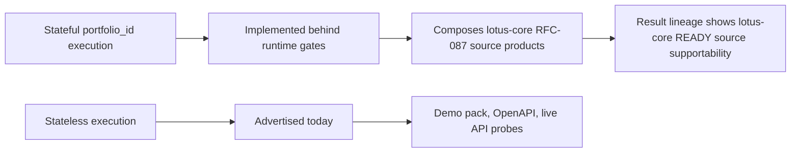

# Supported Features

This page summarizes implementation-backed `lotus-manage` capabilities after the advisory cleanup.
It is intentionally a navigation and demo-prep page; deep mechanics stay in `docs/`.

## Functional Capabilities

| Capability | Primary APIs | Current state | Evidence |
| --- | --- | --- | --- |
| Rebalance simulation | `POST /api/v1/rebalance/simulate` | Supported | unit goldens, OpenAPI gate, API vocabulary gate |
| What-if analysis | `POST /api/v1/rebalance/analyze` | Supported | unit and demo scenarios |
| Async what-if execution | `POST /api/v1/rebalance/analyze/async`, `/api/v1/rebalance/operations/*` | Supported | async operation tests and demo scenario 26 |
| Explicit execution envelope | simulate, analyze, async analyze | Supported with `input_mode=stateless`; `input_mode=stateful` is modeled and feature-gated | envelope contract tests and demo payloads |
| Run supportability | `/api/v1/rebalance/runs/*`, `/api/v1/rebalance/supportability/summary` | Supported | supportability service tests and contract docs tests |
| Deterministic run artifact | `/api/v1/rebalance/runs/{rebalance_run_id}/artifact` | Supported | artifact service tests and demo scenario 27 |
| Lineage lookup | `/api/v1/rebalance/lineage/*` | Feature-gated | lineage service tests |
| Idempotency history | `/api/v1/rebalance/idempotency/*` | Feature-gated | idempotency history service tests and demo scenario 30 |
| Workflow review gates | `/api/v1/rebalance/runs/*/workflow*`, `/api/v1/rebalance/workflow/decisions*` | Feature-gated | workflow service tests and demo scenario 29 |
| Policy-pack supportability | `/api/v1/rebalance/policies/*` | Supported when policy packs are enabled | policy-pack tests and demo scenario 31 |
| Integration capabilities | `/api/v1/integration/capabilities` | Supported | capability contract tests |
| Solver target generation | `POST /api/v1/rebalance/simulate` | Runtime-discovered optional capability | capability contract tests and live demo scenario 08 |
| Stateful `portfolio_id` execution | simulate, analyze, async analyze | Implemented behind explicit runtime gates. When `DPM_CAP_INPUT_MODE_PORTFOLIO_ID_ENABLED=true`, `DPM_STATEFUL_CORE_SOURCING_ENABLED=true`, and `DPM_CORE_BASE_URL` is configured, manage advertises `stateful` and composes governed core data for execution. | resolver unit tests, transformation tests, feature-gate API tests, live `manage.dev.lotus` stateful proof |
| Core model portfolio target sourcing | internal stateful source assembly | Dedicated client method for `DpmModelPortfolioTarget:v1` and transformer to the DPM engine `ModelPortfolio`; live canonical proof passed. | core-sourcing client tests, source-context transformation tests, RFC-087 live validator |
| Core mandate binding sourcing | internal stateful source assembly | Dedicated client method for `DiscretionaryMandateBinding:v1` and transformer to management policy context; live canonical proof passed. | core-sourcing client tests, source-context transformation tests, RFC-087 live validator |
| Core instrument eligibility sourcing | internal stateful source assembly | Dedicated client method for `InstrumentEligibilityProfile:v1` and transformer to DPM engine `ShelfEntry` records carrying shelf status, buy/sell flags, restriction codes, settlement days, liquidity tier, issuer, and taxonomy attributes; live canonical proof passed. | core-sourcing client tests, source-context transformation tests, RFC-087 live validator |
| Core portfolio tax-lot sourcing | internal stateful source assembly | Dedicated client method for `PortfolioTaxLotWindow:v1` and transformer to DPM engine `TaxLot` records carrying lot quantity, unit cost, purchase date, and core lineage-backed cost basis for tax-aware sell allocation; live canonical proof passed. | core-sourcing client tests, source-context transformation tests, RFC-087 live validator |
| Core market-data coverage sourcing | internal stateful source assembly | Dedicated client method for `MarketDataCoverageWindow:v1` and transformer to DPM engine `MarketDataSnapshot`; stale or missing price/FX coverage is rejected before stateful execution can run. Live canonical proof passed. | core-sourcing client tests, source-context transformation tests, RFC-087 live validator |
| Mandate digital-twin APIs | `/api/v1/mandates/*` | Supported as RFC-0038 foundation for refresh/read/version/diff and health read/recalculate. Refresh composes product-specific lotus-core mandate binding, model targets, and optional market-data coverage; source-data gaps remain explicit. Local manage proof and local canonical manage plus live `lotus-core` proof passed; Gateway/Workbench product-surface adoption remains downstream handoff work. | `src/api/routers/mandates.py`, `src/api/services/mandate_service.py`, `tests/unit/dpm/api/test_mandates_api.py`, OpenAPI certification matrix, RFC-0038 proof log |
| Mandate monitoring and exceptions | `/api/v1/dpm/monitoring/*`, `/api/v1/dpm/exceptions*` | Supported as bounded Slice 4 foundation for caller-supplied mandate ids that have already been refreshed. PM-book discovery remains explicit in supportability until Gateway/Core book discovery is added. | `src/api/routers/monitoring.py`, `tests/unit/dpm/api/test_monitoring_api.py`, OpenAPI certification matrix |
| DPM command center foundation | `/api/v1/dpm/command-center` | Supported as a bounded Slice 5 read model over persisted monitoring runs and active exceptions generated by the selected monitoring run. It returns health distribution, attention buckets, recommended actions, latest-run lineage, and supportability state; Workbench/Gateway integration has a Slice 6 handoff contract but is not yet implemented downstream. | `src/api/routers/monitoring.py`, `src/api/services/mandate_service.py`, `tests/unit/dpm/api/test_monitoring_api.py`, OpenAPI certification matrix, `docs/architecture/dpm-command-center-gateway-workbench-handoff.md` |
| Mandate health engine foundation | refresh/health APIs and internal RFC-0038 foundation | Pure deterministic health scoring across ten dimensions with hard-gate overrides, persistence foundation, refresh output, health read/recalculate, monitoring-run integration, and command-center aggregation. | `src/core/mandates.py`, `tests/unit/dpm/core/test_mandate_health.py`, `tests/unit/dpm/api/test_mandates_api.py`, `tests/unit/dpm/api/test_monitoring_api.py` |
| Mandate persistence foundation | internal RFC-0038 foundation | Repository contract, in-memory store, Postgres repository foundation, migration, idempotent snapshot persistence, exception resolution, and retention hooks implemented and used by mandate APIs. | `src/core/mandate_repository.py`, `src/infrastructure/mandates/`, `src/infrastructure/postgres_migrations/dpm/0003_mandate_health_foundation.sql`, `tests/unit/dpm/supportability/test_dpm_mandate_repository.py` |



## Non-Functional Capabilities

| Capability | Current state | Evidence |
| --- | --- | --- |
| OpenAPI governance | Enforced | `scripts/openapi_quality_gate.py` |
| API vocabulary inventory | Enforced | `scripts/api_vocabulary_inventory.py --validate-only` |
| No-alias contract | Enforced | `scripts/no_alias_contract_guard.py` |
| Monetary precision guard | Enforced | `scripts/check_monetary_float_usage.py` |
| Production persistence guardrails | Enforced | `src/api/persistence_profile.py` and production cutover tests |
| PostgreSQL migration checks | Enforced | `scripts/postgres_migrate.py --target dpm` and migration tests |
| Docker startup readiness | Enforced | local Docker runtime contract tests |
| Live API evidence | Enforced before API readiness claims | `scripts/validate_live_api.py` and `make live-api-validate` |
| Async correlation conflict handling | Enforced | API tests and live API duplicate-correlation probe |
| Source-safe core resolver errors | Enforced for modeled stateful mode | resolver timeout/retry tests, no-core-base-url API test, and stateful feature-gate API test |
| Capability truth gating | Enforced | integration capability tests proving stateful is not published without resolver readiness |
| Mesh product validation | Enforced for repo-native declarations and trust telemetry | `make mesh-contract-validate`, domain product tests, trust telemetry tests |
| Sensitive-safe access and service logging | Enforced | observability and API tests proving route-template logging, redaction of sensitive extra fields, and no raw identifiers in service messages |
| Stateful resolver metrics | Enforced with bounded labels | observability tests and stateful resolver API tests |
| DPM execution and workflow metrics | Enforced with bounded labels | observability tests, API route tests, and monitoring contract validation |
| Monitoring contract governance | Enforced for implemented custom metrics | observability contract validator, monitoring contract tests, `make mesh-contract-validate` |
| Live manage API proof | Passed for implemented stateless/manage API surface after targeted manage refresh | `scripts/validate_live_api.py --base-url http://manage.dev.lotus` checks demo pack, readiness, capability truth, no advisory/proposal routes, deployed OpenAPI certification quality including error examples, stateful core-sourcing guardrails, async conflict behavior, supportability summary, and metrics |
| Manage/core integration posture proof | Passed for stateful available posture | `LOTUS_MANAGE_EXPECT_STATEFUL_CORE_SOURCING=available make live-api-validate-core` proves capability truth, composed core sourcing, READY lineage, supportability persistence, metrics, and old monolithic core route absence |
| Swagger error-response examples | Enforced | central OpenAPI enrichment, `scripts/openapi_quality_gate.py`, contract tests, and live validation require bounded JSON examples for every documented `4xx`, `5xx`, and `default` response |

## Explicit Non-Goals

`lotus-manage` does not own advisor-led proposal simulation, proposal artifacts, advisor client
consent, or proposal lifecycle APIs. Those workflows belong in `lotus-advise`.

It also does not own canonical portfolio ledger state, source-data truth, risk methodology,
performance analytics authority, or UI composition.

## Demo Notes

Use `docs/demo/README.md` for executable API demo payloads. Demo evidence should be captured from
the live application only after the relevant API, persistence, and supportability checks pass.

For RFC-0036 final proof, use the direct manage API path first:

```powershell
python scripts/validate_live_api.py --base-url http://manage.dev.lotus --json-output output/rfc-0036-gold-pass/live-api-summary.json
```

For manage/core integration proof with stateful sourcing active, add the explicit expectation:

```powershell
$env:LOTUS_MANAGE_EXPECT_STATEFUL_CORE_SOURCING="available"
make live-api-validate-core
```

Final proof is not complete if the validator reports stale OpenAPI certification drift, including
missing request, response, or error examples, even when business execution probes pass. Stateful
execution is not complete unless the RFC-087 `lotus-core` product-specific source APIs pass
canonical live proof and manage live proof shows READY stateful source lineage.

## Target-State Roadmap Features

The following are proposed strategic features. They are not supported-feature claims until the
owning RFC is implemented, certified, live-proven, and this page is updated with implementation
evidence.

| Proposed capability | Owning RFC | Promotion requirement |
| --- | --- | --- |
| Mandate digital twin | RFC-0038 | Refresh/read/version/diff API foundation exists; promote to full command-center story only after live core/manage proof and later health/monitoring APIs. |
| Mandate health score | RFC-0038 | Scoring, persistence, refresh-response output, standalone health APIs, bounded monitoring integration, and command-center aggregation are implementation-backed and live-proven at the manage/core API layer. |
| DPM command center | RFC-0038 | Bounded command-center summary API is implemented over monitoring runs and active exceptions scoped to the selected monitoring run; PM-book discovery and Workbench/Gateway product-surface integration remain downstream implementation work governed by the Slice 6 handoff contract. |
| Advanced construction alternatives | RFC-0039 | Persisted comparable alternatives with objective/constraint traces and solver posture. |
| Tax, liquidity, risk, ESG, currency, and regime-aware construction | RFC-0039 | Source supportability, degraded behavior, field-level OpenAPI, and live proof for each dimension. |
| Pre-trade proof pack | RFC-0040 | Durable JSON, Markdown, report-input, AI-evidence input, lineage, and hash evidence. |
| Decision timeline and portfolio memory | RFC-0040 | Linked mandate, exception, alternative, approval, wave, handoff, and outcome events. |
| CIO model-change and rebalance waves | RFC-0041 | Multi-portfolio wave proof with ready, pending-review, and blocked items. |
| Post-trade outcome feedback | RFC-0042 | Expected-versus-realized review sourced from core, risk, and performance evidence. |
| Governed AI PM copilot | RFC-0043 | `lotus-ai` workflow-pack integration, guardrail tests, provenance, and AI-unavailable fallback. |

Target-state features may replace or remove older manage APIs where the new strategic contract is
cleaner. No backward compatibility adapter should be added unless a later downstream migration RFC
proves a real production dependency.
